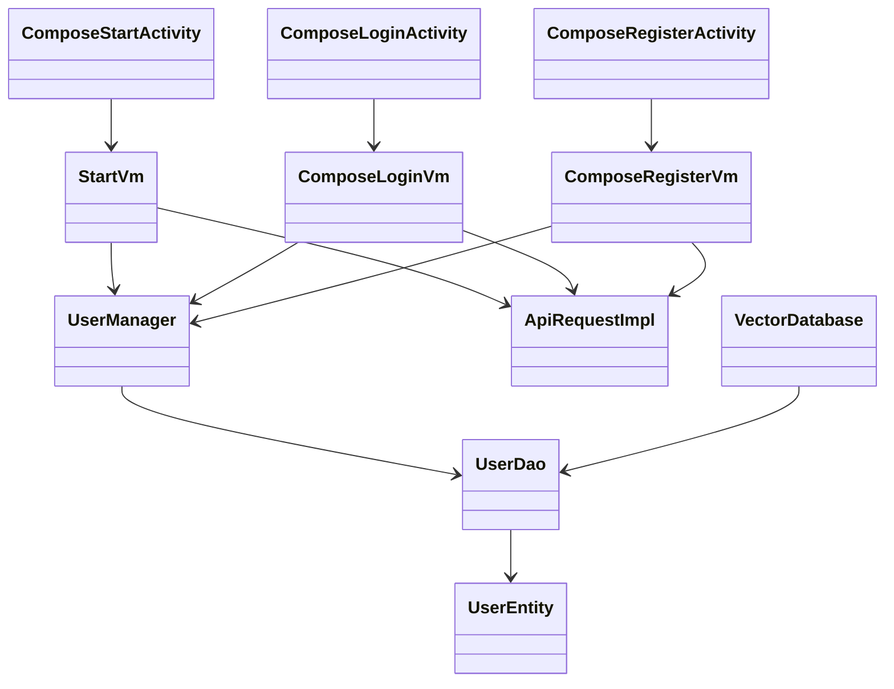
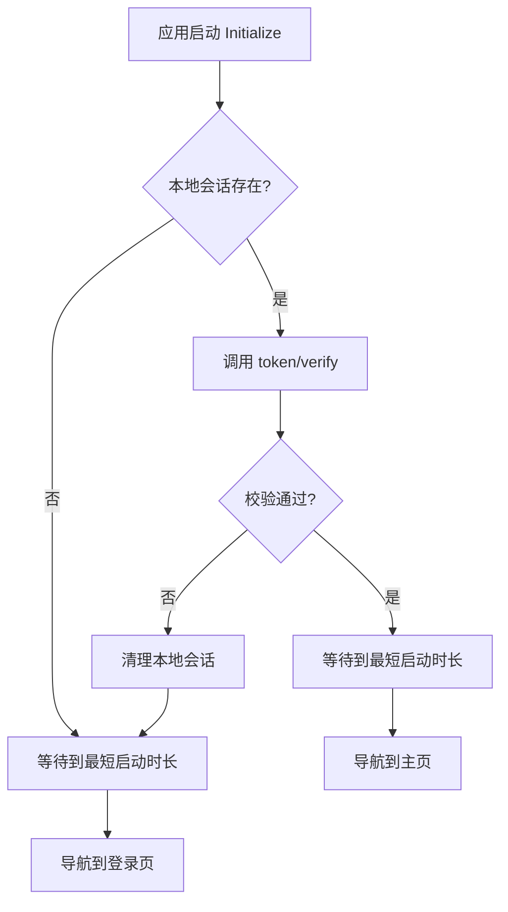
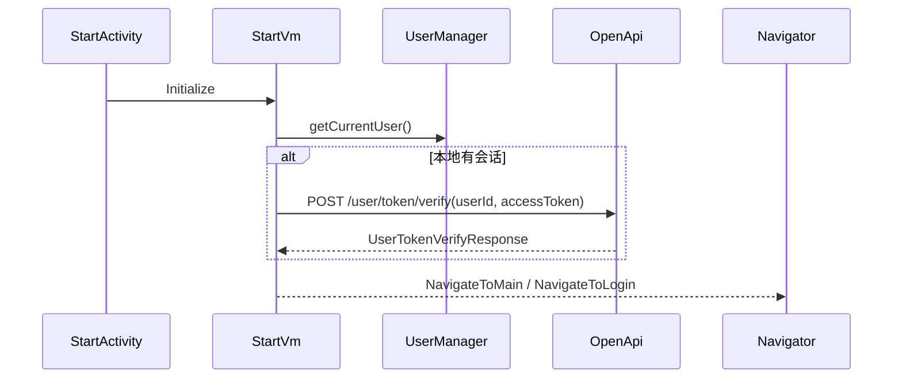
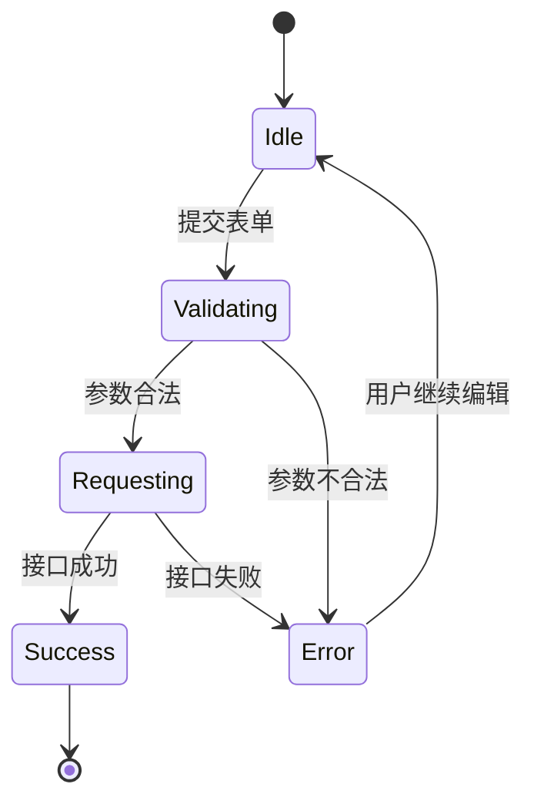
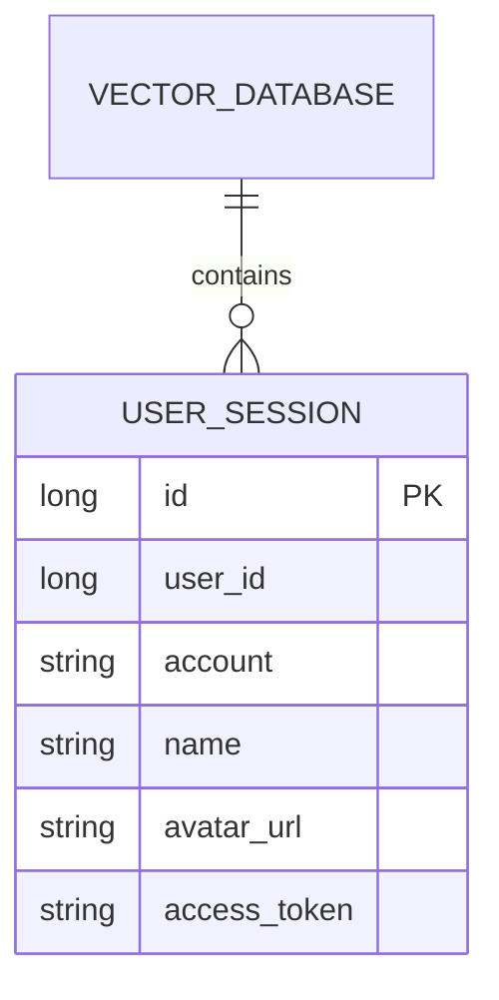
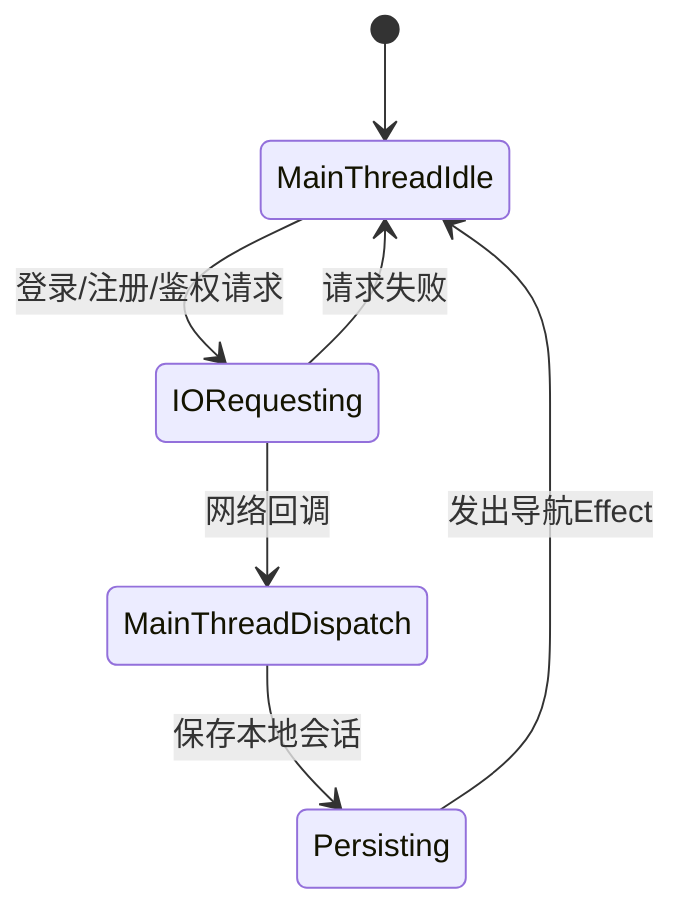

**AndroidDesignDocument**
====

## 文档目标

本文件用于描述 Android 端的模块化架构设计，不使用时间线日志体例。

## 1. 整体架构分层

* **UI 层**：`ComposeStartActivity`、`ComposeLoginActivity`、`ComposeRegisterActivity`，负责页面展示和事件分发。
* **状态管理层（MVI）**：`StartVm`、`ComposeLoginVm`、`ComposeRegisterVm`，负责 Intent 处理、状态流转与 Effect 输出。
* **业务与会话层**：`UserManager`，负责用户会话存取与清理。
* **数据访问层**：`VectorDatabase` + `UserDao` + `UserEntity`，负责本地持久化。
* **网络访问层**：`ApiRequestImpl`，负责鉴权相关接口通信。

### 架构类图

## 2. 启动模块（Start）

### 功能职责
* 启动阶段统一判断登录态，决定进入主页面或登录页面。
* 保证启动页最短停留时间，避免闪屏。
* 当本地会话存在时，执行远端 token 有效性验证。

### 启动活动图

### 启动时序图

## 3. 登录与注册模块（Auth UI）

### 功能职责
* 登录：账号密码提交、按钮可用态控制、成功后写入本地会话。
* 注册：账号/密码/确认密码校验、头像选择与权限申请、成功后自动登录态落库。
* 页面仅负责编排，业务状态由 VM 的 MVI 流统一管理。

### 认证模块状态机图

## 4. 会话管理模块（UserManager）

### 功能职责
* 统一提供 `saveCurrentUser/getCurrentUser/clearCurrentUser`。
* 对上层隐藏 Room 细节，保持 VM 与数据库解耦。
* 启动与登录/注册流程共享同一会话入口。

### 设计约束
* 当前会话以单记录方式存储，主键采用 `id: Long`。
* `userId` 与后端主键一致，统一为 `Long`。
* 启动鉴权采用 `userId + accessToken` 强绑定校验，防止 token 串用。

## 5. 本地数据库设计（Room）

### 设计说明
* 采用单库模式：`VectorDatabase` 统一管理应用表结构。
* 会话表用于保存当前登录用户快照，便于冷启动恢复。

### ER 图

## 6. 网络接口契约（Auth API）

### 接口清单
* `POST /user/login`：请求体 DTO，返回 `UserAuthResponse`。
* `POST /user/register`：请求体 DTO，返回 `UserAuthResponse`。
* `POST /user/token/verify`：请求体 `userId + accessToken`，返回 `UserTokenVerifyResponse`。

### 契约原则
* 非文件上传场景统一使用 `@RequestBody` DTO。
* 不使用裸 `Boolean` 响应，统一结构化响应模型。
* 前后端 `userId` 类型统一为 `Long`。

## 7. 并发与线程模型

### 线程状态图

### 启动鉴权甘特图

```mermaid
gantt
    title Android 启动鉴权线程甘特图
    dateFormat  X
    axisFormat %L ms
    section Main线程
    StartIntent.Initialize        :m1, 0, 5
    收到结果并分发导航Effect        :m2, 70, 10
    section IO线程
    读取Room用户会话              :i1, 5, 15
    发起HTTP verify请求           :i2, 20, 30
    section 协程状态
    suspend等待网络返回           :s1, 20, 40
```

## 8. 已知边界与后续演进

* 注册头像上传链路在 Android 端已预留，后端文件网关稳定后再打通。
* 会话校验当前依赖后端鉴权接口，后续可按安全策略引入 token 刷新与失效策略。

