**AndroidDesignDocument**
====

## 文档目标

本文件用于描述 Android 端的模块化架构设计，不使用时间线日志体例。

## 整体架构分层

* **UI 层**：负责页面渲染、用户输入采集、导航执行。
  * Activity：`ComposeStartActivity`、`ComposeLoginActivity`、`ComposeRegisterActivity`、`MainActivity`、`ComposeChatActivity`
  * Fragment级组合函数：`MessageListScreen`、`AgentEditorOverlay`
* **状态管理层（MVI）**：负责处理 Intent、维护状态、发出 Effect。
  * `StartVm`、`ComposeLoginVm`、`ComposeRegisterVm`、`MainVm`、`MessageListMviVm`、`ComposeChatVm`
* **业务与会话层**：封装会话与用户相关业务能力。
* `UserManager`、`ChatMapController`、`ChatController`、`ChatCacheManager`、`NetworkManager(全局/Application级)`
* **数据访问层（Room）**：负责本地持久化。
  * `VectorDatabase`、`UserDao`、`AgentCacheDao`、`ChatMessageDao`
  * `UserEntity`、`AgentCacheEntity`、`ChatMessageEntity`
* **网络访问层**：`ApiRequestImpl`，负责认证相关接口访问。
* **领域与协议层**：定义业务与传输数据结构。
  * Module：`UserModule`
  * DTO：`UserAuthResponse`、`UserTokenVerifyResponse`、`AgentResponse`、`AgentListResponse`、`ChatMessageResponse`

### 架构类图
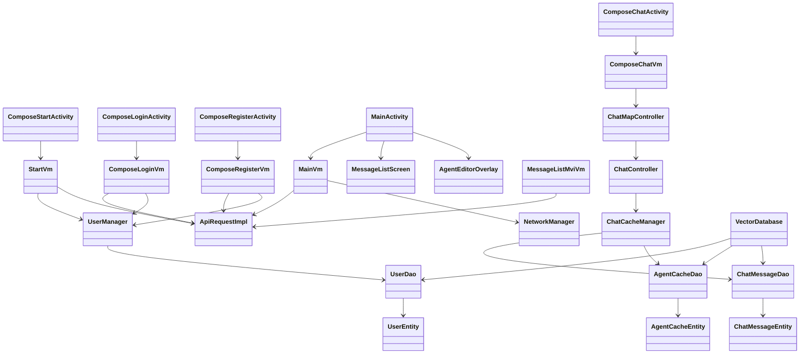

### MVI 建模约束（UML）

禁止在正文中用纯文本定义 MVI 的字段结构（如 `uiState/dataState/intent/effect` 具体值）；MVI 值模型必须通过 UML 类图表达。

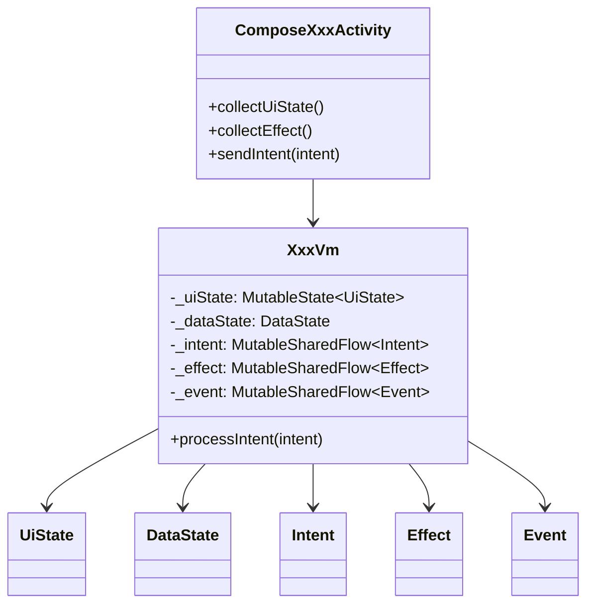

## 页面模块设计

### 启动模块（Start）

#### 功能职责
* 启动阶段统一判断登录态，决定进入主页面或登录页面。
* 保证启动页最短停留时间，避免闪屏。
* 当本地会话存在时，执行远端 token 有效性验证。

#### 启动 UI 设计

##### 启动页面（Start）
**布局结构**：
- 居中显示应用 Logo

**交互设计**：
- 启动时检查本地会话
- 有会话时调用 token/verify 接口验证
- 验证通过：跳转到主页
- 验证失败或无会话：跳转到登录页
- 最短停留 1200ms，避免启动页一闪而过


#### UML静态图（类图）

##### 启动页面 MVI 类图
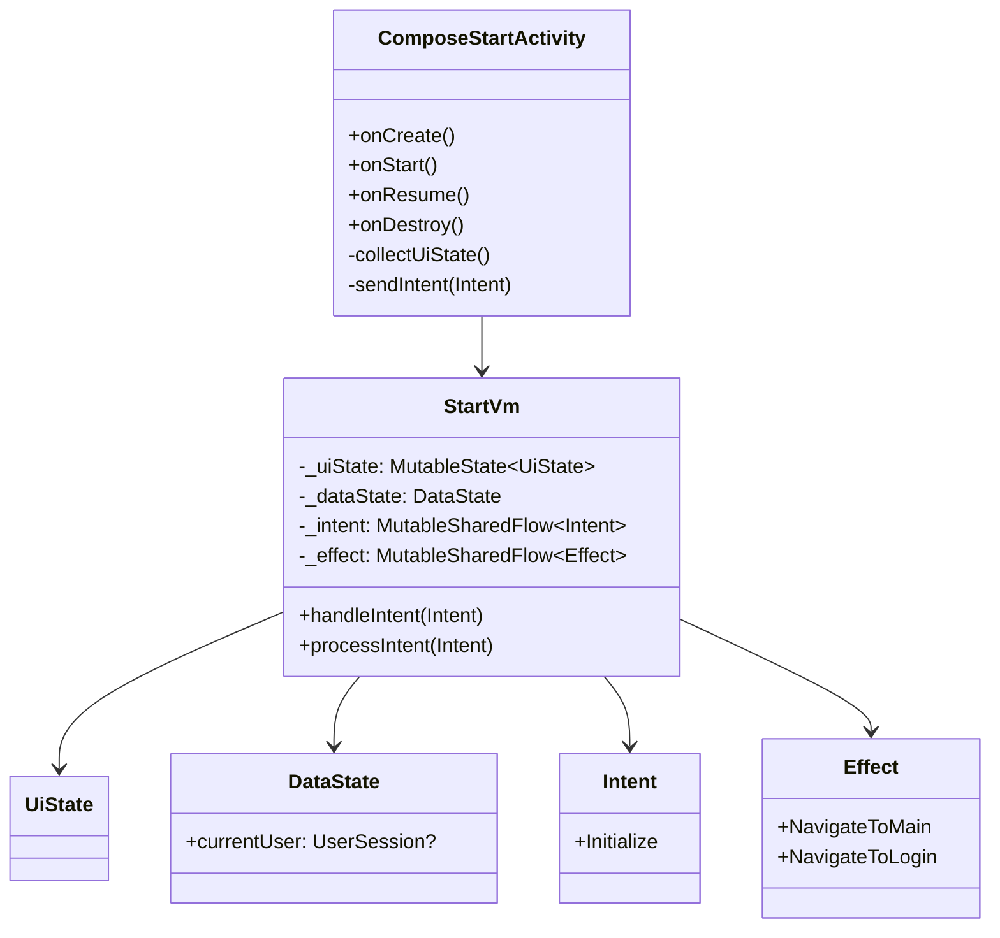

##### 启动页面 MVI 通信图（动态UML）
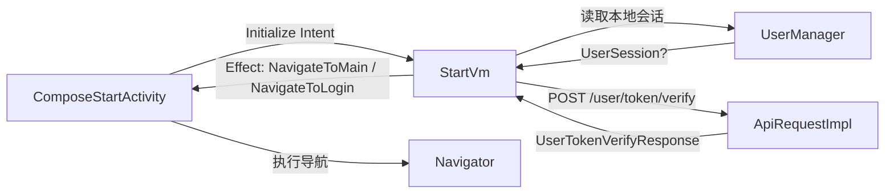

#### UML动态图（通信图/活动图/时序图/甘特图）

##### 启动活动图
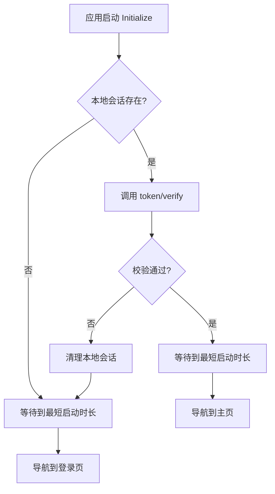

##### 启动时序图
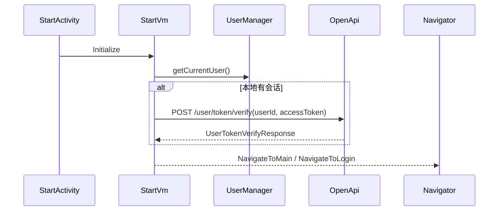

##### 启动鉴权甘特图
```mermaid
gantt
    title Android 启动鉴权线程甘特图
    dateFormat  X
    axisFormat %L ms
    section Main线程
    StartIntent.Initialize        :m1, 0, 5
    收到结果并分发导航Effect        :m2, 70, 10
    section IO线程
    读取Room用户会话              :i1, 5, 15
    发起HTTP verify请求           :i2, 20, 30
    section 协程状态
    suspend等待网络返回           :s1, 20, 40
```

### 登录与注册模块

#### 功能职责
* 登录：账号密码提交、按钮可用态控制、成功后写入本地会话。
* 注册：账号/密码/确认密码校验、头像选择与权限申请、成功后自动登录态落库。
* 页面仅负责编排，业务状态由 VM 的 MVI 流统一管理。

#### 登录 UI 设计

##### 登录页面（Login）
**布局结构**：
- 顶部：Logo 区域
- 中间：账号输入框、密码输入框（隐藏输入内容）
- 底部：登录按钮（账号密码未完整时置灰）、"没有账号？去注册" 链接

**交互设计**：
- 账号输入框：实时校验输入格式，失焦时验证
- 密码输入框：隐藏输入内容，支持显示/隐藏切换
- 登录按钮：账号和密码均非空时激活，点击后显示加载状态
- 注册链接：点击跳转到注册页面

#### UML静态图（类图）
##### 登录页面 MVI 类图
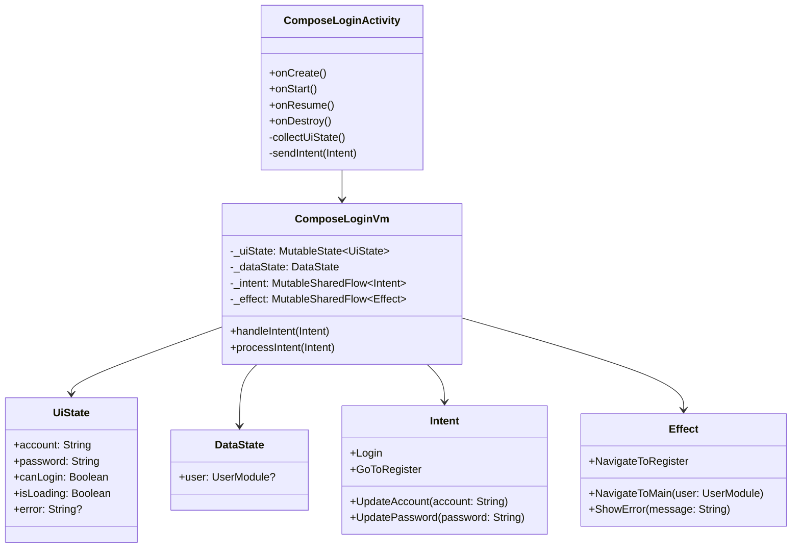

##### 登录页面通信图（动态UML）
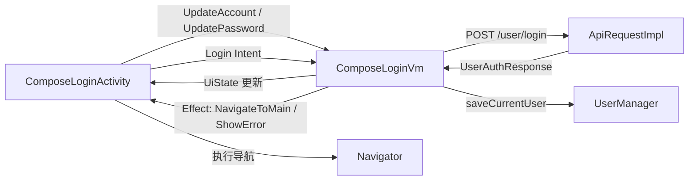

#### UML动态图（通信图/活动图/时序图/甘特图）

##### 登录活动图
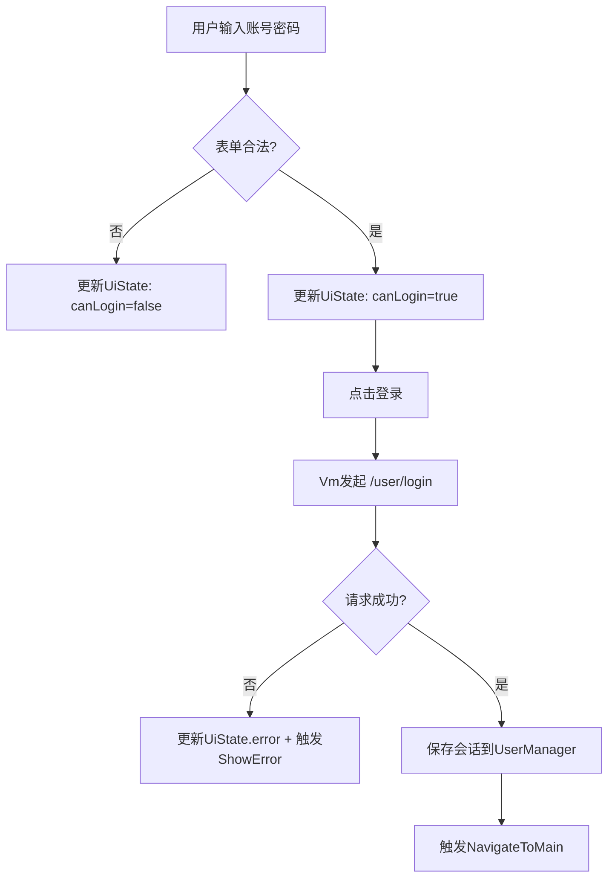

##### 登录时序图


##### 登录鉴权甘特图
```mermaid
gantt
    title Android 登录请求线程甘特图
    dateFormat  X
    axisFormat %L ms
    section Main线程
    输入与点击事件分发            :m1, 0, 8
    渲染加载状态与错误提示         :m2, 65, 12
    section IO线程
    发送 /user/login 请求         :i1, 8, 35
    接收响应并解析 DTO            :i2, 43, 12
    section 本地持久化
    保存会话到 Room               :d1, 55, 10
```

#### 注册 UI 设计
##### 注册页面（Register）

**布局结构**：
- 顶部：Logo 区域
- 中间：账号输入框、密码输入框、确认密码输入框、圆形头像预览区域
- 底部：注册按钮（信息未完整时置灰）、"已有账号？去登录" 链接

**交互设计**：
- 头像选择：点击圆形预览区域，申请存储权限后打开相册
- 密码校验：实时对比密码和确认密码，不一致时显示错误提示
- 注册按钮：账号、密码、确认密码均非空且密码一致时激活
- 注册成功：自动保存会话并跳转到主页

#### UML静态图（类图）
##### 注册页面 MVI 类图
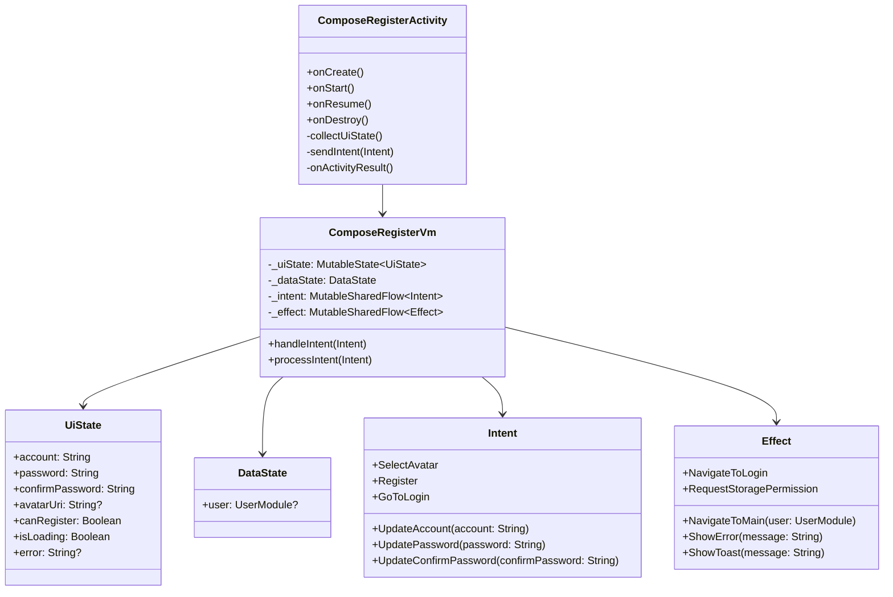

##### 注册页面通信图（动态UML）
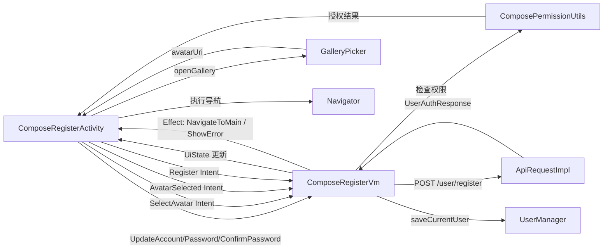

##### 认证模块状态机图
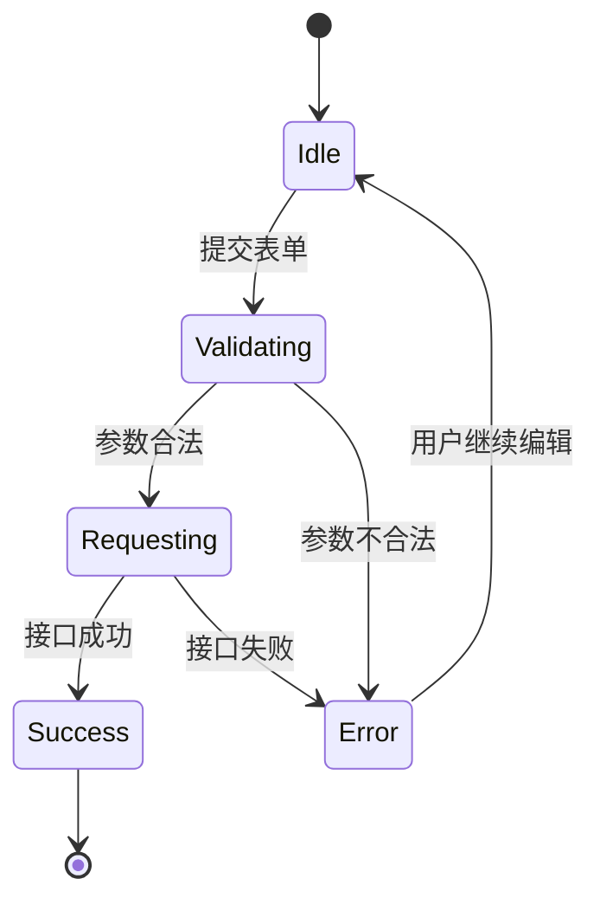

#### UML动态图（通信图/活动图/时序图/甘特图）

##### 注册活动图
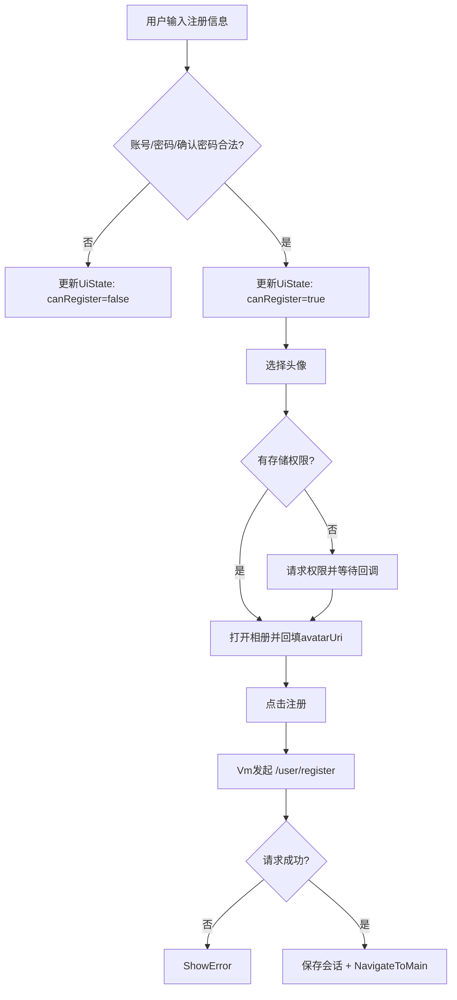

##### 注册时序图
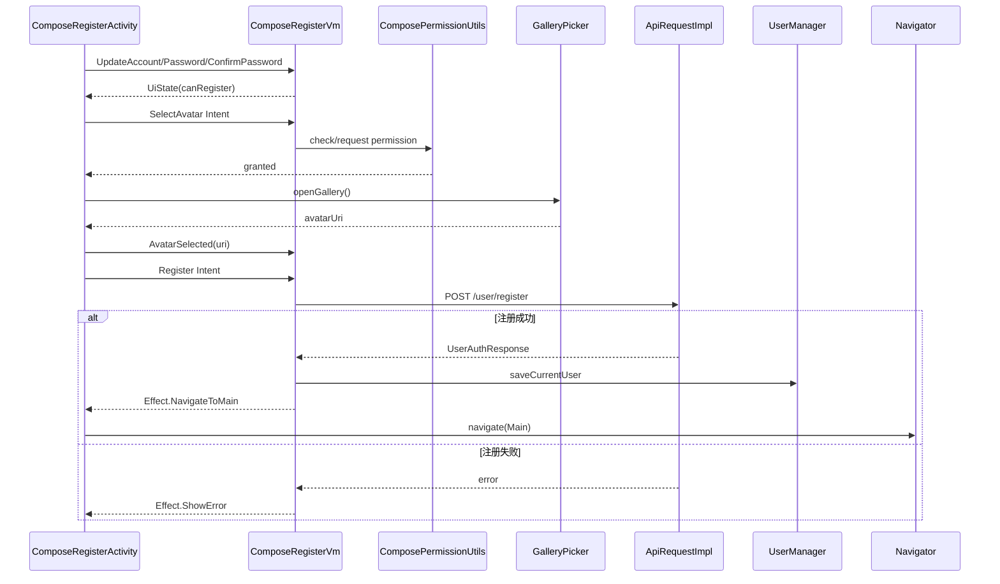

##### 注册鉴权甘特图
```mermaid
gantt
    title Android 注册请求线程甘特图
    dateFormat  X
    axisFormat %L ms
    section Main线程
    表单输入与校验                 :m1, 0, 20
    权限回调与相册结果处理          :m2, 20, 25
    页面状态更新与导航              :m3, 90, 15
    section IO线程
    发送 /user/register 请求       :i1, 45, 35
    响应解析与错误映射              :i2, 80, 10
    section 本地持久化
    保存会话到 Room               :d1, 85, 8
```

### Agent 模块（Main 内联弹层）

#### 功能职责
* Agent 页无数据时显示中心创建按钮；有数据时显示 Agent 列表。
* 创建/查看/修改/删除 Agent 统一采用 Main 页面内全屏组合函数弹层（放大进入、缩小退出）。
* Agent 列表点击跳转 `ComposeChatActivity`；列表长按进入 Agent 编辑弹层。
* 状态同步采用 `StateFlow + SharedFlow`，`eventBus` 仅作为兜底。

#### Agent UI 设计

##### Agent 列表页面（MessageListScreen）
**布局结构**：
- 空状态：中心提示 + 创建按钮
- 非空状态：Agent 列表 + 创建 FAB

**交互设计**：
- 点击创建：打开 `AgentEditorOverlay`（创建模式）
- 点击 Agent：跳转 `ComposeChatActivity`
- 长按 Agent：打开 `AgentEditorOverlay`（编辑模式）

##### Agent 弹层页面（AgentEditorOverlay）
**布局结构**：
- 顶部标题与关闭按钮
- 名称输入、设定输入
- 创建/保存按钮
- 编辑模式下显示删除按钮

**交互设计**：
- 创建成功、更新成功、删除成功均通过 `SharedFlow<AgentListEvent>` 刷新列表
- 关闭或提交后弹层退出，不依赖 Activity Result

#### UML静态图（类图）
##### Agent 页面 MVI 类图
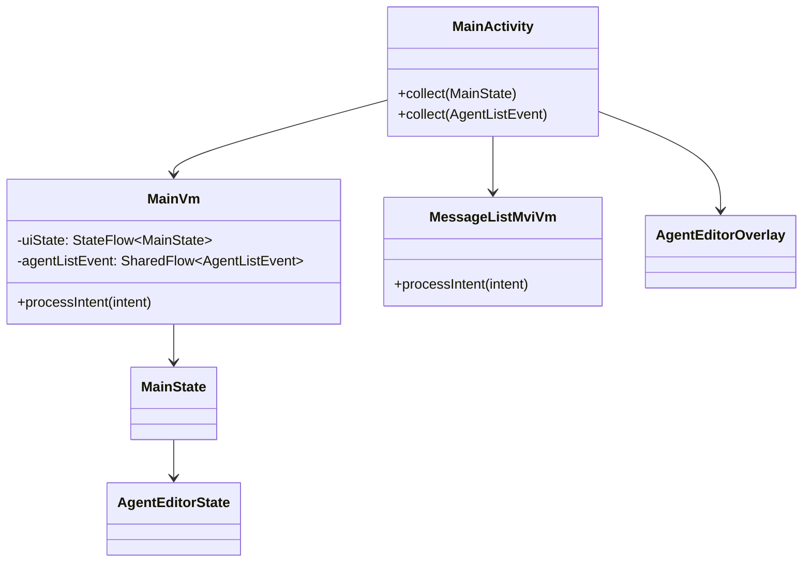

#### UML动态图（通信图/活动图/时序图/甘特图）
##### Agent 页面 MVI 通信图
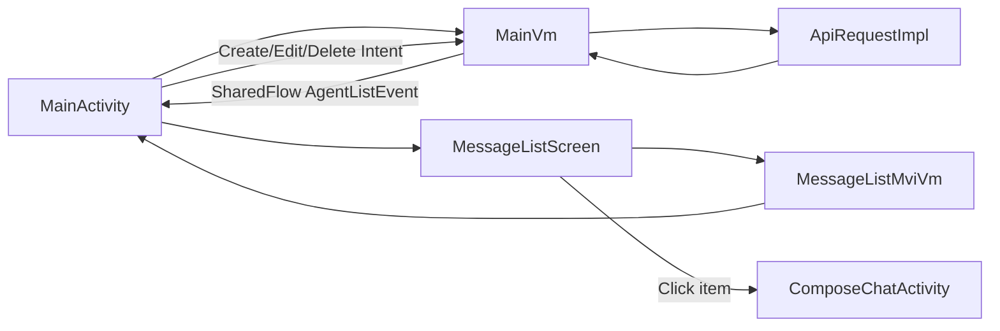

##### Agent 页面活动图
```mermaid
flowchart TD
    A[进入Agent页] --> B{列表是否为空}
    B -- 是 --> C[显示中心创建按钮]
    B -- 否 --> D[显示Agent列表]
    C --> E[打开创建弹层]
    D --> F{点击 or 长按}
    F -- 点击 --> G[跳转ChatActivity]
    F -- 长按 --> H[打开编辑弹层]
    E --> I[提交创建]
    H --> J[保存或删除]
    I --> K[发出AgentListEvent]
    J --> K
    K --> L[刷新MessageList]
```

##### Agent 页面时序图
```mermaid
sequenceDiagram
    participant Main as MainActivity
    participant VM as MainVm
    participant Api as ApiRequestImpl
    participant ListVm as MessageListMviVm
    Main->>VM: OpenCreateAgent/OpenEditAgent
    VM->>Api: create/update/deleteAgent
    Api-->>VM: AgentResponse
    VM-->>Main: AgentListEvent
    Main->>ListVm: Refresh
    ListVm-->>Main: 新列表状态
```

##### Agent 页面线程甘特图
```mermaid
gantt
    title Android Agent页面线程甘特图
    dateFormat  X
    axisFormat %L ms
    section Main线程
    点击事件分发与弹层动画      :m1, 0, 18
    列表重绘                     :m2, 70, 18
    section IO线程
    create/update/delete 请求    :i1, 18, 42
    section 协程状态
    SharedFlow事件派发            :s1, 60, 10
```


## Manager管理类设计

### 会话管理模块（UserManager）

#### 功能职责
* 统一提供 `saveCurrentUser/getCurrentUser/clearCurrentUser`。
* 对上层隐藏 Room 细节，保持 VM 与数据库解耦。
* 启动与登录/注册流程共享同一会话入口。

#### 设计约束
* 当前会话以单记录方式存储，主键采用 `id: Long`。
* `userId` 与后端主键一致，统一为 `Long`。
* 启动鉴权采用 `userId + accessToken` 强绑定校验，防止 token 串用。

#### UML静态图（类图）

##### 会话管理模块 类图 （展示功能）
```mermaid
classDiagram
    class UserManager {
        +saveCurrentUser(user: UserModule)
        +getCurrentUser(): UserSession?
        +clearCurrentUser()
    }
    class VectorDatabase {
        +userDao(): UserDao
    }
    class UserDao {
        +insertOrUpdate(entity: UserEntity)
        +queryCurrentUser(): UserEntity?
        +deleteCurrentUser()
    }
    class UserEntity {
        +id: Long
        +userId: Long
        +account: String
        +name: String
        +avatarUrl: String
        +accessToken: String
    }
    class UserSession {
        +userId: Long
        +account: String
        +name: String
        +avatarUrl: String
        +accessToken: String
    }

    UserManager --> VectorDatabase
    VectorDatabase --> UserDao
    UserDao --> UserEntity
    UserManager --> UserSession
```

#### UML动态图（通信图/活动图/时序图/甘特图）

##### 会话管理通信图
```mermaid
flowchart LR
    VM[Start/Login/Register Vm]
    UM[UserManager]
    DAO[UserDao]
    DB[(VectorDatabase)]

    VM -->|saveCurrentUser/getCurrentUser/clearCurrentUser| UM
    UM -->|读写会话| DAO
    DAO --> DB
    DAO -->|UserEntity| UM
    UM -->|UserSession| VM
```

##### 会话生命周期状态图
```mermaid
stateDiagram-v2
    [*] --> Empty
    Empty --> Persisted : saveCurrentUser
    Persisted --> Persisted : update accessToken/profile
    Persisted --> Invalidated : token verify failed
    Invalidated --> Empty : clearCurrentUser
    Persisted --> Empty : logout/clearCurrentUser
```

### 聊天管理模块（ChatController + ChatMapController + ChatCacheManager）

#### 功能职责
* `ChatMapController` 管理 `<agentId, ChatController>` 映射，支持按 Agent 隔离会话数据。
* `ChatController` 维护单 Agent 有序消息列表，支持 HTTP 批量插入与 WS 单条/流式插入。
* `ChatController` 使用 `messageId` 索引加速去重（O(1)），并限制内存消息上限，历史依赖 Room + 锚点分页回放。
* `ChatCacheManager` 负责 Room 持久化与锚点查询，提供离线回放和重连补偿数据基础。
* `NetworkManager` 负责在线/离线 + WebSocket 连接状态监听，触发首次/重连 HTTP 拉取策略。
* `ChatMapController` 使用线程安全容器并设置 Controller 数量上限，降低长时运行内存泄漏风险。

#### UML静态图（类图）
##### Chat 管理类图
```mermaid
classDiagram
    class ChatMapController {
      -chatManagers: Map~String,ChatController~
      +getChatManager(agentId)
      +removeChatManager(agentId)
    }
    class ChatController {
      -viewChatMessageList: MutableList~ChatItemAo~
      +setResponsesToViews(list)
      +setWsToViews(item)
      +getNeedUpdateList()
    }
    class ChatCacheManager {
      +upsertMessages(list)
      +queryBeforeAnchor(agentId, anchor, limit)
      +queryAfterAnchor(agentId, anchor, limit)
    }
    class NetworkManager
    ChatMapController --> ChatController
    ChatController --> ChatCacheManager
    NetworkManager --> ChatCacheManager
```

#### UML动态图（通信图/活动图/时序图/甘特图）
##### Chat 通信图（多数据源）
```mermaid
flowchart LR
    UI[MessageList/Chat UI] --> VM[MessageListMviVm/ComposeChatVm]
    VM --> MapMgr[ChatMapController]
    MapMgr --> Ctrl[ChatController]
    VM --> Api[ApiRequestImpl]
    VM --> Ws[RealtimeChatController]
    Ctrl --> Cache[ChatCacheManager]
    Cache --> Room[(VectorDatabase)]
    Api --> VM
    Ws --> VM
```

##### Chat 活动图（首次/重连/离线）
```mermaid
flowchart TD
    A[页面初始化] --> B{网络在线?}
    B -- 是 --> C{首次或重连?}
    C -- 是 --> D[HTTP拉取]
    C -- 否 --> E[读取Room]
    D --> F[写入Room]
    F --> G[更新ChatController有序列表]
    E --> G
    B -- 否 --> E
    G --> H[渲染UI]
    H --> I[接收WS消息]
    I --> J[二分插入 + 增量刷新]
```

##### Chat 对象图（运行期）
```mermaid
classDiagram
  class ChatMapController {
    Map~String, ChatController~
  }

  class ChatController {
    agentId
    List~ChatItemAo~
  }

  class ChatCacheManager {
    Room数据库操作
  }

  class NetworkManager {
    网络 + WS状态监听
  }

  class ApiRequestImpl {
    HTTP请求
  }

  class RealtimeChatController {
    WebSocket连接状态
  }

  class ViewModel {
    MessageListMviVm
    ComposeChatVm
  }

  ChatMapController *-- ChatController : 包含

  ChatController --> ChatCacheManager : 读写

  NetworkManager --> ChatCacheManager : 状态通知
  NetworkManager --> ViewModel : 状态通知

  ApiRequestImpl --> ChatCacheManager : 写入历史
  ApiRequestImpl --> ChatController : 批量插入

  RealtimeChatController --> ChatController : 单条插入
  RealtimeChatController --> ChatCacheManager : 持久化

  ViewModel --> ChatMapController : 获取
  ViewModel --> ApiRequestImpl : 调用
  ViewModel --> RealtimeChatController : 管理
  ViewModel --> NetworkManager : 监听
```

##### Chat 状态图（连接与数据源切换）
```mermaid
stateDiagram-v2
    [*] --> Init
    Init --> OnlineSync : 网络可用
    Init --> OfflineRead : 网络不可用
    OnlineSync --> WsStreaming : HTTP同步完成
    WsStreaming --> Reconnect : WS断开
    Reconnect --> OnlineSync : 重连成功
    Reconnect --> OfflineRead : 重连失败
    OfflineRead --> OnlineSync : 网络恢复
```

## 本地数据库设计（Room）

### 设计说明
* 采用单库模式：`VectorDatabase` 统一管理应用表结构。
* 会话表用于保存当前登录用户快照，便于冷启动恢复。
* Agent 缓存表与聊天消息表用于离线展示、重连补偿和锚点分页。
* 头像采用 Glide/Coil 磁盘缓存，Room 保存头像 URL 与业务字段。

### ER 图（合并）
```mermaid
erDiagram
    USER_SESSION ||--o{ AGENT_CACHE : has
    AGENT_CACHE ||--o{ CHAT_MESSAGE : has
    USER_SESSION {
      long id PK
      long user_id
      string account
      string name
      string avatar_url
      string access_token
    }
    AGENT_CACHE {
      long id PK
      long agent_id
      long user_id
      string name
      string description
      string avatar_url
      long updated_at
    }
    CHAT_MESSAGE {
      long id PK
      long agent_id
      long user_id
      string content
      long chat_timestamp
      string chat_time
      int role
      long created_at
    }
```

### DAO 设计
* `UserDao`：会话读写（`upsert/getById/deleteById`）。
* `AgentCacheDao`：Agent 缓存读写（`upsert/upsertBatch/queryByUser/deleteByAgentId`）。
* `ChatMessageDao`：消息分页与批量写入（`queryLastByAgent/queryByAnchorBefore/queryByAnchorAfter/upsertBatch`）。

### 数据结构与索引约束
* `chat_message` 复合索引：`(agent_id, chat_timestamp, id)`。
* `chat_message` 辅助索引：`(user_id, agent_id)`。
* 主键统一 `id: Long`，遵循项目数据库规范。

## 网络接口契约（Auth / Agent / Chat）

### 接口清单（含功能）
* `POST /user/register`：注册并返回登录态（Multipart，头像可选）。
* `POST /user/login`：账号密码登录并返回登录态。
* `POST /user/token/verify`：启动鉴权，验证本地会话有效性。
* `GET /agent/getList`：获取当前用户 Agent 列表（MessageList 首屏基础数据）。
* `GET /agent/getInfo`：获取单个 Agent 详情（编辑弹层回填）。
* `POST /agent/create`：创建 Agent。
* `POST /agent/update`：更新 Agent（名称/设定/头像）。
* `POST /agent/delete`：删除 Agent。
* `GET /agent/getLastAgentChatList`：获取 Agent 最近聊天摘要列表。
* `GET /chat/getLastChat`：获取某 Agent 最近消息。
* `GET /chat/getTimeLimitChat`：按截止时间拉取历史消息。
* `POST /chat/getByAnchor`：请求体 `ChatByAnchorRequest(agentId,anchorTimestamp,before,limit)`，按锚点向前/向后分页拉取消息。
* `POST /chat/vision/upload/img`：视觉图片上传任务。

### 契约原则
* 非文件上传接口统一使用请求体 DTO；上传接口使用 Multipart。
* 响应统一结构化 DTO，不返回裸类型。
* 与 SpringBoot 契约字段保持一致，ID 传输按项目规范执行。
* `getByAnchor` 使用 `before:Boolean` 表示方向（true历史/false补偿），并统一 limit 上限。


