**AndroidDesignDocument**
====

## 文档目标

本文件用于描述 Android 端的模块化架构设计，不使用时间线日志体例。

## 整体架构分层

* **UI 层**：负责页面渲染、用户输入采集、导航执行。
  * Activity：`ComposeStartActivity`、`ComposeLoginActivity`、`ComposeRegisterActivity`、`MainActivity`、`ComposeChatActivity`、`ComposeAgentChatActivity`
  * Fragment级组合函数：`MessageListScreen`、`ControlScreen`、`MineScreen`、`AgentEditorOverlay`、`AgentEmojiFragment`、`AgentTextChatFragment`
* **状态管理层（MVI）**：负责处理 Intent、维护状态、发出 Effect。
  * `StartVm`、`ComposeLoginVm`、`ComposeRegisterVm`、`MainVm`、`MessageListMviVm`、`ControlVm`、`MineVm`、`ComposeChatVm`、`ComposeAgentChatVm`、`AgentEmojiFragmentVm`、`AgentTextChatFragmentVm`
* **业务与会话层（Manager/Controller）**：封装业务规则与状态编排，不直接持有 DAO 与 Retrofit。
* `UserManager`、`ChatMapController`、`ChatController`、`ChatCacheManager`、`ControlCommandController`、`ControlConsoleManager`、`NetworkManager(全局/Application级)`
* **数据源层（DataSource）**：承接可复用数据流程（参数校验、请求拼装、统一响应校验），向上暴露 `suspend` 结果与异常语义。
  * `remote/RemoteApiSource`：远程请求流程封装（基于 `repository/api/ApiRequest`）
  * `local/UserLocalSource`：本地数据流程封装（基于 `repository/dao/UserDao`）
* **仓储接口层（Repository）**：仅定义数据访问接口，不承载业务流程。
  * `repository/api/ApiRequest`（Retrofit）
  * `repository/dao/UserDao`、`AgentCacheDao`、`ChatMessageDao`
* **领域与协议层（Domain）**：按类型存放结构定义，类型转换统一走 `convertor`。
  * `domain/dto`：网络与传输结构（request/response）
  * `domain/entity`：数据库实体（Room）
  * `domain/model`：业务模型（Manager/VM 使用）
  * `domain/convertor`：`dto/entity/model` 转换器

### 架构类图
```mermaid
classDiagram
    class ComposeStartActivity
    class ComposeLoginActivity
    class ComposeRegisterActivity
    class MainActivity
    class ComposeChatActivity
    class ComposeAgentChatActivity
    class MessageListScreen
    class ControlScreen
    class MineScreen
    class AgentEditorOverlay
    class AgentEmojiFragment
    class AgentTextChatFragment
    class StartVm
    class ComposeLoginVm
    class ComposeRegisterVm
    class MainVm
    class MessageListMviVm
    class ControlVm
    class MineVm
    class ComposeChatVm
    class ComposeAgentChatVm
    class AgentEmojiFragmentVm
    class AgentTextChatFragmentVm
    class UserManager
    class ChatMapController
    class ChatController
    class ChatCacheManager
    class ControlCommandController
    class ControlConsoleManager
    class NetworkManager
    class RemoteApiSource
    class UserLocalSource
    class ApiRequest
    class VectorDatabase
    class UserDao
    class AgentCacheDao
    class ChatMessageDao
    class UserEntity
    class AgentCacheEntity
    class ChatMessageEntity

    ComposeStartActivity --> StartVm
    ComposeLoginActivity --> ComposeLoginVm
    ComposeRegisterActivity --> ComposeRegisterVm
    MainActivity --> MainVm
    MainActivity --> MessageListScreen
    MainActivity --> ControlScreen
    MainActivity --> MineScreen
    MainActivity --> AgentEditorOverlay
    ComposeChatActivity --> ComposeChatVm
    ComposeAgentChatActivity --> ComposeAgentChatVm
    ComposeAgentChatActivity --> AgentEmojiFragment
    ComposeAgentChatActivity --> AgentTextChatFragment
    AgentEmojiFragment --> AgentEmojiFragmentVm
    AgentTextChatFragment --> AgentTextChatFragmentVm

    StartVm --> UserManager
    StartVm --> RemoteApiSource
    ComposeLoginVm --> RemoteApiSource
    ComposeLoginVm --> UserManager
    ComposeRegisterVm --> RemoteApiSource
    ComposeRegisterVm --> UserManager
    MainVm --> RemoteApiSource
    MainVm --> NetworkManager
    MessageListMviVm --> RemoteApiSource
    ControlVm --> ControlCommandController
    ControlVm --> ControlConsoleManager
    ControlVm --> RemoteApiSource
    MineVm --> RemoteApiSource
    ComposeChatVm --> ChatMapController
    ComposeAgentChatVm --> RealtimeChatController

    UserManager --> UserLocalSource
    UserLocalSource --> UserDao
    RemoteApiSource --> ApiRequest
    ChatMapController --> ChatController
    ChatController --> ChatCacheManager
    ChatCacheManager --> ChatMessageDao
    ChatCacheManager --> AgentCacheDao
    VectorDatabase --> UserDao
    VectorDatabase --> AgentCacheDao
    VectorDatabase --> ChatMessageDao
    UserDao --> UserEntity
    AgentCacheDao --> AgentCacheEntity
    ChatMessageDao --> ChatMessageEntity
```

### DataSource/Repository 架构（Remote + Local）

#### 职责规划
* [`dataSource/remote/RemoteApiSource.kt`](../app/src/main/java/com/magicvector/dataSource/remote/RemoteApiSource.kt)：统一远程请求流程模板（参数校验、DTO拼装、业务码校验、异常语义），对上只暴露 `suspend`。
* [`dataSource/local/*LocalSource`](../app/src/main/java/com/magicvector/dataSource/local)：统一本地数据流程模板（参数约束、DAO调用、事务边界、返回语义），对上暴露 `suspend`。
* [`repository`](../app/src/main/java/com/magicvector/repository)：仅保留“访问接口定义”，不承载业务分支与状态编排。
* `ViewModel/Manager`：作为调用端，负责 `try-catch + state/effect`；不再依赖回调接口。

#### 设计模式说明
* **Template Method（流程模板）**：Remote/Local Source 固定“校验 -> 调用 -> 结果归一”的主流程，业务只填充输入与后处理。
* **Repository Pattern（接口隔离）**：`ApiRequest`/`Dao` 仅提供数据访问契约，减少上层对底层实现耦合。
* **Structured Concurrency（结构化并发）**：ViewModel 统一 `viewModelScope`，Manager 统一 `CoroutineScope`，生命周期内自动取消。

#### DataSource-Repository-Caller 类图（静态 UML）
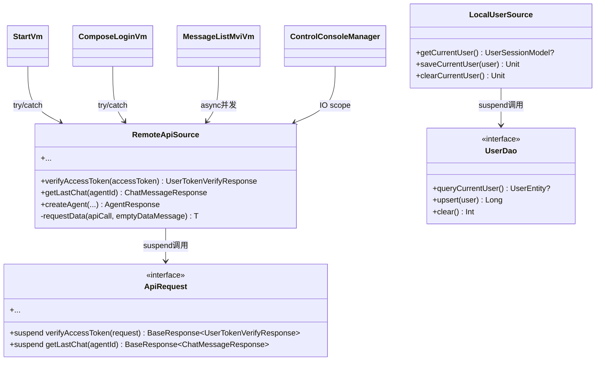

#### DataSource 通用函数甘特图（动态 UML）
```mermaid
gantt
    title DataSource通用函数执行时序（Remote/Local）
    dateFormat  X
    axisFormat  %L
    section 调用端(ViewModel/Manager)
    launch协程+意图分发                 :a1, 0, 10
    try-catch状态更新/effect处理        :a2, 10, 25
    section Source层(Remote/Local)
    参数校验/前置约束                   :b1, 25, 12
    组装请求(远程DTO或本地查询条件)      :b2, 37, 10
    调用Repository接口                  :b3, 47, 35
    统一结果归一(返回或抛异常)           :b4, 82, 12
    section Repository层(Api/Dao)
    Retrofit或Room执行                  :c1, 47, 35
```

#### DataSource 通用状态图（动态 UML）
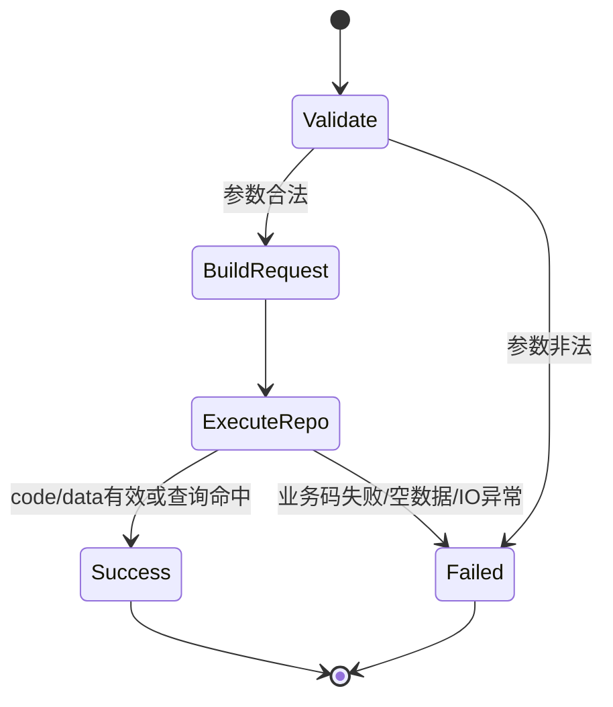

#### 计算机理论基础（为什么 suspend 取消回调）
* **异步控制流复杂度**：回调模式会把顺序逻辑拆成多分支闭包，导致控制流图复杂度上升，增大维护成本。
* **协程挂起恢复模型**：`suspend` 把异步过程映射为顺序语句，降低认知负担，便于推理状态迁移。
* **结构化并发取消传播**：父作用域取消时，子请求协程自动取消，避免“页面销毁但请求仍回调”。
* **一致异常语义**：异常沿协程调用栈传播，调用端用单一 `try-catch` 管理错误与 `effect`，更符合 MVI 单向数据流。

### MVI 建模约束（UML）

禁止在正文中用纯文本定义 MVI 的字段结构（如 `uiState/dataState/intent/effect` 具体值）；MVI 值模型必须通过 UML 类图表达。

#### dataState 使用约束（新增）
* `dataState` 定义为“业务数据缓存层”，用于承载 UI 之外的稳定业务数据（如 `userId/accessToken`、数据库账号列表）。
* `dataState` 允许放置 `Entity/Module` 或其聚合集合；网络 DTO 不直接落 `dataState`，应拆分为业务字段后存储。
* 用户输入只修改 `uiState`（例如登录页账号/密码输入），不直接修改 `dataState` 缓存。
* 当用户执行“下拉选择本地账号”等动作时，允许将 `dataState` 中缓存值回填到 `uiState`。
* `accessToken/userId` 等不可见鉴权数据禁止放在 `uiState`。

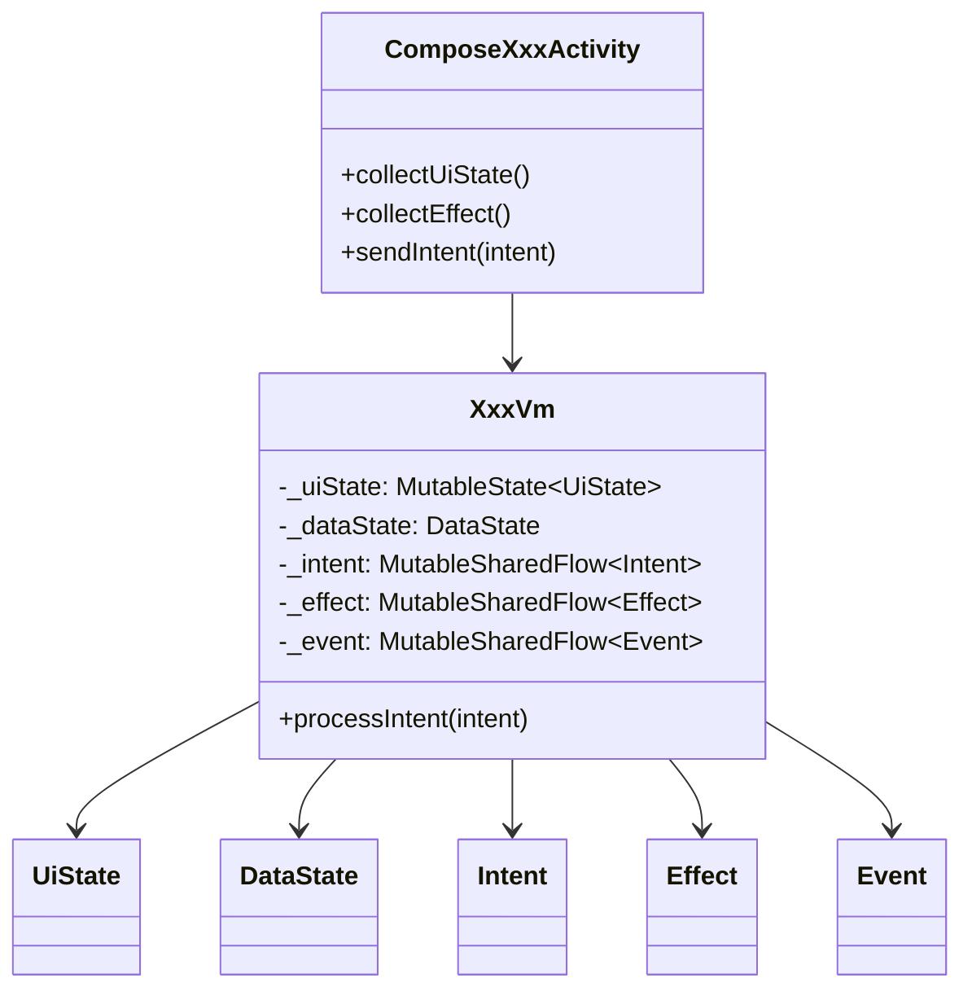

## 页面模块设计

### 启动模块（Start）

#### 功能职责
* 启动阶段统一判断登录态，决定进入主页面或登录页面。
* 保证启动页最短停留时间，避免闪屏。
* 当本地会话存在时，执行远端 token 有效性验证。

#### 启动 UI 设计

##### 启动页面（Start）
**布局结构**：
- 居中显示应用 Logo

**交互设计**：
- 启动时检查本地会话
- 有会话时调用 token/verify 接口验证
- 验证通过：跳转到主页
- 验证失败或无会话：跳转到登录页
- 最短停留 1200ms，避免启动页一闪而过


#### UML静态图（类图）

##### 启动页面 MVI 类图
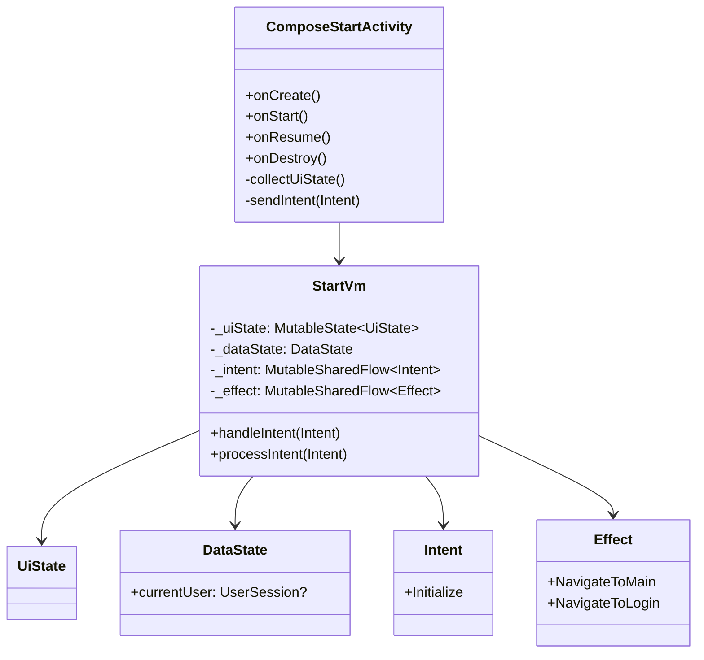

##### 启动页面 MVI 通信图（动态UML）
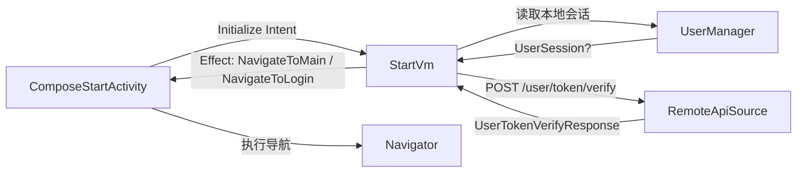

#### UML动态图（通信图/活动图/时序图/甘特图）

##### 启动活动图
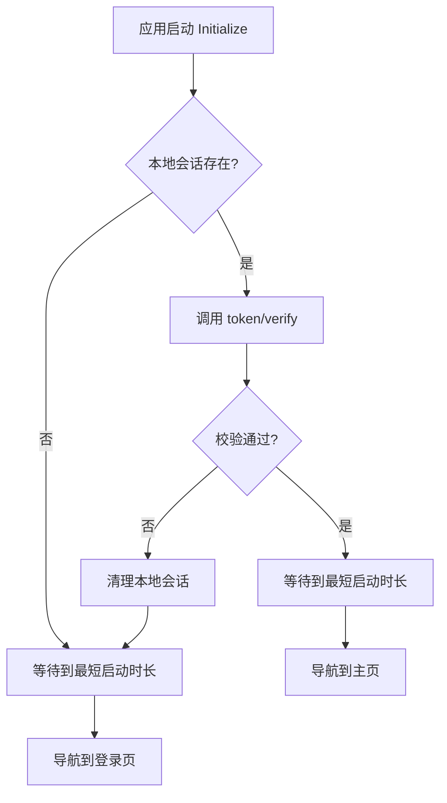

##### 启动时序图
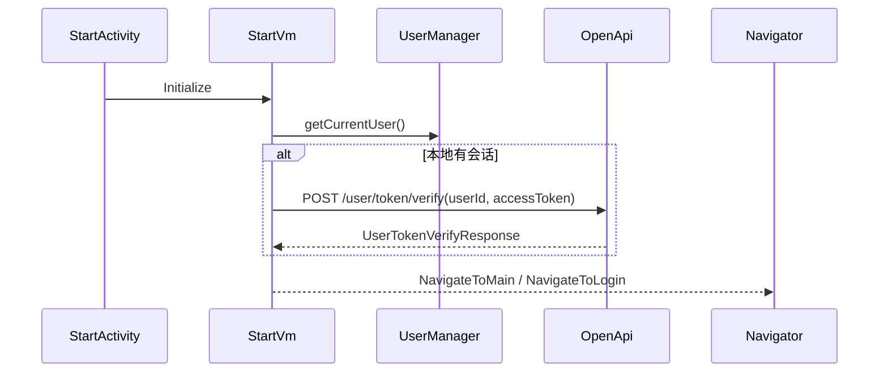

##### 启动鉴权甘特图
```mermaid
gantt
    title Android 启动鉴权线程甘特图
    dateFormat  X
    axisFormat %L ms
    section Main线程
    StartIntent.Initialize        :m1, 0, 5
    收到结果并分发导航Effect        :m2, 70, 10
    section IO线程
    读取Room用户会话              :i1, 5, 15
    发起HTTP verify请求           :i2, 20, 30
    section 协程状态
    suspend等待网络返回           :s1, 20, 40
```

### 登录与注册模块

#### 功能职责
* 登录：账号密码提交、按钮可用态控制、成功后写入本地会话。
* 注册：账号/密码/确认密码校验、头像选择与权限申请、成功后自动登录态落库。
* 页面仅负责编排，业务状态由 VM 的 MVI 流统一管理。
* 登录页 `dataState` 承载本地数据库账号缓存列表，`uiState` 仅承载当前可编辑输入值（账号、密码、加载态）。

#### 登录 UI 设计

##### 登录页面（Login）
**布局结构**：
- 顶部：Logo 区域
- 中间：账号输入框（支持下拉选择本地已有账号）、密码输入框（隐藏输入内容）
- 底部：登录按钮（账号密码未完整时置灰）、"没有账号？去注册" 链接

**交互设计**：
- 账号输入框：实时校验输入格式，失焦时验证
- 点击账号输入框可展开本地账号下拉列表；支持继续手输新账号
- 下拉选择已有账号时，若本地存在该账号密码则自动回填密码
- 密码输入框：隐藏输入内容，支持显示/隐藏切换
- 登录按钮：账号和密码均非空时激活，点击后显示加载状态
- 登录成功后，保存当前账号的最新 token 与密码到本地会话表
- 注册链接：点击跳转到注册页面
- 注册成功仅保存登录态（token），不默认持久化密码

#### UML静态图（类图）
##### 登录页面 MVI 类图
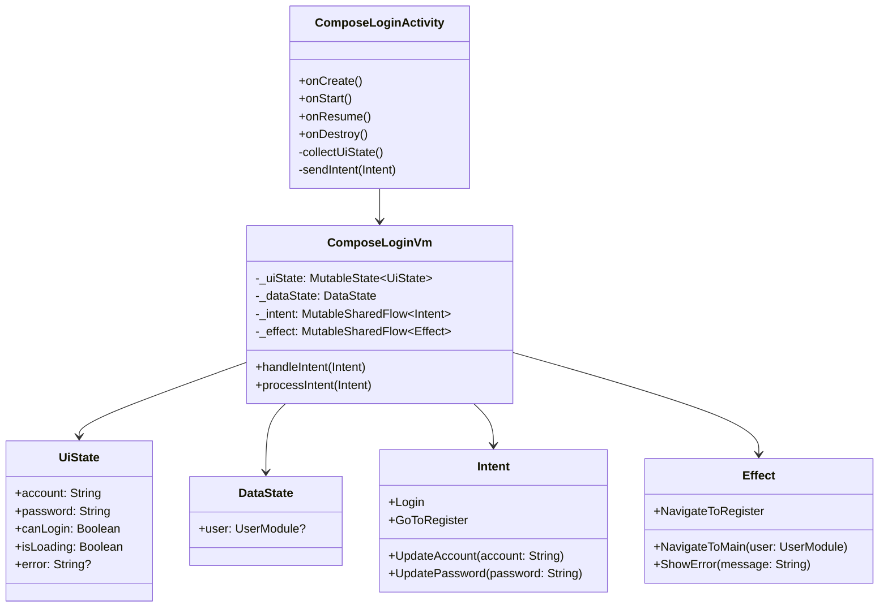

##### 登录页面通信图（动态UML）
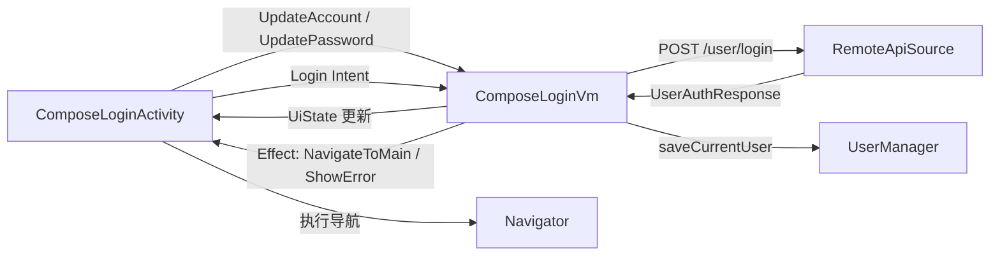

##### 登录 dataState 与 uiState 关系（动态UML）
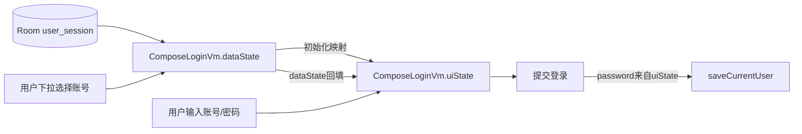

#### UML动态图（通信图/活动图/时序图/甘特图）

##### 登录活动图
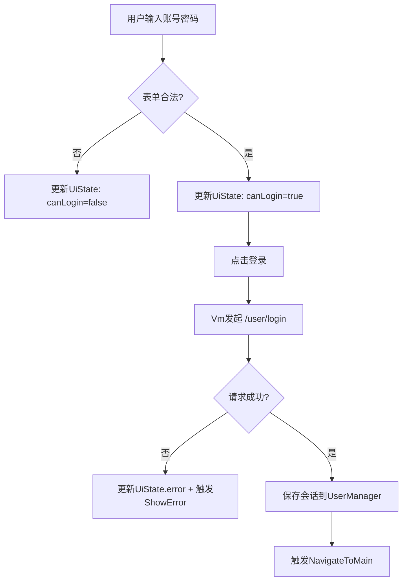

##### 登录时序图
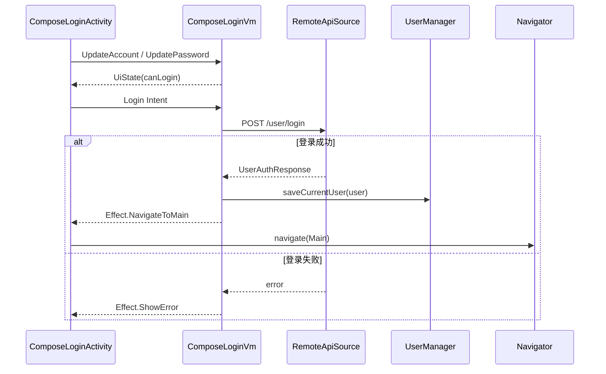

##### 登录鉴权甘特图
```mermaid
gantt
    title Android 登录请求线程与协程甘特图
    dateFormat  X
    axisFormat %L ms
    section Main线程
    输入与点击事件分发            :m1, 0, 8
    渲染加载状态与错误提示         :m2, 65, 12
    section IO线程
    发送 /user/login 请求         :i1, 8, 35
    接收响应并解析 DTO            :i2, 43, 12
    section 本地持久化
    保存会话到 Room               :d1, 55, 10
    section 协程调度器
    Dispatchers.Main (UI交互)     :c1, 0, 8
    Dispatchers.Main (状态更新)    :c2, 65, 12
    Dispatchers.IO (网络请求)      :c3, 8, 35
    Dispatchers.IO (响应解析)      :c4, 43, 12
    Dispatchers.IO (数据库保存)    :c5, 55, 10
```

#### 注册 UI 设计
##### 注册页面（Register）

**布局结构**：
- 顶部：Logo 区域
- 中间：账号输入框、密码输入框、确认密码输入框、圆形头像预览区域
- 底部：注册按钮（信息未完整时置灰）、"已有账号？去登录" 链接

**交互设计**：
- 头像选择：点击圆形预览区域，申请存储权限后打开相册
- 密码校验：实时对比密码和确认密码，不一致时显示错误提示
- 注册按钮：账号、密码、确认密码均非空且密码一致时激活
- 注册成功：自动保存会话并跳转到主页

#### UML静态图（类图）
##### 注册页面 MVI 类图
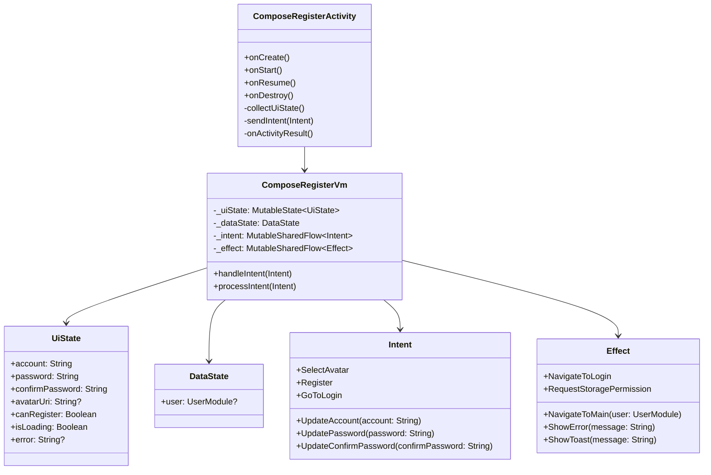

##### 注册页面通信图（动态UML）
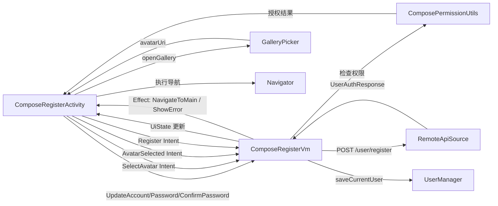

##### 认证模块状态机图
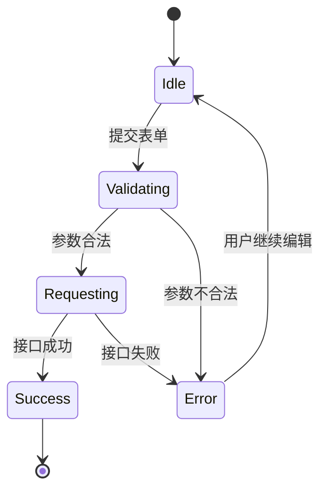

#### UML动态图（通信图/活动图/时序图/甘特图）

##### 注册活动图
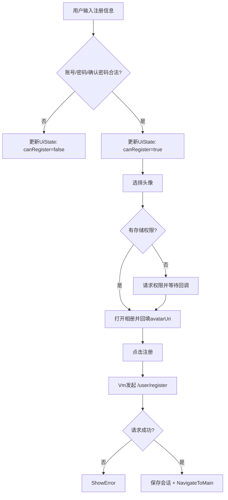

##### 注册时序图
```mermaid
sequenceDiagram
    participant Activity as ComposeRegisterActivity
    participant VM as ComposeRegisterVm
    participant Permission as ComposePermissionUtils
    participant Gallery as GalleryPicker
    participant Api as RemoteApiSource
    participant UM as UserManager
    participant Nav as Navigator

    Activity->>VM: UpdateAccount/Password/ConfirmPassword
    VM-->>Activity: UiState(canRegister)
    Activity->>VM: SelectAvatar Intent
    VM->>Permission: check/request permission
    Permission-->>Activity: granted
    Activity->>Gallery: openGallery()
    Gallery-->>Activity: avatarUri
    Activity->>VM: AvatarSelected(uri)
    Activity->>VM: Register Intent
    VM->>Api: POST /user/register
    alt 注册成功
        Api-->>VM: UserAuthResponse
        VM->>UM: saveCurrentUser
        VM-->>Activity: Effect.NavigateToMain
        Activity->>Nav: navigate(Main)
    else 注册失败
        Api-->>VM: error
        VM-->>Activity: Effect.ShowError
    end
```

##### 注册鉴权甘特图
```mermaid
gantt
    title Android 注册请求线程与协程甘特图
    dateFormat  X
    axisFormat %L ms
    section Main线程
    表单输入与校验                 :m1, 0, 20
    权限回调与相册结果处理          :m2, 20, 25
    页面状态更新与导航              :m3, 90, 15
    section IO线程
    发送 /user/register 请求       :i1, 45, 35
    响应解析与错误映射              :i2, 80, 10
    section 本地持久化
    保存会话到 Room               :d1, 85, 8
    section 协程调度器
    Dispatchers.Main (表单交互)     :c1, 0, 20
    Dispatchers.Main (权限处理)     :c2, 20, 25
    Dispatchers.Main (状态更新)     :c3, 90, 15
    Dispatchers.IO (网络请求)       :c4, 45, 35
    Dispatchers.IO (响应解析)       :c5, 80, 10
    Dispatchers.IO (数据库保存)     :c6, 85, 8
```

### Agent 模块（Main 内联弹层）

#### 功能职责
* Agent 页无数据时显示中心创建按钮；有数据时显示 Agent 列表。
* 创建/查看/修改/删除 Agent 统一采用 Main 页面内全屏组合函数弹层（放大进入、缩小退出）。
* Agent 列表点击跳转 `ComposeChatActivity`；列表长按进入 Agent 编辑弹层。
* 状态同步采用 `StateFlow + SharedFlow`，`eventBus` 仅作为兜底。

#### Agent UI 设计

##### Agent 列表页面（MessageListScreen）
**布局结构**：
- 状态机由 `hasAgent` 与 `hasMessage` 两个值共同驱动。
- `!hasAgent`：中心空状态 + `创建Agent` 主按钮（无 FAB）
- `hasAgent && !hasMessage`：中心提示“当前暂无消息” + 右下创建 FAB
- `hasAgent && hasMessage`：Agent 列表 + 右下创建 FAB

**交互设计**：
- 点击创建：打开 `AgentEditorOverlay`（创建模式）
- 点击 Agent：跳转 `ComposeChatActivity`
- 长按 Agent：打开 `AgentEditorOverlay`（编辑模式）

##### Agent 列表状态机图（新增）
```mermaid
stateDiagram-v2
    [*] --> NoAgent
    NoAgent: hasAgent=false
    HasAgentNoMessage: hasAgent=true, hasMessage=false
    HasAgentWithMessage: hasAgent=true, hasMessage=true
    NoAgent --> HasAgentNoMessage : 创建成功
    HasAgentNoMessage --> HasAgentWithMessage : 收到消息
    HasAgentWithMessage --> HasAgentNoMessage : 清空最近消息摘要
    HasAgentNoMessage --> NoAgent : 删除最后一个Agent
    HasAgentWithMessage --> NoAgent : 删除最后一个Agent
```

##### Agent 弹层页面（AgentEditorOverlay）
**布局结构**：
- 顶部标题与关闭按钮
- 名称输入、设定输入
- 创建/保存按钮
- 编辑模式下显示删除按钮

**交互设计**：
- 创建成功、更新成功、删除成功均通过 `SharedFlow<AgentListEvent>` 刷新列表
- 关闭或提交后弹层退出，不依赖 Activity Result

#### UML静态图（类图）
##### Agent 页面 MVI 类图
```mermaid
classDiagram
    class MainActivity {
      +collect(MainState)
      +collect(AgentListEvent)
    }
    class MainVm {
      -uiState: StateFlow~MainState~
      -agentListEvent: SharedFlow~AgentListEvent~
      +processIntent(intent)
    }
    class MessageListMviVm {
      +processIntent(intent)
      +syncAgentAndMessageState()
    }
    class AgentEditorOverlay
    class MainState
    class AgentEditorState
    class MessageListUiMode

    MainActivity --> MainVm
    MainActivity --> MessageListMviVm
    MainActivity --> AgentEditorOverlay
    MainVm --> MainState
    MainState --> AgentEditorState
    MessageListMviVm --> MessageListUiMode
```

#### UML动态图（通信图/活动图/时序图/甘特图）
##### Agent 页面 MVI 通信图
```mermaid
flowchart LR
    UI[MainActivity]
    List[MessageListScreen]
    VM[MainVm]
    ListVm[MessageListMviVm]
    Api[RemoteApiSource]
    Chat[ComposeChatActivity]
    UI --> VM
    UI --> List
    List --> ListVm
    ListVm --> UI
    UI -->|Create/Edit/Delete Intent| VM
    VM --> Api
    Api --> VM
    VM -->|SharedFlow AgentListEvent| UI
    List -->|Click item| Chat
```

##### Agent 页面活动图
```mermaid
flowchart TD
    A[进入Agent页] --> B{列表是否为空}
    B --> B1{hasAgent}
    B1 -- 否 --> C[显示中心创建按钮]
    B1 -- 是 --> D{hasMessage}
    D -- 否 --> E[显示暂无消息+创建FAB]
    D -- 是 --> F[显示Agent列表+创建FAB]
    C --> G[打开创建弹层]
    E --> G
    F --> H{点击 or 长按}
    H -- 点击 --> I[跳转ChatActivity]
    H -- 长按 --> J[打开编辑弹层]
    G --> K[提交创建]
    J --> L[保存或删除]
    K --> M[发出AgentListEvent]
    L --> M
    M --> N[刷新Agent+最近消息摘要]
```

##### Agent 页面时序图
```mermaid
sequenceDiagram
    participant Main as MainActivity
    participant VM as MainVm
    participant Api as RemoteApiSource
    participant ListVm as MessageListMviVm
    Main->>VM: OpenCreateAgent/OpenEditAgent
    VM->>Api: create/update/deleteAgent
    Api-->>VM: AgentResponse
    VM-->>Main: AgentListEvent
    Main->>ListVm: Refresh
    ListVm-->>Main: 新列表状态
```

##### Agent 页面线程甘特图
```mermaid
gantt
    title Android Agent页面线程甘特图
    dateFormat  X
    axisFormat %L ms
    section Main线程
    点击事件分发与弹层动画      :m1, 0, 18
    列表重绘                     :m2, 70, 18
    section IO线程
    create/update/delete 请求    :i1, 18, 42
    section 协程状态
    SharedFlow事件派发            :s1, 60, 10
```

### AgentChat 模块（ComposeAgentChatActivity 双 Fragment）

#### 功能职责
* 单 Activity 双页面：`ComposeAgentChatActivity` 内以横向滑动切换 `AgentEmojiFragment` 与 `AgentTextChatFragment`。
* Emoji 页（左页）合并 `voice_agent_page.dart` 的状态球语义与 `ComposeAgentEmojiActivity` 的视觉风格（黑底双眼），状态球颜色与缩放由 VAD/WS 状态驱动。
* Text 页（右页）复用 `ComposeChatActivity` 的文本输入/语音按压交互，继续走 `RealtimeChatController -> ChatController -> ChatCacheManager`。
* 两个 Fragment 均采用 MVI：`AgentEmojiFragmentVm`、`AgentTextChatFragmentVm`，Activity 级编排采用 `ComposeAgentChatVm`。

#### UI/交互设计
* 顶部：两个圆点表示当前页；支持左右滑动切换。
* 左页中心：黑底 + 双眼；底部状态球颜色规范：
  * 未连接/断开：灰色
  * 异常：红色
  * 用户语音结束/可继续对话：绿色
  * 用户正在说话：蓝色
  * Agent 回复中：紫色
* 状态球动画：唤醒成功或进入 Speaking/Replying 阶段时弹性放大；回复结束回落到默认尺寸。
* 左页附加状态：显示当前摄像头方向（前置/后置），用于对齐“前置摄像头状况”要求。

#### UML静态图（类图）
```mermaid
classDiagram
    class ComposeAgentChatActivity {
      +onCreate()
      +observeEffects()
      +mapPhaseText()
    }
    class ComposeAgentChatVm {
      +processIntent(intent)
      +initResource(activity)
      +sendTextMessage(msg)
      +startSendVoice(scope)
      +toggleMicState()
    }
    class AgentEmojiFragment
    class AgentTextChatFragment
    class AgentEmojiFragmentVm
    class AgentTextChatFragmentVm
    class RealtimeChatController
    class ChatController
    class ChatCacheManager
    class ChatService

    ComposeAgentChatActivity --> ComposeAgentChatVm
    ComposeAgentChatActivity --> AgentEmojiFragment
    ComposeAgentChatActivity --> AgentTextChatFragment
    AgentEmojiFragment --> AgentEmojiFragmentVm
    AgentTextChatFragment --> AgentTextChatFragmentVm
    ComposeAgentChatVm --> ChatService
    ComposeAgentChatVm --> RealtimeChatController
    RealtimeChatController --> ChatController
    ChatController --> ChatCacheManager
```

#### UML静态图（对象图）
```mermaid
classDiagram
    class activity_1 {
      page = 0
      title = "AgentName"
    }
    class vm_1 {
      vadState = Speaking
      orbPhase = USER_SPEAKING
    }
    class emojiVm_1 {
      statusText = "用户正在说话 · 前置摄像头"
    }
    class textVm_1 {
      isEnableSend = true
    }
    class rtc_1 {
      userId = "u1001"
      agentId = "a2001"
    }
    class chatCtrl_a2001 {
      pendingUpdate = 3
    }

    activity_1 --> vm_1
    activity_1 --> emojiVm_1
    activity_1 --> textVm_1
    vm_1 --> rtc_1
    rtc_1 --> chatCtrl_a2001
```

#### UML动态图（状态图）
```mermaid
stateDiagram-v2
    [*] --> Disconnected
    Disconnected --> Ready : ws connected + vad silent
    Ready --> UserSpeaking : vad startSpeech
    UserSpeaking --> AgentReplying : start_tts
    AgentReplying --> Ready : stop_tts
    Ready --> Error : ws error / vad error
    UserSpeaking --> Error : stt/transport error
    AgentReplying --> Error : tts/transport error
    Error --> Disconnected : reset / reconnect
```

#### UML动态图（活动图）
```mermaid
flowchart TD
    A[进入 ComposeAgentChatActivity] --> B[绑定 ChatService]
    B --> C[初始化 RealtimeChatController]
    C --> D{当前页}
    D -- Emoji页 --> E[展示黑底双眼 + 状态球]
    D -- Text页 --> F[展示消息列表 + 输入栏]
    E --> G{用户操作}
    G -- 唤醒/开麦 --> H[请求录音权限并启动VAD]
    H --> I[状态球弹性放大]
    F --> J{输入类型}
    J -- 文本 --> K[USER_TEXT_MESSAGE]
    J -- 按压语音 --> L[START/STOP_AUDIO_RECORD + AUDIO_CHUNK]
    K --> M[WS回包 TEXT_CHAT_RESPONSE]
    L --> M
    M --> N[ChatController 增量插入]
    N --> O[ChatCacheManager 持久化]
    O --> P[UI 增量刷新]
```

#### UML动态图（时序图）
```mermaid
sequenceDiagram
    participant UI as ComposeAgentChatActivity
    participant VM as ComposeAgentChatVm
    participant FragVm as AgentTextChatFragmentVm
    participant RTC as RealtimeChatController
    participant CC as ChatController
    participant Cache as ChatCacheManager
    participant WS as SpringWS

    UI->>VM: Initialize(intent, activity)
    VM->>RTC: initResource(...)
    UI->>FragVm: UserSendText("你好")
    FragVm-->>VM: ForwardSendText
    VM->>RTC: send USER_TEXT_MESSAGE
    RTC->>WS: websocket send
    WS-->>RTC: TEXT_CHAT_RESPONSE(fragment)
    RTC->>CC: setWsToViews/insert message
    CC->>Cache: upsertBatch
    CC-->>UI: update list/effect
```

#### UML动态图（通信图）
```mermaid
flowchart LR
    AC[ComposeAgentChatActivity] --> VM[ComposeAgentChatVm]
    VM --> EFVM[AgentEmojiFragmentVm]
    VM --> TFVM[AgentTextChatFragmentVm]
    VM --> RTC[RealtimeChatController]
    RTC --> WS[RealtimeChatWsClient]
    RTC --> CC[ChatController]
    CC --> Cache[ChatCacheManager]
    Cache --> Room[(VectorDatabase)]
```

#### 功能线程甘特图
```mermaid
gantt
    title ComposeAgentChat 功能线程甘特图
    dateFormat  X
    axisFormat %L ms
    section Main线程
    Pager切换与圆点动画             :m1, 0, 25
    状态球渲染与弹性动画            :m2, 25, 120
    文本列表重绘                    :m3, 40, 100
    section WebSocket线程
    发送文本/音频消息               :w1, 30, 110
    接收TEXT_CHAT_RESPONSE/TTS事件  :w2, 45, 110
    section 音频线程
    AudioRecord/VAD检测             :a1, 35, 95
    AudioTrack播放                  :a2, 70, 80
    section 数据线程
    ChatController去重插入          :d1, 50, 90
    Room持久化                      :d2, 58, 80
```

#### 设计模式
* **组合模式（Compose UI）**：页面拆分为 Activity 编排 + Fragment级组合函数，便于复用和替换单页逻辑。
* **门面模式**：`ComposeAgentChatVm` 统一封装权限、WS、VAD、页面状态编排。
* **观察者模式**：`StateFlow + Effect` 驱动页面增量更新。
* **状态模式（轻量）**：`AgentVoiceOrbPhase` 将颜色/动画映射集中化，避免在 UI 层散落条件判断。
* **计算机网络/并发说明**：`WebSocket` 实时流与 `AudioRecord` 采集属于并发流水线，需避免主线程阻塞并保证消息顺序一致性。

### Control 模块（Main 第二个 Tab）

#### 功能职责
* 展示设备状态操作监控：`RK<->App(BLE/WiFi)`、`RK<->SpringBoot`、`App<->SpringBoot`、`RK Agent 选用状态`。
* 提供云操控平台（Cloud）与离线操控平台（WiFi/BLE）切换。
* 提供双摇杆遥感控制（左方向、右移动）和基础按钮指令。
* 提供 App 端推拉流测试 UI（推流/拉流模式 + RTMP URL + 视频视图）。
* 提供录制状态切换和录制时长显示（编码链路本期保留 TODO）。

#### UI/交互设计
* 顶部状态卡统一显示连接态：`App-Spring`、`RK-Spring`、`RK-App WiFi`、`RK-App BLE`、`RTMP拉流`、`网络在线`。
* `App-Spring` 连接状态以登录后常驻 `RealtimeChatController` 长连接为准，不再被 `GET /control/status` 返回值覆盖，避免进入页面闪绿再闪红。
* 中部平台切换 + 流来源切换：
  * `RTMP + Nginx`（推荐，链路短、延迟更稳）
  * `UDP裸帧 -> SpringBoot(Netty) -> App`（可选，便于服务端转发治理）
* 视频区使用 `SurfaceView` 容器承载高性能渲染（本期预留挂载位）。
* 控制区采用双摇杆 + 快捷按钮；BLE 模式下禁用视频，仅保留指令。
* 底部提供录制与 App 推拉流测试区。
* 底部新增 `Agent指令日志区`：展示 SpringBoot 返回的 Agent JSON 指令，支持在线分页查询与 Room 离线回放。

#### 可行方案（音视频/连接）
* **RTMP 拉流（在线）**：Android 采用 `Media3 ExoPlayer` 播放 m3u8/RTMP 转 HLS，播放器端性能稳定，便于缓冲与断线重连。
* **离线WiFi UDP视频**：RK 在 AP 模式下通过 UDP 发送 H264/JPEG 分片，Android 本地重组并经 `MediaCodec/OpenGL` 渲染到 `SurfaceView`。
* **BLE 控制链路**：BLE 用于低带宽控制命令（摇杆/按钮），视频链路不走 BLE。
* **录像保存**：在线H264流与离线UDP重组帧都统一进 `FFmpeg/MediaCodec` 转封装 MP4。
* **本期实现检查**：当前仓库 `UdpVisionManager` 仅实现了发送端分片能力，Control 页尚未接入 UDP 接收与渲染，属于待实现项。

#### 技术资料链接
* [Android Media3 HLS 官方文档](https://developer.android.com/media/media3/exoplayer/hls)
* [Media3 HlsMediaSource API](https://developer.android.com/reference/androidx/media3/exoplayer/hls/HlsMediaSource.Factory)
* [FFmpeg 官方文档](https://ffmpeg.org/ffmpeg.html)
* [MinIO Java SDK API](https://minio-java.min.io/io/minio/package-summary.html)
* [tus Java Client（断点续传协议可选）](https://github.com/tus/tus-java-client)

#### UML静态图（类图）
```mermaid
classDiagram
    class ControlScreen
    class ControlVm {
      -_uiState: StateFlow~ControlUiState~
      -_dataState: StateFlow~ControlDataState~
      -_effect: Channel~ControlEffect~
      +processIntent(intent)
    }
    class ControlCommandController {
      +buildJoystickCommand(...)
      +buildButtonCommand(...)
    }
    class ControlConsoleManager {
      +connectControlWs(...)
      +queryControlStatus(...)
      +sendControlCommand(...)
    }
    class RemoteApiSource
    class ControlUiState
    class ControlDataState
    class ControlIntent
    class ControlEffect

    ControlScreen --> ControlVm
    ControlVm --> ControlCommandController
    ControlVm --> ControlConsoleManager
    ControlVm --> RemoteApiSource
    ControlVm --> ControlUiState
    ControlVm --> ControlDataState
    ControlVm --> ControlIntent
    ControlVm --> ControlEffect
```

#### UML静态图（对象图）
```mermaid
classDiagram
    class controlVm_1 {
      platform = CLOUD
      streamSource = RTMP_DIRECT
      recording = false
    }
    class wsState_1 {
      connected = true
      retryCount = 0
    }
    class device_1 {
      id = rk-default
      rkAgentMode = TODO_RK_AGENT
    }
    controlVm_1 --> wsState_1
    controlVm_1 --> device_1
```

#### UML动态图（状态图）
```mermaid
stateDiagram-v2
    [*] --> Booting
    Booting --> Connecting : Initialize
    Connecting --> ReadyCloud : App-Spring在线 + 状态同步
    ReadyCloud --> ReadyOfflineWiFi : switch OFFLINE_WIFI
    ReadyCloud --> ReadyOfflineBle : switch OFFLINE_BLE
    ReadyOfflineWiFi --> ReadyCloud : switch CLOUD
    ReadyOfflineBle --> ReadyCloud : switch CLOUD
    ReadyCloud --> Reconnecting : 控制通道中断
    Reconnecting --> ReadyCloud : 状态恢复
    ReadyCloud --> Recording : toggle recording
    ReadyOfflineWiFi --> Recording : toggle recording
    Recording --> ReadyCloud : stop recording
    Recording --> ReadyOfflineWiFi : stop recording
```

#### UML动态图（活动图）
```mermaid
flowchart TD
    A[进入Control页] --> B[初始化ControlVm]
    B --> C[并发: 监听NetworkState + 连接ControlWS + 拉状态]
    C --> D{平台选择}
    D -- Cloud --> E[视频区可用 + 指令走WS/HTTP]
    D -- Offline WiFi --> F[视频区可用 + 指令走局域网]
    D -- Offline BLE --> G[仅指令, 视频禁用]
    E --> H[双摇杆持续上报指令]
    F --> H
    G --> H
    H --> I[可选开始录制]
```

#### UML动态图（时序图）
```mermaid
sequenceDiagram
    participant UI as ControlScreen
    participant VM as ControlVm
    participant CCM as ControlConsoleManager
    participant API as RemoteApiSource
    participant SB as SpringBoot
    UI->>VM: Initialize
    VM->>CCM: connectControlWs(userId,deviceId)
    VM->>CCM: queryControlStatus(deviceId)
    CCM->>API: GET /control/status
    API->>SB: status request
    SB-->>API: ControlStatusResponse
    API-->>VM: status
    UI->>VM: LeftJoystickDrag(x,y)
    VM->>CCM: sendControlCommand(request)
    CCM->>SB: WS COMMAND / HTTP fallback
    SB-->>CCM: ack(optional)
    CCM-->>VM: accepted/traceId
```

#### UML动态图（通信图）
```mermaid
flowchart LR
    UI[ControlScreen] --> VM[ControlVm]
    VM --> CMD[ControlCommandController]
    VM --> CCM[ControlConsoleManager]
    CCM --> HTTP[RemoteApiSource]
    CCM --> SyncChannel[控制通道]
    HTTP --> SB[(SpringBoot)]
    SyncChannel --> SB
```

#### 功能线程甘特图
```mermaid
gantt
    title Control 模块线程甘特图
    dateFormat  X
    axisFormat %L ms
    section Main线程
    状态卡渲染/平台切换            :m1, 0, 40
    摇杆拖拽事件采样               :m2, 40, 120
    section IO线程
    控制WS建立与保活               :i1, 10, 180
    HTTP状态拉取                   :i2, 25, 60
    section 录制线程(预留)
    H264/UDP转MP4编码              :r1, 70, 220
```

### Mine 模块（Setting + 视频）

#### 功能职责
* 顶部显示头像与大号 `UserAccount`，下方提供三个一级入口按钮：`设置`、`视频`、`测试`。
* 三个按钮分别跳转三个独立 Activity，不在同一页面内混排子业务：
  * `设置` -> `ComposeMineSettingActivity`
  * `视频` -> `ComposeMineVideoActivity`
  * `测试` -> `ComposeTestActivity`
* **Setting**：提供修改密码、登出（业务简单，轻量实现）。
* **视频**：
  * 云上录播记录播放（服务端 MinIO 视频源转 m3u8，Android 播放）
  * 本地视频播放（MP4）
  * 本地视频上传云端（支持断点续传、下载）

#### m3u8 播放方案（新增）
* 播放内核：采用 `androidx.media3 ExoPlayer`，统一支持 m3u8（HLS）和本地 mp4。
* 播放流程：
  1. 页面请求 `GET /video/cloud/play-url` 获取 m3u8 地址（预签名 URL 或网关 URL）。
  2. 使用 `MediaItem.fromUri(playUrl)` 构建媒体源并 `player.prepare()`。
  3. 监听 `Player.Listener`，根据 `STATE_BUFFERING/STATE_READY/STATE_ENDED` 更新 UI。
  4. 播放失败时按错误类型重试（网络超时可指数退避重试，鉴权失败直接刷新 URL）。
* URL 过期策略：
  * 如果返回的是短时预签名 URL，播放失败且错误为 403/401 时，先重新请求播放地址再恢复播放。
  * 预留 TODO：接入网关后改为稳定播放 URL，减少频繁换签。
* 缓冲与体验策略：
  * 默认允许首屏缓冲后起播，弱网情况下优先保证连续播放而不是强实时。
  * 列表页仅预加载封面和元数据，不预拉视频流，避免占用带宽。

#### m3u8 播放活动图（新增）
```mermaid
flowchart TD
    A[进入云视频页面] --> B[请求 /video/cloud/play-url]
    B --> C{返回 URL 成功?}
    C -- 否 --> D[提示获取播放地址失败]
    C -- 是 --> E[ExoPlayer setMediaItem + prepare]
    E --> F{播放器状态}
    F -- BUFFERING --> G[显示缓冲态]
    F -- READY --> H[开始播放]
    F -- ENDED --> I[显示播放完成]
    F -- ERROR --> J{鉴权过期?}
    J -- 是 --> K[重新请求 play-url 并重试]
    J -- 否 --> L[提示播放失败并允许手动重试]
```

#### m3u8 播放参考资料（新增）
* [Android Media3 ExoPlayer HLS](https://developer.android.com/media/media3/exoplayer/hls)
* [ExoPlayer HlsMediaSource.Factory](https://developer.android.com/reference/androidx/media3/exoplayer/hls/HlsMediaSource.Factory)
* [ExoPlayer Player.Listener](https://developer.android.com/reference/androidx/media3/common/Player.Listener)
* [RFC 8216 HTTP Live Streaming](https://datatracker.ietf.org/doc/html/rfc8216)

#### UI/交互设计
* Mine 首页只保留导航入口，不承载 Setting/Video 业务面板。
* `ComposeMineSettingActivity` 承载 Setting 业务，页面 MVI 由 `ComposeMineSettingVm` 管理。
* `ComposeMineVideoActivity` 承载视频业务，页面 MVI 由 `ComposeMineVideoVm` 管理，VideoPanel 包含三个子 Tab：
  * `CloudRecord`：云录播列表 + 播放器 + 下载按钮
  * `LocalPlay`：本地 MP4 选择与播放
  * `Upload`：上传任务列表（进度、暂停、继续、重试）

#### UML静态图（类图）
```mermaid
classDiagram
    class MineScreen
    class ComposeMineSettingActivity
    class ComposeMineVideoActivity
    class ComposeTestActivity
    class MineVm {
      +processIntent(intent)
    }
    class ComposeMineSettingVm {
      -_uiState: StateFlow~MineSettingState~
      -_dataState: StateFlow~MineSettingDataState~
      -_effect: Channel~MineSettingEffect~
      +processIntent(intent)
    }
    class ComposeMineVideoVm {
      -_uiState: StateFlow~MineVideoState~
      -_dataState: StateFlow~MineVideoDataState~
      -_effect: Channel~MineVideoEffect~
      +processIntent(intent)
    }
    class MineVideoManager {
      +fetchCloudRecordList(...)
      +resolveCloudPlayUrl(...)
      +downloadCloudVideo(...)
      +playLocalVideo(...)
    }
    class MineUploadManager {
      +createUploadSession(...)
      +uploadChunk(...)
      +resumeUpload(...)
      +completeUpload(...)
    }
    class MineUploadController {
      +scheduleUpload(...)
      +pauseTask(...)
      +resumeTask(...)
    }
    class MineState
    class MineSettingState
    class MineSettingDataState
    class MineSettingIntent
    class MineSettingEffect
    class MineVideoState
    class MineVideoDataState
    class MineVideoIntent
    class MineVideoEffect
    class ExoPlayer
    class VideoView
    class RemoteApiSource

    MineScreen --> MineVm
    MineScreen --> ComposeMineSettingActivity
    MineScreen --> ComposeMineVideoActivity
    MineScreen --> ComposeTestActivity
    ComposeMineSettingActivity --> ComposeMineSettingVm
    ComposeMineVideoActivity --> ComposeMineVideoVm
    ComposeMineVideoVm --> MineVideoManager
    ComposeMineVideoVm --> MineUploadController
    MineUploadController --> MineUploadManager
    MineVideoManager --> RemoteApiSource
    MineUploadManager --> RemoteApiSource
    MineVideoManager --> ExoPlayer
    MineVideoManager --> VideoView
    MineVm --> MineState
    ComposeMineSettingVm --> MineSettingState
    ComposeMineSettingVm --> MineSettingDataState
    ComposeMineSettingVm --> MineSettingIntent
    ComposeMineSettingVm --> MineSettingEffect
    ComposeMineVideoVm --> MineVideoState
    ComposeMineVideoVm --> MineVideoDataState
    ComposeMineVideoVm --> MineVideoIntent
    ComposeMineVideoVm --> MineVideoEffect
```

#### UML静态图（对象图）
```mermaid
classDiagram
    class mineVm_1 {
      tab = VIDEO
      subTab = CLOUD_RECORD
      currentUser = user_1001
    }
    class uploadTask_1 {
      file = local_a.mp4
      uploadedBytes = 10485760
      state = UPLOADING
    }
    class cloudRecord_1 {
      objectName = v/2026/03/a.m3u8
      playUrl = signed-url
    }
    mineVm_1 --> uploadTask_1
    mineVm_1 --> cloudRecord_1
```

#### UML动态图（状态图）
```mermaid
stateDiagram-v2
    [*] --> MineHome
    MineHome --> SettingPage : click 设置
    MineHome --> VideoPage : click 视频
    MineHome --> TestPage : click 测试
    TestPage --> MineHome : back
    SettingPage --> MineHome : back
    VideoPage --> MineHome : back
    VideoPage --> CloudRecord : subTab cloud
    VideoPage --> LocalPlay : subTab local
    VideoPage --> Uploading : subTab upload
    Uploading --> UploadPaused : pause
    UploadPaused --> Uploading : resume
    Uploading --> UploadDone : complete
    SettingPage --> LoggedOut : logout
```

#### UML动态图（活动图）
```mermaid
flowchart TD
    A[进入Mine页] --> B[显示头像+账号]
    B --> C[展示三个按钮: 设置/视频/测试]
    C --> D{点击入口}
    D -- 设置 --> E[跳转 ComposeMineSettingActivity]
    D -- 视频 --> F[跳转 ComposeMineVideoActivity]
    D -- 测试 --> G[跳转 ComposeTestActivity]
    F --> H{子Tab}
    H -- 云录播 --> I[请求云录播列表 -> 播放]
    H -- 本地播放 --> J[选择本地MP4 -> 播放]
    H -- 上传 --> K[创建上传会话 -> 分片上传 -> 完成]
```

#### UML动态图（时序图）
```mermaid
sequenceDiagram
    participant UI as MineScreen
    participant VM as MineVm
    participant VC as MineUploadController
    participant UM as MineUploadManager
    participant API as RemoteApiSource
    participant SB as SpringBoot
    UI->>VM: SelectLocalVideo(fileUri)
    UI->>VM: StartUpload
    VM->>VC: scheduleUpload(fileUri)
    VC->>UM: createUploadSession()
    UM->>API: POST /video/upload/init
    API->>SB: init request
    SB-->>API: uploadId/chunkSize
    loop chunk
      VC->>UM: uploadChunk(index, bytes)
      UM->>API: POST /video/upload/chunk
      API->>SB: chunk request
      SB-->>API: uploadedOffset
    end
    VC->>UM: completeUpload()
    UM->>API: POST /video/upload/complete
```

#### UML动态图（通信图）
```mermaid
flowchart LR
    MineScreen --> MineVm
    MineVm --> MineVideoManager
    MineVm --> MineUploadController
    MineUploadController --> MineUploadManager
    MineVideoManager --> RemoteApiSource
    MineUploadManager --> RemoteApiSource
    RemoteApiSource --> SpringBoot[(SpringBoot)]
    MineVideoManager --> ExoPlayer
    MineVideoManager --> VideoView
```

#### 功能线程甘特图
```mermaid
gantt
    title Mine模块线程甘特图
    dateFormat  X
    axisFormat %L ms
    section Main线程
    模块切换与状态渲染              :m1, 0, 40
    本地文件选择回调                :m2, 25, 30
    section IO线程
    云列表查询/签名URL获取          :i1, 20, 80
    上传分片读盘与网络发送          :i2, 35, 220
    下载任务写盘                    :i3, 60, 180
    section Media线程
    ExoPlayer/VideoView解码播放      :p1, 45, 240
```

#### 可行方案与资料
* **云录播播放**
  * SpringBoot 读取 MinIO 对象，后台任务用 FFmpeg 将 MP4 切片成 HLS（m3u8 + ts/fmp4），返回播放 URL。
  * Android 用 Media3 ExoPlayer 拉流播放 m3u8。
* **本地播放**
  * 轻量方案：`VideoView` 直接播放 MP4。
  * 可扩展方案：`ExoPlayer` 统一本地+网络播放栈（便于缓存策略一致）。
* **上传断点续传**
  * 主方案：自定义 `uploadId + chunkIndex + offset` 分片接口，服务端持久化上传进度；完成后 MinIO compose/merge。
  * 可选方案：Tus 协议（标准化 resumable upload）。
* 参考：
  * [Android Media3 HLS](https://developer.android.com/media/media3/exoplayer/hls)
  * [FFmpeg Documentation](https://ffmpeg.org/ffmpeg.html)
  * [MinIO Java SDK](https://minio-java.min.io/io/minio/package-summary.html)
  * [tus-java-client](https://github.com/tus/tus-java-client)

## Manager管理类设计

### 会话管理模块（UserManager）

#### 功能职责
* 统一提供 `saveCurrentUser/getCurrentUser/getAllUsers/clearCurrentUser`。
* 对上层隐藏 Room 细节，保持 VM 与数据库解耦。
* 启动与登录/注册流程共享同一会话入口。
* 内部缓存当前会话 `currentUserSession`，优先返回内存缓存；缓存为空时再回源 Room 查询。

#### 设计约束
* 本地会话支持多账号缓存，通过 `is_current` 标识当前登录账号。
* `account` 字段唯一，用于登录页下拉账号选择与密码自动回填。
* `userId` 与后端主键一致，统一为 `Long`。
* 启动鉴权采用 `userId + accessToken` 强绑定校验，防止 token 串用。

#### UML静态图（类图）

##### 会话管理模块 类图 （展示功能）
```mermaid
classDiagram
    class UserManager {
        +saveCurrentUser(user: UserSession)
        +getCurrentUser(): UserSession?
        +getAllUsers(): List~UserSession~
        +clearCurrentUser()
    }
    class UserLocalSource {
        +saveCurrentUser(entity: UserEntity, handleResult)
        +getCurrentUser(handleResult)
        +getAllUsers(handleResult)
        +clearCurrentUser(handleResult)
    }
    class UserConvertor {
        +model2Entity(model: UserSession): UserEntity
        +entity2Model(entity: UserEntity): UserSession
    }
    class UserDao {
        +upsert(entity: UserEntity)
        +getCurrent(): UserEntity?
        +getAll(): List~UserEntity~
        +clearCurrentFlag()
    }
    class UserEntity {
        +id: Long
        +userId: Long
        +account: String
        +name: String
        +avatarUrl: String
        +accessToken: String
        +password: String
        +isCurrent: Boolean
        +lastLoginAt: Long
    }
    class UserSession {
        +userId: Long
        +account: String
        +name: String
        +avatarUrl: String
        +accessToken: String
        +password: String
        +isCurrent: Boolean
        +lastLoginAt: Long
    }

    UserManager --> UserLocalSource
    UserManager --> UserConvertor
    UserLocalSource --> UserDao
    UserDao --> UserEntity
    UserConvertor --> UserEntity
    UserManager --> UserSession
```

#### UML动态图（通信图/活动图/时序图/甘特图）

##### 会话管理通信图
```mermaid
flowchart LR
    VM[Start/Login/Register Vm]
    UM[UserManager]
    LS[UserLocalSource]
    DAO[UserDao]
    CVT[UserConvertor]

    VM -->|saveCurrentUser/getCurrentUser/clearCurrentUser| UM
    UM -->|读写请求| LS
    UM -->|model/entity转换| CVT
    LS -->|执行SQL| DAO
    DAO -->|UserEntity| LS
    LS -->|回调结果| UM
    UM -->|UserSession| VM
```

##### 会话生命周期状态图
```mermaid
stateDiagram-v2
    [*] --> Empty
    Empty --> Persisted : saveCurrentUser
    Persisted --> Persisted : update accessToken/profile
    Persisted --> Invalidated : token verify failed
    Invalidated --> Empty : clearCurrentUser
    Persisted --> Empty : logout/clearCurrentUser
```

### 聊天管理模块（ChatController + ChatMapController + ChatCacheManager）

#### 功能职责
* `RealtimeChatController` 升级为 **用户级常驻连接**：登录成功后建立 `userId` 维度 WS，不再在打开 Chat 时按 `agentId` 新建连接。
* 聊天路由改为 `agentId` 作为 `channelId`：进入不同 Agent Chat 页面时发送 `BIND_CHANNEL` 切换路由。
* Android 侧使用 OkHttp `pingInterval` 框架心跳（20s）维持连接，不再发送应用层 `HEARTBEAT` 文本包。
* `ChatMapController` 管理 `<agentId, ChatController>` 映射，支持按 Agent 隔离会话数据。
* `ChatController` 维护单 Agent 有序消息列表，支持 HTTP 批量插入与 WS 单条/流式插入。
* `ChatController` 使用 `messageId` 索引加速去重（O(1)），并限制内存消息上限，历史依赖 Room + 锚点分页回放。
* `ChatCacheManager` 负责 Room 持久化与锚点查询，提供离线回放和重连补偿数据基础。
* `NetworkManager` 负责在线/离线 + WebSocket 连接状态监听，触发首次/重连 HTTP 拉取策略。
* `ChatMapController` 使用线程安全容器并设置 Controller 数量上限，降低长时运行内存泄漏风险。

#### UML静态图（类图）
##### Chat 管理类图
```mermaid
classDiagram
    class ChatMapController {
      -chatManagers: Map~String,ChatController~
      +getChatManager(agentId)
      +removeChatManager(agentId)
    }
    class ChatController {
      -viewChatMessageList: MutableList~ChatItemAo~
      +setResponsesToViews(list)
      +setWsToViews(item)
      +getNeedUpdateList()
    }
    class ChatCacheManager {
      +upsertMessages(list)
      +queryBeforeAnchor(agentId, anchor, limit)
      +queryAfterAnchor(agentId, anchor, limit)
    }
    class RealtimeChatController {
      -currentUserId: String
      -currentAgentId: String
      +ensureUserConnection(userId)
      +bindChannel(agentId)
    }
    class NetworkManager
    ChatMapController --> ChatController
    ChatController --> ChatCacheManager
    RealtimeChatController --> ChatMapController
    NetworkManager --> ChatCacheManager
    NetworkManager --> RealtimeChatController
```

#### UML动态图（通信图/活动图/时序图/甘特图）
##### Chat 通信图（多数据源）
```mermaid
flowchart LR
    UI[MessageList/Chat UI] --> VM[MessageListMviVm/ComposeChatVm]
    VM --> MapMgr[ChatMapController]
    MapMgr --> Ctrl[ChatController]
    VM --> Api[RemoteApiSource]
    VM --> Ws[RealtimeChatController]
    Ctrl --> Cache[ChatCacheManager]
    Cache --> Room[(VectorDatabase)]
    Api --> VM
    Ws --> VM
```

##### WS 路由通信图（用户连接 + channel 路由）
```mermaid
flowchart LR
    Login[Login/Register Success] --> Main[MainActivity]
    Main --> RTC["RealtimeChatController.ensureUserConnection(userId)"]
    RTC --> WS[(WebSocket /agent/realtime/chat)]
    Chat["ComposeChatActivity(agent1)"] --> RTC2["bindChannel(agentId)"]
    RTC2 --> WS
    WS --> VM[ComposeChatVm/MainVm]
    VM --> MapMgr[ChatMapController]
    MapMgr --> Ctrl["ChatController(agent1)"]
    Ctrl --> SF[StateFlow/SharedFlow]
    SF --> UI[Main MessageList + Chat UI]
```

##### Chat 活动图（首次/重连/离线）
```mermaid
flowchart TD
    A[页面初始化] --> B{网络在线?}
    B -- 是 --> C{首次或重连?}
    C -- 是 --> D[HTTP拉取]
    C -- 否 --> E[读取Room]
    D --> F[写入Room]
    F --> G[更新ChatController有序列表]
    E --> G
    B -- 否 --> E
    G --> H[渲染UI]
    H --> I[接收WS消息]
    I --> J[二分插入 + 增量刷新]
```

##### Chat 对象图（运行期）
```mermaid
classDiagram
  class ChatMapController {
    Map~String, ChatController~
  }

  class ChatController {
    agentId
    List~ChatItemAo~
  }

  class ChatCacheManager {
    Room数据库操作
  }

  class NetworkManager {
    网络 + WS状态监听
  }

  class RemoteApiSource {
    HTTP请求
  }

  class RealtimeChatController {
    WebSocket连接状态
  }

  class ViewModel {
    MessageListMviVm
    ComposeChatVm
  }

  ChatMapController *-- ChatController : 包含

  ChatController --> ChatCacheManager : 读写

  NetworkManager --> ChatCacheManager : 状态通知
  NetworkManager --> ViewModel : 状态通知

  RemoteApiSource --> ChatCacheManager : 写入历史
  RemoteApiSource --> ChatController : 批量插入

  RealtimeChatController --> ChatController : 单条插入
  RealtimeChatController --> ChatCacheManager : 持久化

  ViewModel --> ChatMapController : 获取
  ViewModel --> RemoteApiSource : 调用
  ViewModel --> RealtimeChatController : 管理
  ViewModel --> NetworkManager : 监听
```

##### Chat 状态图（连接与数据源切换）
```mermaid
stateDiagram-v2
    [*] --> Init
    Init --> OnlineSync : 网络可用
    Init --> OfflineRead : 网络不可用
    OnlineSync --> WsStreaming : HTTP同步完成
    WsStreaming --> Reconnect : WS断开
    Reconnect --> OnlineSync : 重连成功
    Reconnect --> OfflineRead : 重连失败
    OfflineRead --> OnlineSync : 网络恢复
```

##### WS 活动图（登录建连 + 路由切换 + 心跳）
```mermaid
flowchart TD
    A[登录成功] --> B[ChatService绑定]
    B --> C["ensureUserConnection(userId)"]
    C --> D[WS onOpen]
    D --> E["发送 CONNECT(userId)"]
    E --> F{打开某个Agent Chat?}
    F -- 是 --> G["发送 BIND_CHANNEL(agentId)"]
    G --> H[收发该channel消息]
    F -- 否 --> I[维持空闲长连接]
    H --> J[OkHttp pingInterval心跳]
    I --> J
    J --> K{WS断开?}
    K -- 是 --> L[NetworkManager触发重连]
    L --> C
```

##### WS 时序图（Main + Chat + 后台更新）
```mermaid
sequenceDiagram
    participant Login as LoginVm
    participant Main as MainActivity/MainVm
    participant RTC as RealtimeChatController
    participant WS as SpringWS
    participant Chat as ComposeChatVm
    participant List as MessageListMviVm

    Login->>Main: 登录成功导航
    Main->>RTC: ensureUserConnection(userId)
    RTC->>WS: CONNECT(userId)
    Chat->>RTC: bindChannel(agentId=agent1)
    RTC->>WS: BIND_CHANNEL(agent1)
    Chat->>WS: USER_TEXT_MESSAGE
    WS-->>RTC: TEXT_CHAT_RESPONSE(agent1)
    RTC-->>Chat: 更新当前聊天UI
    RTC-->>List: SharedFlow刷新摘要/未读
    Note over RTC,WS: OkHttp自动发送Ping/Pong
```

##### WS 功能线程甘特图
```mermaid
gantt
    title Android WS常驻连接线程甘特图
    dateFormat  X
    axisFormat %L
    section UI线程
    登录成功跳转Main              :a1, 0, 5
    打开Chat并bind channel       :a2, 20, 8
    section WS线程
    建立user级连接               :b1, 5, 12
    持续接收消息                 :b2, 17, 120
    OkHttp Ping/Pong心跳          :b3, 17, 120
    section 数据线程
    ChatController插入去重       :c1, 25, 100
    Room增量持久化               :c2, 30, 90
    section 状态分发
    StateFlow/SharedFlow分发     :d1, 26, 95
```

#### 设计模式说明
* **单例模式**：`MainApplication` 持有 `NetworkManager/ChatMapController/ChatCacheManager`，保证全局唯一入口。
* **门面模式**：`RealtimeChatController` 作为 WS + 音频 + 路由的统一门面，对 VM 层屏蔽复杂连接细节。
* **策略/状态模式（轻量）**：`NetworkManager` 以网络/WS状态组合驱动“首次拉取/重连补偿”策略切换。
* **工厂式创建（简化）**：`ChatMapController.getChatManager(agentId)` 按需创建 `ChatController` 并复用。

##### WS 网络状态图（合并网络+连接）
```mermaid
stateDiagram-v2
    [*] --> Offline
    Offline --> NetOnline_WsConnecting : 网络恢复
    NetOnline_WsConnecting --> NetOnline_WsReady : onOpen + CONNECT成功
    NetOnline_WsReady --> NetOnline_WsReady : Ping/Pong正常
    NetOnline_WsReady --> NetOnline_WsDisconnected : onClosed/onFailure
    NetOnline_WsDisconnected --> NetOnline_WsConnecting : NetworkManager重连触发
    NetOnline_WsDisconnected --> Offline : 网络断开
    NetOnline_WsConnecting --> Offline : 网络断开
```

### 实时连接模块（RealtimeChatController）

#### 功能职责
* 统一管理用户级 WS 长连接、Agent channel 路由绑定、音频录制播放、VAD 会话控制。
* 作为 `ComposeChatVm/MainVm` 与底层网络/音频能力的编排层，并向上提供状态回调。
* 接收 WS 文本流并更新 `ChatController`，通过 `StateFlow/SharedFlow` 驱动 Main/Chat 双界面更新。

#### UML静态图（类图）
```mermaid
classDiagram
    class RealtimeChatController {
      -realtimeChatWsClient: RealtimeChatWsClient
      -audioController: AudioController
      -udpVisionManager: UdpVisionManager
      -chatControllerPointer: ChatController
      -onReceiveAgentTextCallback: OnReceiveAgentTextCallback
      -onVadChatStateChange: OnVadChatStateChange
      -realtimeChatState: MutableLiveData~RealtimeChatState~
      +ensureUserConnection(userId)
      +bindChannel(agentId)
      +initResource(...)
      +startRecordRealtimeChatAudio(scope)
      +initVadCall(context)
      +releaseAllResource()
    }
    class RealtimeChatWsClient
    class AudioController
    class UdpVisionManager
    class ChatController
    class OnReceiveAgentTextCallback
    class OnVadChatStateChange
    class NetworkManager

    RealtimeChatController --> RealtimeChatWsClient
    RealtimeChatController --> AudioController
    RealtimeChatController --> UdpVisionManager
    RealtimeChatController --> ChatController
    RealtimeChatController --> OnReceiveAgentTextCallback
    RealtimeChatController --> OnVadChatStateChange
    RealtimeChatController --> NetworkManager
```

#### UML静态图（对象图）
```mermaid
classDiagram
    class rtc_user12 {
      currentUserId = "12"
      currentAgentId = "agent_1"
      state = InitializedConnected
    }
    class wsClient_1 {
      endpoint = /agent/realtime/chat
    }
    class audioCtrl_1 {
      mode = VAD + AudioTrack
    }
    class chatCtrl_agent1 {
      agentId = "agent_1"
    }
    class callbacks {
      textCallback
      vadStateCallback
    }

    rtc_user12 --> wsClient_1
    rtc_user12 --> audioCtrl_1
    rtc_user12 --> chatCtrl_agent1
    rtc_user12 --> callbacks
```

#### UML动态图（通信图）
```mermaid
flowchart LR
    VM[ComposeChatVm/MainVm] --> RTC[RealtimeChatController]
    RTC --> WSMgr[WsManager]
    RTC --> Audio[AudioController]
    RTC --> Net[NetworkManager]
    RTC --> ChatCtrl[ChatController]
    ChatCtrl --> UIFlow[StateFlow/SharedFlow]
    UIFlow --> MainUI[Main MessageList]
    UIFlow --> ChatUI[ComposeChat]
```

#### UML动态图（状态图）
```mermaid
stateDiagram-v2
    [*] --> NotInitialized
    NotInitialized --> Initializing : initResource
    Initializing --> InitializedConnected : ws onOpen
    InitializedConnected --> RecordingAndSending : start record / VAD start
    RecordingAndSending --> Receiving : server streaming
    Receiving --> InitializedConnected : stop_tts / stream finish
    InitializedConnected --> Disconnected : ws closed
    InitializedConnected --> Error : ws failure
    Error --> Initializing : NetworkManager reconnect
```

#### UML动态图（活动图）
```mermaid
flowchart TD
    A[Main绑定ChatService] --> B["ensureUserConnection(userId)"]
    B --> C[WS onOpen -> CONNECT]
    C --> D[进入Chat页]
    D --> E["bindChannel(agentId)"]
    E --> F{发送类型}
    F -- 文本 --> G[USER_TEXT_MESSAGE]
    F -- 语音 --> H[AudioRecord/VAD -> AUDIO_CHUNK]
    G --> I[接收TEXT_CHAT_RESPONSE]
    H --> I
    I --> J[ChatController二分插入/去重]
    J --> K[UI增量刷新]
```

#### UML动态图（时序图）
```mermaid
sequenceDiagram
    participant Main as MainVm
    participant RTC as RealtimeChatController
    participant Audio as AudioController
    participant WS as SpringWS
    participant ChatCtrl as ChatController
    participant UI as ComposeChat/MainList

    Main->>RTC: ensureUserConnection(userId)
    RTC->>WS: CONNECT(userId)
    UI->>RTC: bindChannel(agentId)
    RTC->>WS: BIND_CHANNEL(agentId)
    UI->>RTC: send text / start voice
    RTC->>Audio: startRecord or VAD
    RTC->>WS: USER_TEXT_MESSAGE / AUDIO_CHUNK
    WS-->>RTC: TEXT_CHAT_RESPONSE
    RTC->>ChatCtrl: setWsToViews(response)
    ChatCtrl-->>UI: needUpdate + stateFlow
```

#### 功能线程甘特图
```mermaid
gantt
    title RealtimeChatController内部线程甘特图
    dateFormat  X
    axisFormat %L
    section UI线程
    绑定服务与初始化                :a1, 0, 10
    发送文本/触发语音               :a2, 25, 80
    section WebSocket线程
    CONNECT/BIND                    :b1, 5, 20
    收消息回调                      :b2, 25, 100
    OkHttp Ping/Pong                :b3, 20, 100
    section 音频线程
    AudioRecord采集                 :c1, 30, 70
    VAD检测                         :c2, 30, 70
    AudioTrack播放                  :c3, 40, 60
    section 数据线程
    ChatController插入去重          :d1, 35, 90
```

#### 通信图（内部协同）
```mermaid
flowchart LR
    WS[RealtimeChatWsClient] --> RTC[RealtimeChatController]
    RTC --> AC[AudioController]
    RTC --> CC[ChatController]
    RTC --> NM[NetworkManager]
    RTC --> CB1[OnReceiveAgentTextCallback]
    RTC --> CB2[OnVadChatStateChange]
```

#### 设计评估与重构 TODO
* `TODO-RTC-1`：当前 `RealtimeChatController` 职责过重（WS路由、音频、VAD、UI回调、数据写入均集中），违反单一职责，后续维护成本高。
* `TODO-RTC-2`：连接生命周期虽已从 `agentId` 升级到 `userId`，但音频与连接仍强耦合，建议拆分 `UserConnectionManager` 与 `AudioSessionManager`。
* `TODO-RTC-3`：`MutableLiveData + callback + flow` 并存，状态源分散，建议统一到 `StateFlow` 并收敛事件总线出口。
* `TODO-RTC-4`：`initResource/releaseAllResource` 里包含大量可空字段切换，容易产生边界错误；建议引入显式会话状态机与资源拥有者模型。
* `TODO-RTC-5`：WS消息解析与业务处理在同一类里，建议抽离 `RealtimeMessageRouter`（只做协议分发）和 `RealtimeCommandHandler`（只做业务执行）。

### ChatService（WS资源容器）

#### UML静态图（类图）
```mermaid
classDiagram
    class ChatService {
      -realtimeChatController: RealtimeChatController
      +onCreate()
      +onBind(intent)
      +onDestroy()
    }
    class ChatServiceBinder {
      +getChatMessageHandler()
      +getService()
    }
    class RealtimeChatController

    ChatService --> RealtimeChatController
    ChatService --> ChatServiceBinder
```

#### UML静态图（对象图）
```mermaid
classDiagram
    class chatService_1 {
      state = started
    }
    class binder_1
    class rtc_1 {
      ws = connected
    }
    chatService_1 --> binder_1
    chatService_1 --> rtc_1
```

#### UML动态图（状态图）
```mermaid
stateDiagram-v2
    [*] --> Created
    Created --> Bound : activity bindService
    Bound --> Running : controller active
    Running --> Released : onDestroy
    Released --> [*]
```

#### UML动态图（活动图）
```mermaid
flowchart TD
    A[Service onCreate] --> B[创建RealtimeChatController]
    B --> C[Activity bindService]
    C --> D[返回Binder]
    D --> E[VM拿到Controller并初始化资源]
    E --> F[Service onDestroy]
    F --> G[controller.destroy]
```

#### UML动态图（时序图）
```mermaid
sequenceDiagram
    participant A as ComposeAgentChatVm
    participant S as ChatService
    participant B as ChatServiceBinder
    participant R as RealtimeChatController
    A->>S: bindService()
    S-->>A: onServiceConnected
    A->>B: getChatMessageHandler()
    B-->>A: R
    A->>R: initResource(...)
```

#### UML动态图（通信图）
```mermaid
flowchart LR
    Activity --> ChatService
    ChatService --> Binder
    Binder --> RealtimeChatController
```

#### 功能线程甘特图
```mermaid
gantt
    title ChatService线程甘特图
    dateFormat  X
    axisFormat %L ms
    section Main线程
    Service创建与绑定回调     :m1, 0, 20
    section 背景线程
    RealtimeController运行     :b1, 20, 120
```

#### 设计模式
* **门面 + 服务定位**：`ChatService` 作为长生命周期资源容器，对外仅暴露 Binder 能力。

### AudioController（录音/播放/VAD）

#### UML静态图（类图）
```mermaid
classDiagram
    class AudioController {
      -realtimeChatAudioRecord: AudioRecord
      -realtimeChatAudioTrack: AudioTrack
      -vadSileroController: VadSileroController
      +initAudioRecorderAndPlayer()
      +startRecordingAudio(...)
      +startVAD(onStart)
      +stopVAD(onStop)
      +playBase64Audio(data)
      +releaseAll()
    }
    class AudioHandleCallback
    class VadDetectionCallback
    class VadSileroController
    AudioController --> AudioHandleCallback
    AudioController --> VadDetectionCallback
    AudioController --> VadSileroController
```

#### UML静态图（对象图）
```mermaid
classDiagram
    class audioCtrl_1 {
      recordState = recording
      vadState = speaking
    }
    class audioRecord_1
    class audioTrack_1
    class vad_1
    audioCtrl_1 --> audioRecord_1
    audioCtrl_1 --> audioTrack_1
    audioCtrl_1 --> vad_1
```

#### UML动态图（状态图）
```mermaid
stateDiagram-v2
    [*] --> Idle
    Idle --> Recording : startRecordingAudio
    Recording --> VADSpeaking : onStartSpeech
    VADSpeaking --> Recording : onStopSpeech
    Recording --> Playing : START_TTS + AUDIO_CHUNK
    Playing --> Recording : STOP_TTS
    Recording --> Released : releaseAll
    Playing --> Released : releaseAll
```

#### UML动态图（活动图）
```mermaid
flowchart TD
    A[initAudioRecorderAndPlayer] --> B[startRecordingAudio]
    B --> C[AudioRecord读取PCM]
    C --> D[Base64编码并回调发送WS]
    D --> E{收到TTS?}
    E -- 是 --> F[AudioTrack播放]
    E -- 否 --> C
    F --> G[stopAudioTrackPlay]
```

#### UML动态图（时序图）
```mermaid
sequenceDiagram
    participant RTC as RealtimeChatController
    participant AC as AudioController
    participant VAD as VadSileroController
    participant WS as RealtimeChatWsClient
    RTC->>AC: startRecordingAudio()
    AC-->>WS: START_AUDIO_RECORD + AUDIO_CHUNK
    AC->>VAD: startRecording()
    VAD-->>RTC: onStartSpeech/onStopSpeech
    WS-->>RTC: START_TTS/AUDIO_CHUNK
    RTC->>AC: playBase64Audio()
```

#### UML动态图（通信图）
```mermaid
flowchart LR
    RTC --> AC
    AC --> AudioRecord
    AC --> VadSilero
    AC --> AudioTrack
    AC --> WS
```

#### 功能线程甘特图
```mermaid
gantt
    title AudioController线程甘特图
    dateFormat  X
    axisFormat %L
    section AudioRecord线程
    PCM采集与编码                  :r1, 0, 100
    section VAD线程
    语音活动检测                   :v1, 5, 95
    section AudioTrack线程
    TTS音频播放                    :p1, 40, 70
```

#### 设计模式
* **适配器模式**：把底层 `AudioRecord/AudioTrack/VAD` 差异化接口统一到 `AudioHandleCallback/VadDetectionCallback`。
* **并发模型说明（操作系统/IO）**：采集、VAD、播放是三条并行流水线，避免互斥阻塞可显著降低语音首包延迟。

### UdpVisionManager（视频帧 UDP 分片）

#### UML静态图（类图）
```mermaid
classDiagram
    class UdpVisionManager {
      -datagramSocket: DatagramSocket
      -currentUserId: String
      -currentAgentId: String
      +initialize(userId,agentId)
      +sendVideoFrame(bitmap)
      +destroy()
    }
    class VideoUdpPacket
    UdpVisionManager --> VideoUdpPacket
```

#### UML静态图（对象图）
```mermaid
classDiagram
    class udp_1 {
      initialized = true
      fpsLimit = 10
    }
    class socket_1
    class packet_1 {
      totalChunks = N
    }
    udp_1 --> socket_1
    udp_1 --> packet_1
```

#### UML动态图（状态图）
```mermaid
stateDiagram-v2
    [*] --> Uninitialized
    Uninitialized --> Initialized : initialize
    Initialized --> Sending : sendVideoFrame
    Sending --> Initialized : frame done
    Initialized --> Destroyed : destroy
```

#### UML动态图（活动图）
```mermaid
flowchart TD
    A[收到Bitmap] --> B[JPEG压缩]
    B --> C[按chunkSize分片]
    C --> D[构建CRC二进制包]
    D --> E[DatagramSocket发送]
```

#### UML动态图（时序图）
```mermaid
sequenceDiagram
    participant Emoji as AgentEmoji页
    participant Udp as UdpVisionManager
    participant Pkt as VideoUdpPacket
    participant Server as UDP Server
    Emoji->>Udp: sendVideoFrame(bitmap)
    Udp->>Pkt: createVideoPacket()
    Pkt-->>Udp: binaryWithCRC
    Udp->>Server: DatagramPacket(chunk_i)
```

#### UML动态图（通信图）
```mermaid
flowchart LR
    Emoji --> UdpVisionManager --> DatagramSocket --> UDPServer
```

#### 功能线程甘特图
```mermaid
gantt
    title UdpVisionManager线程甘特图
    dateFormat  X
    axisFormat %L
    section IO线程
    JPEG压缩与分片             :i1, 0, 45
    UDP分片发送               :i2, 45, 75
```

#### 设计模式
* **单例模式**：会话期复用 `DatagramSocket`，减少频繁创建套接字开销。
* **计算机网络说明**：UDP 无连接 + 分片 + CRC 校验，优先时延而非可靠性（后续可迁移 RTMP）。

### VisionManager（CameraX + YOLO）

#### UML静态图（类图）
```mermaid
classDiagram
    class VisionManager {
      -isFrontCamera: Boolean
      +initStart(context,preview,listener,owner)
      +switchCamera(preview,owner)
      +isUsingFrontCamera()
      +onPause()
      +onDestroy(window)
    }
    class Detector
    class VisionCallback
    VisionManager --> Detector
    VisionManager --> VisionCallback
```

#### UML静态图（对象图）
```mermaid
classDiagram
    class vision_1 {
      isFrontCamera = true
    }
    class preview_1
    class detector_1
    vision_1 --> preview_1
    vision_1 --> detector_1
```

#### UML动态图（状态图）
```mermaid
stateDiagram-v2
    [*] --> Idle
    Idle --> CameraStarted : initStart
    CameraStarted --> Detecting : analyzer on
    Detecting --> CameraStarted : switchCamera
    CameraStarted --> Paused : onPause
    Paused --> CameraStarted : onResume
    CameraStarted --> Destroyed : onDestroy
```

#### UML动态图（活动图）
```mermaid
flowchart TD
    A[initStart] --> B[启动CameraX]
    B --> C[Analyzer回调每帧]
    C --> D[回传当前Bitmap]
    C --> E[YOLO detect]
    E --> F[输出BoundingBoxes]
```

#### UML动态图（时序图）
```mermaid
sequenceDiagram
    participant UI as ComposeAgentEmoji
    participant VM as VisionManager
    participant CX as CameraX
    participant YOLO as Detector
    UI->>VM: initStart(...)
    VM->>CX: bindCameraUseCases
    CX-->>VM: frame bitmap
    VM->>YOLO: detect(bitmap)
    YOLO-->>UI: onDetect(result)
```

#### UML动态图（通信图）
```mermaid
flowchart LR
    ComposeUI --> VisionManager --> CameraX
    VisionManager --> Detector
    VisionManager --> VisionCallback
```

#### 功能线程甘特图
```mermaid
gantt
    title VisionManager线程甘特图
    dateFormat  X
    axisFormat %L
    section Camera线程
    帧采集                     :c1, 0, 120
    section 识别线程
    YOLO推理                   :d1, 10, 110
```

#### 设计模式
* **策略模式（镜头选择）**：前/后摄像头切换视为不同采集策略。

### EyesMoveManager（设计稿模块）

> 该管理器用于把“目标点 -> 双眼偏移动画”从 UI 中解耦，当前实现已在 Compose 层完成，后续建议独立为 Manager。

#### UML静态图（类图）
```mermaid
classDiagram
    class EyesMoveManager {
      +updateTarget(x,y)
      +computePupilOffset() Pair~Float,Float~
      +resetToCenter(delayMs)
    }
    class TargetPoint
    EyesMoveManager --> TargetPoint
```

#### UML静态图（对象图）
```mermaid
classDiagram
    class eyesMgr_1 {
      target = (0.72,0.34)
      pupil = (8,-5)
    }
```

#### UML动态图（状态图）
```mermaid
stateDiagram-v2
    [*] --> Center
    Center --> Tracking : updateTarget
    Tracking --> Resetting : delay timeout
    Resetting --> Center
```

#### UML动态图（活动图）
```mermaid
flowchart TD
    A[输入目标点] --> B[计算瞳孔偏移]
    B --> C[弹簧动画过渡]
    C --> D[延迟复位中心]
```

#### UML动态图（时序图）
```mermaid
sequenceDiagram
    participant Detect as TargetDetector
    participant Eyes as EyesMoveManager
    participant UI as EmojiEyesComposable
    Detect->>Eyes: updateTarget(x,y)
    Eyes-->>UI: pupilOffset
    Eyes-->>UI: resetCenter(after delay)
```

#### UML动态图（通信图）
```mermaid
flowchart LR
    TargetActivityDetectionManager --> EyesMoveManager --> ComposeEyesUI
```

#### 功能线程甘特图
```mermaid
gantt
    title EyesMoveManager线程甘特图
    dateFormat  X
    axisFormat %L
    section Main线程
    偏移计算与动画                 :m1, 0, 80
```

#### 设计模式
* **观察者 + 状态模式**：目标点变化驱动眼睛状态迁移（Center/Tracking/Resetting）。

### TargetActivityDetectionManager（目标活动检测）

#### UML静态图（类图）
```mermaid
classDiagram
    class TargetActivityDetectionManager {
      +detect(boundingBoxes,targetPoint) TargetActivityDetectionResult
      -calculateBoxCountDifference()
      -calculateResult()
    }
    class BoundingBox
    class TargetPoint
    class TargetActivityDetectionResult
    TargetActivityDetectionManager --> BoundingBox
    TargetActivityDetectionManager --> TargetPoint
    TargetActivityDetectionManager --> TargetActivityDetectionResult
```

#### UML静态图（对象图）
```mermaid
classDiagram
    class detectMgr_1 {
      lastMaxObjS = 0.16
      lastMaxPersonS = 0.24
    }
    class frame_t {
      personCount = 1
      objCount = 3
    }
    class result_t {
      score = 0.42
      detectionType = 0
    }
    detectMgr_1 --> frame_t
    detectMgr_1 --> result_t
```

#### UML动态图（状态图）
```mermaid
stateDiagram-v2
    [*] --> Stable
    Stable --> ActivePerson : score > PERSON_THRESHOLD
    Stable --> ActiveObject : score > OBJECT_THRESHOLD
    ActivePerson --> Stable : score回落
    ActiveObject --> Stable : score回落
```

#### UML动态图（活动图）
```mermaid
flowchart TD
    A[输入BoundingBoxes] --> B[统计person/object数量变化]
    B --> C[计算面积差与位移差]
    C --> D[合成score]
    D --> E{score超阈值?}
    E -- 是 --> F[输出检测类型]
    E -- 否 --> G[输出稳定状态]
```

#### UML动态图（时序图）
```mermaid
sequenceDiagram
    participant Vision as VisionManager
    participant Detect as TargetActivityDetectionManager
    participant VM as AgentEmojiVm
    Vision->>Detect: detect(boxes,targetPoint)
    Detect-->>VM: TargetActivityDetectionResult
    VM-->>VM: 映射颜色/状态
```

#### UML动态图（通信图）
```mermaid
flowchart LR
    VisionManager --> TargetActivityDetectionManager --> AgentEmojiVm --> EmojiUI
```

#### 功能线程甘特图
```mermaid
gantt
    title TargetActivityDetection线程甘特图
    dateFormat  X
    axisFormat %L
    section 识别线程
    数量差与面积差计算             :d1, 0, 55
    score融合与阈值判断            :d2, 55, 25
```

#### 设计模式
* **规则引擎（轻量）**：使用可调阈值与权重组合实现行为判定，后续可平滑迁移为模型推理。

### 控制台管理模块（ControlConsoleManager + ControlCommandController）

#### 功能职责
* `ControlConsoleManager`：统一管理控制台 WS 连接、HTTP 状态查询、指令发送回退策略。
* `ControlCommandController`：统一封装摇杆/按钮输入到控制协议 DTO，避免 VM 拼装细节外泄。
* 向页面暴露连接状态（连接中/已连接/重连中/失败）和追踪信息（traceId）。

#### UML静态图（类图）
```mermaid
classDiagram
    class ControlConsoleManager {
      -wsState: StateFlow~ControlWsState~
      +connectControlWs(userId,deviceId,onPayload)
      +disconnectControlWs()
      +queryControlStatus(deviceId,onSuccess,onError)
      +sendControlCommand(request,onSuccess,onError)
    }
    class ControlCommandController {
      +buildJoystickCommand(...)
      +buildButtonCommand(...)
    }
    class RemoteApiSource
    class ControlWsState
    class ControlCommandRequest
    class ControlStatusResponse
    class ControlCommandResponse

    ControlConsoleManager --> RemoteApiSource
    ControlConsoleManager --> ControlWsState
    ControlConsoleManager --> ControlCommandRequest
    ControlConsoleManager --> ControlStatusResponse
    ControlConsoleManager --> ControlCommandResponse
    ControlCommandController --> ControlCommandRequest
```

#### UML静态图（对象图）
```mermaid
classDiagram
    class manager_1 {
      ws.connected = true
      ws.retryCount = 1
    }
    class controller_1 {
      sequence = 124
    }
    class request_124 {
      commandType = JOYSTICK
      transport = CLOUD
    }
    controller_1 --> request_124
    manager_1 --> request_124
```

#### UML动态图（状态图）
```mermaid
stateDiagram-v2
    [*] --> Idle
    Idle --> Connecting : connectControlWs
    Connecting --> Connected : onOpen
    Connected --> Reconnecting : onFailure
    Reconnecting --> Connected : retry success
    Reconnecting --> Failed : retry exhausted
    Connected --> Closed : disconnectControlWs
    Failed --> Closed
```

#### UML动态图（活动图）
```mermaid
flowchart TD
    A[VM发起控制命令] --> B[ControlCommandController构建DTO]
    B --> C{WS已连接?}
    C -- 是 --> D[ControlConsoleManager通过WS发送]
    C -- 否 --> E[回退HTTP /control/command]
    D --> F[更新traceId与状态]
    E --> F
```

#### UML动态图（时序图）
```mermaid
sequenceDiagram
    participant VM as ControlVm
    participant Ctl as ControlCommandController
    participant Mgr as ControlConsoleManager
    participant Api as RemoteApiSource
    participant SB as SpringBoot
    VM->>Ctl: buildJoystickCommand(...)
    Ctl-->>VM: ControlCommandRequest
    VM->>Mgr: sendControlCommand(request)
    alt ws connected
      Mgr->>SB: WS COMMAND
    else ws disconnected
      Mgr->>Api: POST /control/command
      Api->>SB: HTTP command
    end
    SB-->>Mgr: ack/response
    Mgr-->>VM: accepted + traceId
```

#### UML动态图（通信图）
```mermaid
flowchart LR
    ControlVm --> ControlCommandController
    ControlVm --> ControlConsoleManager
    ControlConsoleManager --> RemoteApiSource
    ControlConsoleManager --> SpringBootWS[SpringBoot Control WS]
    RemoteApiSource --> SpringBootHTTP[(SpringBoot HTTP)]
```

#### 功能线程甘特图
```mermaid
gantt
    title Control 管理模块线程甘特图
    dateFormat  X
    axisFormat %L
    section Main线程
    DTO构建与UI反馈                :m1, 0, 25
    section IO线程
    WS发送/重连                    :i1, 10, 160
    HTTP回退请求                   :i2, 35, 70
```

#### 设计模式
* **门面模式**：`ControlConsoleManager` 统一对外暴露“状态 + 指令 + 重连”能力。
* **策略模式**：发送链路按 `WS优先 -> HTTP回退` 策略执行。
* **并发/网络说明**：高频摇杆指令应在 IO 线程处理，避免主线程阻塞造成输入抖动和背压堆积。

### Mine视频管理模块（MineVideoManager + MineUploadManager + MineUploadController）

#### 功能职责
* `MineVideoManager`：聚合“云录播列表查询、云播放 URL 解析、本地播放、下载任务”。
* `MineUploadManager`：聚合“上传初始化、分片上传、断点恢复、上传完成”。
* `MineUploadController`：处理上传队列调度、并发窗口、失败重试与暂停恢复。

#### UML静态图（类图）
```mermaid
classDiagram
    class MineVideoManager {
      +fetchCloudRecordList(userId)
      +resolveCloudPlayUrl(videoId)
      +downloadCloudVideo(videoId)
      +openLocalVideo(uri)
    }
    class MineUploadManager {
      +createUploadSession(fileMeta)
      +uploadChunk(uploadId,chunkIndex,bytes)
      +resumeUpload(uploadId)
      +completeUpload(uploadId)
    }
    class MineUploadController {
      +scheduleUpload(fileUri)
      +pauseTask(taskId)
      +resumeTask(taskId)
      +retryTask(taskId)
    }
    class RemoteApiSource
    class MineUploadTask
    MineVideoManager --> RemoteApiSource
    MineUploadManager --> RemoteApiSource
    MineUploadController --> MineUploadManager
    MineUploadController --> MineUploadTask
```

#### UML静态图（对象图）
```mermaid
classDiagram
    class uploadController_1 {
      running = 2
      waiting = 3
    }
    class task_20260312 {
      file = demo.mp4
      state = PAUSED
      uploadedOffset = 73400320
    }
    uploadController_1 --> task_20260312
```

#### UML动态图（状态图）
```mermaid
stateDiagram-v2
    [*] --> Idle
    Idle --> Preparing : createUploadSession
    Preparing --> Uploading : get uploadId
    Uploading --> Paused : user pause
    Paused --> Uploading : resume
    Uploading --> Failed : network fail
    Failed --> Uploading : retry
    Uploading --> Completed : completeUpload
```

#### UML动态图（活动图）
```mermaid
flowchart TD
    A[选择本地视频] --> B[MineUploadController创建任务]
    B --> C[MineUploadManager初始化上传会话]
    C --> D[按chunk读取文件并上传]
    D --> E{成功?}
    E -- 否 --> F[记录offset并重试]
    E -- 是 --> G{最后分片?}
    G -- 否 --> D
    G -- 是 --> H[completeUpload并落库记录]
```

#### UML动态图（时序图）
```mermaid
sequenceDiagram
    participant VM as MineVm
    participant UC as MineUploadController
    participant UM as MineUploadManager
    participant API as RemoteApiSource
    participant SB as SpringBoot
    VM->>UC: scheduleUpload(fileUri)
    UC->>UM: createUploadSession(meta)
    UM->>API: POST /video/upload/init
    API->>SB: init
    SB-->>API: uploadId/chunkSize/uploadedOffset
    loop chunk
      UC->>UM: uploadChunk(...)
      UM->>API: POST /video/upload/chunk
      API->>SB: chunk
      SB-->>API: nextOffset
    end
    UC->>UM: completeUpload(uploadId)
    UM->>API: POST /video/upload/complete
```

#### UML动态图（通信图）
```mermaid
flowchart LR
    MineVm --> MineVideoManager
    MineVm --> MineUploadController
    MineUploadController --> MineUploadManager
    MineVideoManager --> RemoteApiSource
    MineUploadManager --> RemoteApiSource
    RemoteApiSource --> SpringBoot
```

#### 功能线程甘特图
```mermaid
gantt
    title Mine上传管理线程甘特图
    dateFormat  X
    axisFormat %L
    section Main线程
    任务创建/暂停恢复命令           :m1, 0, 35
    section IO线程
    分片读盘                        :i1, 20, 200
    分片上传                        :i2, 30, 220
    section DB线程
    上传进度持久化                  :d1, 35, 140
```

### 控制台日志模块（ControlAgentLogManager + ControlAgentLogController）

#### 功能职责
* 在线：拉取 SpringBoot `Agent指令日志`，支持按 `user_id/agent_id/time` 查询。
* 离线：将日志写入 Room，支持断网回看。
* UI：Control 页面底部实时输出日志 JSON 文本。

#### UML静态图（类图）
```mermaid
classDiagram
    class ControlAgentLogManager {
      +fetchOnlineLogs(userId,agentId,page,size)
      +appendLocalLogs(logs)
      +queryLocalLogs(agentId,limit)
    }
    class ControlAgentLogController {
      +syncLogs(...)
      +onNewWsLog(...)
    }
    class ControlAgentLogEntity
    class ControlAgentLogDao
    class RemoteApiSource
    ControlAgentLogManager --> RemoteApiSource
    ControlAgentLogManager --> ControlAgentLogDao
    ControlAgentLogController --> ControlAgentLogManager
    ControlAgentLogDao --> ControlAgentLogEntity
```

## 本地数据库设计（Room）

### 设计说明
* 采用单库模式：`VectorDatabase` 统一管理应用表结构。
* 会话表用于保存当前登录用户快照，便于冷启动恢复。
* Agent 缓存表与聊天消息表用于离线展示、重连补偿和锚点分页。
* 头像采用 Glide/Coil 磁盘缓存，Room 保存头像 URL 与业务字段。
* 新增 `control_agent_log` 表，缓存 Agent 指令日志（在线查询 + 离线回放）。
* 离线视频本期依赖系统本地文件（`Uri`）直接回放；后续可扩展 `local_video_cache`。

### ER 图（合并）
```mermaid
erDiagram
    USER_SESSION ||--o{ AGENT_CACHE : has
    AGENT_CACHE ||--o{ CHAT_MESSAGE : has
    AGENT_CACHE ||--o{ CONTROL_AGENT_LOG : has
    USER_SESSION {
      long id PK
      long user_id
      string account
      string name
      string avatar_url
      string access_token
      string password
      bool is_current
      long last_login_at
    }
    AGENT_CACHE {
      long id PK
      long agent_id
      long user_id
      string name
      string description
      string avatar_url
      long updated_at
    }
    CHAT_MESSAGE {
      long id PK
      long agent_id
      long user_id
      string content
      long chat_timestamp
      string chat_time
      int role
      long created_at
    }
    CONTROL_AGENT_LOG {
      long id PK
      long user_id
      long agent_id
      long log_time
      string log_content
    }
```

### DAO 设计
* `UserDao`：会话读写（`upsert/getCurrent/getAll/clearCurrentFlag`）。
* `AgentCacheDao`：Agent 缓存读写（`upsert/upsertBatch/queryByUser/deleteByAgentId`）。
* `ChatMessageDao`：消息分页与批量写入（`queryLastByAgent/queryByAnchorBefore/queryByAnchorAfter/upsertBatch`）。
* `ControlAgentLogDao`：控制台日志读写（`upsertBatch/queryByAgentIdLimit/queryByTimeRange`）。

### 数据结构与索引约束
* `chat_message` 复合索引：`(agent_id, chat_timestamp, id)`。
* `chat_message` 辅助索引：`(user_id, agent_id)`。
* `control_agent_log` 索引：`(user_id, agent_id, log_time)`。
* 主键统一 `id: Long`，遵循项目数据库规范。

## 网络接口契约（Auth / Agent / Chat）

### 接口清单（含功能）
* `POST /user/register`：注册并返回登录态（Multipart，头像可选）。
* `POST /user/login`：账号密码登录并返回登录态。
* `POST /user/token/verify`：启动鉴权，验证本地会话有效性。
* `GET /agent/getList`：获取当前用户 Agent 列表（MessageList 首屏基础数据）。
* `GET /agent/getInfo`：获取单个 Agent 详情（编辑弹层回填）。
* `POST /agent/create`：创建 Agent。
* `POST /agent/update`：更新 Agent（名称/设定/头像）。
* `POST /agent/delete`：删除 Agent。
* `GET /agent/getLastAgentChatList`：获取 Agent 最近聊天摘要列表。
* `GET /chat/getLastChat`：获取某 Agent 最近消息。
* `GET /chat/getTimeLimitChat`：按截止时间拉取历史消息。
* `POST /chat/getByAnchor`：请求体 `ChatByAnchorRequest(agentId,anchorTimestamp,before,limit)`，按锚点向前/向后分页拉取消息。
* `POST /chat/vision/upload/img`：视觉图片上传任务。
* `GET /control/status`：查询设备控制态（`deviceId` -> `ControlStatusResponse`）。
* `POST /control/command`：发送控制台指令（`ControlCommandRequest` -> `ControlCommandResponse`）。
* `GET /control/log/list`：在线查询 Agent 控制日志（`userId/agentId/page/size`）。
* `WS /control/ws`：控制台长连接（App/RK 状态同步 + 低时延命令通道）。
* `POST /video/upload/init`：创建分片上传会话，返回 `uploadId/chunkSize/uploadedOffset`。
* `POST /video/upload/chunk`：上传分片（支持断点续传）。
* `POST /video/upload/complete`：完成上传并落库视频元数据。
* `GET /video/cloud/list`：查询用户云录播列表。
* `GET /video/cloud/play-url`：按 videoId 获取播放地址（m3u8）。
* `GET /video/cloud/download-url`：按 videoId 获取下载地址（MP4/TS）。

### 契约原则
* 非文件上传接口统一使用请求体 DTO；上传接口使用 Multipart。
* 响应统一结构化 DTO，不返回裸类型。
* 与 SpringBoot 契约字段保持一致，ID 传输按项目规范执行。
* `getByAnchor` 使用 `before:Boolean` 表示方向（true历史/false补偿），并统一 limit 上限。
* 控制台命令采用 `WS优先 + HTTP回退` 双链路，降低实时场景丢包影响。
* 上传链路采用 `uploadId + chunkIndex + offset`，客户端与服务端都持久化进度实现断点续传。


