**AndroidDesignDocument**
====

## 文档目标

本文件用于描述 Android 端的模块化架构设计，不使用时间线日志体例。

## 整体架构分层

* **UI 层**：负责页面渲染、用户输入采集、导航执行。
  * Activity：`ComposeStartActivity`、`ComposeLoginActivity`、`ComposeRegisterActivity`
* **状态管理层（MVI）**：负责处理 Intent、维护状态、发出 Effect。
  * `StartVm`、`ComposeLoginVm`、`ComposeRegisterVm`
* **业务与会话层**：封装会话与用户相关业务能力。
  * `UserManager`：负责用户会话读取、保存、清理。
* **数据访问层（Room）**：负责本地持久化。
  * `VectorDatabase`、`UserDao`、`UserEntity`
* **网络访问层**：`ApiRequestImpl`，负责认证相关接口访问。
* **领域与协议层**：定义业务与传输数据结构。
  * Module：`UserModule`
  * DTO：`UserAuthResponse`、`UserTokenVerifyResponse` 等

### 架构类图
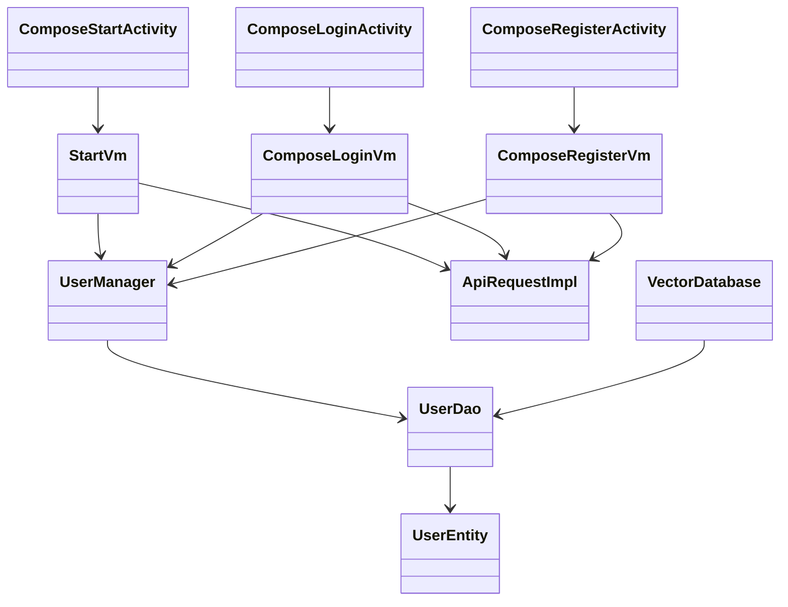

### MVI 建模约束（UML）

禁止在正文中用纯文本定义 MVI 的字段结构（如 `uiState/dataState/intent/effect` 具体值）；MVI 值模型必须通过 UML 类图表达。

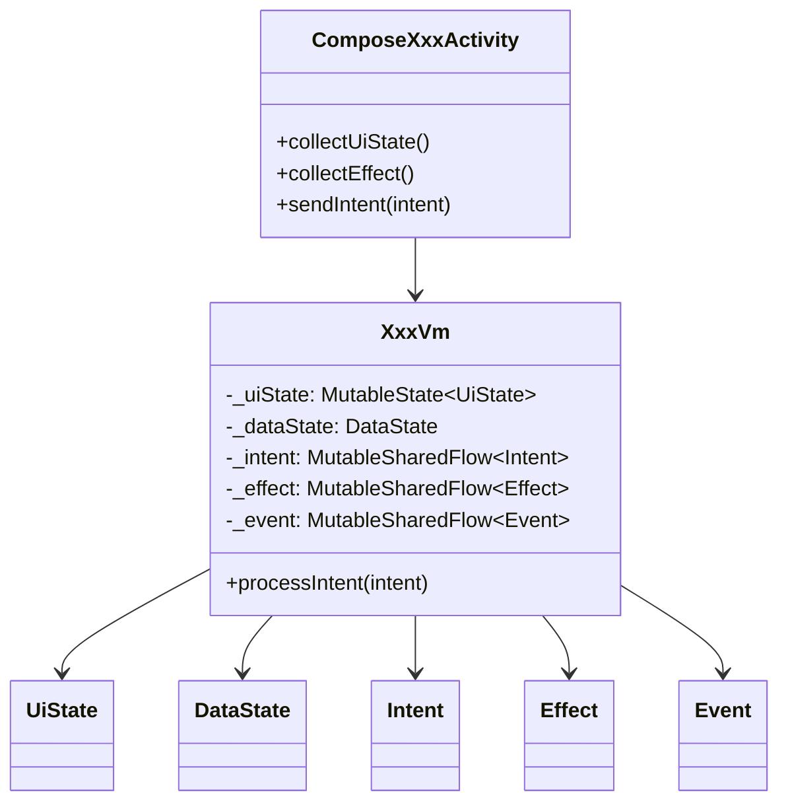

## 页面模块设计

### 启动模块（Start）

#### 功能职责
* 启动阶段统一判断登录态，决定进入主页面或登录页面。
* 保证启动页最短停留时间，避免闪屏。
* 当本地会话存在时，执行远端 token 有效性验证。

#### 启动 UI 设计

##### 启动页面（Start）
**布局结构**：
- 居中显示应用 Logo

**交互设计**：
- 启动时检查本地会话
- 有会话时调用 token/verify 接口验证
- 验证通过：跳转到主页
- 验证失败或无会话：跳转到登录页
- 最短停留 1200ms，避免启动页一闪而过


#### UML静态图

##### 启动页面 MVI 类图
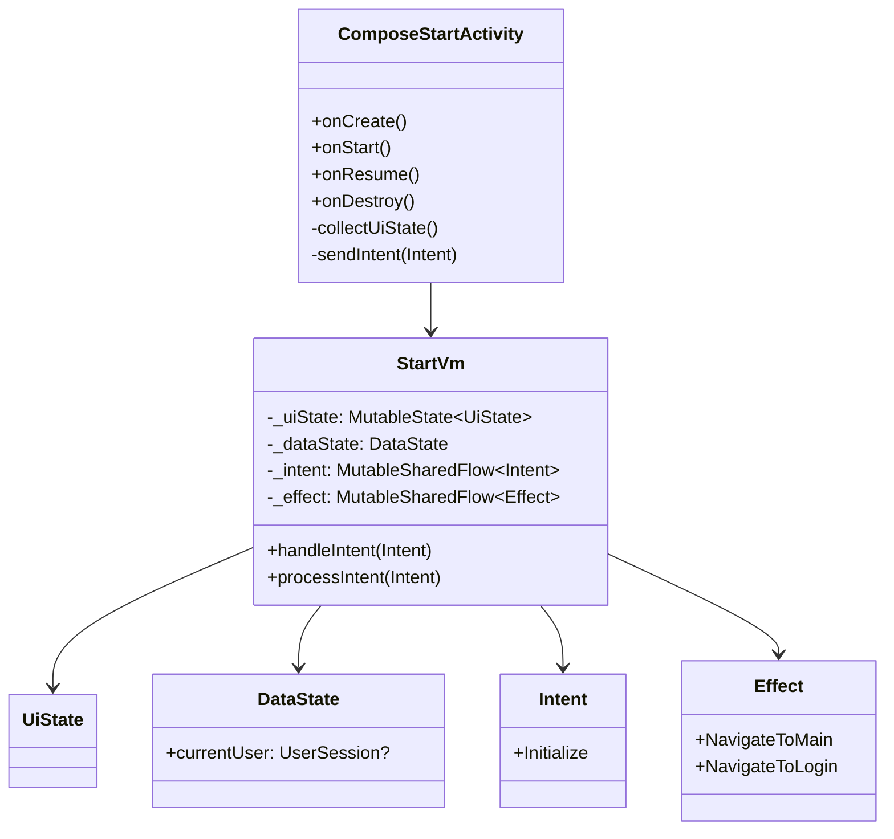

##### 启动页面 MVI 通信图
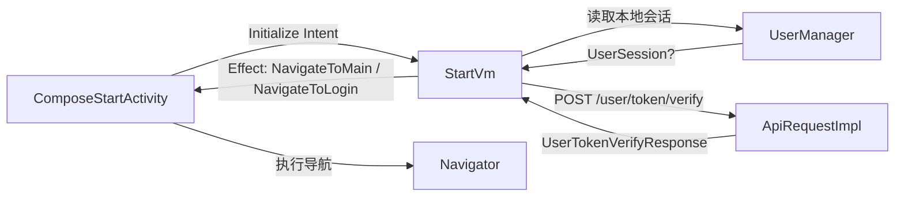

#### UML动态图

##### 启动活动图
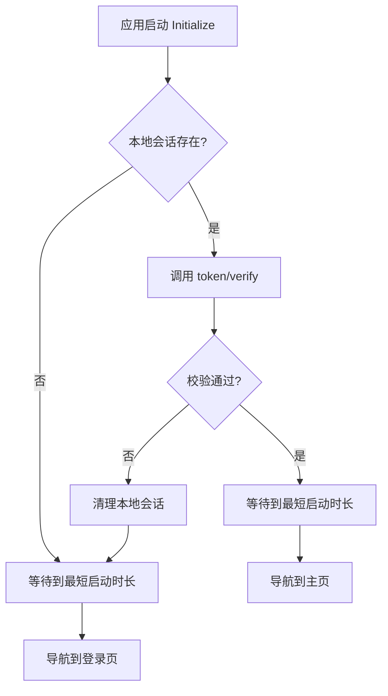

##### 启动时序图
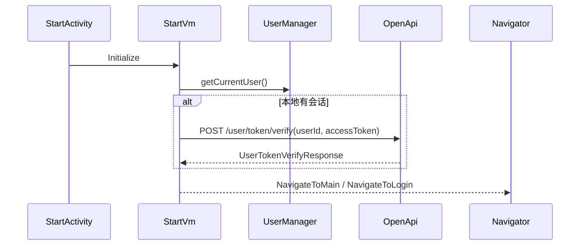

##### 启动鉴权甘特图
```mermaid
gantt
    title Android 启动鉴权线程甘特图
    dateFormat  X
    axisFormat %L ms
    section Main线程
    StartIntent.Initialize        :m1, 0, 5
    收到结果并分发导航Effect        :m2, 70, 10
    section IO线程
    读取Room用户会话              :i1, 5, 15
    发起HTTP verify请求           :i2, 20, 30
    section 协程状态
    suspend等待网络返回           :s1, 20, 40
```

### 登录与注册模块

#### 功能职责
* 登录：账号密码提交、按钮可用态控制、成功后写入本地会话。
* 注册：账号/密码/确认密码校验、头像选择与权限申请、成功后自动登录态落库。
* 页面仅负责编排，业务状态由 VM 的 MVI 流统一管理。

#### 登录 UI 设计

##### 登录页面（Login）
**布局结构**：
- 顶部：Logo 区域
- 中间：账号输入框、密码输入框（隐藏输入内容）
- 底部：登录按钮（账号密码未完整时置灰）、"没有账号？去注册" 链接

**交互设计**：
- 账号输入框：实时校验输入格式，失焦时验证
- 密码输入框：隐藏输入内容，支持显示/隐藏切换
- 登录按钮：账号和密码均非空时激活，点击后显示加载状态
- 注册链接：点击跳转到注册页面

#### UML静态图
##### 登录页面 MVI 类图
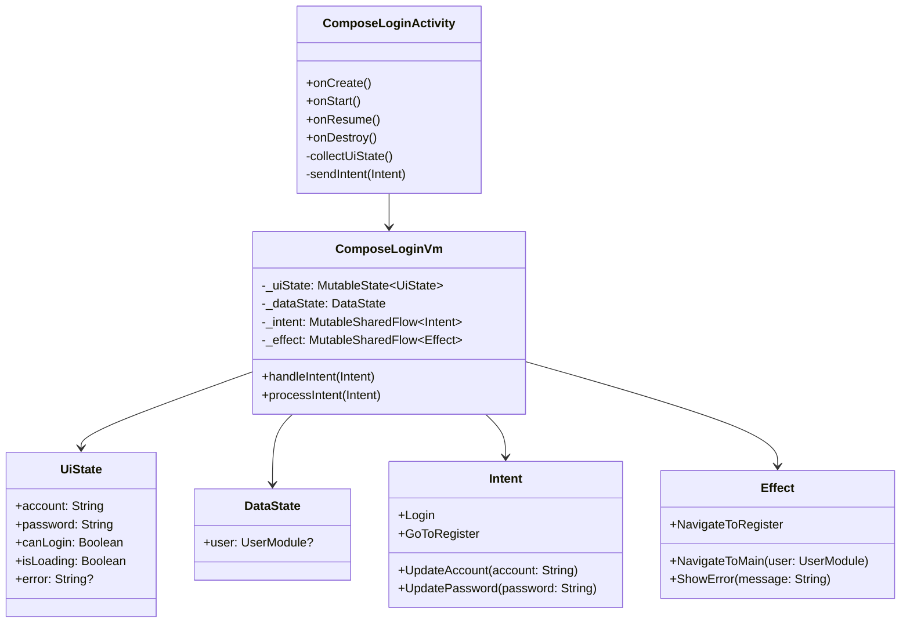

##### 登录页面通信图
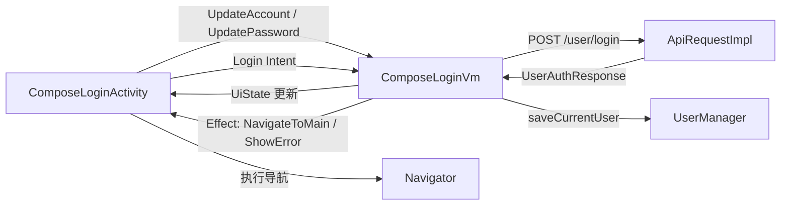

#### UML动态图

##### 登录活动图
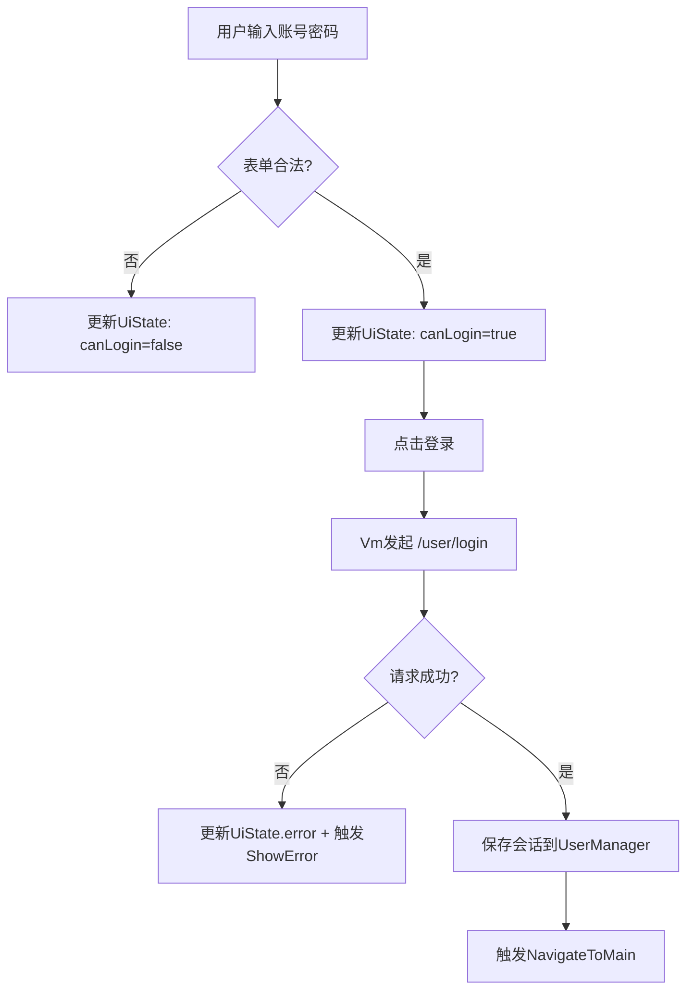

##### 登录时序图


##### 登录鉴权甘特图
```mermaid
gantt
    title Android 登录请求线程甘特图
    dateFormat  X
    axisFormat %L ms
    section Main线程
    输入与点击事件分发            :m1, 0, 8
    渲染加载状态与错误提示         :m2, 65, 12
    section IO线程
    发送 /user/login 请求         :i1, 8, 35
    接收响应并解析 DTO            :i2, 43, 12
    section 本地持久化
    保存会话到 Room               :d1, 55, 10
```

#### 注册 UI 设计
##### 注册页面（Register）

**布局结构**：
- 顶部：Logo 区域
- 中间：账号输入框、密码输入框、确认密码输入框、圆形头像预览区域
- 底部：注册按钮（信息未完整时置灰）、"已有账号？去登录" 链接

**交互设计**：
- 头像选择：点击圆形预览区域，申请存储权限后打开相册
- 密码校验：实时对比密码和确认密码，不一致时显示错误提示
- 注册按钮：账号、密码、确认密码均非空且密码一致时激活
- 注册成功：自动保存会话并跳转到主页

#### UML静态图
##### 注册页面 MVI 类图
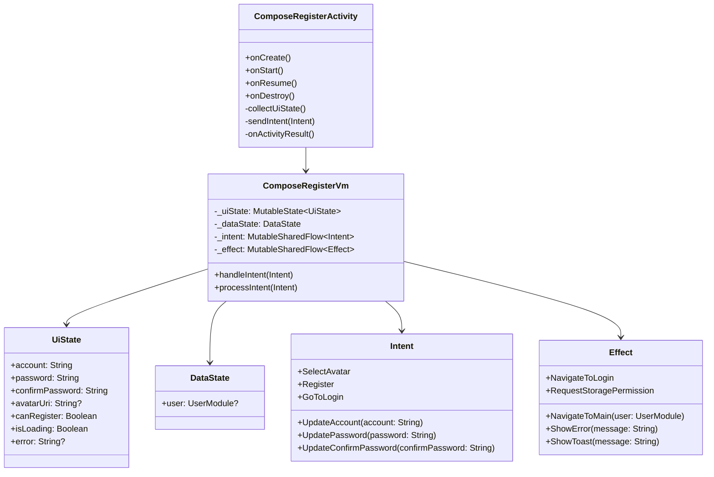

##### 注册页面通信图
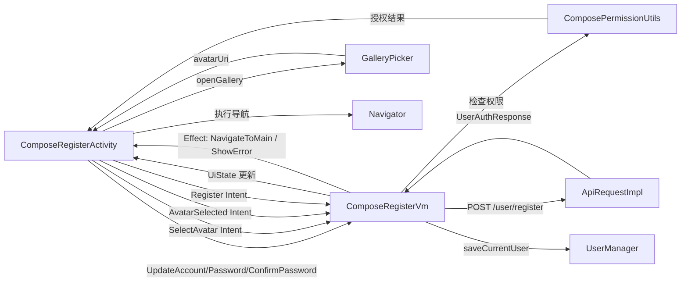

##### 认证模块状态机图
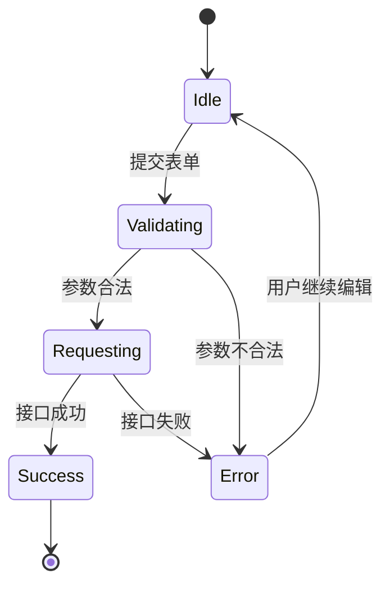

#### UML动态图

##### 注册活动图
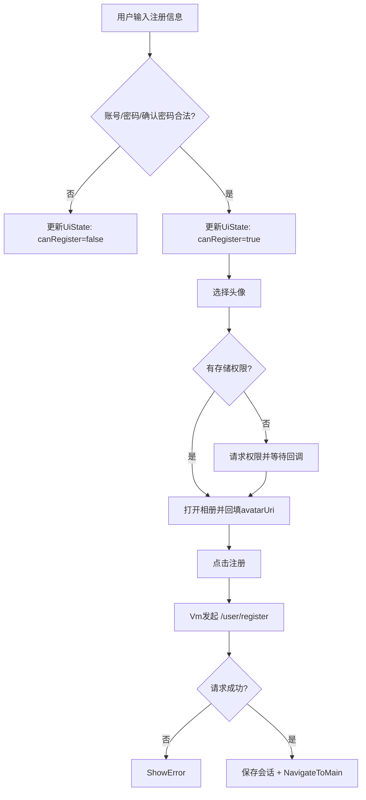

##### 注册时序图
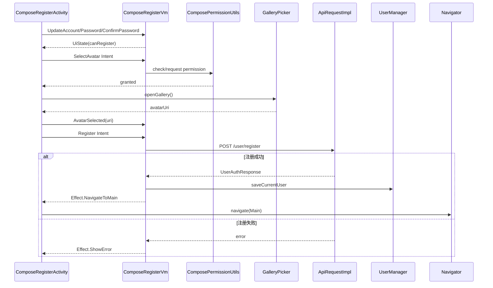

##### 注册鉴权甘特图
```mermaid
gantt
    title Android 注册请求线程甘特图
    dateFormat  X
    axisFormat %L ms
    section Main线程
    表单输入与校验                 :m1, 0, 20
    权限回调与相册结果处理          :m2, 20, 25
    页面状态更新与导航              :m3, 90, 15
    section IO线程
    发送 /user/register 请求       :i1, 45, 35
    响应解析与错误映射              :i2, 80, 10
    section 本地持久化
    保存会话到 Room               :d1, 85, 8
```


## Manager管理类设计

### 会话管理模块（UserManager）

#### 功能职责
* 统一提供 `saveCurrentUser/getCurrentUser/clearCurrentUser`。
* 对上层隐藏 Room 细节，保持 VM 与数据库解耦。
* 启动与登录/注册流程共享同一会话入口。

#### 设计约束
* 当前会话以单记录方式存储，主键采用 `id: Long`。
* `userId` 与后端主键一致，统一为 `Long`。
* 启动鉴权采用 `userId + accessToken` 强绑定校验，防止 token 串用。

#### UML静态图

##### 会话管理模块 类图 （展示功能）
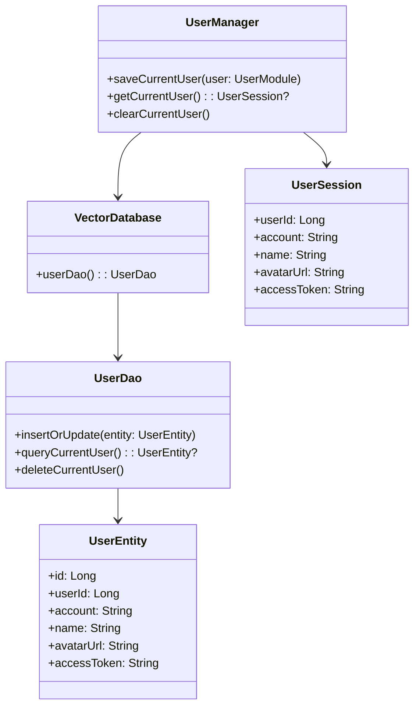

#### UML动态图

##### 会话管理通信图
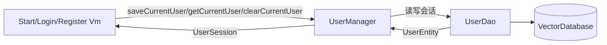

##### 会话生命周期状态图
```mermaid
stateDiagram-v2
    [*] --> Empty
    Empty --> Persisted : saveCurrentUser
    Persisted --> Persisted : update accessToken/profile
    Persisted --> Invalidated : token verify failed
    Invalidated --> Empty : clearCurrentUser
    Persisted --> Empty : logout/clearCurrentUser
```

## 本地数据库设计（Room）

### 设计说明
* 采用单库模式：`VectorDatabase` 统一管理应用表结构。
* 会话表用于保存当前登录用户快照，便于冷启动恢复。

### ER 图
```mermaid
erDiagram
    VECTOR_DATABASE ||--o{ USER_SESSION : contains
    USER_SESSION {
      long id PK
      long user_id
      string account
      string name
      string avatar_url
      string access_token
    }
```

## 网络接口契约（Auth API）

### 接口清单
* `POST /user/login`：请求体 DTO，返回 `UserAuthResponse`。
* `POST /user/register`：Multipart/FormData（`avatar/account/password/name`），返回 `UserAuthResponse`。
* `POST /user/token/verify`：请求体 `userId + accessToken`，返回 `UserTokenVerifyResponse`。

### 契约原则
* 非文件上传场景统一使用 `@RequestBody` DTO。
* 文件上传场景（如注册头像）统一使用 Multipart/FormData；字段由 `@Part/@RequestParam` 传递。
* 不使用裸 `Boolean` 响应，统一结构化响应模型。
* 前后端 `userId` 类型统一为 `Long`。


