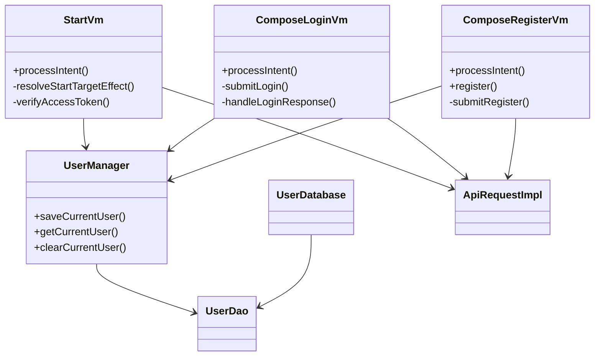
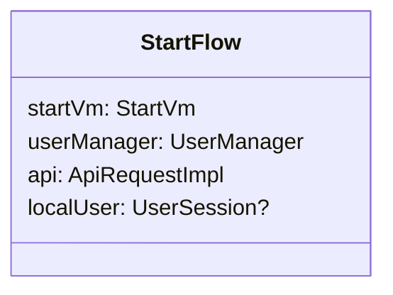
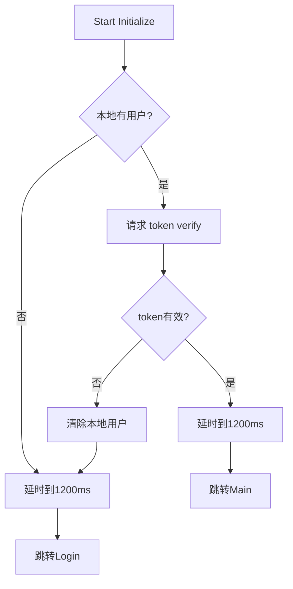
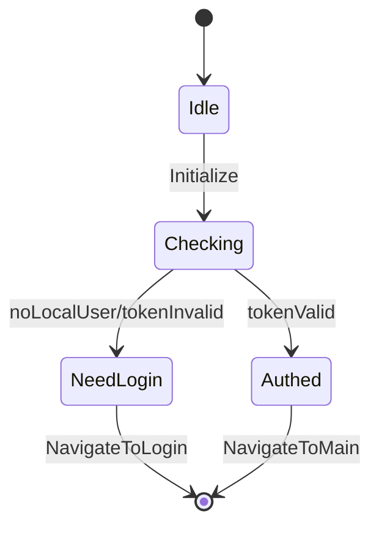
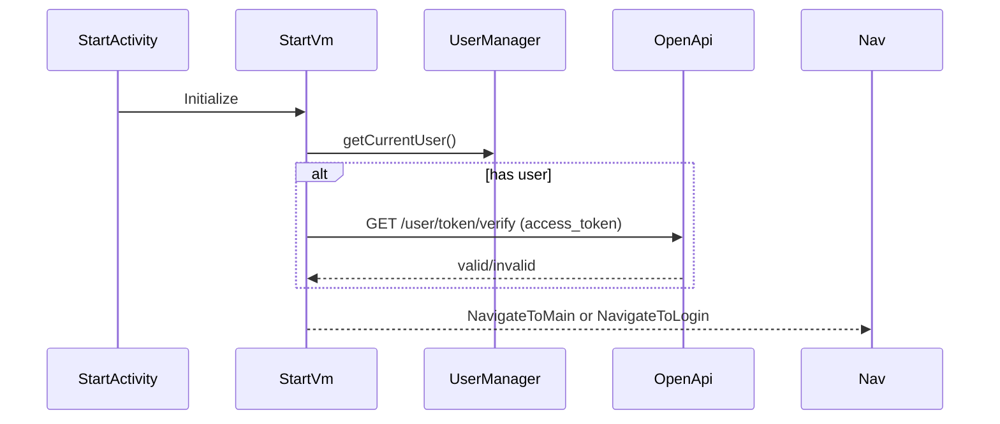
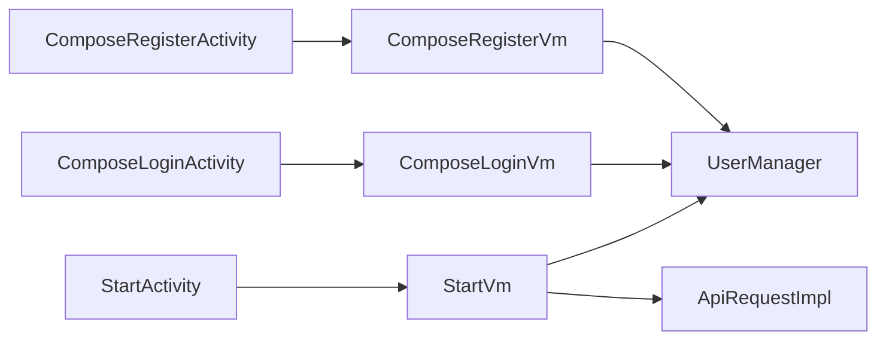
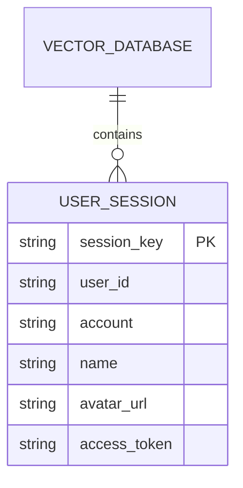
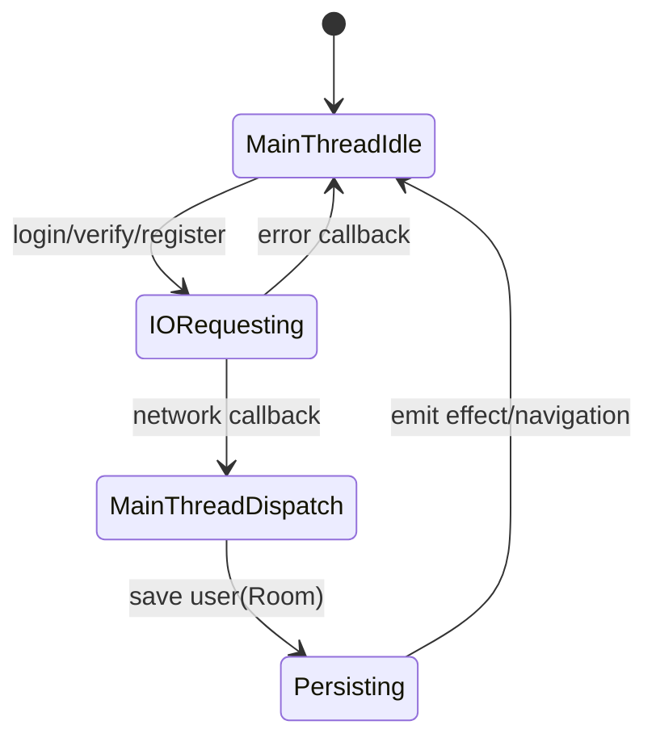

# Cursor开发日志

## 2026-03-07 启动页 + 登录注册（Compose + MVI）

### 本次开发内容
- 启动页 `StartVm` 增加登录态判定链路：读取 `UserManager` 本地用户 -> 调用后端校验 `access_token` -> 导航 `Main/Login`。
- 启动页保证最短停留时间 `1200ms`，避免页面一闪而过。
- 新增 `ComposeLoginActivity` + `ComposeLoginVm`（MVI）：账号密码登录、按钮可用态、登录成功保存本地用户、跳转主页面。
- 新增 `ComposeRegisterActivity` + `ComposeRegisterVm`（MVI）：账号/密码/确认密码、头像选择、存储权限申请、注册成功直接登录并跳转主页面。
- 新增 `UserManager(Room)` 本地用户会话持久化：`UserEntity/UserDao/UserDatabase/UserSession`。
- 扩展 Android API：`/user/register`、`/user/login`、`/user/token/verify`。

### 类图（Class Diagram）

### 对象图（Object Diagram）

### 活动图（Activity Diagram）

### 状态机图（State Machine）

### 时序图（Sequence Diagram）

### 通讯图（Communication Diagram）

### 备注
- 头像注册上传流程已在 Android 侧保留；后端当前按需求暂不处理头像文件。

## 2026-03-08 规则对齐与Bug修复（DTO重构/单库/权限修复）

### 本次调整
- `login`、`token/verify` 按规范改为单一请求体 DTO（非 FormData 场景不再用 query/header 拼接参数）。
- `token/verify` 响应改为 `UserTokenVerifyResponse`，不再返回裸 `Boolean`。
- 登录与注册 Activity 的页面 UI 已拆分到 `com/magicvector/ui/view/activity`，Activity 仅保留编排逻辑。
- 注册权限申请修复：从 `PermissionUtils` 切换为 `ComposePermissionUtils`。
- Room 架构修正为单库：移除 `UserDatabase`，改为全局 `VectorDatabase`，`UserEntity` 作为其中一张表。
- MVI 的 `uiState/dataState/intent/effect/event` 字段定义补充注释，便于维护。

### 数据库设计说明（Room）
- 本次未新增字段，仅修正数据库架构组织方式：从“独立用户数据库”调整为“全局单库 + 用户表”。
- 设计原因：降低多库维护复杂度，统一迁移策略与生命周期管理。

### 数据库图（ER）

### 线程状态图（Thread State）

### 设计模式记录
- **状态模式（State）**：通过 `uiState/dataState/effect` 管理页面状态流转，避免 Activity 中散落状态判断。
- **单例模式（Singleton）**：`UserManager` 与 `VectorDatabase` 使用单例入口，统一生命周期与资源管理。

### 理论知识标注
- **操作系统（线程/IO）**：网络请求在 IO 线程执行，回调切回主线程更新 UI 状态。
- **数据库**：Room 单库设计与表聚合，降低 schema 演进复杂度。
- **计算机网络**：登录与鉴权接口采用明确请求/响应 DTO，有助于协议扩展与向后兼容。