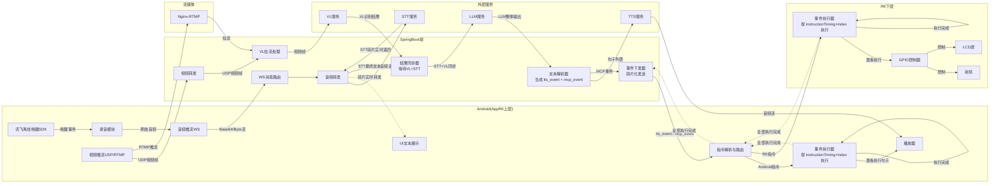
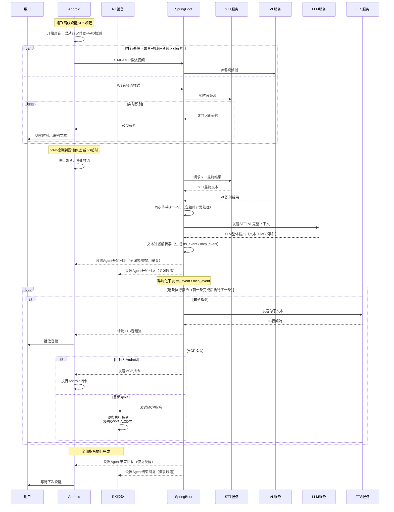
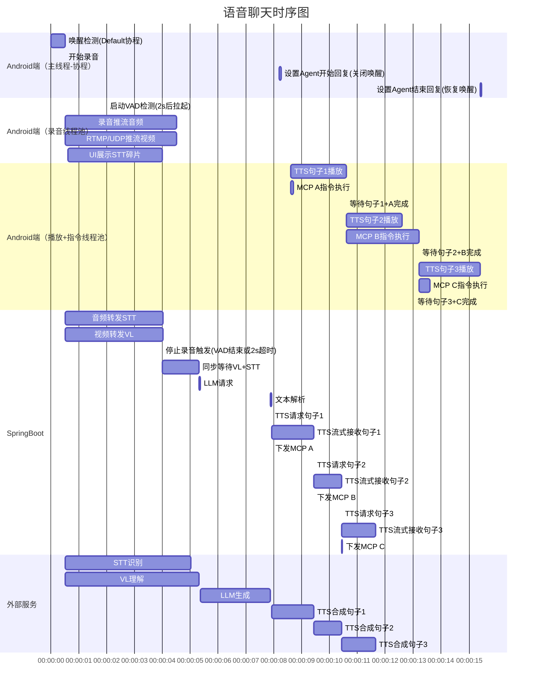
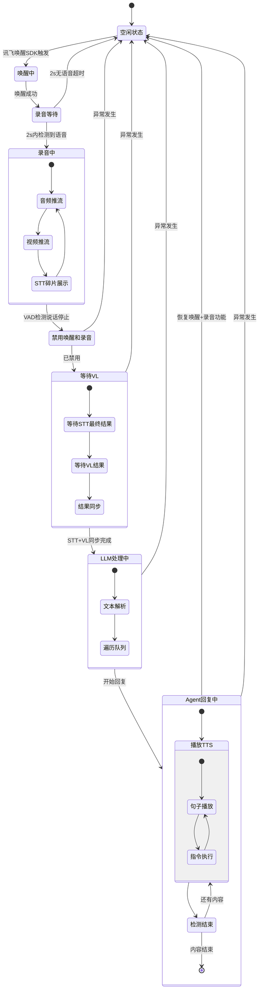

# AgentChat设计


### 消息记录查看页面

取消聊天功能：右滑查看具体聊天记录和指令信息，不能发送消息。
取消二分插入：直接使用Java的Sort工具类。

### Android（App，RK通用）语音聊天初步设计

- 讯飞离线唤醒SDK唤醒
- 开始录音，同时启动2s定时器
- 2s后启动VAD语音活动检测：
  - 若2s内未检测到语音 → 停止录音（认为用户已说完）
  - 若2s内检测到语音 → 进入VAD循环检测，直到检测到说话停止 → 停止录音
- 录音期间并行执行以下操作：
  - 音频流通过WS（Base64/Byte流）发送给SpringBoot → SpringBoot实时转发给STT服务 → STT碎片实时返回 → SpringBoot转发给Android进行UI展示
  - 视频流通过RTMP/UDP推流：
    - UDP：SpringBoot转发给VL模型识别视觉内容，并转发给其他接收端
    - RTMP：推流到Nginx-RTMP服务器 → SpringBoot拉流转发给VL → SpringBoot将RTMP URL转发给其他Android设备，其他设备直接从Nginx拉流
- 停止录音后：
  - SpringBoot等待VL识别结果
  - 同步（STT最终结果 + VL结果）→ 发送给LLM
  - LLM产生整体输出（非流式，包含文本 + MCP事件）
- 文本交给文本过滤分析器，生成 `tts_event` 与 `mcp_event`
- 给Android和RK设置 `Agent开始回复`：关闭唤醒词唤醒功能 + 禁用录音
- 服务端碎片化下发 `tts_event` / `mcp_event`
- 客户端按 `instructionTiming + index` 排序执行：
  - 句子：发送给TTS服务 → 获取音频流 → Android播放
  - MCP指令：区分目标设备（Android/RK）→ 发送执行 → 等待执行完成
- 全部指令执行完成后 → 给Android和RK设置 `Agent结束回复`：恢复唤醒词唤醒功能 + 恢复录音功能
- 异常处理：任何环节发生异常，均恢复到空闲状态（恢复唤醒+录音功能）


### 语音视频聊天 UML图设计


活动图

```mermaid
flowchart TD
    subgraph 语音聊天活动图
        Start([用户语音交互]) --> WakeUp[讯飞唤醒SDK唤醒]
        WakeUp --> StartRecord[开始录音]
        
        %% 录音与流媒体并行
        StartRecord --> ParallelStart{并行执行}
        
        ParallelStart --> AudioStreamProcess["录音与流媒体模块<br/>━━━━━━━━━━━━━━━<br/>• 持续发送音频流WS→STT碎片→Android展示<br/>• 持续发送视频帧RTMP/UDP<br/>• VAD检测循环，条件：说话未停止且未超时"]
        
        ParallelStart --> TimeoutMonitor[2s超时监控]
        
        AudioStreamProcess -->|VAD检测到说话停止或2s超时| StopRecord["停止录音，停止所有流媒体"]
        TimeoutMonitor -->|2s内无语音| StopRecord
        
        StopRecord --> SyncWait["同步等待<br/>━━━━━━━━━━━━━━━<br/>等待VL结果 + STT最终结果<br/>（含超时异常处理）"]
        
        SyncWait -->|两者都到达| SendLLM[发送LLM]
        
        SendLLM --> LLMOutput[LLM整体输出<br/>文本+指令]
        LLMOutput --> ParseFilter[文本过滤分析器<br/>生成 tts_event + mcp_event]
        
        ParseFilter --> SetSpeaking[设置Agent开始回复<br/>关闭唤醒/禁用录音]
        
        SetSpeaking --> ProcessList["处理事件流<br/>━━━━━━━━━━━━━━━<br/>服务端碎片化下发<br/>客户端按 instructionTiming+index 执行"]
        
        ProcessList -->|句子| SendTTS[发送TTS]
        SendTTS --> AudioPlay[Android播放音频流]
        AudioPlay -->|播放完成| ProcessList
        
        ProcessList -->|MCP指令| CheckTarget{目标设备}
        CheckTarget -->|Android指令| SendAndroid[发送Android指令]
        CheckTarget -->|RK指令| SendRK[发送RK指令]
        
        SendAndroid --> WaitAndroid[等待Android执行完成]
        SendRK --> WaitRK["等待RK执行完成<br/>（RK的语音输出也由Android播放）"]
        
        WaitAndroid --> ProcessList
        WaitRK --> ProcessList
        
        ProcessList -->|列表处理完成| SetIdle[设置Agent结束回复<br/>恢复唤醒功能]
        
        SetIdle --> End([结束])
    end
```



通信图



时序图


甘特图



状态图




### Instruction 事件流


提示词会要求Agent回复是一个list，里面包含MCP和TTS的指令。
```json
[
  {
    "chatSentence": "你好，我先执行第一阶段。",
    "instructionTiming": 0
  },
  {
    "chatSentence": "向左转。",
    "instructionTiming": 1,
    "eventList": [
      {
        "eventType": "motion",
        "event": {
          "type": "左转",
          "value": "90"
        }
      }
    ]
  }
]
```


服务端直接碎片化下发：
- `tts_event`（`tts` 通道）
- `mcp_event`（`control` 通道）

客户端（Android / RK）本地按 `instructionTiming` + `index` 排序执行。
其中 `tts_event.text` 为该音频分片对应的文本碎片（用于字幕/落库对齐）。

#### 服务端下发示例

```json
{
  "channel": "tts",
  "event": "tts_event",
  "data": {
    "requestId": "req_20260408_001",
    "agentId": "10001",
    "type": "tts",
    "index": 0,
    "instructionTiming": 0,
    "text": "你好，我先执行第一阶段。",
    "seq": "0",
    "isLast": false,
    "timestamp": 1710000000000,
    "base64AudioStream": "ejkcviifri23kwrn42njbj242524df..."
  }
}
```

```json
{
  "channel": "control",
  "event": "mcp_event",
  "data": {
    "requestId": "req_20260408_001",
    "type": "mcp",
    "index": 1,
    "instructionTiming": 0,
    "target": "rk",
    "deviceId": "rk-001",
    "commandId": "cmd_gpio_001",
    "command": "GPIO_SET",
    "params": { "pin": "1", "value": "1" }
  }
}
```

#### 客户端执行规则

- 同一 `requestId` 内：先按 `instructionTiming` 升序，再按 `index` 升序。
- 同一 `instructionTiming` 阶段内：TTS 和 MCP 可并行。
- 阶段 `N` 全部完成后，才执行阶段 `N+1`。

#### 回执（单条结果）

```json
{
  "channel": "system",
  "event": "instruction_event_result",
  "data": {
    "requestId": "req_20260408_001",
    "index": 1,
    "type": "mcp",
    "instructionTiming": 0,
    "status": "success",
    "code": 200,
    "message": "GPIO_SET done"
  }
}
```

