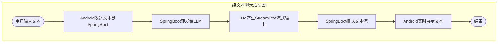
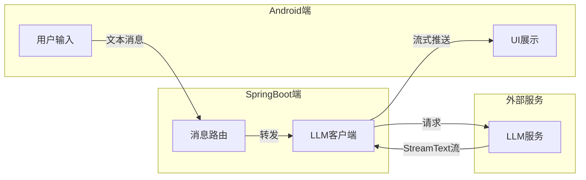
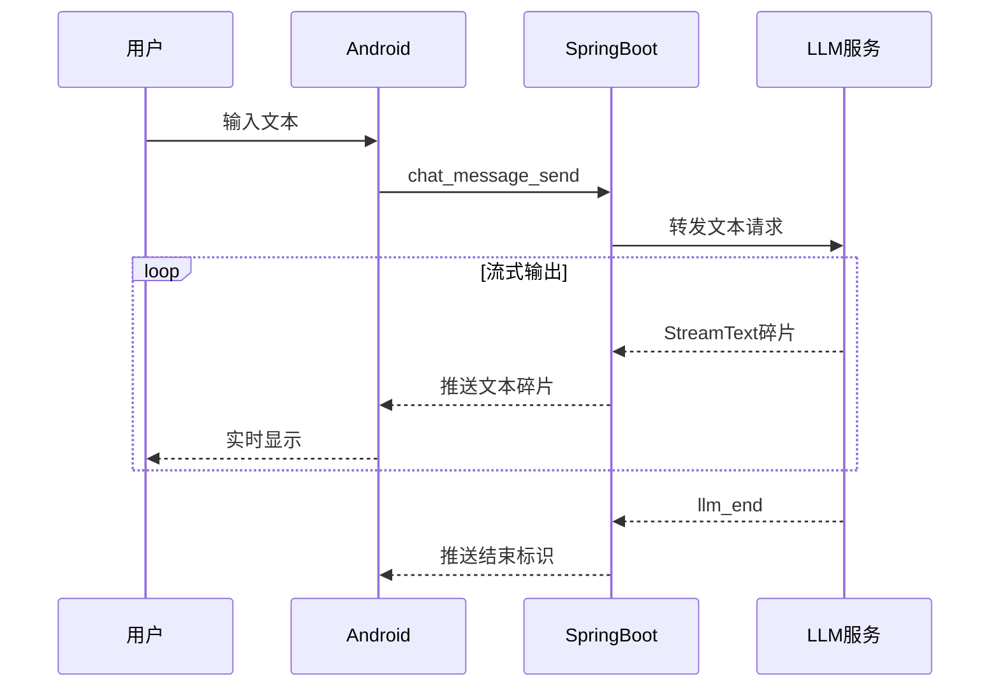
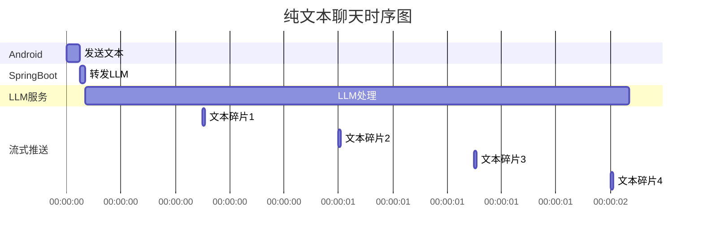
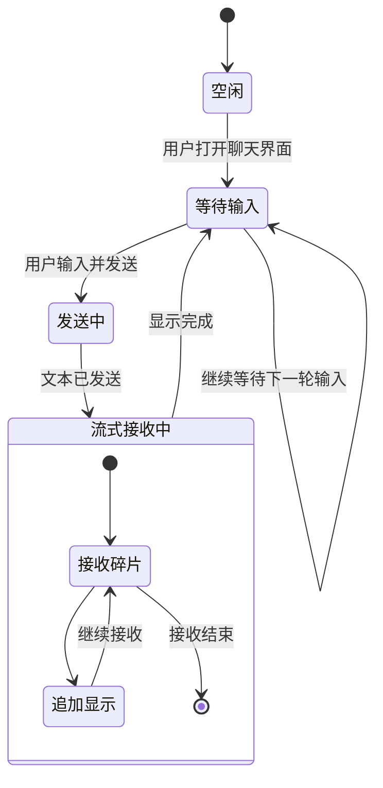
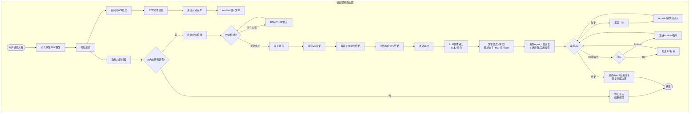
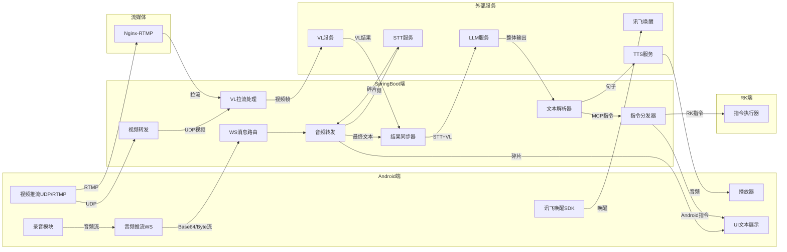
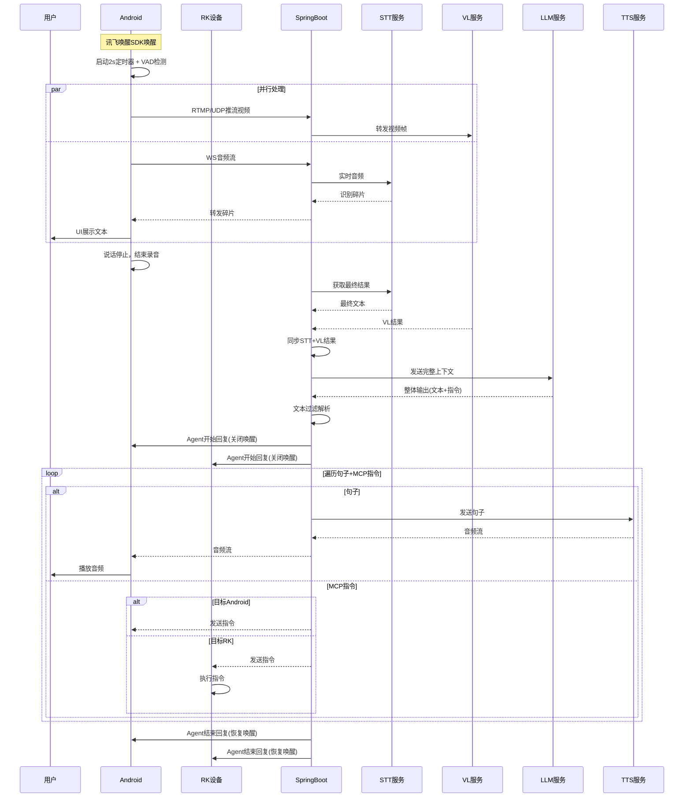
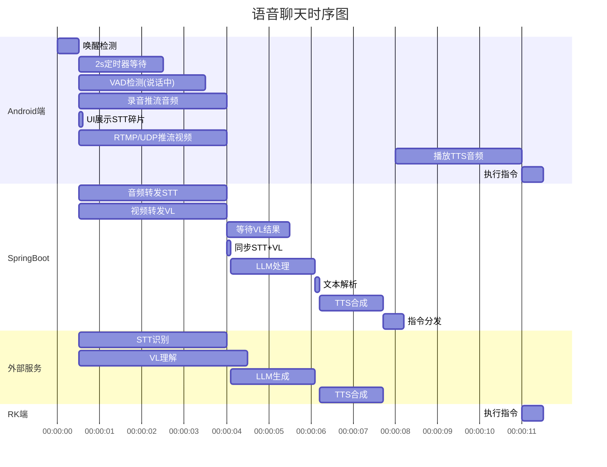
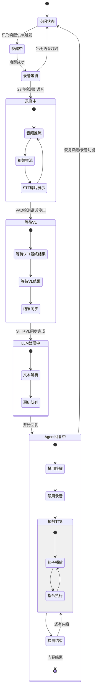

# AgentChat设计

## 描述

有一点你理解错了，我现现在这样吧。我来教你绘制Agent调用流程图：

1.纯文本聊天：
Android发送Text消息->SpringBoot
SpringBoot交给LLM模型
LLM产生StreamText
Android直接展示Text流

2.Android（App，RK通用）语音聊天：
* 讯飞唤醒SDK唤醒->
* 定时任务，2s之后启动VAD语音活动检测（Android2s没检测到语音则认为2s内说完了，停止录音。否则开始VAD检测，直到检测从说话变为停止，则结束录音）->
* Android2s到录音结束期间会RTMP推流或者UDP发送视频帧，
    * UDP：SpringBoot转发给VL模型识别视觉内容，并转发给其他接收的Android设备。
    * RTMP：SpringBoot从Nginx流媒体服务器拉流，转发给VL。SpringBoot将流媒体rtmp的url转发其他Android设备其他Android设备直接从Nginx拉流。
* Android开始录音并将音频流通过WS将Base64或者Byte流（两种方式：音频流Base64放在JSON中，Byte音频流头部尾部加上协议帧）发送给服务器->
* SpringBoot将Base64转为Byte流或者将Android的Byte流拆帧去尾实时发送给远端STT模型->
* 远端STT模型恢复识别碎片给SpringBoot，SpringBoot存储一份在本地，其他碎片全部转发Android（Android UI展示）->
* Android结束录音 ->
* SpringBoot等待远端VL视觉理解结果 ->
* 同步(STT的最终结果 + VL的结果) -> 一同发送给远端LLM -> LLM产生整体输出不流式（因为TTS需要整段话而不是碎片流）（内部包含文本和指令）->
* 文本交给text过滤分析器（句子 + MCP指令 + 句子 + MCP指令的List格式） ->
* 给Android和RK设置为`Agent开始回复`，此时关闭唤醒词唤醒功能；禁用录音
* A：句子交给远端TTS模型 ->
* B：获得的音频流交给Android播放
* C：遇到MCP指令 -> 区分发送给Android/RK -> 检测是否结束
* 递归回调ABC直到结束 -> 
* 给Android和RK设置为`Agent结束回复`，恢复唤醒词唤醒功能。

根据我写的绘制：活动图，通信图，时序图，甘特图，状态图

### 纯文本聊天

活动图

通信图

时序图

甘特图

状态图

### 语音视频聊天

活动图

通信图

时序图

甘特图

状态图

