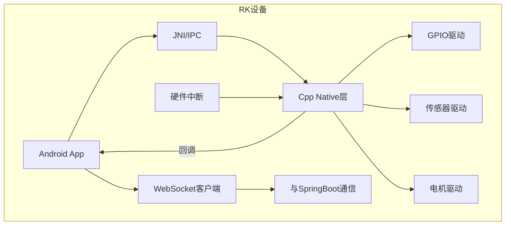
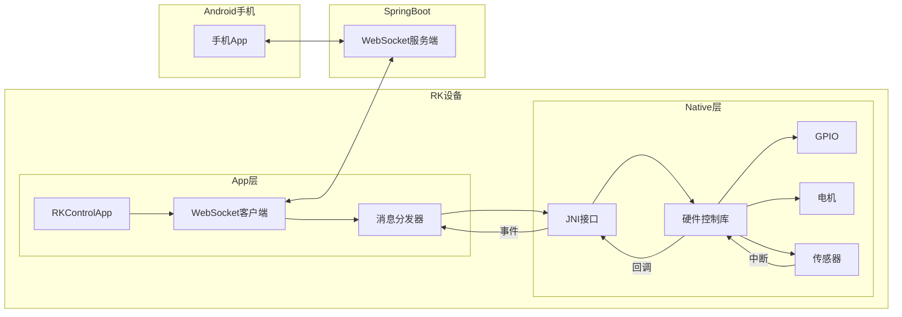

**RK设计**
====

```mermaid
flowchart TD
    subgraph RK设备
        A[Android App] --> B[JNI/IPC]
        B --> C[Cpp Native层]
        C --> D[GPIO驱动]
        C --> E[传感器驱动]
        C --> F[电机驱动]
        
        A --> G[WebSocket客户端]
        G --> H[与SpringBoot通信]
        
        I[硬件中断] --> C
        C -->|回调| A
    end
```

```mermaid
flowchart LR
    subgraph RK设备
        subgraph App层
            A[RKControlApp]
            B[WebSocket客户端]
            C[消息分发器]
        end
        
        subgraph Native层
            D[JNI接口]
            E[硬件控制库]
            F[GPIO]
            G[电机]
            H[传感器]
        end
        
        A --> B
        B --> C
        C --> D
        D --> E
        E --> F
        E --> G
        E --> H
        
        H -->|中断| E
        E -->|回调| D
        D -->|事件| C
    end
    
    subgraph SpringBoot
        I[WebSocket服务端]
    end
    
    subgraph Android手机
        J[手机App]
    end
    
    B <--> I
    J <--> I
```

