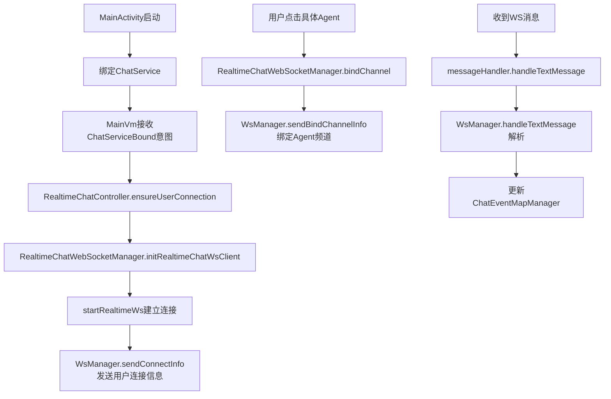
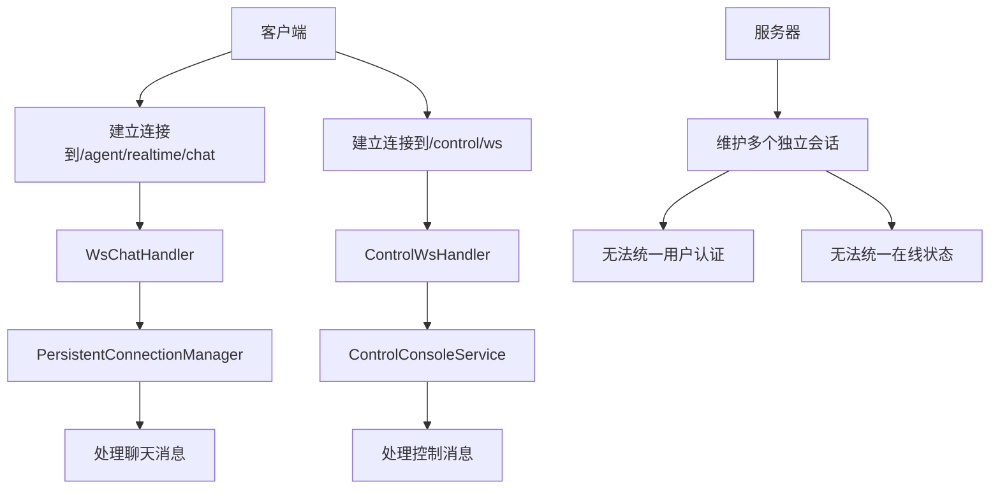
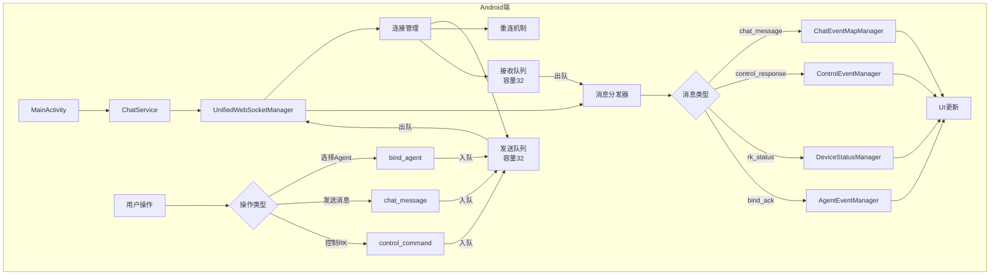
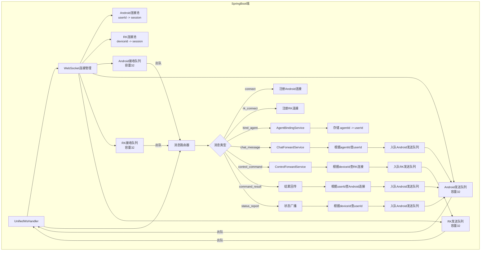
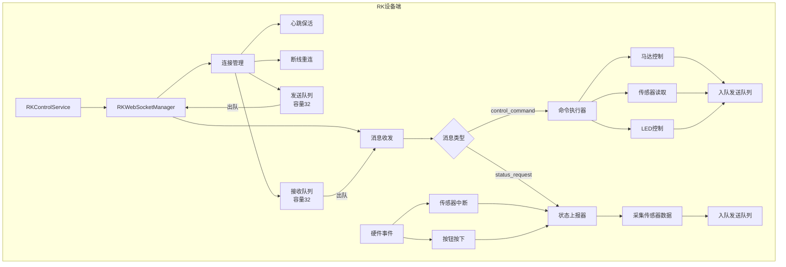
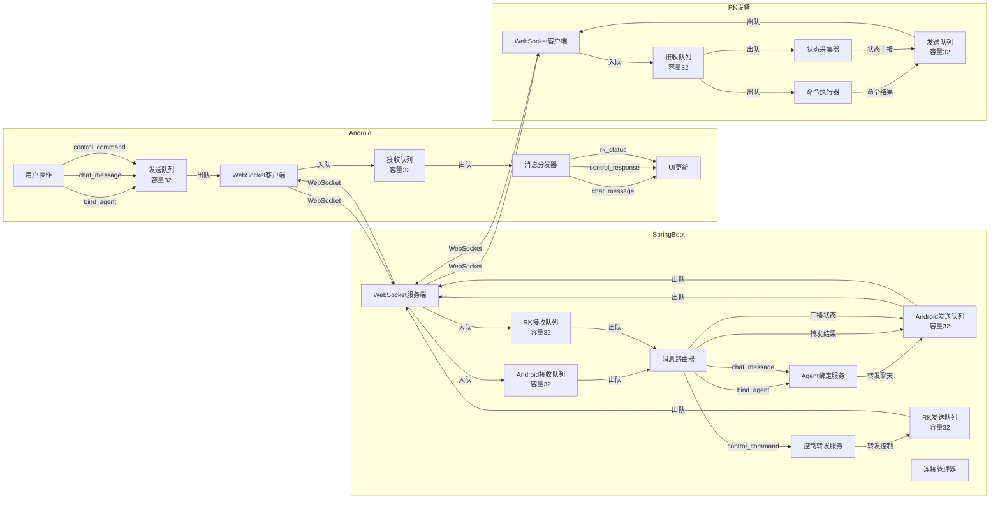

## 现有问题
### Android端现有流程


### SpringBoot端WS架构分析



## 优化后
### 优化后的Android WS架构设计



### 优化后的SpringBoot WS架构




### RK框架



### 整体数据流



### 数据结构设计

#### Event

SpringBoot

```java
@Data
public class ClientEvent {
    private String channel;
    private Map<String, String> data;
}

@Data
public class ServerEvent {
    private String channel;
    private Map<String, String> data;
}
```

Android (App/RK)

```kotlin
data class ClientEvent(
    val channel: String,
    val data: Map<String, String> = emptyMap()
)
data class ServerEvent(
    val channel: String,
    val data: Map<String, String> = emptyMap()
)
```

#### Channel 枚举设计

##### 1. 连接管理类（三端通用）

| Channel | 方向 | 说明 | data字段 |
|---------|------|------|----------|
| `connect` | Android→SB | 建立用户连接 | `userId` |
| `connect_ack` | SB→Android | 连接确认 | `code`, `message` |
| `rk_connect` | RK→SB | RK设备注册 | `deviceId`, `firmware` |
| `rk_connect_ack` | SB→RK | RK注册确认 | `code`, `message` |
| `ping` | 双向 | 心跳请求 | - |
| `pong` | 双向 | 心跳响应 | - |

> ping, pong超时策略（如连续3次无响应则断开重连）

##### 2. Agent数据同步类（Android ↔ SB）

| Channel | 方向 | 说明 | data字段 |
|---------|------|------|----------|
| `agent_list_sync` | SB→Android | Agent列表变更推送 | `AgentChatDto` 列表 |
| `agent_update` | Android→SB | 用户操作Agent（创建/更新/删除） | `AgentChatDto` |

##### 3. 聊天消息类（Android ↔ SB）

| Channel | 方向 | 说明 | data字段 |
|---------|------|------|----------|
| `chat_message_sync` | SB→Android | 聊天消息推送 | `ChatMessageDto` |
| `chat_message_send` | Android→SB | 用户发送消息 | `ChatMessageDto` |

##### 4. 音频处理类（Android ↔ SB）

| Channel | 方向 | 说明 | data字段 |
|---------|------|------|----------|
| `stt_start` | Android→SB | 开始语音识别（STT） | `agentId` |
| `stt_start_ack` | SB→Android | 语音识别确认 | `agentId` |
| `stt_audio_data` | Android→SB | 语音数据流 | `agentId`, `base64AudioStream`, `seq` |
| `stt_text_data` | SB→Android | 识别的文本结果流 | `agentId`, `textStream`, `seq` |
| `stt_end` | Android→SB | 结束语音识别 | `agentId` |
| `stt_error` | Android→SB | 语音识别异常 | `agentId`, `code`, `message` |
| `llm_start` | SB→Android | 开始LLM处理 | `agentId` |
| `llm_data` | SB→Android | LLM文本流 | `agentId`, `textStream`, `seq` |
| `llm_end` | SB→Android | LLM处理结束 | `agentId` |
| `llm_error` | SB→Android | LLM处理异常 | `agentId`, `code`, `message` |
| `tts_start` | SB→Android | 开始语音合成（TTS） | `agentId` |
| `tts_data` | SB→Android | TTS音频流 | `agentId`, `base64AudioStream`, `seq` |
| `tts_end` | SB→Android | TTS合成结束 | `agentId` |
| `tts_error` | SB→Android | TTS合成异常 | `agentId`, `code`, `message` |
| `vl_start` | Android→SB | 开始视觉理解（VL） | `agentId`（v2版本中获取视频源的方式只有两种：Udp推流SB或SB主动拉取RTMP） |
| `vl_data` | SB→Android | 视觉理解结果 | `agentId`, `content` |
| `vl_end` | SB→Android | 视觉理解结束 | `agentId` |
| `vl_error` | SB→Android | 视觉理解异常 | `agentId`, `code`, `message` |

##### 5. 控制命令类（Android ↔ SB ↔ RK）

| Channel | 方向 | 说明 | data字段 |
|---------|------|------|----------|
| `control_command_an` | Android→SB | 控制RK设备 | `deviceId`, `command`, `params`（Map<String, String>） |
| `control_command_sb` | SB→RK | 转发控制命令 | `commandId`, `command`, `params`（Map<String, String>） |
| `command_result` | RK→SB | 命令执行结果 | `commandId`, `code`, `message` |
| `control_response` | SB→Android | 控制结果响应 | `deviceId`, `code`, `message` |

##### 6. 设备状态类（RK ↔ SB ↔ Android）

| Channel | 方向 | 说明 | data字段 |
|---------|------|------|----------|
| `status_request` | Android/SB→RK | 请求设备状态 | `deviceId` |
| `rk_status` | RK→SB | 设备状态上报 | `deviceId`, `battery`, `position` |
| `rk_status` | SB→Android | 转发设备状态 | `deviceId`, `battery`, `position` |

##### 7. 系统消息类（三端通用）

| Channel | 方向 | 说明 | data字段 |
|---------|------|------|----------|
| `error` | 双向 | 错误信息 | `code`, `message` |
| `system_message` | SB→双向 | 系统通知 | `event`, `param`（Map<String, String>） |

---

#### Channel 枚举定义

##### Kotlin 版本（Android / RK）

```kotlin
enum class WsChannel(val value: String) {
    // 连接管理
    CONNECT("connect"),
    CONNECT_ACK("connect_ack"),
    RK_CONNECT("rk_connect"),
    RK_CONNECT_ACK("rk_connect_ack"),
    PING("ping"),
    PONG("pong"),

    // Agent数据同步
    AGENT_LIST_SYNC("agent_list_sync"),
    AGENT_UPDATE("agent_update"),

    // 聊天消息
    CHAT_MESSAGE_SYNC("chat_message_sync"),
    CHAT_MESSAGE_SEND("chat_message_send"),

    // STT 语音识别
    STT_START("stt_start"),
    STT_START_ACK("stt_start_ack"),
    STT_AUDIO_DATA("stt_audio_data"),
    STT_TEXT_DATA("stt_text_data"),
    STT_END("stt_end"),
    STT_ERROR("stt_error"),

    // LLM 语言模型
    LLM_START("llm_start"),
    LLM_DATA("llm_data"),
    LLM_END("llm_end"),
    LLM_ERROR("llm_error"),

    // TTS 语音合成
    TTS_START("tts_start"),
    TTS_DATA("tts_data"),
    TTS_END("tts_end"),
    TTS_ERROR("tts_error"),

    // VL 视觉理解
    VL_START("vl_start"),
    VL_DATA("vl_data"),
    VL_END("vl_end"),
    VL_ERROR("vl_error"),

    // 控制命令
    CONTROL_COMMAND_AN("control_command_an"),
    CONTROL_COMMAND_SB("control_command_sb"),
    COMMAND_RESULT("command_result"),
    CONTROL_RESPONSE("control_response"),

    // 设备状态
    STATUS_REQUEST("status_request"),
    RK_STATUS("rk_status"),

    // 系统消息
    ERROR("error"),
    SYSTEM_MESSAGE("system_message")
}
```

Java 版本（SpringBoot）

```java
public enum WsChannel {
    // 连接管理
    CONNECT("connect"),
    CONNECT_ACK("connect_ack"),
    RK_CONNECT("rk_connect"),
    RK_CONNECT_ACK("rk_connect_ack"),
    PING("ping"),
    PONG("pong"),

    // Agent数据同步
    AGENT_LIST_SYNC("agent_list_sync"),
    AGENT_UPDATE("agent_update"),

    // 聊天消息
    CHAT_MESSAGE_SYNC("chat_message_sync"),
    CHAT_MESSAGE_SEND("chat_message_send"),

    // STT 语音识别
    STT_START("stt_start"),
    STT_START_ACK("stt_start_ack"),
    STT_AUDIO_DATA("stt_audio_data"),
    STT_TEXT_DATA("stt_text_data"),
    STT_END("stt_end"),
    STT_ERROR("stt_error"),

    // LLM 语言模型
    LLM_START("llm_start"),
    LLM_DATA("llm_data"),
    LLM_END("llm_end"),
    LLM_ERROR("llm_error"),

    // TTS 语音合成
    TTS_START("tts_start"),
    TTS_DATA("tts_data"),
    TTS_END("tts_end"),
    TTS_ERROR("tts_error"),

    // VL 视觉理解
    VL_START("vl_start"),
    VL_DATA("vl_data"),
    VL_END("vl_end"),
    VL_ERROR("vl_error"),

    // 控制命令
    CONTROL_COMMAND_AN("control_command_an"),
    CONTROL_COMMAND_SB("control_command_sb"),
    COMMAND_RESULT("command_result"),
    CONTROL_RESPONSE("control_response"),

    // 设备状态
    STATUS_REQUEST("status_request"),
    RK_STATUS("rk_status"),

    // 系统消息
    ERROR("error"),
    SYSTEM_MESSAGE("system_message");

    private final String value;

    WsChannel(String value) {
        this.value = value;
    }

    public String getValue() {
        return value;
    }
}
```

