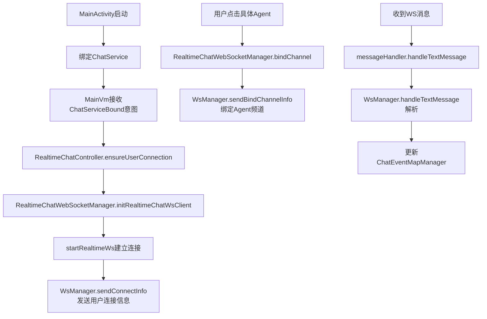
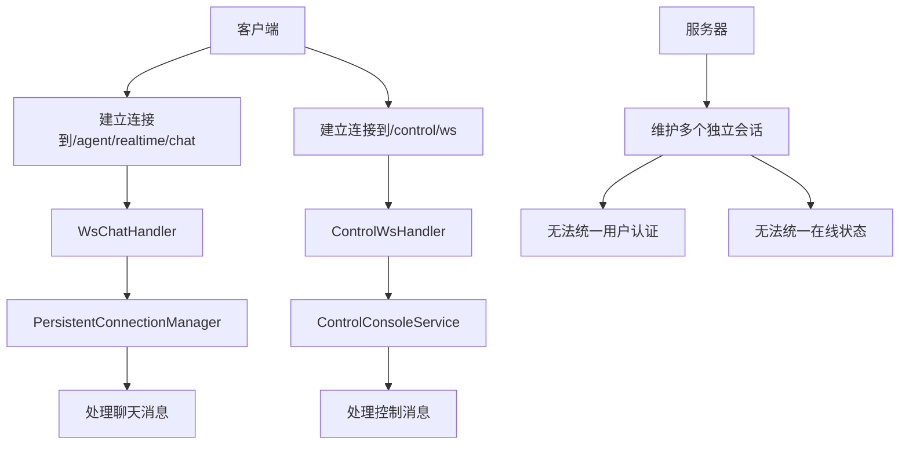
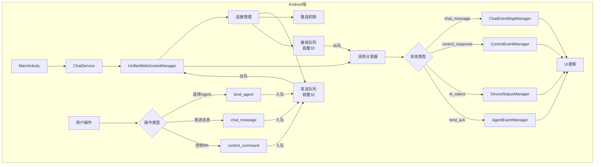
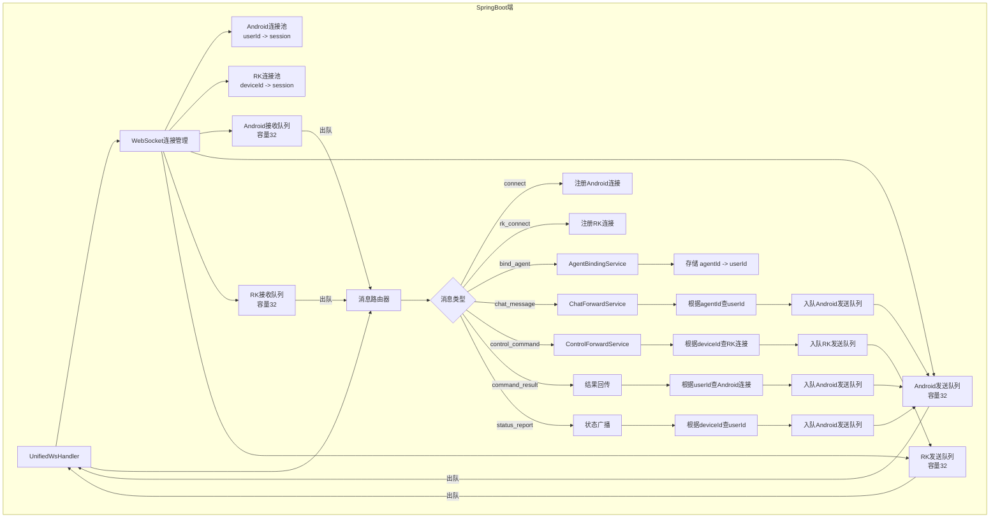
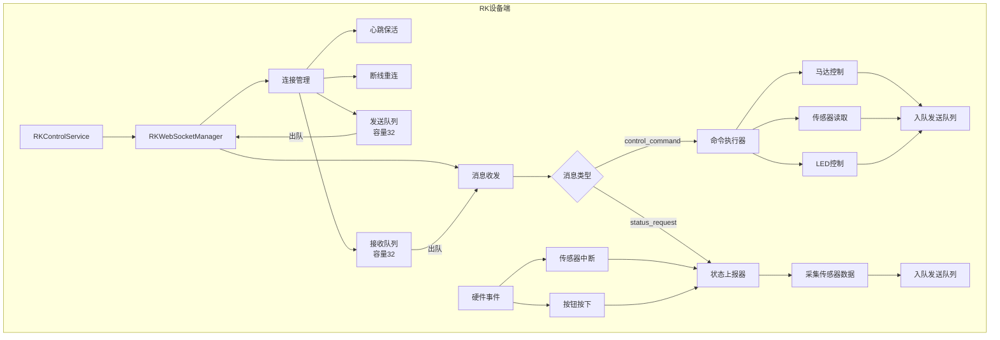
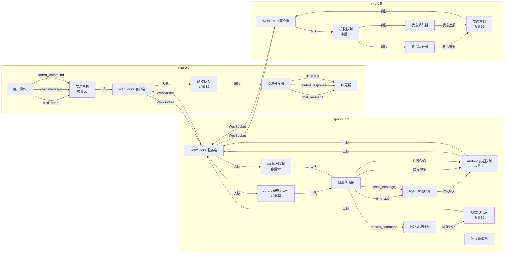

## 现有问题
### Android端现有流程

```mermaid
flowchart TD
    A[MainActivity启动] --> B[绑定ChatService]
    B --> C[MainVm接收ChatServiceBound意图]
    C --> D[RealtimeChatController.ensureUserConnection]
    D --> E[RealtimeChatWebSocketManager.initRealtimeChatWsClient]
    E --> F[startRealtimeWs建立连接]
    F --> G[WsManager.sendConnectInfo发送用户连接信息]
    H[用户点击具体Agent] --> I[RealtimeChatWebSocketManager.bindChannel]
    I --> J[WsManager.sendBindChannelInfo绑定Agent频道]
    K[收到WS消息] --> L[messageHandler.handleTextMessage]
    L --> M[WsManager.handleTextMessage解析]
    M --> N[更新ChatEventMapManager]

```

### SpringBoot端WS架构分析

```mermaid
flowchart TD
    A[客户端] --> B[建立连接到/agent/realtime/chat]
    A --> C[建立连接到/control/ws]
    B --> D[WsChatHandler]
    C --> E[ControlWsHandler]
    D --> F[PersistentConnectionManager]
    E --> G[ControlConsoleService]
    F --> H[处理聊天消息]
    G --> I[处理控制消息]
    J[服务器] --> K[维护多个独立会话]
    K --> L[无法统一用户认证]
    K --> M[无法统一在线状态]
```

## 优化后
### 优化后的Android WS架构设计

```mermaid
flowchart TD
    subgraph Android端
        A[MainActivity] --> B[ChatService]
        B --> C[UnifiedWebSocketManager]

        C --> D[连接管理]
        D --> E[发送队列<br/>容量32]
        D --> F[重连机制]
        D --> G[接收队列<br/>容量32]

        C --> H[消息分发器]
        H --> I{消息类型}

        I -->|chat_message| J[ChatEventMapManager]
        I -->|control_response| K[ControlEventManager]
        I -->|rk_status| L[DeviceStatusManager]
        I -->|bind_ack| M[AgentEventManager]

        J --> N[UI更新]
        K --> N
        L --> N
        M --> N

        O[用户操作] --> P{操作类型}
        P -->|选择Agent| Q[bind_agent]
        P -->|发送消息| R[chat_message]
        P -->|控制RK| S[control_command]

        Q -->|入队| E
        R -->|入队| E
        S -->|入队| E

        E -->|出队| C
        G -->|出队| H
    end
```

### 优化后的SpringBoot WS架构

```mermaid
flowchart TD
    subgraph SpringBoot端
        A[UnifiedWsHandler] --> B[WebSocket连接管理]

        B --> C[Android连接池<br/>userId -> session]
        B --> D[RK连接池<br/>deviceId -> session]
        B --> E[Android接收队列<br/>容量32]
        B --> F[Android发送队列<br/>容量32]
        B --> G[RK接收队列<br/>容量32]
        B --> H[RK发送队列<br/>容量32]

        A --> I[消息路由器]

        I --> J{消息类型}

        J -->|connect| K[注册Android连接]
        J -->|rk_connect| L[注册RK连接]
        J -->|bind_agent| M[AgentBindingService]
        J -->|chat_message| N[ChatForwardService]
        J -->|control_command| O[ControlForwardService]
        J -->|command_result| P[结果回传]
        J -->|status_report| Q[状态广播]

        M --> R[存储 agentId -> userId]
        N --> S[根据agentId查userId]
        S --> T[入队Android发送队列]

        O --> U[根据deviceId查RK连接]
        U --> V[入队RK发送队列]

        P --> W[根据userId查Android连接]
        W --> X[入队Android发送队列]

        Q --> Y[根据deviceId查userId]
        Y --> Z[入队Android发送队列]

        T --> F
        V --> H
        X --> F
        Z --> F

        E -->|出队| I
        F -->|出队| A
        G -->|出队| I
        H -->|出队| A
    end
```

### RK框架

```mermaid
flowchart TD
    subgraph RK设备端
        A[RKControlService] --> B[RKWebSocketManager]

        B --> C[连接管理]
        C --> D[心跳保活]
        C --> E[断线重连]
        C --> F[发送队列<br/>容量32]
        C --> G[接收队列<br/>容量32]

        B --> H[消息收发]

        H --> I{消息类型}

        I -->|control_command| J[命令执行器]
        I -->|status_request| K[状态上报器]

        J --> L[马达控制]
        J --> M[传感器读取]
        J --> N[LED控制]

        L --> O[入队发送队列]
        M --> O
        N --> O

        K --> P[采集传感器数据]
        P --> Q[入队发送队列]

        R[硬件事件] --> S[传感器中断]
        S --> K
        R --> T[按钮按下]
        T --> K

        F -->|出队| B
        G -->|出队| H
    end
```

### 整体数据流

```mermaid
graph LR
    subgraph Android
        A1[用户操作]
        A2[发送队列<br/>容量32]
        A3[WebSocket客户端]
        A4[接收队列<br/>容量32]
        A5[消息分发器]
        A6[UI更新]
    end

    subgraph SpringBoot
        B1[WebSocket服务端]
        B2[Android接收队列<br/>容量32]
        B3[消息路由器]
        B4[Android发送队列<br/>容量32]
        B5[RK接收队列<br/>容量32]
        B6[RK发送队列<br/>容量32]
        B7[连接管理器]
        B8[Agent绑定服务]
        B9[控制转发服务]
    end

    subgraph RK设备
        C1[发送队列<br/>容量32]
        C2[WebSocket客户端]
        C3[接收队列<br/>容量32]
        C4[命令执行器]
        C5[状态采集器]
    end

    A1 -->|bind_agent| A2
    A1 -->|chat_message| A2
    A1 -->|control_command| A2

    A2 -->|出队| A3
    A3 -->|WebSocket| B1

    B1 -->|入队| B2
    B2 -->|出队| B3

    B3 -->|bind_agent| B8
    B3 -->|chat_message| B8
    B3 -->|control_command| B9

    B8 -->|转发聊天| B4
    B9 -->|转发控制| B6

    B4 -->|出队| B1
    B6 -->|出队| B1

    B1 -->|WebSocket| C2
    C2 -->|入队| C3
    C3 -->|出队| C4
    C3 -->|出队| C5

    C4 -->|命令结果| C1
    C5 -->|状态上报| C1

    C1 -->|出队| C2
    C2 -->|WebSocket| B1

    B1 -->|入队| B5
    B5 -->|出队| B3
    B3 -->|转发结果| B4
    B3 -->|广播状态| B4

    B4 -->|出队| B1
    B1 -->|WebSocket| A3

    A3 -->|入队| A4
    A4 -->|出队| A5
    A5 -->|chat_message| A6
    A5 -->|control_response| A6
    A5 -->|rk_status| A6
```
