## 现有问题
### Android端现有流程
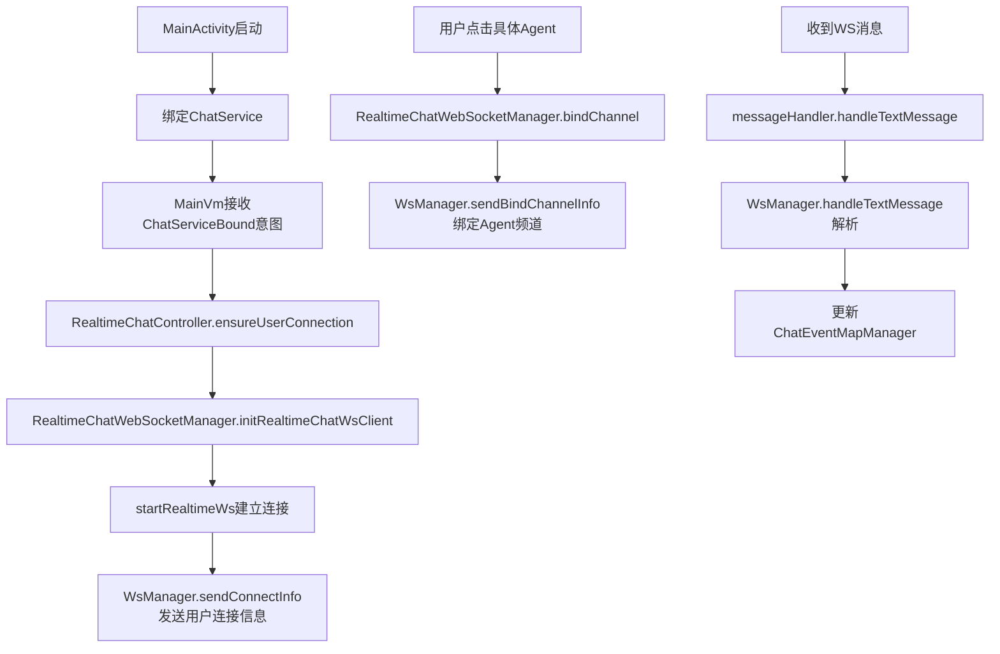

### SpringBoot端WS架构分析
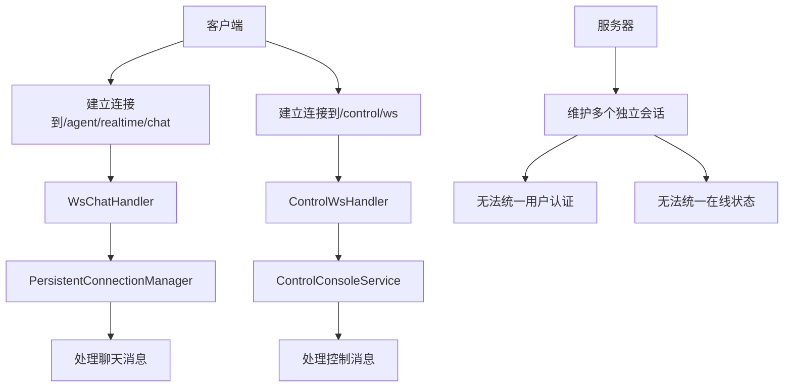


## 优化后
### 优化后的Android WS架构设计

```mermaid
flowchart TD
    subgraph 初始化与连接管理
        Start([应用启动]) --> InitWS[初始化 WebSocketService<br/>创建 CoroutineScope]
        InitWS --> CreateManager[创建 UnifiedWebSocketManager]
        CreateManager --> ConnLoop{连接状态}
        ConnLoop -->|未连接| Connect[connect 协程 IO<br/>建立 WS 连接]
        Connect --> SendAuth[发送认证信息<br/>channel:connection, event:auth]
        SendAuth --> WaitAck[等待 connect_ack]
        WaitAck -->|成功| StartPing[启动 ping/pong 心跳]
        WaitAck -->|失败/超时| ReconnDelay[延迟重连<br/>指数退避]
        ReconnDelay --> Connect
        StartPing --> ConnEstablished[连接已建立]
        ConnEstablished --> DispatchLoop[启动接收分发循环<br/>Dispatchers.Default]
    end

    subgraph 消息发送通道
        UserAction[用户操作] --> ActionType{操作类型}
        ActionType -->|创建/删除/编辑 Agent| AgentUpdate[构造 agent_update 消息<br/>channel:agent]
        ActionType -->|发送聊天文本| ChatSend[构造 chat_message_send<br/>channel:chat]
        ActionType -->|控制 RK 设备| ControlCmd[构造 control_command<br/>channel:control]
        ActionType -->|开始语音交互| VoiceStart[启动语音交互流程]
        ActionType -->|HTTP 请求| HttpReq[协程 IO 请求<br/>GET /api/agents 或 /api/chat/history]
        HttpReq --> UpdateCache[更新本地缓存<br/>withContext Main]

        AgentUpdate --> SendMsg[发送到发送 Channel<br/>容量 32]
        ChatSend --> SendMsg
        ControlCmd --> SendMsg

        SendMsg --> WsSend[WebSocket 发送<br/>协程 IO]
    end

    subgraph 语音交互详细流程
        VoiceStart --> CheckAgentState{isAgentReplying?}
        CheckAgentState -->|是| RejectVoice[忽略本次唤醒/录音<br/>提示忙碌]
        RejectVoice --> EndVoice([结束])
        CheckAgentState -->|否| WakeUp[讯飞离线唤醒 SDK 唤醒]
        WakeUp --> StartRecord[开始录音<br/>启动 2s 超时定时器]
        StartRecord --> ParallelVoice{并行执行}

        ParallelVoice --> AudioPush[循环读取麦克风 buffer<br/>发送 stt_audio_data 分片<br/>含 seq 序列号]
        AudioPush --> WsSend

        ParallelVoice --> VideoPush[视频推流独立协程<br/>UDP/RTMP 发送视频帧]
        VideoPush --> VideoOut[视频流输出]

        ParallelVoice --> VadTimer[2s 超时检测]
        VadTimer -->|2s 内无语音| StopRec1[停止录音<br/>发送 stt_end]
        VadTimer -->|2s 内检测到语音| VadLoop[VAD 循环检测]
        VadLoop -->|静音超过阈值| StopRec2[停止录音<br/>发送 stt_end]

        StopRec1 --> WaitReply[等待服务器回复]
        StopRec2 --> WaitReply
    end

    subgraph 消息接收与分发
        DispatchLoop --> RecvMsg[从接收 Channel 取消息<br/>容量 32]
        RecvMsg --> ParseChannel{解析 channel 字段}

        ParseChannel -->|agent| AgentHandler[AgentEventHandler<br/>处理 agent_list_sync]
        ParseChannel -->|chat| ChatHandler[ChatEventHandler<br/>处理 chat_message_sync]
        ParseChannel -->|stt| SttHandler[STTEventHandler<br/>处理 stt_start_ack, stt_text_data, stt_error]
        ParseChannel -->|llm| LlmHandler[LLMEventHandler<br/>处理 llm_start/llm_data/llm_end]
        ParseChannel -->|tts| TtsHandler[TTSEventHandler<br/>流式 tts_*, 非批量回复路径]
        ParseChannel -->|instruction_list| InstListHandler[InstructionListEventHandler<br/>收到 instruction_list, 展开入队]
        ParseChannel -->|control| CtrlHandler[ControlEventHandler<br/>收到 control_command / control_response]
        ParseChannel -->|system| SysHandler[SystemEventHandler<br/>处理 error, system_message]
        ParseChannel -->|status| StatusHandler[StatusEventHandler<br/>处理 rk_status]
        ParseChannel -->|connection| ConnHandler[ConnectionEventHandler<br/>处理 ping/pong/connect_ack]

        AgentHandler --> UiUpdate[更新 UI<br/>withContext Main]
        ChatHandler --> UiUpdate
        SttHandler --> UiUpdate
        LlmHandler --> UiUpdate
        InstListHandler --> UiUpdate
        StatusHandler --> UiUpdate
        ConnHandler --> Heartbeat[更新心跳时间]

        SysHandler --> CheckAgentStateChange{是否为 agent_start_reply<br/>或 agent_end_reply?}
        CheckAgentStateChange -->|agent_start_reply| SetReplying[设置 isAgentReplying = true<br/>关闭唤醒 + 禁用录音]
        CheckAgentStateChange -->|agent_end_reply| SetIdle[设置 isAgentReplying = false<br/>恢复唤醒 + 恢复录音]
        CheckAgentStateChange -->|其他| LogError[记录错误或忽略]

        CtrlHandler --> CheckMcp{是否为 MCP 指令?<br/>且非 instruction_list 编排内}
        CheckMcp -->|是| SubmitInstruction[提交到 InstructionExecutor 队列<br/>独立控制通道场景]
        CheckMcp -->|否| ForwardControl[转发给普通控制处理器]

        TtsHandler --> SubmitTtsStream[流式路径: 提交 TTS 分片到播放或缓冲<br/>与批量 instruction_list 互斥由会话状态约定]
        InstListHandler --> SubmitBatch[批量路径: 按序提交列表项到 InstructionExecutor 队列]
    end

    subgraph 顺序指令执行器
        InstructionExecutor[InstructionExecutor<br/>单线程协程 Dispatchers.Main.immediate] --> QueueLoop[循环从队列取指令]
        QueueLoop --> InstType{指令类型}
        InstType -->|TTS 音频| PlayTTS[调用 AudioPlayer 播放]
        PlayTTS --> WaitPlay[等待播放完成回调]
        WaitPlay --> SendComplete["发送 instruction_result<br/>channel:instruction_list, event:instruction_result<br/>携带 request_id、index、type、status"]
        InstType -->|MCP 指令| ExecMcp{目标设备?}
        ExecMcp -->|Android| ExecLocal[执行本地指令<br/>如 GPIO/舵机/LCD]
        ExecMcp -->|RK| ForwardRk[通过 WebSocket 转发给 RK<br/>等待 RK 回复确认]
        ExecLocal --> WaitLocalDone[等待执行完成]
        ForwardRk --> WaitRkAck[等待 RK command_result<br/>本地聚合后再发 instruction_result]
        WaitLocalDone --> SendComplete
        WaitRkAck --> SendComplete
        SendComplete --> QueueLoop
    end

    subgraph 视频推流独立模块
        VideoPush --> VideoMode{传输模式}
        VideoMode -->|高速模式| UdpSend[UDP 推流到 SpringBoot UDP 服务]
        VideoMode -->|防花屏模式| RtmpSend[RTMP 推流到 Nginx-RTMP]
        UdpSend --> VideoEnd[持续推流直至停止]
        RtmpSend --> VideoEnd

        VideoPlay[拉流播放] --> PlayMode{播放来源}
        PlayMode -->|UDP| UdpRecv[UDP 接收协程 IO]
        PlayMode -->|RTMP| RtmpRecv[RTMP 拉流协程 IO]
        UdpRecv --> Decode[解码视频帧 Dispatchers.Default]
        RtmpRecv --> Decode
        Decode --> Render[渲染到 SurfaceView<br/>withContext Main]
    end

    subgraph 异常与状态恢复
    AnyError["何环节发生异常<br/>如 WS 断开、超时、解析失败"] --> ResetIdle[调用 resetToIdle]
    ResetIdle --> StopPlaying[停止当前 TTS 播放]
    ResetIdle --> ClearQueue[清空 InstructionExecutor 队列]
    ResetIdle --> SetIdleState[设置 isAgentReplying = false<br/>恢复唤醒 + 恢复录音]
    SetIdleState --> NotifyServer[发送 error_reset 通知服务器]
    NotifyServer --> ReconnectWs[触发 WebSocket 重连]
    ReconnectWs --> ConnLoop
    end
    
    %% 连接关系补全
    WsSend -.-> RecvMsg
    SendComplete -.-> WsSend
    NotifyServer -.-> WsSend
    SetReplying -.-> CheckAgentState
    SetIdle -.-> CheckAgentState
    InstructionExecutor -.-> UiUpdate
    ExecLocal -.-> UiUpdate
```

### 优化后的SpringBoot WS架构

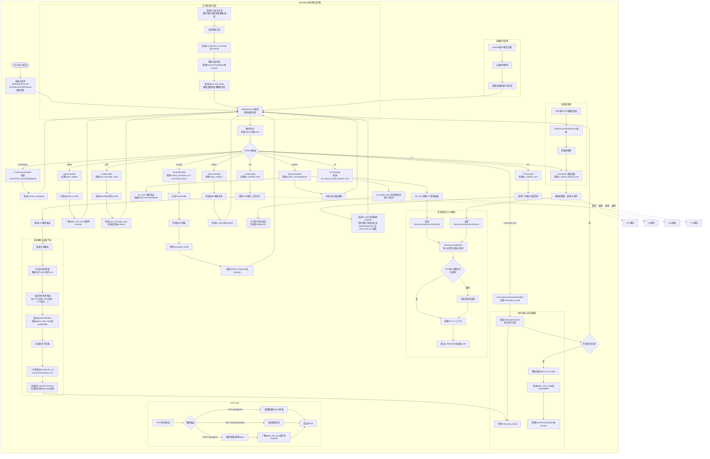


### RK框架

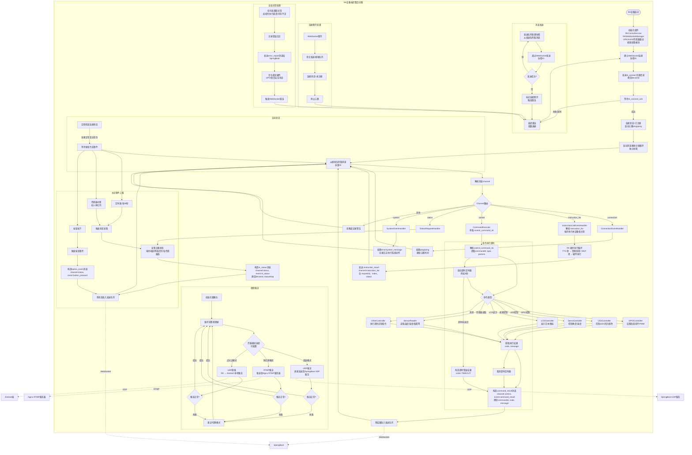

### 整体数据流
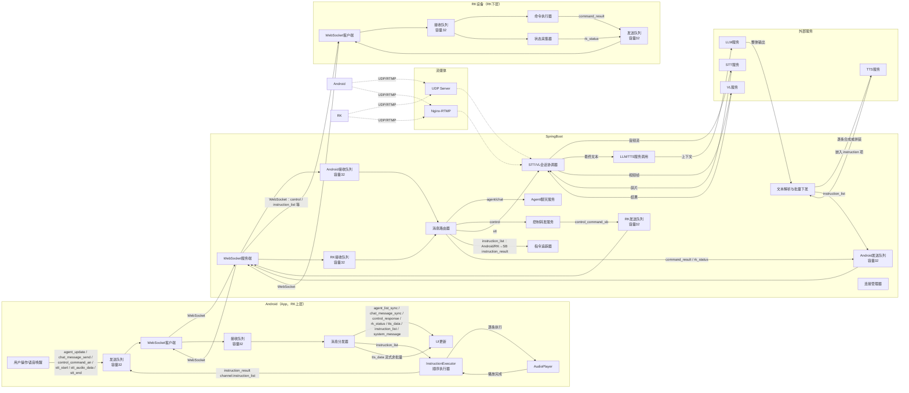


### 数据结构设计

#### Event

SpringBoot

```java
@Data
public class ClientEvent {
    private String channel;
    private Map<String, String> data;
}

@Data
public class ServerEvent {
    private String channel;
    private Map<String, String> data;
}
```

Android (App/RK)

```kotlin
data class ClientEvent(
    val channel: String,
    val data: Map<String, String> = emptyMap()
)
data class ServerEvent(
    val channel: String,
    val data: Map<String, String> = emptyMap()
)
```


三端消息体复用同一套字段语义时，以 **`CommonResultDto`**（请求追踪 + 结果码 + 描述）、**`StreamSeqDto`**（流式分片：agent、序号、末帧、时间戳）为基类；具体 Event 的 Request/Response 再继承其一。实现位置：

**CommonResultDto**

```java
@Data
public class CommonResultDto {
    private String requestId;    // 请求追踪ID
    private Integer code;        // 200=成功
    private String message;      // 描述信息
}
```

**StreamSeqDto**

```java
@Data
public class StreamSeqDto {
    private String agentId;
    private String seq;          // 流序号
    private Boolean isLast;      // 是否最后一帧
    private Long timestamp;      // 时间戳
}
```

**与现有类型的关系（示例）**

- 流式 TTS 分片：**`TtsDataResponse` extends `StreamSeqDto`**，子类字段见 `springboot/.../response/TtsDataResponse.java`（`base64AudioStream`）；Android 同形 `TtsDataResponse.kt`。
- 控制命令载荷：**`ControlCommandResponse` extends `CommonResultDto`**，子类字段 `commandId`、`command`、`params`；Android 同形 `ControlCommandResponse.kt`。

#### Event 枚举设计

##### 1. 连接管理类（三端通用）

| Event | 方向 | 说明 | data字段 |
|---------|------|------|----------|
| `connect` | Android→SB | 建立用户连接 | `userId` |
| `connect_ack` | SB→Android | 连接确认 | `code`, `message` |
| `rk_connect` | RK→SB | RK设备注册 | `deviceId`, `firmware` |
| `rk_connect_ack` | SB→RK | RK注册确认 | `code`, `message` |
| `ping` | 双向 | 心跳请求 | - |
| `pong` | 双向 | 心跳响应 | - |

> ping, pong超时策略（如连续3次无响应则断开重连）

##### 2. Agent数据同步类（Android ↔ SB）

| Event | 方向 | 说明 | data字段 |
|---------|------|------|----------|
| `agent_list_sync` | SB→Android | Agent列表变更推送 | `AgentChatDto` 列表 |
| `agent_update` | Android→SB | 用户操作Agent（创建/更新/删除） | `AgentChatDto` |

##### 3. 聊天消息类（Android ↔ SB）

| Event | 方向 | 说明 | data字段 |
|---------|------|------|----------|
| `chat_message_sync` | SB→Android | 聊天消息推送 | `ChatMessageDto` |
| `chat_message_send` | Android→SB | 用户发送消息 | `ChatMessageDto` |

##### 4. 音频处理类（Android ↔ SB）

| Event | 方向 | 说明 | data字段                                          |
|---------|------|------|-------------------------------------------------|
| `stt_start` | Android→SB | 开始语音识别（STT） | `agentId`                                       |
| `stt_start_ack` | SB→Android | 语音识别确认 | `agentId`                                       |
| `stt_audio_data` | Android→SB | 语音数据流 | `agentId`, `base64AudioStream`, `seq`           |
| `stt_text_data` | SB→Android | 识别的文本结果流 | `agentId`, `textStream`, `seq`                  |
| `stt_end` | Android→SB | 结束语音识别 | `agentId`                                       |
| `stt_error` | Android→SB | 语音识别异常 | `agentId`, `code`, `message`                    |
| `llm_start` | SB→Android | 开始LLM处理 | `agentId`                                       |
| `llm_data` | SB→Android | LLM文本流 | `agentId`, `textStream`, `seq`                  |
| `llm_end` | SB→Android | LLM处理结束 | `agentId`                                       |
| `llm_error` | SB→Android | LLM处理异常 | `agentId`, `code`, `message`                    |
| `tts_start` | SB→Android | 开始语音合成（TTS） | `agentId`                                       |
| `tts_data` | SB→Android | TTS音频流 | `agentId`, `base64AudioStream`, `text`, `seq`         |
| `tts_end` | SB→Android | TTS合成结束 | `agentId`                                       |
| `tts_error` | SB→Android | TTS合成异常 | `agentId`, `code`, `message`                    |
| `vl_start` | Android→SB | 开始视觉理解（VL） | `agentId`（v2版本中获取视频源的方式只有两种：Udp推流SB或SB主动拉取RTMP） |
| `vl_data` | SB→Android | 视觉理解结果 | `agentId`, `content`                            |
| `vl_end` | SB→Android | 视觉理解结束 | `agentId`                                       |
| `vl_error` | SB→Android | 视觉理解异常 | `agentId`, `code`, `message`                    |

##### 5. 控制命令类（Android ↔ SB ↔ RK）

| Event | 方向            | 说明 | data字段                                                  |
|---------|---------------|------|---------------------------------------------------------|
| `control_command_an` | Android→SB    | 控制RK设备 | `deviceId`, `command`, `params`（Map<String, String>）    |
| `control_command_sb` | SB→RK/Android | 转发控制命令 | `commandId`, `target`, `command`, `params`（Map<String, String>） |
| `command_result` | RK→SB         | 命令执行结果 | `commandId`, `code`, `message`                          |
| `control_response` | SB→Android    | 控制结果响应 | `deviceId`, `code`, `message`                           |

##### 6. 设备状态类（RK ↔ SB ↔ Android）

| Event | 方向 | 说明 | data字段 |
|---------|------|------|----------|
| `status_request` | Android/SB→RK | 请求设备状态 | `deviceId` |
| `rk_status` | RK→SB | 设备状态上报 | `deviceId`, `battery`, `position` |
| `rk_status` | SB→Android | 转发设备状态 | `deviceId`, `battery`, `position` |

##### 7. 指令批量处理类（三端通用）

**设计说明**：`instruction_list` / `instruction_result` 独占 **`instruction_list` 通道**，
由 **`InstructionListChannelHandler`（SB）** 与 **`InstructionListEventHandler`（Android / RK）** 处理，
用于把「TTS 与 MCP」绑定为**同一有序批次**，与 **`tts` 通道 + `TTSEventHandler`（流式预览）**、**`control` 通道 + `ControlEventHandler`（单条控制）** 解耦，避免两路消息在客户端自行拼时序。

| Event | Channel | 方向 | 说明 | data字段 |
|--------------------|-------------|------|----------------------------|----------|
| `instruction_list`   | `instruction_list` | SB → Android / RK（及需同步的下发面） | 一次下发完整有序列表（TTS 片段 + MCP 项） | 见下「载荷结构」 |
| `instruction_result` | `instruction_list` | Android / RK → SB | 列表内**单条**执行结果（按 index 推进追踪） | `requestId`, `index`, `type`（`Instruction` 枚举）, `status`, `code`, `message` |

**列表项与现有 DTO 对齐规则**

| 项类型 | 基类链 | 对齐的已有类型 | 说明 |
|--------|--------|----------------|------|
| TTS | **`StreamSeqDto` ← `TtsDataResponse`** | `TtsDataResponse`（`base64AudioStream`） | 一项 = 一条可播放分片；`seq` / `isLast` 与同批内多块音频一致 |
| MCP | **`CommonResultDto` ← `ControlCommandResponse`** | `ControlCommandResponse`（`commandId`、`command`、`params`） | 一项 = 一条控制语义；`requestId`/`code`/`message` 继承自 `CommonResultDto` |

**列表项 DTO（`type` 字段使用 `Instruction`，禁止魔法字符串）**

```java
// 在 TtsDataResponse（extends StreamSeqDto，含 base64AudioStream、text）上增加列表编排字段
@Data
@EqualsAndHashCode(callSuper = true)
public class InstructionTtsItem extends TtsDataResponse {
    private Instruction type = Instruction.TTS;
    private Integer index;
}

// 在 ControlCommandResponse（extends CommonResultDto，含 commandId/command/params/target）上增加列表编排字段
@Data
@EqualsAndHashCode(callSuper = true)
public class InstructionMcpItem extends ControlCommandResponse {
    private Instruction type = Instruction.MCP;
    private Integer index;
    /** 执行侧路由（与下行 push 的 target 语义不同，见实现注释） */
    private String executionTarget;
    private String deviceId;
}
```

> 实现说明：若工程里 `InstructionMcpItem` 暂不继承 `ControlCommandResponse`（避免与 SB 下行 `target` 字段语义混用），则保持「继承 `CommonResultDto` + 与 `ControlCommandResponse` 同名字段」即可，**`type` 仍须为 `Instruction` 枚举**。

##### 8. 系统消息类（三端通用）

| Event | 方向 | 说明 | data字段 |
|---------|------|------|----------|
| `error` | 双向 | 错误信息 | `code`, `message` |
| `system_message` | SB→双向 | 系统通知 | `event`, `param`（Map<String, String>） |

---

#### Channel设计

Channel为一类Event的通道

UnifiedWsHandler + MessageRouter (Channel分发器) + ChannelHandler + 线程池架构

| Channel | 包含Event | 方向 | 说明                                               |
|---------|----------|------|--------------------------------------------------|
| connection | connect, connect_ack, rk_connect, rk_connect_ack, ping, pong | 三端双向 | 连接管理、心跳保活                                        |
| agent | agent_list_sync, agent_update | Android ↔ SB | Agent配置同步                                        |
| chat | chat_message_sync, chat_message_send | Android ↔ SB | 聊天消息传输                                           |
| stt | stt_start, stt_start_ack, stt_audio_data, stt_text_data, stt_end, stt_error | Android ↔ SB | 语音识别数据流                                          |
| llm | llm_start, llm_data, llm_end, llm_error | SB → Android | LLM文本流                                           |
| tts | tts_start, tts_data, tts_end, tts_error | SB → Android | TTS 音频流（**流式 / 非混合时序**；混合时序回复走 `instruction_list`） |
| instruction_list | instruction_list, instruction_result | SB ↔ Android / RK | **混合时序编排**：有序 TTS+MCP，与 `instruction_result` 成对追踪  |
| vl | vl_start, vl_data, vl_end, vl_error | Android ↔ SB | 视觉理解数据流（V2版本由UDP或RTMP替代）                         |
| control | control_command_an, control_command_sb, command_result, control_response | Android → SB → RK → SB → Android | **单条**设备控制（非混合时序 `instruction_list` 编排内）             |
| status | status_request, rk_status | RK ↔ SB ↔ Android | 设备状态上报与查询                                        |
| system | error, system_message | 三端双向 | 系统消息与错误通知                                        |

#### UnifiedWsHandler 类图

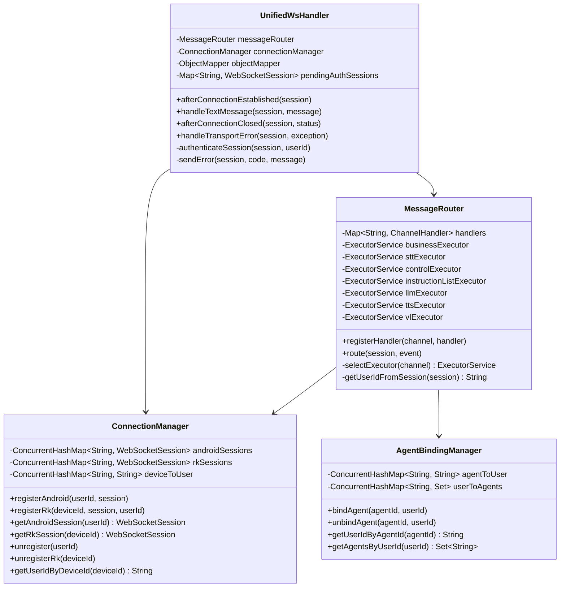


#### ChannelHandler 全量划分

```mermaid
classDiagram
    class ChannelHandler {
        <<interface>>
        +handle(session, event)
        +getSupportedChannel() String
    }

    class ConnectChannelHandler {
        -ConnectionManager connectionManager
        +handle(session, event)
        -handleConnect(session, event)
        -handleRkConnect(session, event)
        -sendAck(session, channel, code, message)
    }

    class PingChannelHandler {
        +handle(session, event)
        -handlePing(session)
        -handlePong(session)
    }

    class AgentChannelHandler {
        -AgentBindingManager bindingManager
        -AgentService agentService
        +handle(session, event)
        -handleAgentUpdate(session, event)
        -broadcastAgentList(userId)
    }

    class ChatChannelHandler {
        -AgentBindingManager bindingManager
        -ChatForwardService chatForwardService
        +handle(session, event)
        -handleChatMessageSend(session, event)
    }

    class SttChannelHandler {
        -SttService sttService
        -AudioBufferManager bufferManager
        -SessionCoordinator sessionCoordinator
        +handle(session, event)
        -handleSttStart(session, event)
        -handleSttAudioData(session, event)
        -handleSttEnd(session, event)
        -handleSttError(session, event)
    }

    class LlmChannelHandler {
        -LlmService llmService
        -LlmStreamManager streamManager
        +handle(session, event)
        -handleLlmStart(session, event)
        -handleLlmData(session, event)
        -handleLlmEnd(session, event)
        -handleLlmError(session, event)
    }

    class TtsChannelHandler {
        -TtsService ttsService
        -AudioStreamManager streamManager
        +handle(session, event)
        -handleTtsStart(session, event)
        -handleTtsData(session, event)
        -handleTtsEnd(session, event)
        -handleTtsError(session, event)
    }

    class VlChannelHandler {
        -VlService vlService
        +handle(session, event)
        -handleVlStart(session, event)
        -handleVlData(session, event)
        -handleVlEnd(session, event)
        -handleVlError(session, event)
    }

    class ControlChannelHandler {
        -ControlForwardService controlService
        -ConnectionManager connectionManager
        +handle(session, event)
        -handleControlCommand(session, event)
        -handleCommandResult(session, event)
        -sendControlResponse(userId, deviceId, code, message)
    }

    class InstructionListChannelHandler {
        -InstructionTracker instructionTracker
        -BatchDispatchService batchDispatchService
        -ConnectionManager connectionManager
        +handle(session, event)
        -handleInstructionResult(session, event)
        -onAllInstructionsDone(requestId)
    }

    class StatusChannelHandler {
        -StatusService statusService
        -ConnectionManager connectionManager
        +handle(session, event)
        -handleStatusRequest(session, event)
        -handleRkStatus(session, event)
        -broadcastStatus(deviceId, status)
    }

    class SystemChannelHandler {
        -SystemMessageService systemService
        +handle(session, event)
        -handleError(session, event)
        -handleSystemMessage(session, event)
    }

    ChannelHandler <|.. ConnectChannelHandler
    ChannelHandler <|.. PingChannelHandler
    ChannelHandler <|.. AgentChannelHandler
    ChannelHandler <|.. ChatChannelHandler
    ChannelHandler <|.. SttChannelHandler
    ChannelHandler <|.. LlmChannelHandler
    ChannelHandler <|.. TtsChannelHandler
    ChannelHandler <|.. VlChannelHandler
    ChannelHandler <|.. ControlChannelHandler
    ChannelHandler <|.. InstructionListChannelHandler
    ChannelHandler <|.. StatusChannelHandler
    ChannelHandler <|.. SystemChannelHandler
```


#### MessageRouter 整体通信图

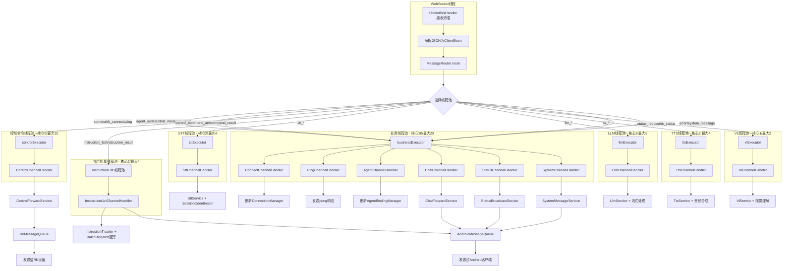


#### 线程池类图


```mermaid
classDiagram
    class ThreadPoolConfig {
        +businessExecutor() ExecutorService
        +sttExecutor() ExecutorService
        +controlExecutor() ExecutorService
        +instructionListExecutor() ExecutorService
        +llmExecutor() ExecutorService
        +ttsExecutor() ExecutorService
        +vlExecutor() ExecutorService
        +monitoringExecutor() ScheduledExecutorService
    }

    class CustomThreadPool {
        -String poolName
        -ThreadPoolExecutor executor
        -AtomicLong submittedCount
        -AtomicLong completedCount
        +submit(task) Future
        +getActiveCount() int
        +getQueueSize() int
        +getPoolStatus() PoolStatus
    }

    class PoolStatus {
        +String poolName
        +int corePoolSize
        +int maxPoolSize
        +int activeCount
        +int poolSize
        +int queueSize
        +long completedTaskCount
        +long submittedCount
    }

    class ThreadPoolMonitor {
        -List~CustomThreadPool~ pools
        -AlertService alertService
        +monitorPools()
        +checkBackPressure()
        +logPoolStatus()
        +alertIfThresholdExceeded()
    }

    class MessageRouter {
        -ExecutorService businessExecutor
        -ExecutorService sttExecutor
        -ExecutorService controlExecutor
        -ExecutorService instructionListExecutor
        -ExecutorService llmExecutor
        -ExecutorService ttsExecutor
        -ExecutorService vlExecutor
        +route(session, event)
        -selectExecutor(channel) ExecutorService
    }

    ThreadPoolConfig --> CustomThreadPool : creates
    CustomThreadPool --> PoolStatus : exposes
    ThreadPoolMonitor --> CustomThreadPool : monitors
    MessageRouter --> CustomThreadPool : uses
```

#### 线程池对象图


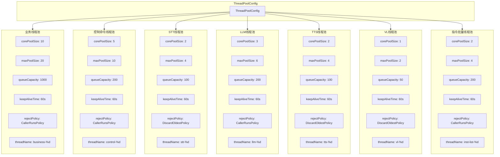


#### Android 泳道图（Swimlane）

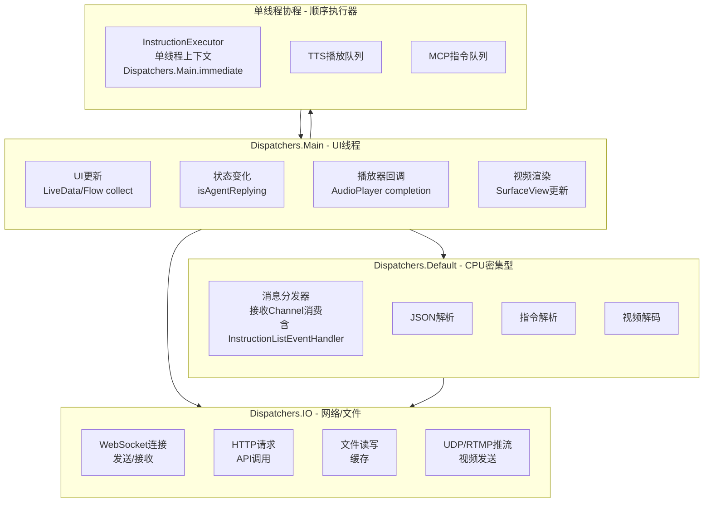

#### 异步处理层次设计

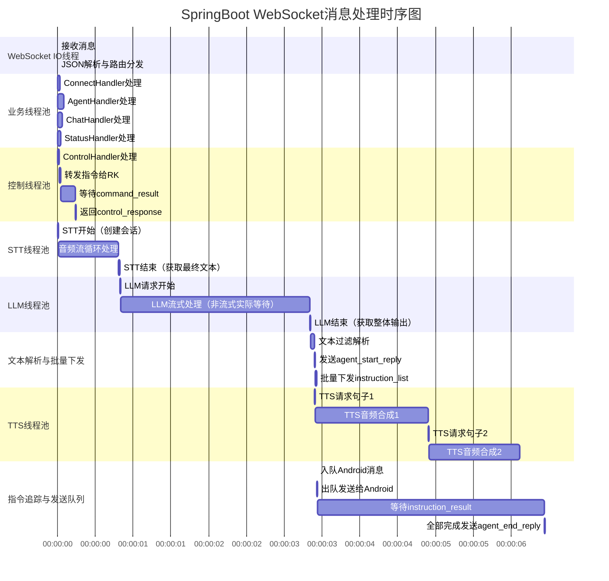


#### RK 下层（C++）线程池设计

RK上层的Android已经完成了绝大部分任务，下层只需要GPIO，视频流采集，MCP执行，音频播放等

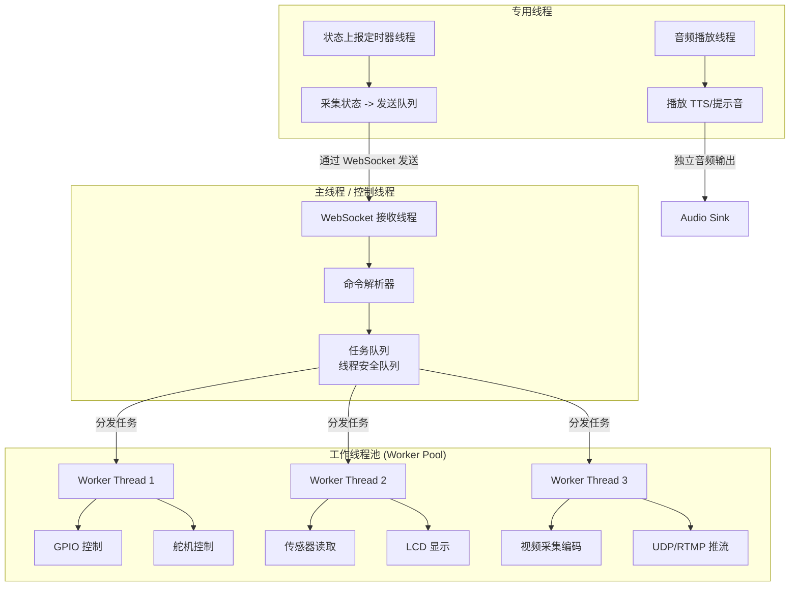

#### 线程池隔离设计原则

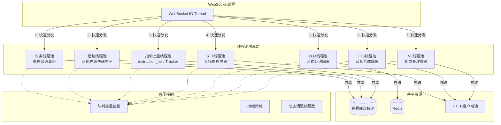


### 状态机设计

#### Android（App，RK上层）状态机状态图

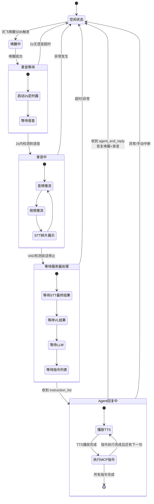

#### SpringBoot 状态机状态图

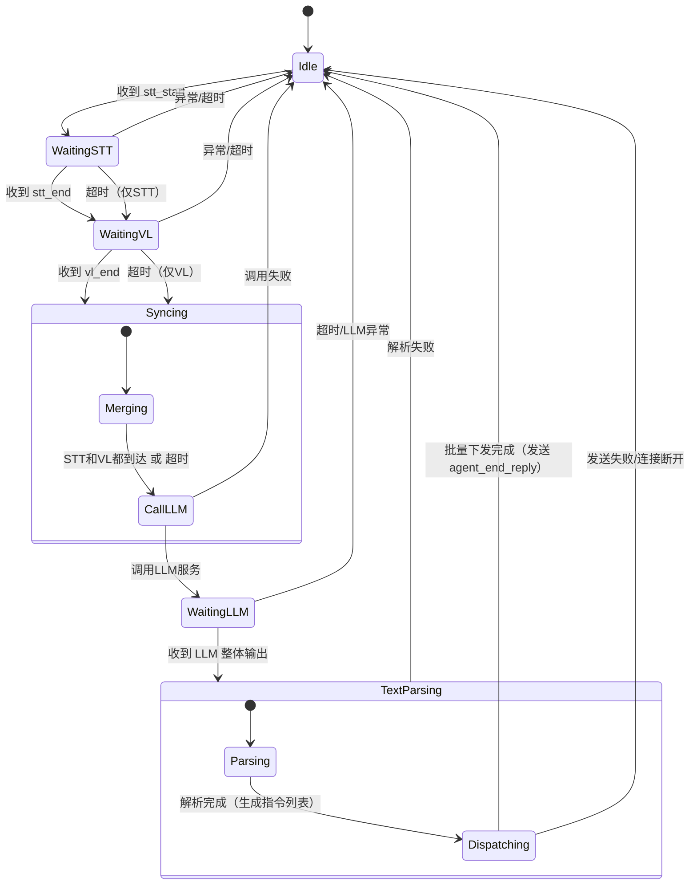

#### RK 下层 Cpp 状态机状态图

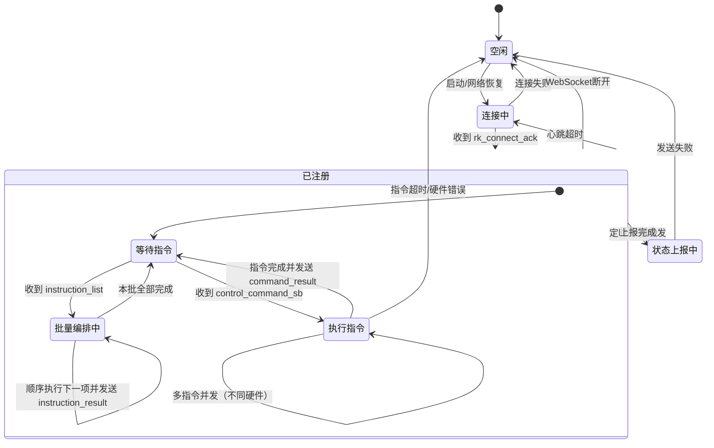


