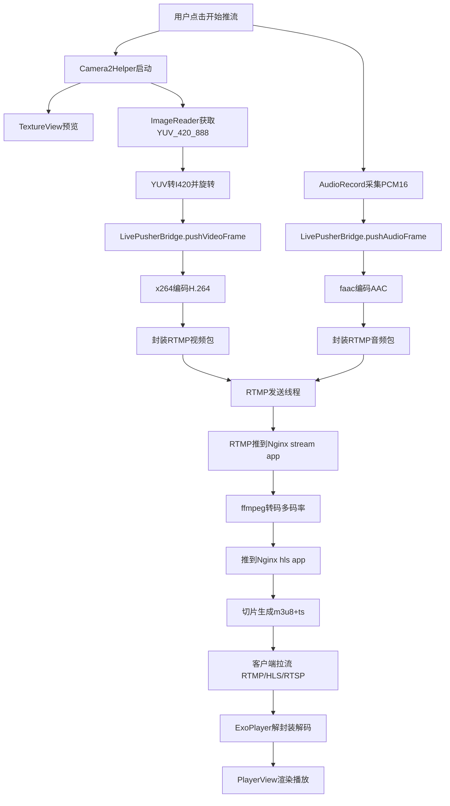

# Android 音视频采集、推拉流与播放全链路梳理（基于当前项目代码）

本文基于以下真实代码做分析：
- `demo/flutter/flutteraar/app/src/main/java/com/example/flutteraar/ui/activity/LivePushDemoActivity.java`
- `demo/flutter/flutteraar/app/src/main/java/com/example/flutteraar/ui/activity/LivePullDemoActivity.java`
- `demo/flutter/flutteraar/app/src/main/java/com/example/flutteraar/live/camera/Camera2Helper.java`
- `demo/flutter/flutteraar/aarlib/src/main/java/com/demo/aarlib/live/LivePusherBridge.java`
- `demo/flutter/flutteraar/aarlib/src/main/cpp/live/VideoStream.cpp`
- `demo/flutter/flutteraar/aarlib/src/main/cpp/live/AudioStream.cpp`
- `demo/flutter/flutteraar/aarlib/src/main/cpp/live/RtmpPusher.cpp`
- `demo/springboot/nginx-docker/conf/nginx.conf`

---

## 1. 先给结论（你问的关键点）

### 1.1 推流端 `LivePushDemoActivity` 怎么采集视频和音频？
- **视频采集**：`Camera2 + ImageReader(YUV_420_888)`，由 `Camera2Helper` 输出帧。
- **视频预览**：`TextureView`（不是 `SurfaceView`）。
- **视频送编码**：`YUV_420_888 -> I420`（Java 层转换），再 JNI 送 `x264` 编码成 `H.264`，再封装成 RTMP 视频包发出去。
- **音频采集**：`AudioRecord` 采集 `PCM 16bit`，JNI 送 `faac` 编码成 `AAC`，再封装成 RTMP 音频包发出去。
- **传输协议**：RTMP（底层 TCP）。

### 1.2 拉流端 `LivePullDemoActivity` 怎么播放？
- 播放器是 **ExoPlayer(Media3)** + `PlayerView`。
- 支持 `RTMP/HLS/RTSP` 三种地址。
- 拉流播放时**没有项目自定义 FFmpeg 参与解码播放路径**；播放解码主要走 ExoPlayer + Android 平台解码器（MediaCodec）。
- FFmpeg 在本项目里主要用于**文件/网络源转推**（`FFmpegPushBridge`），不是 `LivePullDemoActivity` 的解码内核。

### 1.3 nginx 流媒体服务在做什么？
- `application stream { live on; }`：接受主 RTMP 推流。
- `exec ffmpeg ...`：收到一路 RTMP 后，转码出多码率分辨率分支（720p/480p/360p/240p...）再推到 `hls` app。
- `application hls { hls on; ... }`：把分支 RTMP 切片成 HLS（`m3u8 + ts`）。
- `http://IP:8080/hls/...`：给播放器提供 HLS 拉流地址。
- `/stat`：提供 RTMP 状态监控。

---

## 2. 推流端详细逻辑（采集 -> 编码 -> 封装 -> 发送）

## 2.1 视频采集与预览

`LivePushDemoActivity` 中：
- 预览控件：`TextureView texturePreview`
- 初始化相机：`Camera2Helper.Builder().previewOn(texturePreview)...build().start()`

`Camera2Helper` 内部关键流程：
1. 通过 `TextureView.SurfaceTextureListener` 获取可用的 `SurfaceTexture`
2. 创建 `CameraCaptureSession`，同时绑定两个输出目标：
   - `Surface(texture)`：用于 UI 预览
   - `ImageReader.getSurface()`：用于拿 YUV 数据做编码
3. `ImageReader` 配置格式：`ImageFormat.YUV_420_888`
4. 在 `onImageAvailable` 中取 `Image.Plane[]`，手动拼接为 I420
5. 根据方向做 `YuvUtil.YUV420pRotate90/180`
6. 通过 `camera2Listener.onPreviewFrame(byte[])` 回调给 `LivePushDemoActivity`
7. `LivePushDemoActivity.onPreviewFrame` 调 `livePusherBridge.pushVideoFrame(yuvData, LiveFrameFormat.I420)`

### 为什么是 `TextureView`，不是 `SurfaceView`？
从代码上看，项目明确使用了 `TextureView`。原因通常有：
- `TextureView` 支持 `setTransform(Matrix)`，该项目在 `configureTransform()` 中做了旋转缩放矩阵处理，适配方向变化更灵活。
- 能做更复杂 UI 叠加/动画，适合 Demo 页面交互。

性能上：
- `SurfaceView` 通常在纯预览场景更“轻”一些（独立 Surface 合成路径）。
- `TextureView` 会多一层纹理合成，理论上开销略高，但在这里分辨率 640x480、fps=10，压力很小，不是主瓶颈。
- 当前真正重 CPU 的点不是预览，而是 Java 层 YUV 拷贝旋转 + x264 软编。

## 2.2 音频采集

`LivePushDemoActivity.AudioCaptureTask`：
- 使用 `AudioRecord` 采集：
  - 采样率：44100
  - 声道：2（立体声）
  - 格式：`ENCODING_PCM_16BIT`
- 按编码器期望帧长读取：
  - `frameBytes = max(bridge.getAudioInputByteCount(), 2048)`
  - `bridge.getAudioInputByteCount()` 来自 native `faac` 输入采样数
- 线程循环 `audioRecord.read(...)` 后调用 `bridge.pushAudioFrame(...)`

## 2.3 编码与 RTMP 封装（native）

### 视频：I420 -> H.264(x264)
`VideoStream.cpp`：
- `x264_param_default_preset("ultrafast","zerolatency")`
- `profile=baseline`
- `i_bframe = 0`（低延迟，不用 B 帧）
- `i_keyint_max = fps * 2`（约 2 秒一个关键帧）
- 输入色彩空间：`X264_CSP_I420`

编码后会拿到 NAL：
- SPS/PPS：通过 `sendSpsPps()` 打成 RTMP AVC sequence header
- 其他帧：`sendFrame()` 按 IDR/非IDR 打 RTMP 视频包

### 音频：PCM -> AAC(faac)
`AudioStream.cpp`：
- `faacEncOpen(...)` 打开 AAC 编码器
- `getAudioTag()` 发送 AAC DecoderSpecificInfo（AudioSpecificConfig）
- `encodeData()` 把 PCM 编成 AAC 后打 RTMP 音频包（`0xAF/0xAE`）

### RTMP 发送线程
`RtmpPusher.cpp`：
- 单独推流线程里执行：
  - `RTMP_SetupURL`
  - `RTMP_Connect`
  - `RTMP_ConnectStream`
- 编码线程回调把音视频 `RTMPPacket` 放进 `PacketQueue`
- 推流线程循环 `RTMP_SendPacket` 发送
- 时间戳：`packet->m_nTimeStamp = RTMP_GetTime() - start_time`

---

## 3. 数据格式与“为什么转码”

## 3.1 采集源格式是什么？
- **视频采集源**：`YUV_420_888`
- **视频进入编码器前**：转成 `I420`（YUV420P）
- **音频采集源**：`PCM 16bit`

## 3.2 转成了什么？
- 视频：`I420 -> H.264`
- 音频：`PCM -> AAC`
- 容器/传输封装：RTMP message（视频 tag + 音频 tag）在 TCP 上传输

## 3.3 为什么不能直接传 YUV/PCM？
- 原始 YUV/PCM 码率太高，网络和服务端压力极大。
- 例：640x480@10fps，YUV420 一帧约 460KB，10fps 约 4.6MB/s（约 36.8Mbps），远高于当前 800kbps 编码目标。
- 编码后（H.264/AAC）压缩比高很多，可实时传输、可长期稳定拉流。

## 3.4 为什么不继续转 H.265？
当前代码链路使用 x264，没有 x265/HEVC 实现，且选择 H.264 有现实工程权衡：
- H.264 端到端兼容性最好（播放器/CDN/设备）。
- 同等实时低延迟下，H.265 编码复杂度更高，移动端软编 CPU 压力明显更大。
- 本项目当前是软编链路，若上 H.265，性能与功耗风险会上升。

---

## 4. RTMP、I/P/B 帧、封装必要性

## 4.1 这个项目有 I/P/B 帧吗？
- 代码里 `param.i_bframe = 0`，因此**没有 B 帧**。
- 实际是 **I + P** GOP 结构，更低延迟，更适合直播。

## 4.2 RTMP 里“封装了 I/P/B 吗”？
- RTMP 不是“编码器”，它是传输协议与消息封装。
- 编码器产出的 H.264 NAL（I/P 等）会按 FLV/RTMP 规范封装进 video message。
- 因此“有无 B 帧”取决于编码参数，不取决于 RTMP 协议本身。

## 4.3 为什么必须封装？
- 不封装就无法让接收端识别帧边界、时间戳、解码参数（SPS/PPS/AAC config）。
- 直播要求连续音视频同步与乱序处理，封装层是必须的。

---

## 5. 拉流播放链路（`LivePullDemoActivity`）

流程：
1. 输入 URL（rtmp/hls/rtsp）
2. `ensurePlayer()` 创建 `ExoPlayer`，设置 `DefaultMediaSourceFactory(DefaultDataSource.Factory)`
3. 如果是 RTSP：走 `RtspMediaSource.Factory().setForceUseRtpTcp(true)`
4. 否则直接 `setMediaItem(MediaItem.fromUri(uri))`，由 media3 插件分发给 RTMP/HLS 对应 Source
5. `player.prepare(); player.play();`
6. `Player.Listener` 更新状态（缓冲、ready、错误等）

播放解码说明：
- `PlayerView` 是渲染容器，不是解码器。
- 解码通常由 ExoPlayer 走 `MediaCodec`（硬解优先，设备不支持时可软解降级）。
- 当前页面没有接入自定义 FFmpeg 解码 pipeline。

---

## 6. 流媒体服务器（nginx）角色分析

`nginx.conf` 的流媒体部分做了三件事：

1) **接收推流（ingest）**
- `rtmp://IP:1935/stream/live`

2) **实时转码多码率（ABR ladder）**
- `exec ffmpeg -i rtmp://localhost:1935/stream/$name ... rtmp://localhost:1935/hls/$name_xxx`
- 产出多分辨率多码率，便于弱网自适应。

3) **切片分发（HLS packaging + HTTP serving）**
- `application hls { hls on; ... hls_path /tmp/hls; }`
- 通过 `http://IP:8080/hls/...` 提供 m3u8 + ts

额外：`/stat` 用于运维观察流状态。

---

## 7. 全流程图

## 7.1 活动图（Activity Diagram）

## 7.2 数据通信图（Data Communication）

```mermaid
flowchart LR
    CAM[Camera Sensor] -->|YUV_420_888| C2[Camera2Helper/ImageReader]
    C2 -->|"I420 byte[]"| JNI1[LivePusherBridge JNI]
    JNI1 -->|H.264 NAL| RTPKT1[RTMP Video Packet]

    MIC[Microphone] -->|PCM16| AR[AudioRecord]
    AR -->|"PCM byte[]"| JNI2[LivePusherBridge JNI]
    JNI2 -->|AAC Frame| RTPKT2[RTMP Audio Packet]

    RTPKT1 --> Q[PacketQueue]
    RTPKT2 --> Q
    Q -->|RTMP over TCP| NGINX[Nginx-RTMP]

    NGINX -->|RTMP原流| RTMPPLAY[RTMP播放器路径]
    NGINX -->|exec ffmpeg转码| ABR[多码率分支]
    ABR -->|RTMP内部回灌| HLSAPP[hls app]
    HLSAPP -->|m3u8/ts over HTTP| HLSPLAY[HLS播放器路径]

    RTMPPLAY --> EXO[ExoPlayer]
    HLSPLAY --> EXO
    EXO -->|MediaCodec解码| RENDER[PlayerView]
```

---

## 8. 当前架构的性能评估与优化建议

## 8.1 主要性能瓶颈（按优先级）

1. **Java 层 YUV 拷贝与旋转**
- `YUV_420_888 -> I420` 手工逐像素拷贝，CPU 占用高，内存带宽压力大。
- 每帧多次数组复制，GC 压力上升风险。

2. **x264/faac 软编**
- 全部 CPU 编码，移动端高分辨率/高帧率下容易升温降频。

3. **音频线程中 `buffer.clone()`**
- 音频帧每次 clone，增加内存分配与拷贝。

4. **PacketQueue 未阻塞等待（忙轮询倾向）**
- `pop` 没有 `wait`，发送线程可能空转，徒增 CPU。

5. **RTMP 单 TCP 通道**
- 网络抖动时头阻塞会放大延迟。

## 8.2 内存泄漏/风险点

- `AudioStream::~AudioStream` 用 `delete m_buffer;`，而 `m_buffer` 来自 `new[]`，应使用 `delete[]`（潜在未定义行为）。
- `AudioCaptureTask.stop()` 里 interrupt 后未 `join` 线程，生命周期边界复杂时有竞态风险。
- `PacketQueue` 没有构造函数初始化 `m_running`，依赖外部 `setRunning`，可维护性风险。
- `RtmpPusher` 全局对象较多，若未来多实例推流可能出现共享状态问题。

## 8.3 我会优先做的优化路线（工程可落地）

### 第1阶段（低风险，高收益）
- 把 YUV 转换/旋转下沉到 native（libyuv）并复用缓冲区。
- 消除音频 `clone()`：用环形缓冲 + 固定块大小。
- `PacketQueue` 改为条件变量阻塞 pop，避免空转。
- 修复 `delete[]`、补线程 join 和状态机边界保护。

### 第2阶段（中风险，高收益）
- 视频编码切换到 `MediaCodec`（硬编 H.264），CPU 与功耗显著下降。
- 动态码率/帧率（根据队列积压和发送耗时）做自适应。

### 第3阶段（复杂度提升）
- 引入 SRT/WebRTC 低延迟链路用于弱网场景。
- 服务端 ABR 与播放器策略联动，优化首帧与卡顿。

---

## 9. 你关心的技术理论问题（深入版）

## 9.1 I/P/B 帧与传输、解码、展示
- **I帧** 可独立解码，适合随机接入；**P帧** 参考历史帧压缩；**B帧** 双向参考压缩效率更高但增加时延与复杂度。
- 网络传输时按编码序（DTS）与显示序（PTS）组织；B 帧会引入重排序。
- 本项目关闭 B 帧，减少重排序和缓存时延，适配直播低延迟目标。

## 9.2 音画同步怎么做？
- 核心是统一时间轴（PTS/DTS/RTMP timestamp）。
- 编码输出后都带时间戳，播放端以音频时钟或系统时钟驱动同步。
- 若网络抖动，播放器通过缓冲与时钟校正（丢帧/降速/追帧）保持 A/V 同步。

## 9.3 采样率、码率、编解码对 CPU 的影响
- 分辨率、fps、编码复杂度（preset/profile）决定视频编码开销。
- 采样率/声道/编码复杂度决定音频开销。
- 码率本身不是 CPU 唯一决定因素，但码率控制策略会影响编码搜索复杂度。

## 9.4 RTMP 基于 TCP 还是 UDP？在哪一层？和 HTTP 区别？
- RTMP 基于 **TCP**。
- RTMP 属于应用层协议（运行在 TCP 之上）。
- 与 HTTP 的主要差异：RTMP 更偏流式长连接、低延迟连续媒体传输；HTTP 更偏请求响应与分段下载。
- 为什么不直接 UDP：UDP 虽低延迟，但需自己处理可靠性、拥塞控制、重传、乱序，工程复杂度高。RTMP 选 TCP 是稳定性与实现成本权衡。

## 9.5 为什么 YUV 不能直接传，必须 H.264/H.265？
- 原始 YUV 带宽成本极高。
- H.264/H.265利用时空冗余做压缩，才能在公网实时传输。
- 同时播放器生态普遍基于标准编码与封装，不直接消费裸 YUV 网络流。

## 9.6 系统瓶颈在哪里？
- 推流端：YUV 处理 + 软编最重。
- 服务端：转码最耗 CPU（尤其多码率 ABR）。
- 网络端：并发拉流带宽与 TCP 拥塞。
- 播放端：弱机型软解与缓冲策略。

## 9.7 线程池怎样设计更优？
- 采集、编码、发送分离；队列采用有界队列防止内存失控。
- 实时链路优先级：采集线程 > 编码线程 > 网络发送。
- 视频队列满时优先丢非关键帧；音频尽量不丢（影响感知更明显）。

---

## 10. 结合 408 的知识映射

## 10.1 数据结构与算法
- 队列：`PacketQueue` 是典型生产者-消费者模型。
- 时间戳重排与同步：本质是序列对齐与时序约束。
- ABR 选择可看作带宽估计下的决策问题。

## 10.2 操作系统
- 多线程并发：采集线程、编码线程、发送线程、UI线程协作。
- 锁与同步：`mutex/atomic`，避免竞态。
- 进程与调度：Android 进程内 JNI + native 线程调度。
- 内存管理：Java 堆 + native 堆协同，跨语言生命周期管理。

## 10.3 计算机网络
- 应用层协议：RTMP/HLS/RTSP。
- 传输层：RTMP/TCP；RTSP 常配 RTP(UDP/TCP)。
- 拥塞控制与重传：TCP 稳定但可能增延迟。
- CDN 与边缘分发：多用户拉流时的扩展核心。

## 10.4 计算机组成原理
- SIMD/NEON 对 YUV 转换有巨大加速价值。
- CPU cache/memory bandwidth 是图像拷贝旋转瓶颈核心。
- 硬编硬解（MediaCodec）是专用硬件单元（效率/功耗优势）。

---

## 11. 我额外补充的一批高价值学习问题（含简答）

1. **为什么直播常用 GOP=1~2 秒？**  
   关键帧太稀影响首帧和错误恢复；太密浪费码率。

2. **ABR 多码率阶梯怎么定？**  
   按目标网络档位和设备解码能力定分辨率+码率组合，关键是相邻档位体验连续。

3. **弱网下是“保清晰”还是“保流畅”？**  
   直播一般优先保流畅（降分辨率/码率/fps），否则卡顿更影响体验。

4. **为什么音频通常更“不能丢”？**  
   人耳对音频中断非常敏感，短时间视频降质通常可接受。

5. **首帧时间由什么决定？**  
   推流关键帧间隔、服务器缓存策略、播放器缓冲门限、网络 RTT。

6. **端到端延迟怎么拆解？**  
   采集+编码+上行+服务端处理+下行+解码+渲染，各环节都可量化。

7. **为什么 HLS 延迟通常高于 RTMP/RTSP/WebRTC？**  
   HLS 基于切片和 playlist 更新，天然有分段缓存延迟。

8. **什么时候该上 WebRTC？**  
   当目标是亚秒级互动低延迟，而不是大规模 CDN 分发优先。

9. **软编什么时候不可用？**  
   高分辨率高帧率 + 中低端设备 + 长时运行，容易发热降频崩体验。

10. **如何定位卡顿根因？**  
   先看发送队列积压和编码耗时，再看网络 RTT/丢包，再看播放器缓冲与解码耗时。

---

## 12. 针对当前项目的“可执行改进清单”

- [ ] 把 `YUV_420_888 -> I420 + rotate` 改成 native+SIMD
- [ ] `AudioStream` 修复 `delete[]`
- [ ] `PacketQueue::pop` 增加条件变量阻塞等待
- [ ] 音视频队列加上限，防止网络抖动导致内存上涨
- [ ] 引入硬编 `MediaCodec` 路径（保留软编兜底）
- [ ] 增加实时监控指标：采集fps、编码耗时、队列长度、发送失败率、首帧时延、端到端时延
- [ ] 明确 A/V 同步策略与丢帧策略（文档化）
- [ ] 服务端转码任务加资源隔离与容量评估（CPU核数/并发路数）

---

## 13. 一句话总览

这个 Demo 的主链路是：**Camera2/AudioRecord 采集 -> I420/PCM -> x264/faac 编码 -> RTMP 封装发送 -> Nginx(可转码成 HLS) -> ExoPlayer 拉流解码播放**。  
当前架构能跑通教学与基础直播，但性能上主要受 **Java侧YUV处理 + 软编** 限制，优化优先级非常明确。