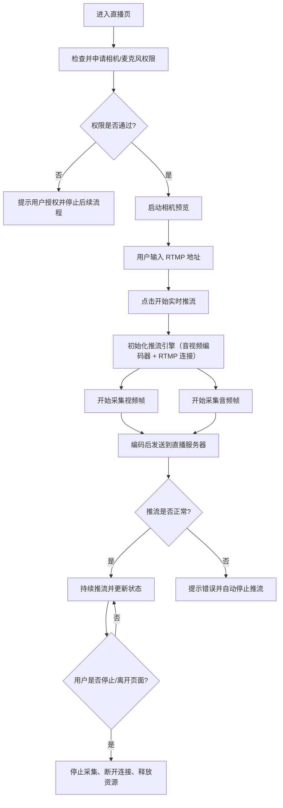
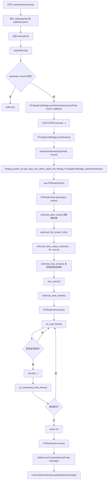
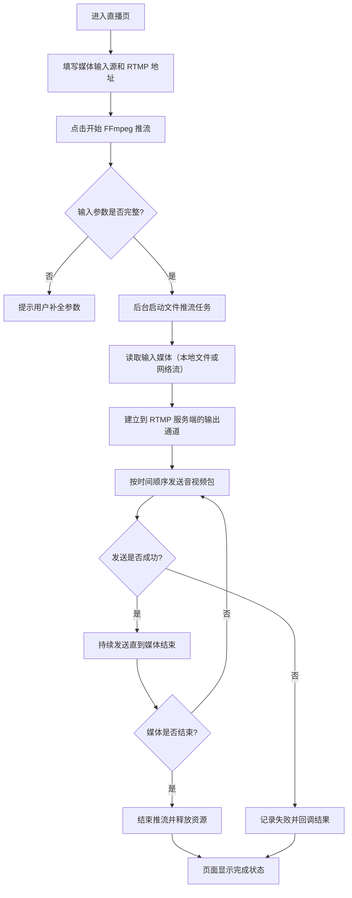
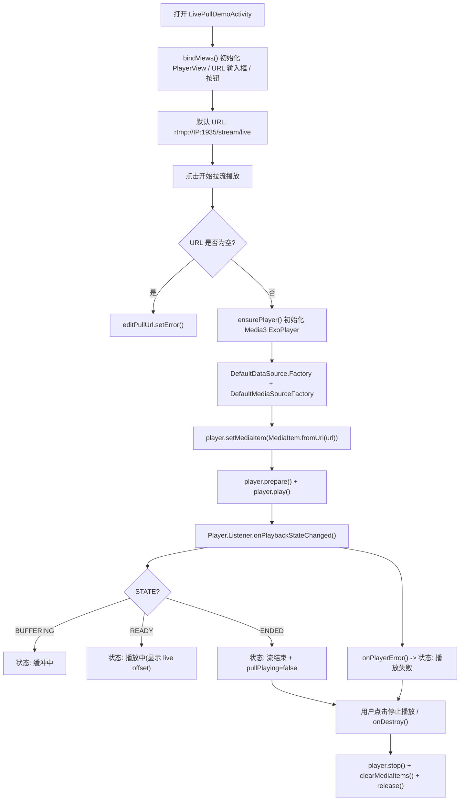
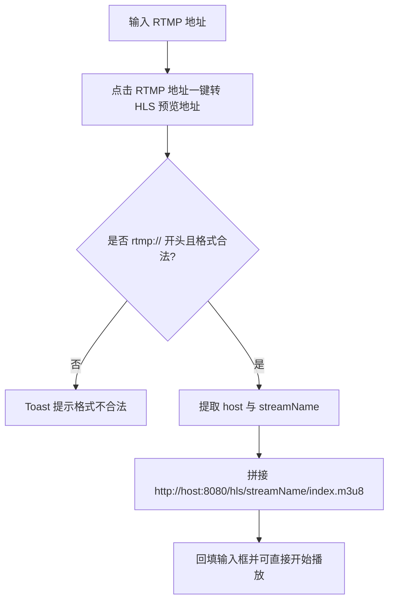

# Live功能活动图

## 1. 实时推流活动图

```mermaid
flowchart TD
    A["打开 LivePushDemoActivity"] --> B["onCreate()"]
    B --> C["bindViews() 初始化输入框/按钮"]
    C --> D["initListeners() 绑定按钮事件"]
    D --> E["ensurePermissions() 检查 CAMERA / RECORD_AUDIO"]
    D --> D1["initOrientationListener()"]

    E -->|已授权| F["initCameraPreview()"]
    E -->|未授权| E1["permissionLauncher.launch(...)"]
    E1 --> E2["onPermissionResult()"]
    E2 -->|授权成功| F
    E2 -->|授权失败| E3["updateStatus() + Toast"]

    F --> G["camera2Helper = new Camera2Helper.Builder()...build()"]
    G --> H["Camera2Helper.start()"]
    H --> I["Camera2Helper.openCamera()"]
    I --> J["Camera2Helper.createCameraPreviewSession()"]
    J --> K["onCameraOpened(Size previewSize, int displayOrientation)"]
    K --> L["LivePushDemoActivity.previewSize / previewDegree 赋值"]
    L --> M["updateButtons() 允许开始推流"]

    M --> N["点击 btnTogglePush"]
    N --> O["startLivePush()"]
    O --> P{"previewSize != null 且 liveUrl 非空?"}
    P -->|否| P1["updateStatus() 或 editLiveUrl.setError()"]
    P -->|是| Q["new LivePushConfig(...)"]
    Q --> R["new LivePusherBridge(config, this)"]

    R --> R1["LivePusherBridge.<init>()"]
    R1 --> R2["native_init()"]
    R2 --> R3["native_setVideoCodecInfo(...)"]
    R3 --> R4["native_setAudioCodecInfo(...)"]

    R4 --> S["livePusherBridge.startPush(liveUrl)"]
    S --> S1["LivePusherBridge.startPush()"]
    S1 --> S2["native_start(path)"]
    S2 --> S3["RtmpPusher.cpp::native_start"]
    S3 --> S4["start(void* args) 连接 RTMP"]
    S4 --> S5["RTMP_Connect()"]
    S5 --> S6["RTMP_ConnectStream()"]
    S6 --> S7["isPushing = true + packets.setRunning(true)"]
    S7 --> S8["callback(audioStream->getAudioTag()) 先发 AAC 头"]

    S --> T["audioCaptureTask = new AudioCaptureTask(livePusherBridge)"]
    T --> U["AudioCaptureTask.start()"]
    U --> V["AudioCaptureTask.run()"]
    V --> V1["audioRecord.startRecording()"]
    V1 --> V2["audioRecord.read(...)"]
    V2 --> V3["bridge.pushAudioFrame(...)"]
    V3 --> V4["LivePusherBridge.pushAudioFrame()"]
    V4 --> V5["native_pushAudio(data)"]
    V5 --> V6["RtmpPusher.cpp::native_pushAudio"]
    V6 --> V7["AudioStream::encodeData()"]
    V7 --> V8["callback(packet)"]
    V8 --> V9["packets.push(packet)"]

    J --> W["Camera2Helper.OnImageAvailableListenerImpl.onImageAvailable()"]
    W --> W1["YuvUtil.YUV420pRotate90/180() 按 rotateDegree 旋转"]
    W1 --> W2["camera2Listener.onPreviewFrame(dstData/yuvData)"]
    W2 --> X["LivePushDemoActivity.onPreviewFrame(byte[] yuvData)"]
    X --> X1["livePusherBridge.pushVideoFrame(yuvData, LiveFrameFormat.I420)"]
    X1 --> X2["LivePusherBridge.pushVideoFrame()"]
    X2 --> X3["native_pushVideo(data, frameFormat)"]
    X3 --> X4["RtmpPusher.cpp::native_pushVideo"]
    X4 --> X5["VideoStream::encodeVideo()"]
    X5 --> X6["sendSpsPps() / sendFrame()"]
    X6 --> X7["callback(packet)"]
    X7 --> X8["packets.push(packet)"]

    D1 --> ORI["OrientationEventListener.onOrientationChanged()"]
    ORI --> ORI1["camera2Helper.updatePreviewDegree(newPreviewDegree)"]
    ORI1 --> ORI2{"正在推流且 previewSize != null?"}
    ORI2 -->|是| ORI3["livePusherBridge.updateVideoCodecInfo(width, height)"]
    ORI2 -->|否| ORI4["仅更新 previewDegree 字段"]

    V9 --> Y["start(void* args) 发送线程循环"]
    X8 --> Y
    Y --> Y1["packets.pop(packet)"]
    Y1 --> Y2["RTMP_SendPacket(rtmp, packet, 1)"]
    Y2 --> Y3{发送成功?}
    Y3 -->|是| Y1
    Y3 -->|否| Z["throwErrToJava(ERROR_RTMP_SEND_PACKET)"]
    Z --> Z1["LivePusherBridge.errorFromNative(int errCode)"]
    Z1 --> Z2["listener.onError(errCode, message)"]
    Z2 --> Z3["LivePushDemoActivity.onError()"]
    Z3 --> Z4["stopLivePush()"]

    N -->|再次点击| AA["stopLivePush()"]
    AA --> AB["AudioCaptureTask.stop()"]
    AB --> AC["livePusherBridge.stopPush()"]
    AC --> AD["native_stop()"]
    AD --> AE["RtmpPusher.cpp::native_stop -> isPushing = false"]
    AE --> AF["livePusherBridge.release()"]
    AF --> AG["native_release()"]
```

## 2. FFmpeg 文件推流活动图

## 3. 关键字段速览

- `LivePushDemoActivity.pushing`
  - 当前实时推流状态位，控制按钮、音频采集循环、视频帧是否继续送入 SDK。
- `LivePushDemoActivity.previewSize`
  - 由 `onCameraOpened()` 回填，是 `startLivePush()` 生成 `LivePushConfig` 的基础。
- `LivePushDemoActivity.previewDegree`
  - 由 `Camera2` 打开时传回，用于决定宽高是否交换。
- `LivePusherBridge.started`
  - SDK 内部是否已启动 native 推流。
- `LivePusherBridge.mute`
  - 控制 `pushAudioFrame()` 是否跳过 PCM 上送。
- `RtmpPusher.cpp::isPushing`
  - native RTMP 线程是否继续发送队列包。
- `RtmpPusher.cpp::packets`
  - 音视频编码后的 `RTMPPacket` 队列。

## 4. Live 拉流播放活动图

