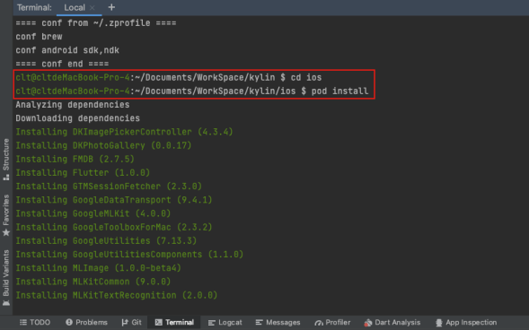
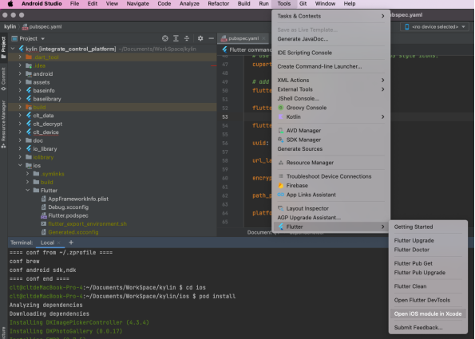
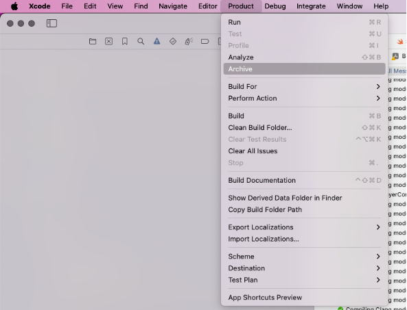
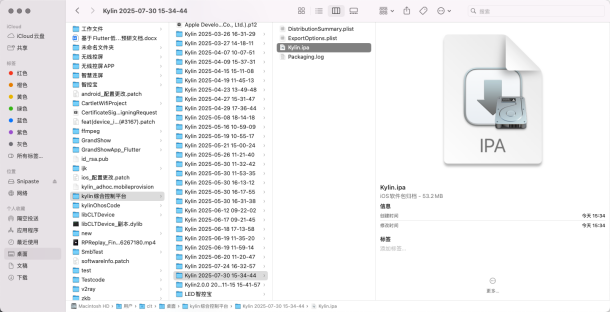

**flutter兼容鸿蒙**
====

Flutter兼容鸿蒙需要不同的SDK插件所以需要开启新的分支：
Android、IOS：-> dev / main
HarmonyOS -> dev_ohos / main_ohos

## 开发工具安装

DecEco Studio 安装

## flutter版本

鸿蒙需要自己的Flutter兼容版本

### FVM

fvm是flutter的版本管理工具，windows上需要使用`Chocolatey`安装

#### Windows安装Choco
[Windows安装Chocolatey](https://blog.csdn.net/duke_ding2/article/details/147687690)
需要使用管理员权限打开PowerShell安装


## 打包

`pubspec.yaml`管理版本
配置`setting`中的`flutter`和`dart`

### Android 打包

Android打包方法


### IOS打包

执行 Flutter Clean，清除旧的构建缓存文件

执行 Flutter Pub Get，重新获取依赖
注意需要用非鸿蒙的SDK进行打包，参考命令：
```shell
# mac上选择flutter 3.7.12进行打包
source ~/.zshrc;source ~/.bash_profile; /Users/clt/Documents/flutter-3.7.3/bin/flutter clean
# 执行 Flutter Pub Get，重新获取依赖
source ~/.zshrc;source ~/.bash_profile; /Users/clt/Documents/flutter-3.7.3/bin/flutter pub get
```


在命令行中，在/ios路径下执行 pod install
苹果构建需要同步依赖，命令参考：
```shell
cd ios
pod install
```


执行 Open iOS module in Xcode，在 Xcode 中打开

编译也需要在XCode进行编译

执行 Archive，开始打包


打包完成后，选取刚刚打的包，点击 Distribute App按钮导出安装包


根据不同的需求场景，选择不同的打包方式


（之后为打测试包流程）按照弹窗顺序一直点Export即可，无需额外操作


在访达中访问上一步指定的路径，找到刚刚导出的 kylin.ipa 文件，即苹果测试包


### 鸿蒙打包
flutter本身不支持鸿蒙打包，所以需要进行鸿蒙Flutter换源


目前`flutter 3.7.12-ohos-1.0.4`暂时不支持windows上运行，需要使用mac

下拉鸿蒙源git[鸿蒙flutter源](https://gitee.com/openharmony-sig/flutter_flutter/)

idea打开鸿蒙源，checkout到1.0.4，拉取最新代码。
将此鸿蒙源配置到mac环境变量。

mac的环境变量是通过vim配置到bash.profile或者zshrc.profile中
打开终端输入：
```shell
vim .zshrc
```
打开zshrc之后按`i`进行输入，`esc`退出; 按`:`进行命令输入，输入`:wq`保存并退出，输入`:q!`退出

需要配置的内容：
```shell
 # JDK
 export JAVA_HOME=<JAVA_HOME path>/Contents/Home
 export PATH=$JAVA_HOME/bin:$PATH
 
 # 鸿蒙
 export TOOL_HOME=/Applications/DevEco-Studio.app/Contents # mac环境
 export DEVECO_SDK_HOME=$TOOL_HOME/sdk # command-line-tools/sdk
 export PATH=$TOOL_HOME/tools/ohpm/bin:$PATH # command-line-tools/ohpm/bin
 export PATH=$TOOL_HOME/tools/hvigor/bin:$PATH # command-line-tools/hvigor/bin
 export PATH=$TOOL_HOME/tools/node/bin:$PATH # command-line-tools/tool/node/bin
 export HOS_SDK_HOME=$DEVECO_SDK_HOME
 # flutter源和缓存
 export PUB_CACHE=D:/PUB
 export PATH=<flutter_flutter path>/bin:$PATH # export PATH=/Users/clt/Library/flutter_flutter/bin:$PAT
 export PUB_HOSTED_URL=https://pub.flutter-io.cn
 export FLUTTER_STORAGE_BASE_URL=https://storage.flutter-io.cn
```

配置完成之后保存。然后再在Android Studio的Setting中设置为鸿蒙flutter

配置完成之后使用flutter命令检查，清除，更新：
```shell
flutter doctor
flutter --version
flutter clean
flutter pub get
```

然后编译会出现没有鸿蒙签名的报错。现在需要打开DevEco Studio，先连接鸿蒙真机然后在File->Project Structure->Signing Configs中点击`把支持鸿蒙`和`自动生成签名`勾选上。
然后跳转浏览器登录鸿蒙账号。
签名完成之后在Android Studio中进行运行或者编译打包。
1. 运行直接点击run
2. 编译打包安装：需要进入到项目pubspec.yaml所在的目录
```shell
# build打包 需要进入到项目pubspec.yaml所在的目录
source ~/.zshrc;source ~/.bash_profile; echo $PATH; flutter build hap

# 编译成功之后安装
hdc install <outputs_path>/app-release.hap
```

最后会得到：akp，hap，ipa三个文件
