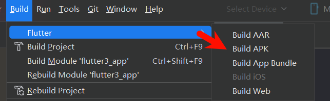
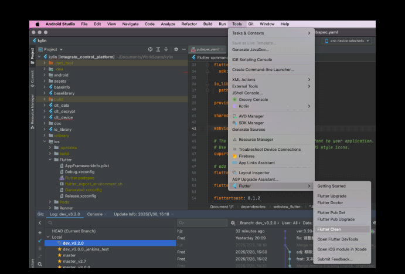
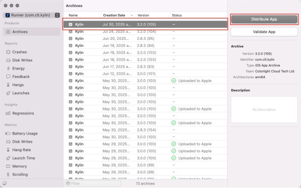
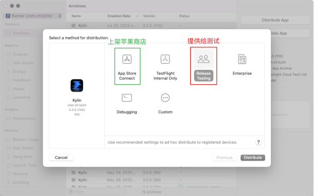
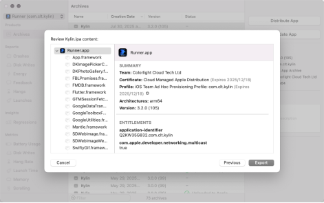
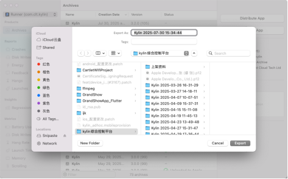

**flutter兼容鸿蒙**
====

Flutter兼容鸿蒙需要不同的SDK插件所以需要开启新的分支：
Android、IOS：-> dev / main
HarmonyOS -> dev_ohos / main_ohos

## 开发工具安装

DecEco Studio 安装

## flutter版本

鸿蒙需要自己的Flutter兼容版本

### FVM

fvm是flutter的版本管理工具，windows上需要使用`Chocolatey`安装

#### Windows安装Choco
[Windows安装Chocolatey](https://blog.csdn.net/duke_ding2/article/details/147687690)
需要使用管理员权限打开PowerShell安装

## 打包

`pubspec.yaml`管理版本
配置`setting`中的`flutter`和`dart`

### Android 打包

Android打包方法

### IOS打包

执行 Flutter Clean，清除旧的构建缓存文件

执行 Flutter Pub Get，重新获取依赖

在命令行中，在/ios路径下执行 pod install

执行 Open iOS module in Xcode，在 Xcode 中打开

执行 Archive，开始打包

打包完成后，选取刚刚打的包，点击 Distribute App按钮导出安装包

根据不同的需求场景，选择不同的打包方式

（之后为打测试包流程）按照弹窗顺序一直点Export即可，无需额外操作

在访达中访问上一步指定的路径，找到刚刚导出的 kylin.ipa 文件，即苹果测试包

### 鸿蒙打包
flutter本身不支持鸿蒙打包，所以需要进行鸿蒙Flutter换源

[鸿蒙flutter源](https://gitee.com/openharmony-sig/flutter_flutter/)

