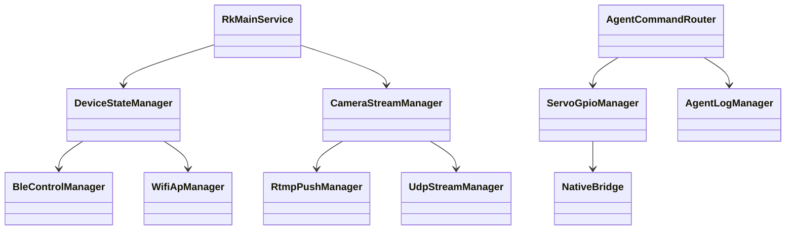
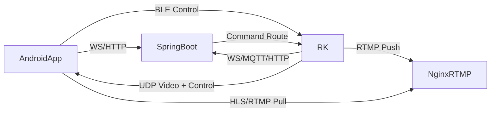
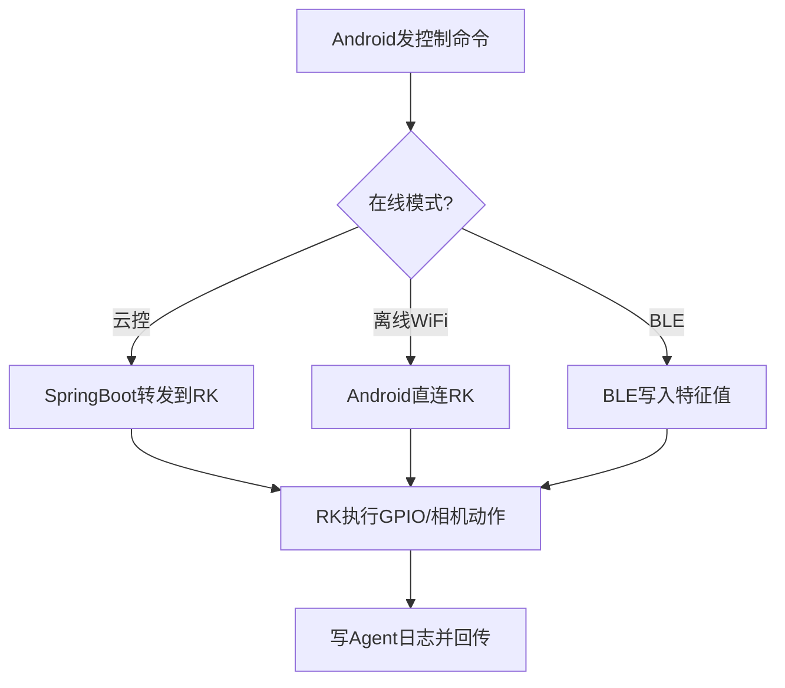
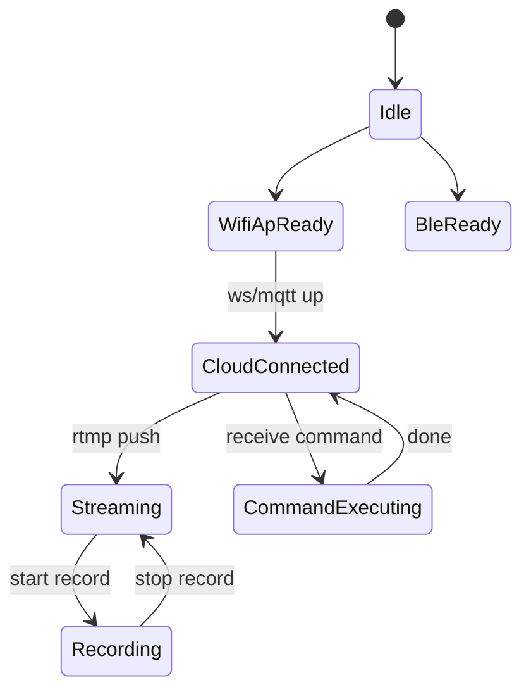
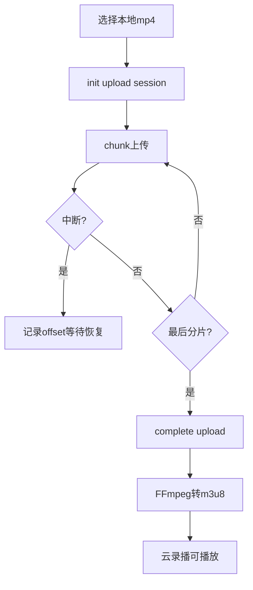
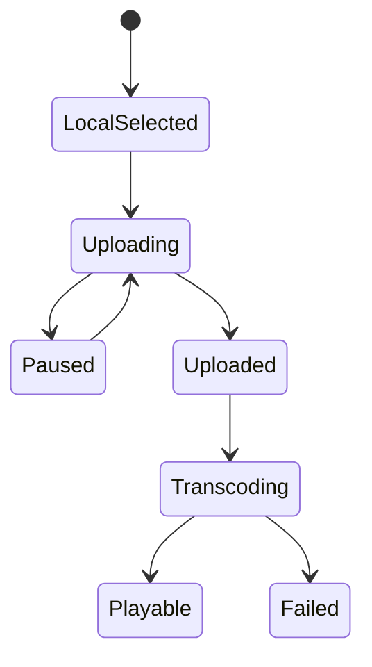

**RKDesignDocument**
====

## 文档目标

本文件用于描述 RK 设备端（系统级 Android App + JNI/CPP + GPIO + Camera + 网络通信）的可行方案与架构设计。

## 芯片选型结论

### 结论
* **推荐主选：RK3588（或RK3588S）**
* **备选：RK3566（成本敏感型）**

### 选择理由（结合本项目）
* 你需要：Android系统App + YOLOv8 + Silero(VAD/TFLite) + 摄像头编码传输 + JNI控制GPIO舵机。
* RK3588 在 CPU/NPU、编解码吞吐、多路并发能力上明显更宽裕，后续迭代风险更低。
* RK3566 也能跑基础能力，但在多任务并发（视频+AI+网络+舵机）上更容易遇到性能瓶颈。

### 风险与建议
* 若预算优先且功能先 MVP，可先用 RK3566 打样；
* 若目标是中期稳定上线与可扩展，建议直接 RK3588。

### 参考链接
* [RK3588 vs RK3566 对比（第三方汇总）](https://rockchips.net/rk3566-vs-rk3588-key-differences-performance/)
* [RK3588 NPU实测分析（第三方）](https://tinycomputers.io/posts/rockchip-rk3588-npu-benchmarks.html)

## RK端目标能力

* 运行系统级 Android App（开机自启）
* JNI 调用 C/C++ 控制 GPIO（SG90 舵机）
* 摄像头采集并推流（RTMP）或局域网 UDP 帧输出
* 与 SpringBoot 通信（WS/MQTT/HTTP）
* 与 Android 手机 App 通信（WiFi AP + BLE）
* 接收 Agent 指令并回传日志

## 总体架构分层

* **设备应用层（Android App）**：UI状态、连接管理、控制命令路由
* **设备能力层（Manager）**：CameraManager、RtmpPushManager、UdpStreamManager、BleControlManager、WifiApManager、ServoGpioManager
* **JNI/Native层**：GPIO/编码/OpenCV/FFmpeg 加速能力
* **通信层**：WS/MQTT/HTTP + BLE + UDP/RTMP

### 大概类图

### 大概通信图

## Control 可行方案

### 1) 设备状态操作监控
* RK与App连接状态：
  * WiFi：RK 开 AP，Android STA 连接；心跳包（2~5s）确认在线态
  * BLE：GATT 服务提供连接/写特征值/通知；状态值写入设备状态表
* RK与SpringBoot连接状态：
  * 主链路 WS 长连接（实时控制）
  * 辅链路 MQTT（离线缓冲/重连补偿，可选）
  * HTTP 用于配置查询与状态上报

### 2) 云操控平台（Live）
* 推流：RK 摄像头 -> JNI/FFmpeg/硬编 -> RTMP -> Nginx
* 拉流：Android 使用 ExoPlayer（HLS）或 RTMP 播放 SDK
* 录制：Android 或 RK 对接收流进行封装 MP4（非系统录屏）
* 另一台设备 Camera 信道：统一接入 Nginx channel（`rtmp://.../live/{deviceId}`）

### 3) 离线蓝牙/WiFi操控
* BLE：低带宽控制命令（摇杆、动作、模式切换）
* WiFi：
  * 指令：局域网 UDP/TCP
  * 视频：RK UDP 分片发送（H264 NAL/JPEG分片），Android 重组后 SurfaceView 渲染
* GPIO 方案：命令 -> JNI -> sysfs/libgpiod -> PWM 控制 SG90 角度

### Control 活动图（大概）

### Control 状态机图（大概）

### Control 甘特图（大概）

```mermaid
gantt
    title RK Control 功能线程甘特图
    dateFormat  X
    axisFormat %L ms
    section Main线程
    状态机切换/调度                    :m1, 0, 80
    section 网络线程
    WS/MQTT保活与收发                   :n1, 5, 300
    section 视频线程
    Camera采集+编码+发送                :v1, 20, 400
    section JNI线程
    GPIO/PWM舵机控制                    :j1, 40, 120
```

## Mine 可行方案（视频）

### 云上录播记录播放
* SpringBoot 从 MinIO 获取对象后执行转码任务：
  * MP4 -> m3u8(ts/fmp4)（FFmpeg）
  * 保存索引到 `video_record`
* Android 拉取播放 URL，ExoPlayer 播放 m3u8。
* 可选下载：提供签名 URL 下载 MP4。

### 本地视频播放
* MVP：VideoView 直接播放本地 MP4
* 统一栈：ExoPlayer 同时支持本地与云端播放

### 本地视频上传云端（断点续传）
* 协议：`uploadId + chunkIndex + offset`
* 流程：init -> chunk -> complete
* 服务端将分片写 MinIO，完成后 compose/merge 并异步转 HLS
* 失败恢复：客户端读取上次 offset 继续上传

### Mine 活动图（大概）

### Mine 状态机图（大概）

### Mine 甘特图（大概）

```mermaid
gantt
    title RK/Mine视频链路甘特图
    dateFormat  X
    axisFormat %L ms
    section 客户端
    分片读取与上传                     :c1, 0, 240
    section 服务端
    分片合并/对象写入                  :s1, 50, 220
    FFmpeg转码m3u8                     :s2, 220, 420
```

## 关键技术清单

* 音视频：FFmpeg、MediaCodec、OpenGL、OpenCV（按场景选）
* 推拉流：RTMP(H264/AAC)、HLS(m3u8)
* 离线传输：UDP 分片 + CRC + 重传策略
* 通信：WS、MQTT、HTTP、BLE
* 硬件控制：JNI + GPIO/PWM（SG90）

## 资料链接

* [FFmpeg 文档](https://ffmpeg.org/ffmpeg.html)
* [Android Media3 HLS](https://developer.android.com/media/media3/exoplayer/hls)
* [MinIO Java SDK](https://minio-java.min.io/io/minio/package-summary.html)
* [tus 协议](https://tus.io/)
* [tus Java Server](https://github.com/tomdesair/tus-java-server)

