# cursorDevelopLog

## 2026-03-07 用户认证接口（登录/注册/token校验）

### 本次开发内容
- 新增 `UserController`：
  - `POST /user/register`
  - `POST /user/login`
  - `GET /user/token/verify`（请求头：`access_token`）
- 新增 `AuthTokenService` + `AuthTokenServiceImpl`：内存版 access_token 签发与校验。
- 新增认证响应模型 `UserAuthResponse`，统一返回 `userId/account/name/avatarUrl/accessToken`。
- 扩展 `UserService`：新增 `getUserById`、`getUserByAccount`。
- 修复 `UserServiceImpl#createUser` 在有头像分支下重复 `insert` 的问题。
- 注册接口中增加 TODO：minio 未稳定前，头像参数先接收不处理，避免影响主流程。

### 类图（Class Diagram）
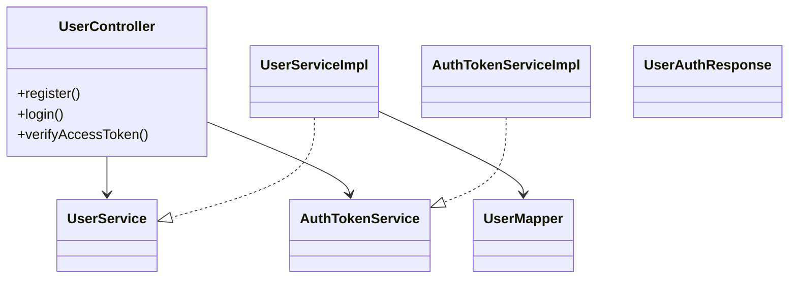

### 对象图（Object Diagram）
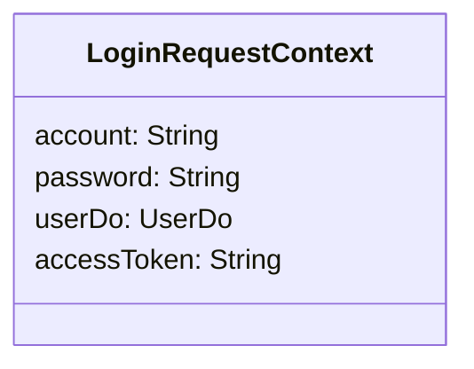

### 活动图（Activity Diagram）
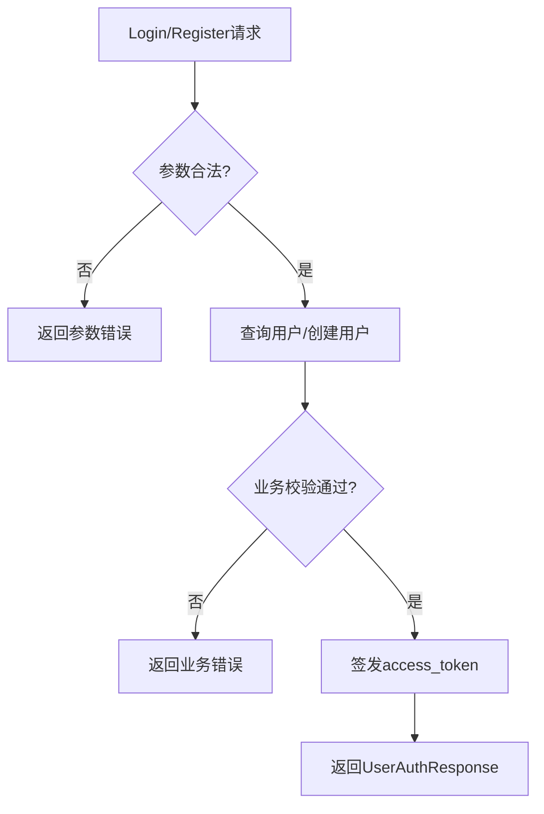

### 状态机图（State Machine）
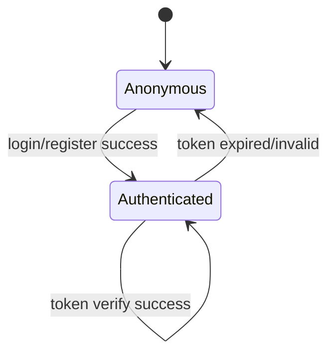

### 时序图（Sequence Diagram）
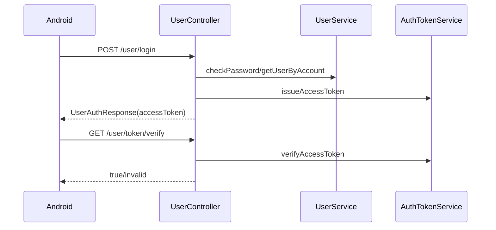

### 通讯图（Communication Diagram）
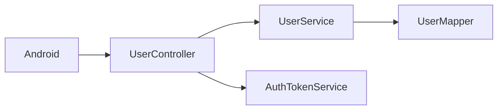

### TODO
- minio 网关/反向代理未就绪阶段，`register` 头像参数暂不入库上传；后续可恢复 `MultipartFile avatar` 上传链路并返回真实可访问 URL。
- `AuthTokenService` 当前为内存实现，后续建议迁移 Redis，避免服务重启 token 全失效。

## 2026-03-08 规则对齐与分层修复（DTO/Service/接口体）

### 本次调整
- `POST /user/login` 改为 `@RequestBody UserLoginRequest`。
- `POST /user/token/verify` 改为 `@RequestBody UserTokenVerifyRequest`，响应改为 `UserTokenVerifyResponse`（可扩展结构）。
- `AuthTokenService#issueAccessToken` 入参从 `UserDo` 改为 `userId`，避免 Do 穿透业务层。
- `UserService` 不再向 Controller 暴露 `UserDo`，改为返回 `UserModule`（业务实体）。
- 新增 `UserModule`，由 Service 内部将 Mapper 返回的 `UserDo` 转换后再对外返回。

### 数据库改动说明（MySQL）
- 本次无数据库表结构修改，因此 `springboot/db/magic_vector.sql` 无变更。
- 记录原因：本次改动集中在接口契约和分层边界，不涉及表字段变更。

### 数据库图（ER）
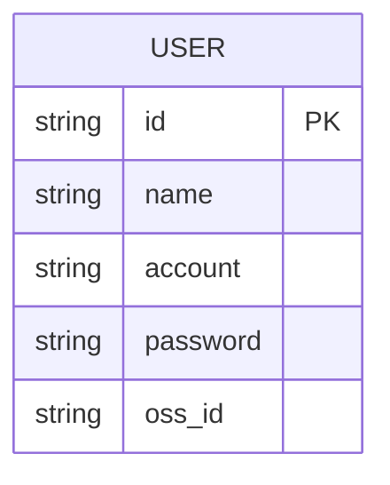

### 线程状态图（Thread State）
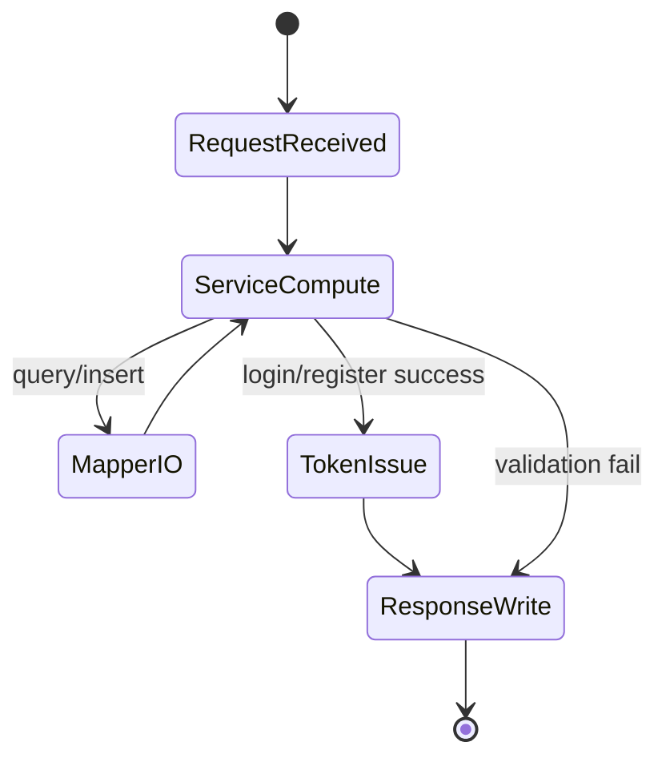

### 设计模式记录
- **分层模式（Layered Architecture）**：Controller/Service/Mapper 分工明确，防止持久化对象泄漏到接口层。
- **门面式返回（DTO Facade）**：通过 request/response DTO 封装协议，保证接口可扩展性。

### 理论知识标注
- **数据库**：Entity（Do）与 Module 分离，避免数据库结构耦合业务接口。
- **计算机网络**：统一请求体/响应体契约，减少协议演进成本。
- **操作系统（线程/IO）**：请求处理是计算 + IO 组合流程，Mapper 查询属于典型 IO 边界。

## 2026-03-08 继续调整（主键Long + Token强绑定）

### 本次调整
- `user.id` 从 `varchar` 调整为 `BIGINT`，并同步 `UserDo/Mapper/Service/Module/DTO` 的 `userId` 类型为 `Long`。
- `UserTokenVerifyRequest` 增加 `userId` 字段，`verifyAccessToken` 改为 `userId + accessToken` 联合校验。
- `AuthTokenService` 校验逻辑增强：token 映射会话中的 userId 必须与请求 userId 一致。

### AccessToken内部原理 - 通讯图（Communication Diagram）
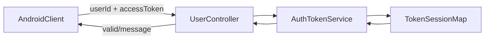

### AccessToken内部原理 - 活动图（Activity Diagram）
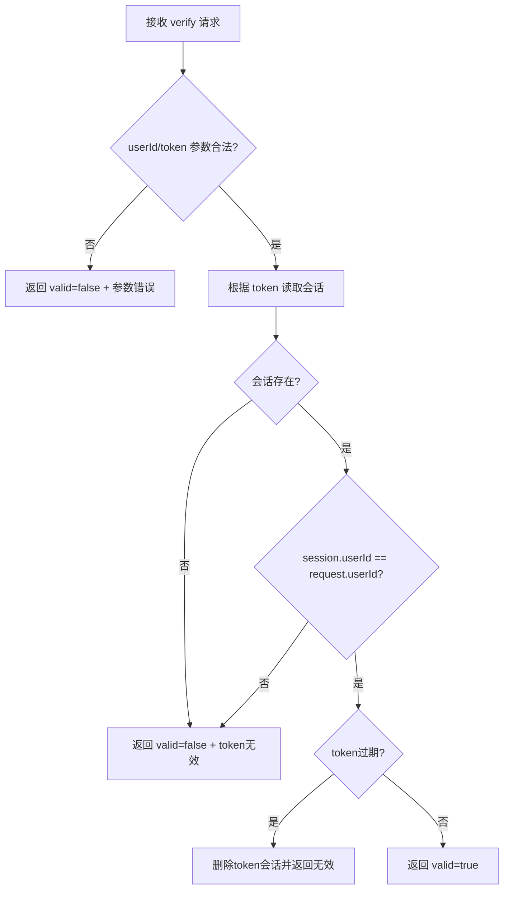

### 多线程甘特图（Gantt）
```mermaid
gantt
    title SpringBoot 鉴权请求线程甘特图
    dateFormat  X
    axisFormat %L ms
    section HTTP-NIO线程
    接收请求/参数反序列化 :a1, 0, 10
    写回响应              :a2, 60, 10
    section 业务线程
    调用AuthTokenService校验 :b1, 10, 20
    会话匹配与过期检查       :b2, 30, 20
    section 锁与状态
    ConcurrentHashMap无阻塞读 :c1, 10, 40
```

### 数据库改动记录
- 已同步修改 `springboot/db/magic_vector.sql`：`user.id` 类型改为 `BIGINT`。
- 设计原因（数据库理论）：`BIGINT` 主键在 B+Tree 索引中比较开销更低、索引体积更小、排序与范围查询更高效。

## 2026-03-12 Mine/Control 扩展（视频与日志）

### 本次开发内容
- 新增控制台日志查询与落库：
  - `GET /control/log/list`
  - 新增 `agent_log` 表与 Mapper/Service
- 新增视频模块接口骨架：
  - `POST /video/upload/init`
  - `POST /video/upload/chunk`
  - `POST /video/upload/complete`
  - `GET /video/cloud/list`
  - `GET /video/cloud/play-url`
  - `GET /video/cloud/download-url`
- 新增 `video_record` 表与 Mapper/Service。
- 新增 `POST /user/password/update`（Setting 修改密码）。

### 数据库改动说明（MySQL）
- 已同步修改 `springboot/db/magic_vector.sql`，新增：
  - `agent_log(id,user_id,agent_id,log_time,log_content)`
  - `video_record(id,user_id,object_name,hls_object_name,status,created_at,updated_at)`