**SpringBootDesignDocument**
====

## 文档目标

本文件用于描述 SpringBoot 服务端的模块化架构设计，不使用时间线日志体例。

## 整体架构分层

* **Controller 层**：接收请求、参数校验、响应封装。
* **Service 层**：业务流程编排、鉴权判断、转换调用。
* **Mapper 层**：`UserMapper` 访问 MySQL，执行增删改查。
* **Domain 层**：`dto/entity(module)` 数据模型与错误定义。
* **控制台链路（本次）**：`ControlController` + `ControlConsoleService` + `ControlSessionManager`，承接 App/RK 控制命令与状态同步。

鉴权不引入 SpringCloudGateway；当前项目在应用内使用拦截器实现路由鉴权。

## 用户认证模块（登录 / 注册）

### 功能职责
* 提供登录与注册接口，返回统一 `UserAuthResponse`。
* 注册成功后可直接形成可用登录态响应。
* Service 层处理业务规则，Controller 层不感知 DB 对象。

### 静态图
#### 类图


### 动态图
#### 通讯图
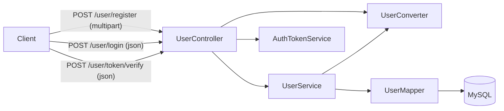

#### 认证活动图
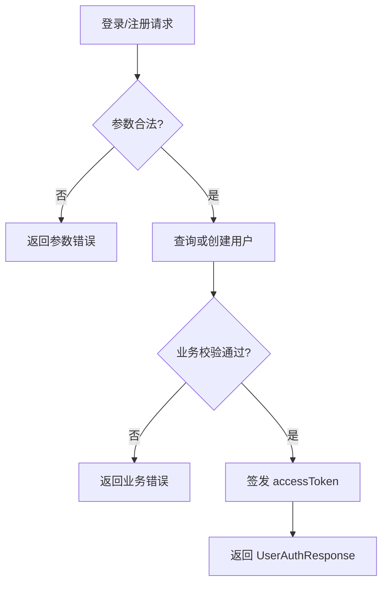

#### 登录时序图
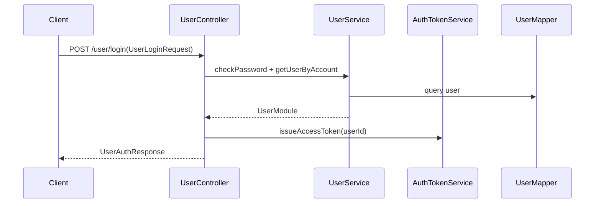

#### 线程甘特图
```mermaid
gantt
    title SpringBoot 登录/注册线程甘特图
    dateFormat  X
    axisFormat %L ms
    section HTTP-NIO线程
    接收请求与参数绑定          :a1, 0, 8
    写回响应                    :a2, 55, 10
    section 业务线程
    用户校验与查询              :b1, 8, 20
    token签发                   :b2, 28, 12
    section 数据访问
    UserMapper 查询/写入        :c1, 15, 20
```

### 鉴权模块（拦截器 + 配置）

### 功能职责
* 在 `AuthTokenInterceptor` 中统一拦截需要鉴权的路由。
* 在 `AuthInterceptorConfig` 中可配置“需要鉴权路由”和“白名单路由”。
* token 校验采用内存 `Map<String, TokenSession>`，绑定 `userId + accessToken` 并处理过期清理。
* 新增 `DebugConfig`：通过配置控制是否输出调试日志。
* `/user/token/verify` 在 debug 开启时输出请求与校验结果日志（token 需脱敏）。
* 当前不引入 Redis；当前不使用 JWT 无状态方案（避免无法主动踢人）。

#### 路由拦截通信图
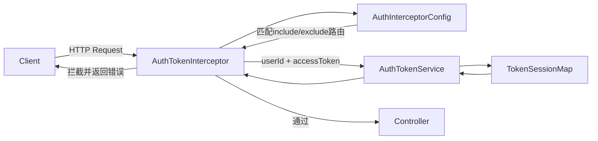

#### 拦截校验活动图
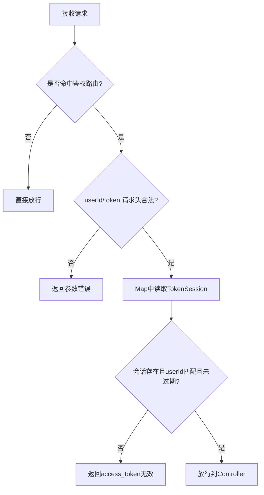

#### 路由配置示例
```yaml
openapi:
  debug:
    enabled: false
    token-verify-log-enabled: false
  auth:
    include-paths:
      - /agent/**
      - /chat/**
    exclude-paths:
      - /user/login
      - /user/register
      - /user/token/verify
    user-id-header: user_id
    access-token-header: access_token
```

#### 校验状态机图
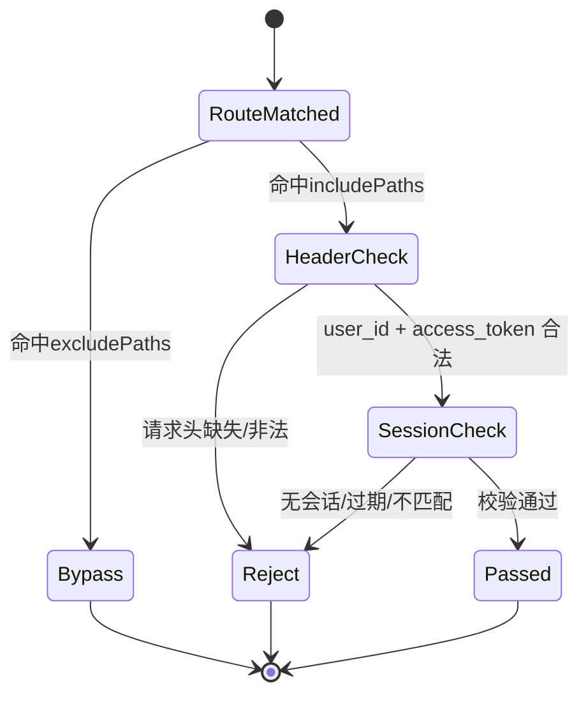

#### Token 校验活动图（接口级）
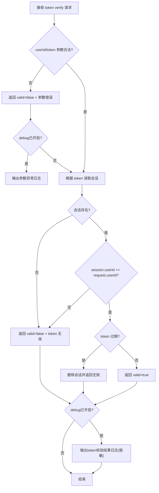

#### 鉴权甘特图
```mermaid
gantt
    title SpringBoot 鉴权请求线程甘特图
    dateFormat  X
    axisFormat %L ms
    section HTTP-NIO线程
    接收请求/参数反序列化 :a1, 0, 10
    写回响应              :a2, 60, 10
    section 业务线程
    调用AuthTokenService校验 :b1, 10, 20
    会话匹配与过期检查       :b2, 30, 20
    section 锁与状态
    ConcurrentHashMap无阻塞读 :c1, 10, 40
```

## Agent 管理与消息分页模块

### 功能职责
* Agent 能力补全为：创建、查看、修改、删除、列表查询。
* 聊天记录能力补全为：按时间锚点分页查询（向前/向后）、首屏最近消息查询。
* SpringBoot `Mapper` 与 Android `Dao` 在“查询语义”上保持一致，便于前后端统一回放逻辑。
* 文件头像上传继续走 Multipart；MinIO 未就绪时允许不传头像并保留 TODO。

### Agent 模块类图
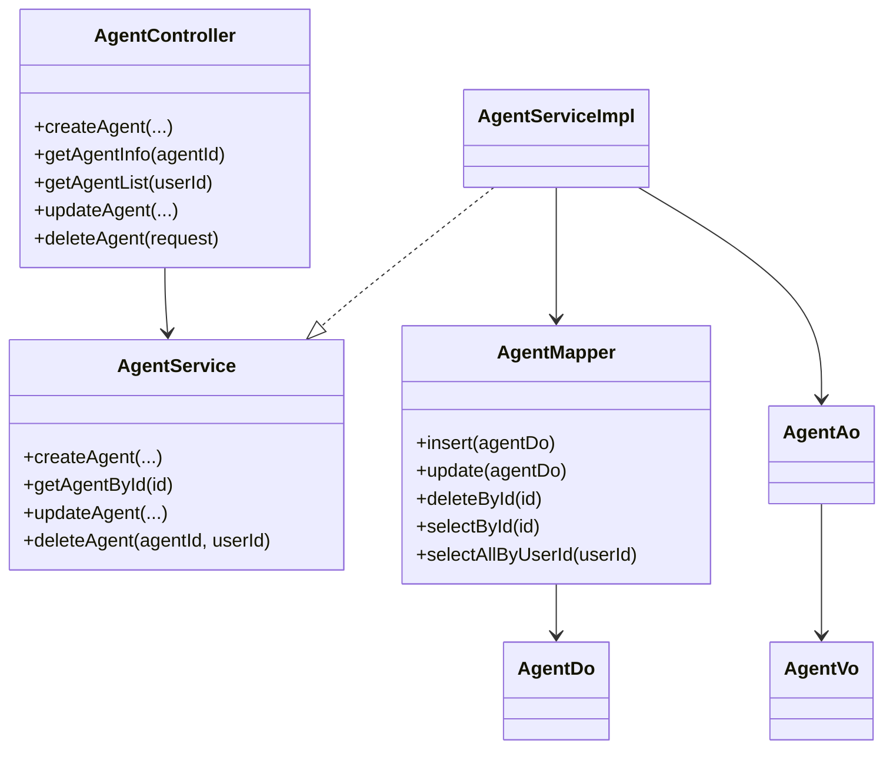

### Chat 分页活动图（锚点分页）
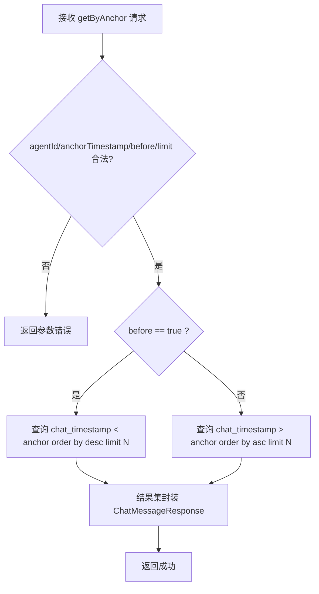

### Chat Mapper 与索引设计（数据库）
* 建议新增复合索引：`(agent_id, chat_timestamp, id)`，覆盖按 Agent + 时间锚点分页的核心查询。
* 保留已有 `(user_id, agent_id)` 索引用于用户维度过滤。
* `chat_timestamp` 作为排序主键，`id` 作为同秒内稳定 tie-breaker。

### Mapper/DAO 语义对齐说明
* SpringBoot `ChatMessageMapper.getByAnchor(...)` 与 Android `ChatMessageDao.queryByAnchor(...)` 保持同参数语义。
* 统一支持：
  * 向前分页（历史消息）：`before + desc`
  * 向后分页（新消息/补偿）：`after + asc`
* 该对齐可减少端侧二次排序和边界 bug 风险。

### 持久连接模块（用户级WS + Channel路由）

#### 功能职责
* WS 连接从“按 agentId 建连”重构为“按 userId 建连”：`CONNECT(userId)` 在登录后由客户端发起。
* `agentId` 改为聊天路由参数：通过 `BIND_CHANNEL(agentId)` 绑定当前聊天通道。
* 服务端维护 `userId + currentAgentId` 会话态，后续 `USER_TEXT_MESSAGE/AUDIO_CHUNK/...` 走当前 channel。
* 心跳改为框架级 WebSocket `Ping/Pong`：服务端定时发 `Ping`，超过 60 秒未收到 `Pong` 则断连并清理上下文。

#### UML静态图（类图）
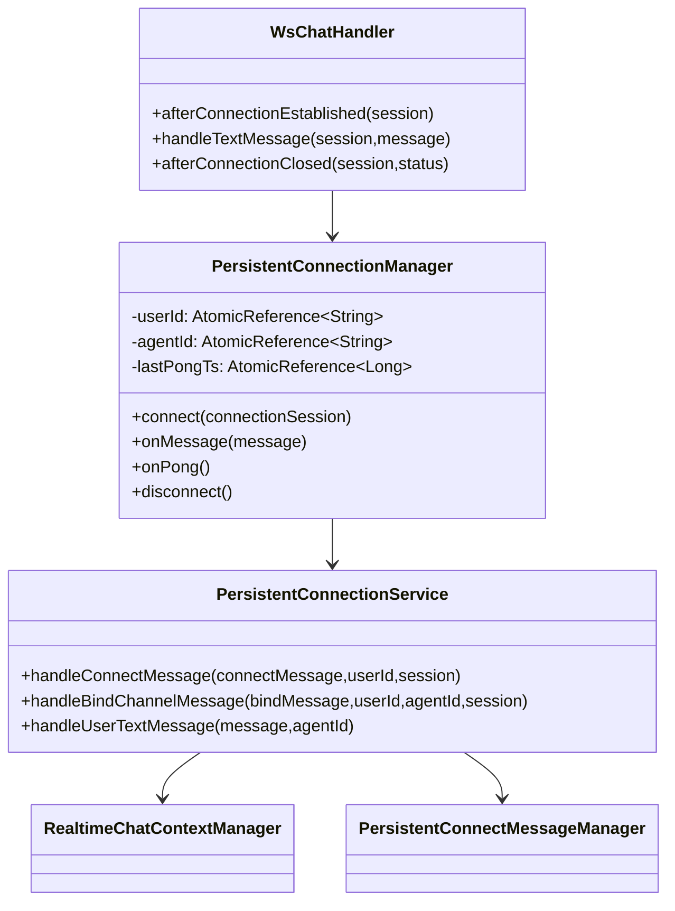

#### UML静态图（对象图）
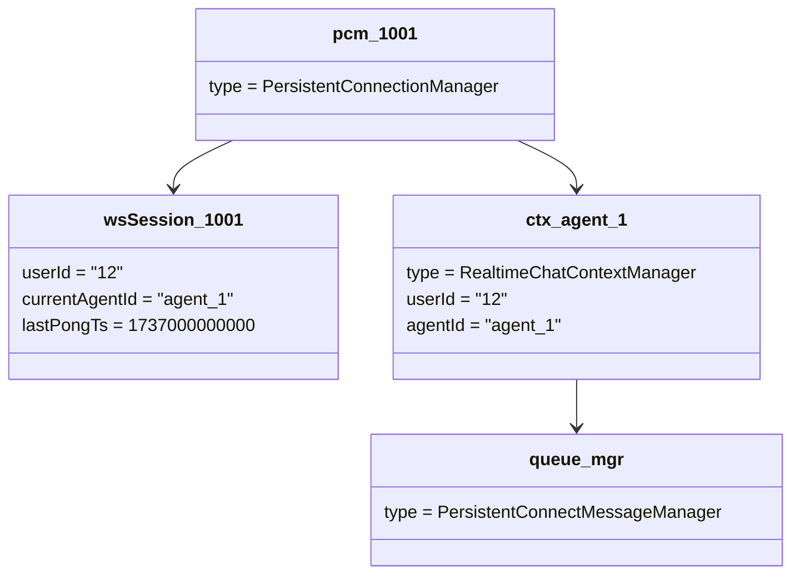

#### UML动态图（通信图）
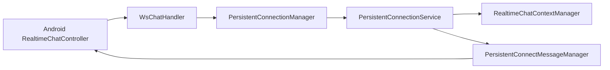

#### UML动态图（活动图）
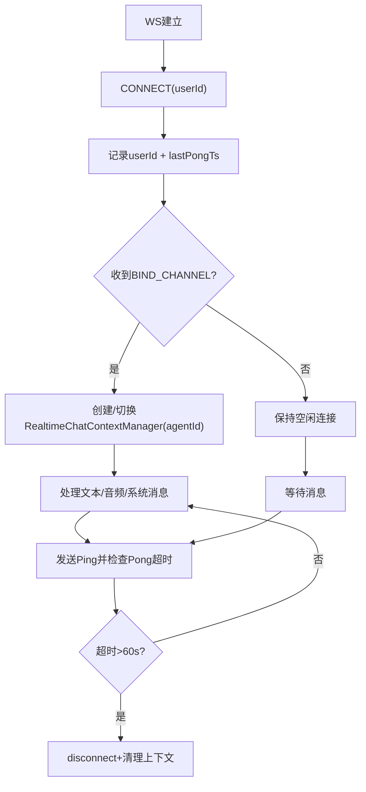

#### UML动态图（时序图）
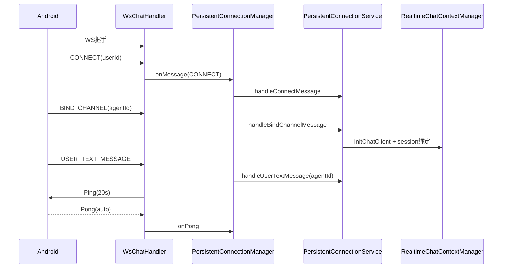

#### 功能线程甘特图
```mermaid
gantt
    title SpringBoot WS持久连接线程甘特图
    dateFormat  X
    axisFormat %L
    section WebSocket线程
    握手与CONNECT处理            :a1, 0, 10
    BIND_CHANNEL处理             :a2, 15, 10
    收发消息                     :a3, 25, 120
    section 业务线程池
    startTextChat/startAudioChat :b1, 30, 90
    section 心跳检测线程
    10s周期检测                   :c1, 10, 120
    超时断连与清理                :c2, 131, 8
```

#### 设计模式说明
* **门面模式**：`PersistentConnectionService` 汇聚 CONNECT/BIND/文本音频消息处理入口。
* **状态模式（轻量）**：连接状态由 `userId/currentAgentId/lastPongTs` 驱动路由与超时行为。
* **工厂式创建（按需）**：`handleBindChannelMessage` 按 channel 创建 `RealtimeChatContextManager`。
* **生产者-消费者模式**：`PersistentConnectMessageManager` 通过队列异步发送，解耦业务线程与网络发送。

#### WS 网络状态图
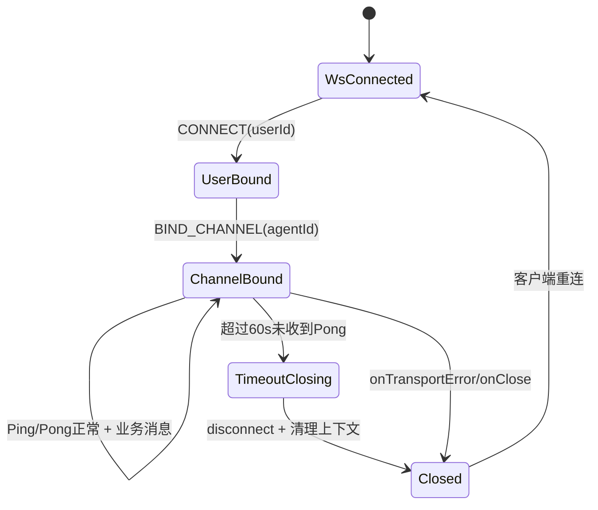

### RealtimeChatServiceImpl 模块（文本/音频/多模态编排）

#### 功能职责
* 负责实时会话核心编排：`initChatClient`、`startTextChat`、`startAudioChat`、`STT->LLM->TTS` 链路、消息落库与回推。
* 复用 `RealtimeChatContextManager` 管理单会话状态与任务生命周期（录音、LLM、TTS、错误重试计数）。
* 通过 `PersistentConnectMessageManager` 统一异步下发 `TEXT_CHAT_RESPONSE/START_TTS/STOP_TTS/AUDIO_CHUNK/SYSTEM_MESSAGE`。

#### UML静态图（类图）
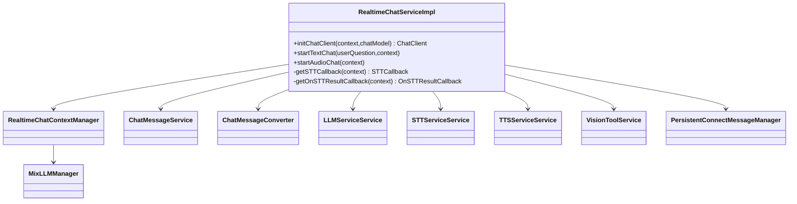

#### UML静态图（对象图）
```mermaid
classDiagram
    class rtService_1
    class ctx_agent1 {
      userId = "12"
      agentId = "agent_1"
      recording = true
      llmErrorCount = 0
    }
    class stt_cb_1
    class llm_svc_1
    class tts_svc_1
    class msg_queue_1 {
      pending = 8
    }
    rtService_1 --> ctx_agent1
    rtService_1 --> stt_cb_1
    rtService_1 --> llm_svc_1
    rtService_1 --> tts_svc_1
    rtService_1 --> msg_queue_1
```

#### UML动态图（状态图）
```mermaid
stateDiagram-v2
    [*] --> Idle
    Idle --> Initializing : initChatClient
    Initializing --> Ready : memory/prompt loaded
    Ready --> TextProcessing : USER_TEXT_MESSAGE
    Ready --> AudioRecording : START_AUDIO_RECORD
    AudioRecording --> STTProcessing : STOP_AUDIO_RECORD / stream complete
    STTProcessing --> LLMStreaming : 识别完成
    TextProcessing --> LLMStreaming : 文本入模
    LLMStreaming --> TTSStreaming : sentence chunk ready
    TTSStreaming --> Ready : STOP_TTS + endConversation
    AudioRecording --> Error : stt transport error
    LLMStreaming --> Error : llm proxy error
    TTSStreaming --> Error : tts error
    Error --> Ready : retry within limit
    Error --> [*] : over retry limit + reset
```

#### UML动态图（活动图）
```mermaid
flowchart TD
    A[收到USER_TEXT_MESSAGE或音频流] --> B{输入类型}
    B -- 文本 --> C[构建RealtimeChatTextResponse]
    B -- 音频 --> D[持续pollAudioBuffer写入STT流]
    D --> E[STT完成得到句子]
    C --> F[保存用户消息到MySQL]
    E --> F
    F --> G[回推TEXT_CHAT_RESPONSE给客户端]
    G --> H[LLMService mixLLMCallErrorProxy]
    H --> I[TTSService合成音频流]
    I --> J[回推AUDIO_CHUNK]
    J --> K[会话完成发送STOP_TTS]
```

#### UML动态图（时序图）
```mermaid
sequenceDiagram
    participant WS as RealtimeChatChannel
    participant Svc as RealtimeChatServiceImpl
    participant Ctx as RealtimeChatContextManager
    participant STT as STTServiceService
    participant LLM as LLMServiceService
    participant TTS as TTSServiceService
    participant DB as ChatMessageService
    participant MQ as PersistentConnectMessageManager

    WS->>Svc: startAudioChat(ctx)
    Svc->>Ctx: startRecord()
    Svc->>STT: sttStreamCallErrorProxy(audioStream, callback)
    STT-->>Svc: onRecognitionComplete(text)
    Svc->>DB: insertOne(user message)
    Svc->>MQ: submit TEXT_CHAT_RESPONSE
    Svc->>LLM: mixLLMCallErrorProxy(text,...)
    LLM-->>Svc: llmResult
    Svc->>TTS: start(llmResult,...)
    TTS-->>MQ: AUDIO_CHUNK / START_TTS / STOP_TTS
    Svc->>Ctx: endConversation()
```

#### UML动态图（通信图）
```mermaid
flowchart LR
    Channel[RealtimeChatChannel] --> Service[RealtimeChatServiceImpl]
    Service --> Context[RealtimeChatContextManager]
    Service --> STT[STTServiceService]
    Service --> LLM[LLMServiceService]
    Service --> TTS[TTSServiceService]
    Service --> Vision[VisionToolService]
    Service --> DB[(ChatMessageService/Mapper)]
    Service --> Msg[PersistentConnectMessageManager]
    Msg --> Channel
```

#### 功能线程甘特图
```mermaid
gantt
    title RealtimeChatServiceImpl 功能线程甘特图
    dateFormat  X
    axisFormat %L ms
    section WebSocket线程
    收包与任务提交                    :w1, 0, 20
    section 业务线程池
    startTextChat/startAudioChat编排   :b1, 20, 120
    section STT流线程
    音频帧消费与识别                   :s1, 25, 95
    section LLM/TTS线程
    LLM流式生成                        :l1, 55, 80
    TTS分段合成与发送                  :t1, 75, 85
    section 数据库线程
    ChatMessage写入                    :d1, 45, 30
    section 消息发送线程
    队列消费与session发送              :m1, 50, 100
```

#### 设计模式
* **门面模式**：`RealtimeChatServiceImpl` 对上层提供单一编排入口，屏蔽 STT/LLM/TTS 多子系统细节。
* **策略模式**：输入来源（文本/音频）走不同前处理策略，最终统一汇聚到 LLM/TTS 管线。
* **生产者-消费者模式**：`PersistentConnectMessageManager` 异步发送，解耦业务编排与网络回写。
* **模板化回调模式**：`StreamCallErrorCallback/STTCallback/TTSCallback` 抽象错误重试、任务登记、会话终止行为。
* **计算机网络/并发说明**：音频流轮询 + STT 流式消费是典型 IO 管线；若在主线程执行会导致 WebSocket 处理阻塞和背压扩散。

### Control 控制台模块（状态查询 + 指令下发 + WS桥接）

#### 功能职责
* 提供设备控制状态查询接口（`/control/status`）。
* 提供控制指令下发接口（`/control/command`）。
* 提供控制台 WS 通道（`/control/ws`），用于 App/RK 长连接状态同步与低时延命令桥接。
* 提供 Agent 指令日志在线查询（`/control/log/list`），并通过 WS 下发实时日志片段。
* RK 端 MQTT/Agent 落地逻辑本期保留 TODO（先完成三端协议与路由骨架）。

#### UML静态图（类图）
```mermaid
classDiagram
    class ControlController {
      +getControlStatus(deviceId)
      +sendControlCommand(request)
      +getControlAgentLogs(userId,agentId,page,size)
    }
    class ControlConsoleService
    class ControlConsoleServiceImpl
    class ControlSessionManager {
      +bindSession(deviceId,clientType,session)
      +buildStatus(deviceId)
      +forwardCommandToRk(deviceId,payload)
    }
    class ControlWsHandler
    class ControlCommandRequest
    class ControlStatusResponse
    class ControlCommandResponse
    class ControlAgentLogResponse
    class ControlAgentLogService
    class ControlAgentLogMapper

    ControlController --> ControlConsoleService
    ControlConsoleServiceImpl ..|> ControlConsoleService
    ControlConsoleServiceImpl --> ControlSessionManager
    ControlWsHandler --> ControlConsoleService
    ControlConsoleService --> ControlCommandRequest
    ControlConsoleService --> ControlStatusResponse
    ControlConsoleService --> ControlCommandResponse
    ControlController --> ControlAgentLogService
    ControlAgentLogService --> ControlAgentLogMapper
```

#### UML静态图（对象图）
```mermaid
classDiagram
    class app_session_rk01 {
      clientType = app
      connected = true
    }
    class rk_session_rk01 {
      clientType = rk
      connected = false
    }
    class status_rk01 {
      appToSpring = true
      rkToSpring = false
      rkAgentMode = TODO_RK_AGENT
    }
    app_session_rk01 --> status_rk01
    rk_session_rk01 --> status_rk01
```

#### UML动态图（状态图）
```mermaid
stateDiagram-v2
    [*] --> NoChannel
    NoChannel --> AppOnline : app ws connected
    AppOnline --> FullOnline : rk ws connected
    FullOnline --> AppOnline : rk ws disconnected
    AppOnline --> Reconnecting : app ws lost
    Reconnecting --> AppOnline : app retry success
    FullOnline --> Dispatching : receive command
    Dispatching --> FullOnline : forward success
    Dispatching --> AppOnline : rk offline fallback
```

#### UML动态图（活动图）
```mermaid
flowchart TD
    A[App发起控制命令] --> B[ControlController校验DTO]
    B --> C[ControlConsoleService.dispatchCommand]
    C --> D{RK WS在线?}
    D -- 是 --> E[ControlSessionManager转发到RK]
    D -- 否 --> F[返回未送达 + TODO队列]
    E --> G[写入Agent指令日志]
    G --> H[返回accepted=true + traceId]
    F --> H[返回accepted=false + traceId]
```

#### UML动态图（时序图）
```mermaid
sequenceDiagram
    participant App as Android ControlVm
    participant Ctl as ControlController
    participant Svc as ControlConsoleServiceImpl
    participant Mgr as ControlSessionManager
    participant LogSvc as ControlAgentLogService
    participant Rk as RK Client
    App->>Ctl: POST /control/command
    Ctl->>Svc: dispatchCommand(request)
    Svc->>Mgr: forwardCommandToRk(deviceId,payload)
    alt rk connected
      Mgr->>Rk: WS COMMAND
      Rk-->>Mgr: ack(optional)
      Svc->>LogSvc: saveControlLog(...)
      Mgr-->>Svc: true
      Svc-->>Ctl: accepted=true
    else rk offline
      Mgr-->>Svc: false
      Svc-->>Ctl: accepted=false (TODO queue)
    end
    Ctl-->>App: ControlCommandResponse
```

#### UML动态图（通信图）
```mermaid
flowchart LR
    App[Android App] --> HTTP[ControlController]
    App --> CWS[Control WS /control/ws]
    RK[RK Device] --> CWS
    HTTP --> Service[ControlConsoleService]
    CWS --> Service
    Service --> SessionMgr[ControlSessionManager]
    SessionMgr --> RK
```

#### 功能线程甘特图
```mermaid
gantt
    title Control 控制台线程甘特图
    dateFormat  X
    axisFormat %L ms
    section WebSocket线程
    App/RK连接建立与心跳处理           :w1, 0, 160
    section HTTP-NIO线程
    指令请求接收与响应回写             :h1, 25, 40
    section 业务线程
    DTO校验/转发决策                   :b1, 30, 55
    section 网络发送线程
    向RK发送控制命令                   :n1, 45, 60
```

#### 可选方案对比
* **RTMP 方案（推荐主链路）**：端到端成熟，配合 Nginx 稳定；SpringBoot 只做控制面。
* **UDP 方案（可选数据面）**：可做极低延迟转发，但需要额外处理丢包/乱序/重组与回压。
* **命令链路建议**：控制命令 `WS优先 + HTTP回退`；RK 离线可扩展消息队列/MQTT（本期 TODO）。
* **日志链路建议**：控制命令与 Agent JSON 指令都写 `agent_log`，支持在线分页与离线同步。

### Mine 视频模块（云录播 + 上传下载）

#### 功能职责
* 提供云录播列表查询与播放 URL 解析。
* 提供本地视频上传（断点续传）与下载 URL 获取。
* 后台任务提供 MinIO 对象转 m3u8（FFmpeg）能力。

#### UML静态图（类图）
```mermaid
classDiagram
    class VideoController {
      +initUpload(request)
      +uploadChunk(...)
      +completeUpload(request)
      +getCloudVideoList(userId)
      +getCloudPlayUrl(videoId)
      +getCloudDownloadUrl(videoId)
    }
    class VideoService
    class VideoServiceImpl
    class VideoUploadSessionManager
    class OssService
    class VideoRecordMapper
    class FfmpegTranscodeManager
    VideoController --> VideoService
    VideoServiceImpl ..|> VideoService
    VideoServiceImpl --> VideoUploadSessionManager
    VideoServiceImpl --> OssService
    VideoServiceImpl --> VideoRecordMapper
    VideoServiceImpl --> FfmpegTranscodeManager
```

#### UML静态图（对象图）
```mermaid
classDiagram
    class session_u123 {
      uploadId = up_abc
      uploadedOffset = 52428800
      chunkSize = 5242880
    }
    class video_1 {
      objectName = user123/video/demo.mp4
      hlsState = TRANSCODING
    }
    session_u123 --> video_1
```

#### UML动态图（状态图）
```mermaid
stateDiagram-v2
    [*] --> Created
    Created --> Uploading : initUpload
    Uploading --> Paused : client pause/disconnect
    Paused --> Uploading : resume by offset
    Uploading --> Uploaded : completeUpload
    Uploaded --> Transcoding : ffmpeg job
    Transcoding --> Ready : m3u8 generated
    Transcoding --> Failed : transcode error
```

#### UML动态图（活动图）
```mermaid
flowchart TD
    A[客户端initUpload] --> B[生成uploadId与会话]
    B --> C[循环上传chunk]
    C --> D[校验offset并写临时块]
    D --> E{最后分片?}
    E -- 否 --> C
    E -- 是 --> F[completeUpload合并对象]
    F --> G[触发FFmpeg转m3u8任务]
    G --> H[写video_record并返回播放信息]
```

#### UML动态图（时序图）
```mermaid
sequenceDiagram
    participant App
    participant VC as VideoController
    participant VS as VideoServiceImpl
    participant Sess as VideoUploadSessionManager
    participant Oss as OssService
    participant FF as FfmpegTranscodeManager
    App->>VC: POST /video/upload/init
    VC->>VS: initUpload
    VS->>Sess: createSession
    App->>VC: POST /video/upload/chunk
    VC->>VS: uploadChunk
    VS->>Sess: validate offset
    VS->>Oss: put chunk object
    App->>VC: POST /video/upload/complete
    VS->>Oss: compose/merge object
    VS->>FF: transcode to m3u8 (async)
```

#### UML动态图（通信图）
```mermaid
flowchart LR
    Android --> VideoController
    VideoController --> VideoService
    VideoService --> UploadSessionMgr
    VideoService --> OssService
    VideoService --> VideoRecordMapper
    VideoService --> FfmpegTranscodeManager
    FfmpegTranscodeManager --> MinIO[(MinIO)]
```

#### 功能线程甘特图
```mermaid
gantt
    title Mine视频服务线程甘特图
    dateFormat  X
    axisFormat %L ms
    section HTTP线程
    init/chunk/complete接口处理          :h1, 0, 120
    section IO线程
    分片写入MinIO                         :i1, 20, 200
    section 异步任务线程
    FFmpeg转码m3u8                        :t1, 120, 400
    section DB线程
    video_record状态更新                  :d1, 80, 160
```

#### 可行方案与资料
* [FFmpeg 官方文档](https://ffmpeg.org/ffmpeg.html)
* [MinIO Java SDK](https://minio-java.min.io/io/minio/package-summary.html)
* [tus-java-server（可选断点续传协议）](https://github.com/tomdesair/tus-java-server)


## 数据库设计（MySQL）

### 设计说明
* 用户表主键统一采用 `id BIGINT`。
* 主键和业务 `userId` 全链路统一为 `Long/BIGINT`。
* 聊天消息表支持锚点分页，采用 `chat_timestamp` 作为排序主轴。
* 新增复合索引 `(agent_id, chat_timestamp, id)`，用于历史/补偿消息高效分页。
* 新增 `agent_log`：存储 Agent 控制台日志（在线查询 + 离线同步）。
* 新增 `video_record`：存储用户上传视频、转码状态、播放/下载对象索引。

### ER 图（合并）
```mermaid
erDiagram
    USER ||--o{ AGENT : owns
    AGENT ||--o{ CHAT_MESSAGE : has
    AGENT ||--o{ AGENT_LOG : has
    USER ||--o{ VIDEO_RECORD : owns
    USER ||--o{ CHAT_MESSAGE : sends
    USER {
      long id PK
      string name
      string account
      string password
      long oss_id
    }
    AGENT {
      long id PK
      long user_id FK
      string name
      string description
      long oss_id
    }
    CHAT_MESSAGE {
      long id PK
      long agent_id FK
      long user_id FK
      string content
      datetime chat_time
      long chat_timestamp
      int role
    }
    AGENT_LOG {
      long id PK
      long user_id
      long agent_id
      long log_time
      string log_content
    }
    VIDEO_RECORD {
      long id PK
      long user_id
      string object_name
      string hls_object_name
      string status
      long created_at
      long updated_at
    }
```

### 主键规范说明
* 使用整型主键可降低 B+Tree 比较和排序成本。
* 索引体积更小，有利于范围查询与排序性能。

## 接口契约模块

### 接口清单（含功能）
* `POST /user/register`：Multipart/FormData（`account/password/name/avatar`）-> `UserAuthResponse`
* `POST /user/login`：`UserLoginRequest -> UserAuthResponse`
* `POST /user/token/verify`：`UserTokenVerifyRequest -> UserTokenVerifyResponse`
* `POST /agent/create`：创建 Agent（头像可选）-> `AgentResponse`
* `POST /agent/update`：更新 Agent（名称/设定/头像）-> `AgentResponse`
* `POST /agent/delete`：删除 Agent -> `AgentResponse`
* `GET /agent/getInfo`：查询单 Agent 信息 -> `AgentResponse`
* `GET /agent/getList`：查询用户 Agent 列表 -> `AgentListResponse`
* `GET /agent/getLastAgentChatList`：查询 Agent 最近聊天摘要（`userId` 必填且必须存在）-> `AgentLastChatListResponse`
* `GET /chat/getLastChat`：查询最近消息 -> `ChatMessageResponse`
* `GET /chat/getTimeLimitChat`：按截止时间查询历史消息 -> `ChatMessageResponse`
* `POST /chat/getByAnchor`：请求体 `ChatByAnchorRequest(agentId,anchorTimestamp,before,limit)`，按锚点向前/向后分页 -> `ChatMessageResponse`
* `GET /control/status`：查询控制台设备连接态（`deviceId`）-> `ControlStatusResponse`
* `POST /control/command`：发送控制台命令（`ControlCommandRequest`）-> `ControlCommandResponse`
* `GET /control/log/list`：分页查询 Agent 指令日志 -> `ControlAgentLogResponse`
* `WS /control/ws`：控制台长连接（`clientType=deviceId` 查询参数），用于状态同步与低时延命令桥接
* `POST /video/upload/init`：初始化断点上传 -> `VideoUploadInitResponse`
* `POST /video/upload/chunk`：分片上传 -> `VideoUploadChunkResponse`
* `POST /video/upload/complete`：完成上传 -> `VideoUploadCompleteResponse`
* `GET /video/cloud/list`：查询云录播列表 -> `VideoCloudListResponse`
* `GET /video/cloud/play-url`：查询播放地址（m3u8）-> `VideoPlayUrlResponse`
* `GET /video/cloud/download-url`：查询下载地址（mp4）-> `VideoDownloadUrlResponse`

### 契约原则
* 非文件上传接口使用 `@RequestBody` + `jakarta.validation` 注解校验。
* 文件上传接口使用 Multipart/FormData，不使用 `@Valid @RequestBody`，改为 `@RequestParam/@Part` + 手动校验。
* 参数校验异常统一由全局异常处理器处理，业务错误类型统一维护在 `com/openapi/domain/constant/error`。
* Agent 列表页状态机需要 `GET /agent/getList` 与 `GET /agent/getLastAgentChatList` 联合判定：`hasAgent` 与 `hasMessage`。
* `getByAnchor` 使用 `before:Boolean` 表示方向（true历史/false补偿），并限制最大分页条数。
* 控制台命令链路采用 `WS优先 + HTTP回退`，确保实时性与可达性平衡。
* 视频上传链路采用会话化分片协议（uploadId + offset + chunkIndex），可恢复中断上传。

## Domain 转换模块（Converter）

### 设计说明
* Domain 层对象转换统一通过 `Converter` 完成，避免 Controller/Service 手写大段字段拷贝。
* SpringBoot 侧统一使用 `MapStruct`，当前用户链路使用 `UserConverter`。
* Agent 与 ChatMessage 链路同样通过 `AgentConverter`、`ChatMessageConverter` 做对象转换。

### 转换类图
```mermaid
classDiagram
    class UserDo {
        +id: Long
        +account: String
        +name: String
        +ossId: String
    }
    class UserModule {
        +userId: Long
        +account: String
        +name: String
        +avatarOssId: String
    }
    class UserAuthResponse {
        +userId: Long
        +account: String
        +name: String
        +avatarUrl: String
        +accessToken: String
    }
    class UserConverter {
        +doToModule(UserDo) UserModule
        +moduleToAuthResponse(UserModule,accessToken,avatarUrl) UserAuthResponse
    }

    UserConverter --> UserDo
    UserConverter --> UserModule
    UserConverter --> UserAuthResponse
```


