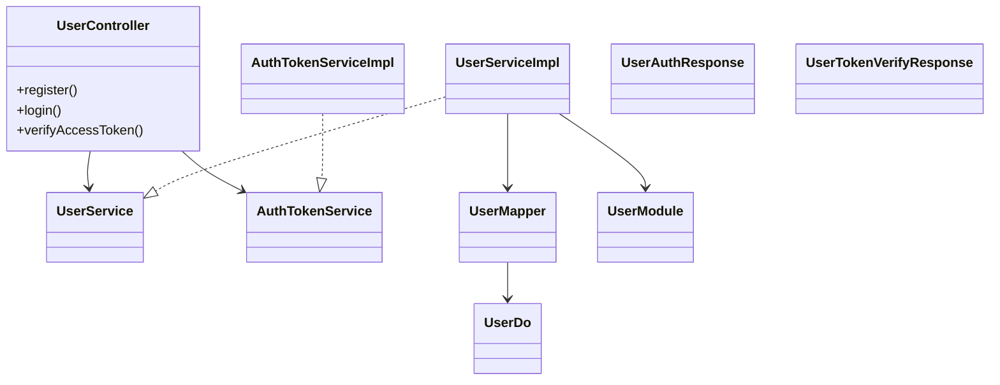
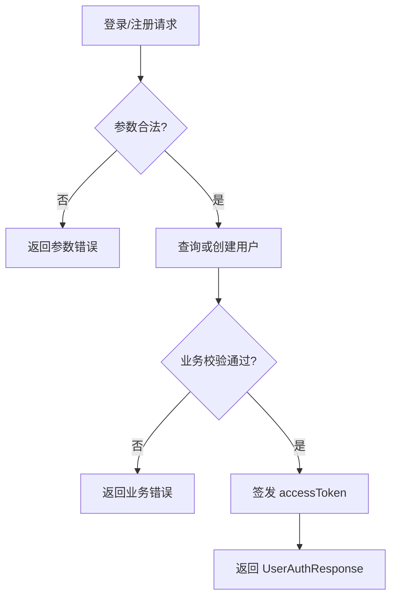
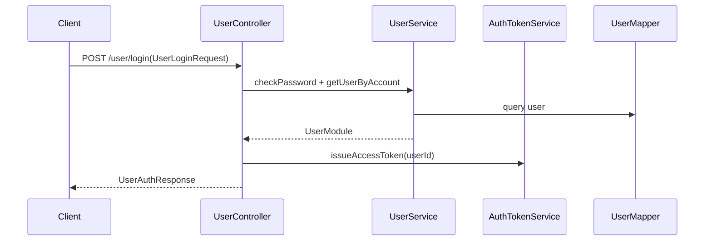
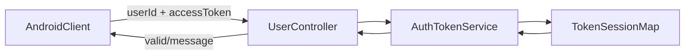
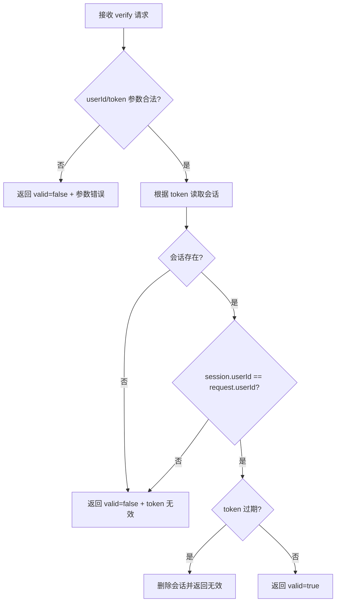
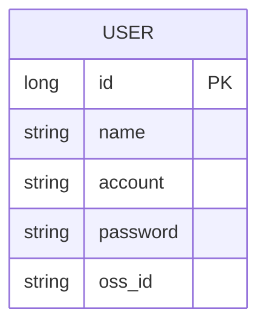
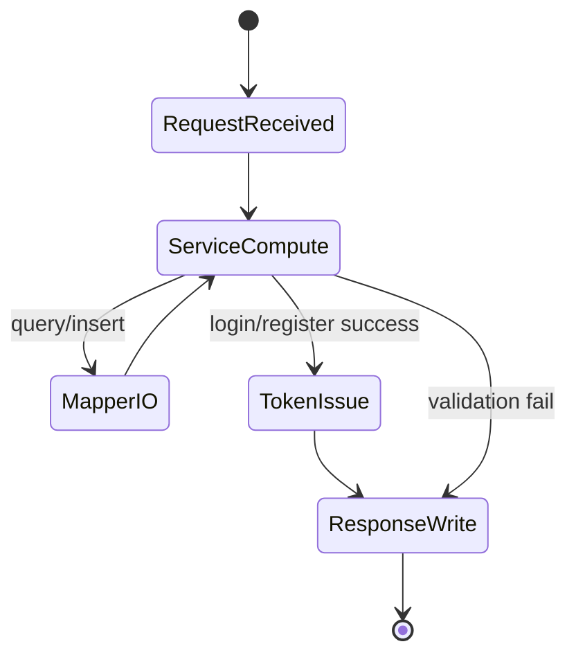

**SpringBootDesignDocument**
====

## 文档目标

本文件用于描述 SpringBoot 服务端的模块化架构设计，不使用时间线日志体例。

## 1. 整体架构分层

* **Controller 层**：接收请求、参数校验、响应封装。
* **Service 层**：认证流程编排、用户业务处理、对象转换。
* **鉴权子系统**：token 签发、会话映射、过期与一致性校验。
* **持久化层**：`UserMapper` 访问 MySQL，`UserDo` 作为数据库实体。
* **领域模型层**：`UserModule` 作为业务实体，隔离数据库对象外泄。

### 架构类图

## 2. 用户认证模块（登录 / 注册）

### 功能职责
* 提供登录与注册接口，返回统一 `UserAuthResponse`。
* 注册成功后可直接形成可用登录态响应。
* Service 层处理业务规则，Controller 层不感知 DB 对象。

### 认证活动图

### 登录时序图

## 3. Token 鉴权模块

### 功能职责
* token 签发时绑定 `userId`。
* token 校验必须同时校验 `userId + accessToken`。
* 对过期 token 进行清理，保障会话一致性。

### Token 校验通讯图

### Token 校验活动图

## 4. 用户领域与对象转换模块

### 分层原则
* `UserDo` 仅用于 Mapper/数据库层，不直接暴露到 Controller。
* Service 层输出 `UserModule`，Controller 再映射到 Response DTO。
* DTO 协议统一使用请求体对象，保障接口演进兼容性。

### 设计模式
* **分层架构（Layered Architecture）**：Controller/Service/Mapper 职责隔离。
* **DTO 门面（DTO Facade）**：通过 Request/Response DTO 稳定对外协议。

## 5. 数据库设计（MySQL）

### 设计说明
* 用户表主键统一采用 `id BIGINT`。
* 主键和业务 `userId` 全链路统一为 `Long/BIGINT`。

### ER 图

### 主键规范说明
* 使用整型主键可降低 B+Tree 比较和排序成本。
* 索引体积更小，有利于范围查询与排序性能。

## 6. 接口契约模块

### 接口清单
* `POST /user/register`：`UserRegisterRequest -> UserAuthResponse`
* `POST /user/login`：`UserLoginRequest -> UserAuthResponse`
* `POST /user/token/verify`：`UserTokenVerifyRequest -> UserTokenVerifyResponse`

### 契约原则
* 非文件上传场景使用 `@RequestBody`。
* 响应使用结构化 DTO，不返回裸布尔值。
* 校验接口要求 `userId + accessToken` 联合入参。

## 7. 并发与线程模型

### 请求线程状态图

### 鉴权甘特图

```mermaid
gantt
    title SpringBoot 鉴权请求线程甘特图
    dateFormat  X
    axisFormat %L ms
    section HTTP-NIO线程
    接收请求/参数反序列化 :a1, 0, 10
    写回响应              :a2, 60, 10
    section 业务线程
    调用AuthTokenService校验 :b1, 10, 20
    会话匹配与过期检查       :b2, 30, 20
    section 锁与状态
    ConcurrentHashMap无阻塞读 :c1, 10, 40
```

## 8. 已知边界与后续演进

* 当前 `AuthTokenService` 为内存实现，后续建议迁移 Redis 以支持重启与扩容场景。
* 注册头像上传链路受文件网关可用性影响，后续再恢复完整上传回写流程。

