**SpringBootDesignDocument**
====

## 文档目标

本文件用于描述 SpringBoot 服务端的模块化架构设计，不使用时间线日志体例。

## 整体架构分层

* **Controller 层**：接收请求、参数校验、响应封装。
* **Service 层**：业务流程编排、鉴权判断、转换调用。
* **Mapper 层**：`UserMapper` 访问 MySQL，执行增删改查。
* **Domain 层**：`dto/entity(module)` 数据模型与错误定义。

鉴权不引入 SpringCloudGateway；当前项目在应用内使用拦截器实现路由鉴权。

## 用户认证模块（登录 / 注册）

### 功能职责
* 提供登录与注册接口，返回统一 `UserAuthResponse`。
* 注册成功后可直接形成可用登录态响应。
* Service 层处理业务规则，Controller 层不感知 DB 对象。

### 静态图
#### 类图
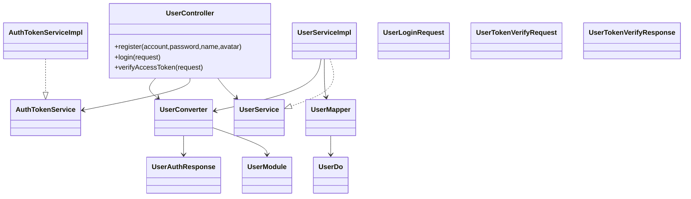

### 动态图
#### 通讯图
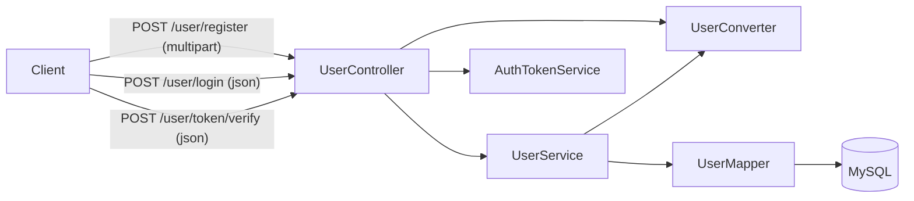

#### 认证活动图
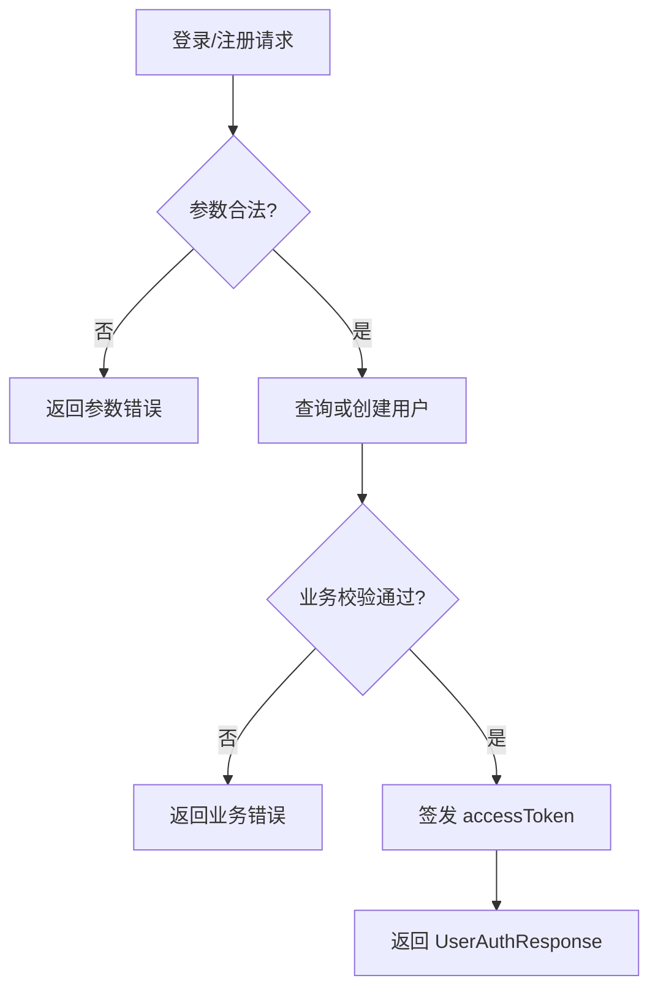

#### 登录时序图
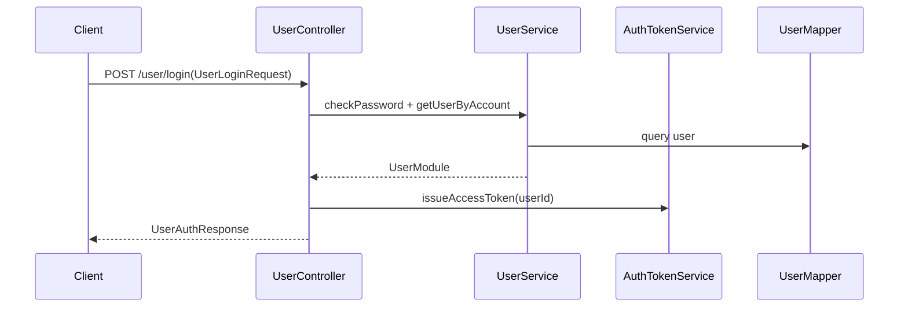

#### 线程甘特图
```mermaid
gantt
    title SpringBoot 登录/注册线程甘特图
    dateFormat  X
    axisFormat %L ms
    section HTTP-NIO线程
    接收请求与参数绑定          :a1, 0, 8
    写回响应                    :a2, 55, 10
    section 业务线程
    用户校验与查询              :b1, 8, 20
    token签发                   :b2, 28, 12
    section 数据访问
    UserMapper 查询/写入        :c1, 15, 20
```

### 鉴权模块（拦截器 + 配置）

### 功能职责
* 在 `AuthTokenInterceptor` 中统一拦截需要鉴权的路由。
* 在 `AuthInterceptorConfig` 中可配置“需要鉴权路由”和“白名单路由”。
* token 校验采用内存 `Map<String, TokenSession>`，绑定 `userId + accessToken` 并处理过期清理。
* 当前不引入 Redis；当前不使用 JWT 无状态方案（避免无法主动踢人）。

#### 路由拦截通信图
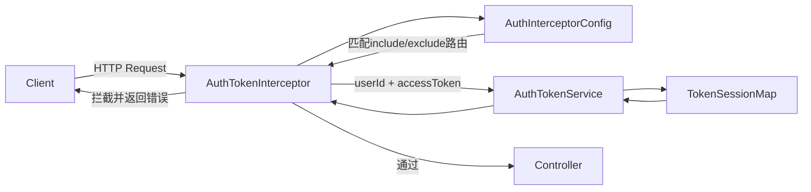

#### 拦截校验活动图
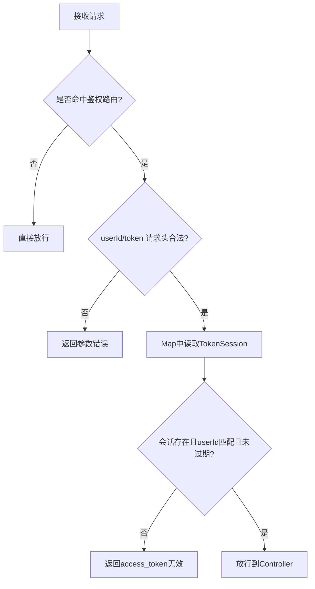

#### 路由配置示例
```yaml
openapi:
  auth:
    include-paths:
      - /agent/**
      - /chat/**
    exclude-paths:
      - /user/login
      - /user/register
      - /user/token/verify
    user-id-header: user_id
    access-token-header: access_token
```

#### 校验状态机图
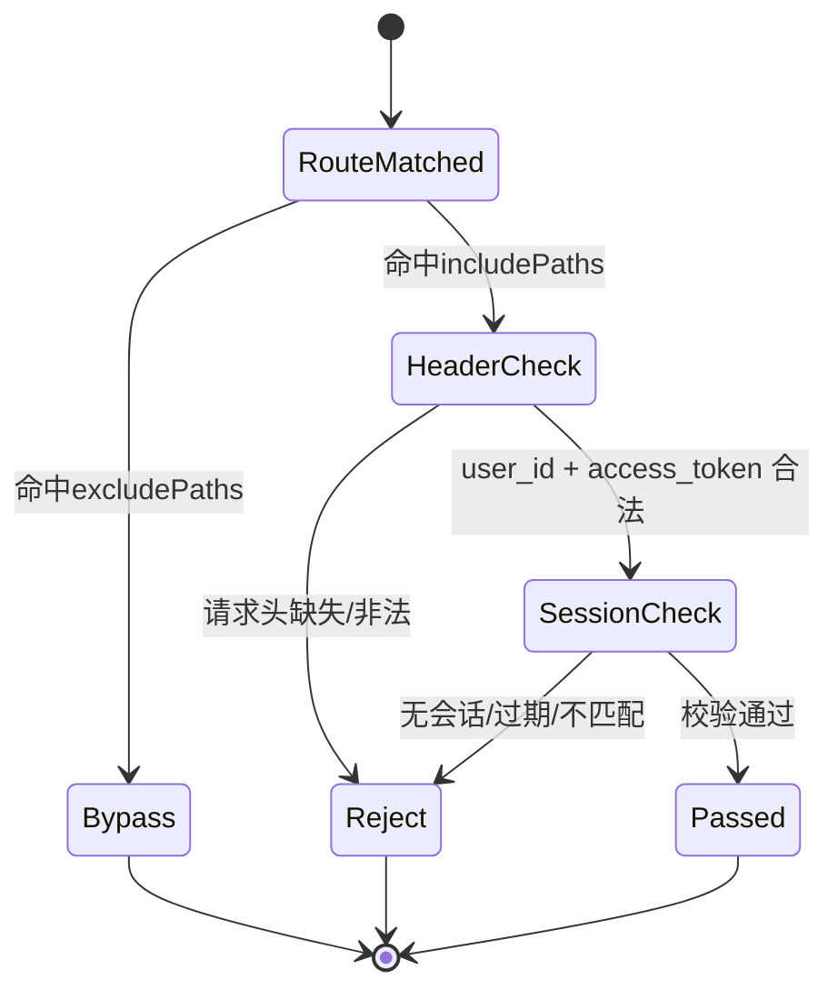

#### Token 校验活动图（接口级）
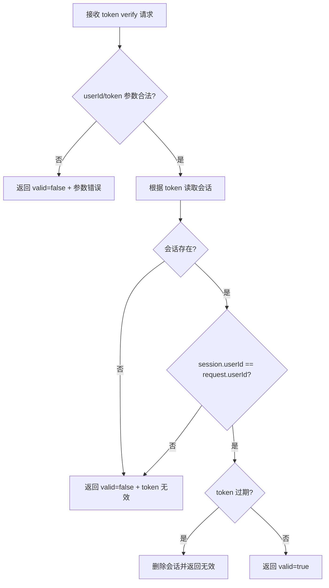

#### 鉴权甘特图
```mermaid
gantt
    title SpringBoot 鉴权请求线程甘特图
    dateFormat  X
    axisFormat %L ms
    section HTTP-NIO线程
    接收请求/参数反序列化 :a1, 0, 10
    写回响应              :a2, 60, 10
    section 业务线程
    调用AuthTokenService校验 :b1, 10, 20
    会话匹配与过期检查       :b2, 30, 20
    section 锁与状态
    ConcurrentHashMap无阻塞读 :c1, 10, 40
```

## Agent 管理与消息分页模块

### 功能职责
* Agent 能力补全为：创建、查看、修改、删除、列表查询。
* 聊天记录能力补全为：按时间锚点分页查询（向前/向后）、首屏最近消息查询。
* SpringBoot `Mapper` 与 Android `Dao` 在“查询语义”上保持一致，便于前后端统一回放逻辑。
* 文件头像上传继续走 Multipart；MinIO 未就绪时允许不传头像并保留 TODO。

### Agent 模块类图
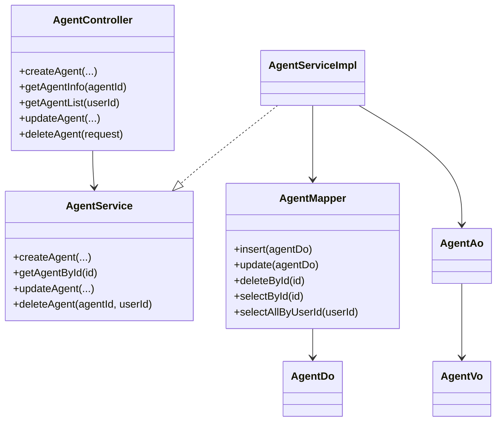

### Chat 分页活动图（锚点分页）
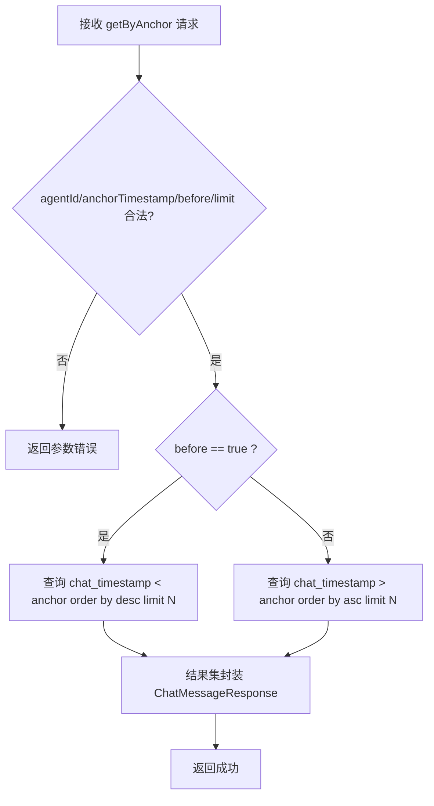

### Chat Mapper 与索引设计（数据库）
* 建议新增复合索引：`(agent_id, chat_timestamp, id)`，覆盖按 Agent + 时间锚点分页的核心查询。
* 保留已有 `(user_id, agent_id)` 索引用于用户维度过滤。
* `chat_timestamp` 作为排序主键，`id` 作为同秒内稳定 tie-breaker。

### Mapper/DAO 语义对齐说明
* SpringBoot `ChatMessageMapper.getByAnchor(...)` 与 Android `ChatMessageDao.queryByAnchor(...)` 保持同参数语义。
* 统一支持：
  * 向前分页（历史消息）：`before + desc`
  * 向后分页（新消息/补偿）：`after + asc`
* 该对齐可减少端侧二次排序和边界 bug 风险。

### 持久连接模块（用户级WS + Channel路由）

#### 功能职责
* WS 连接从“按 agentId 建连”重构为“按 userId 建连”：`CONNECT(userId)` 在登录后由客户端发起。
* `agentId` 改为聊天路由参数：通过 `BIND_CHANNEL(agentId)` 绑定当前聊天通道。
* 服务端维护 `userId + currentAgentId` 会话态，后续 `USER_TEXT_MESSAGE/AUDIO_CHUNK/...` 走当前 channel。
* 心跳改为框架级 WebSocket `Ping/Pong`：服务端定时发 `Ping`，超过 60 秒未收到 `Pong` 则断连并清理上下文。

#### UML静态图（类图）
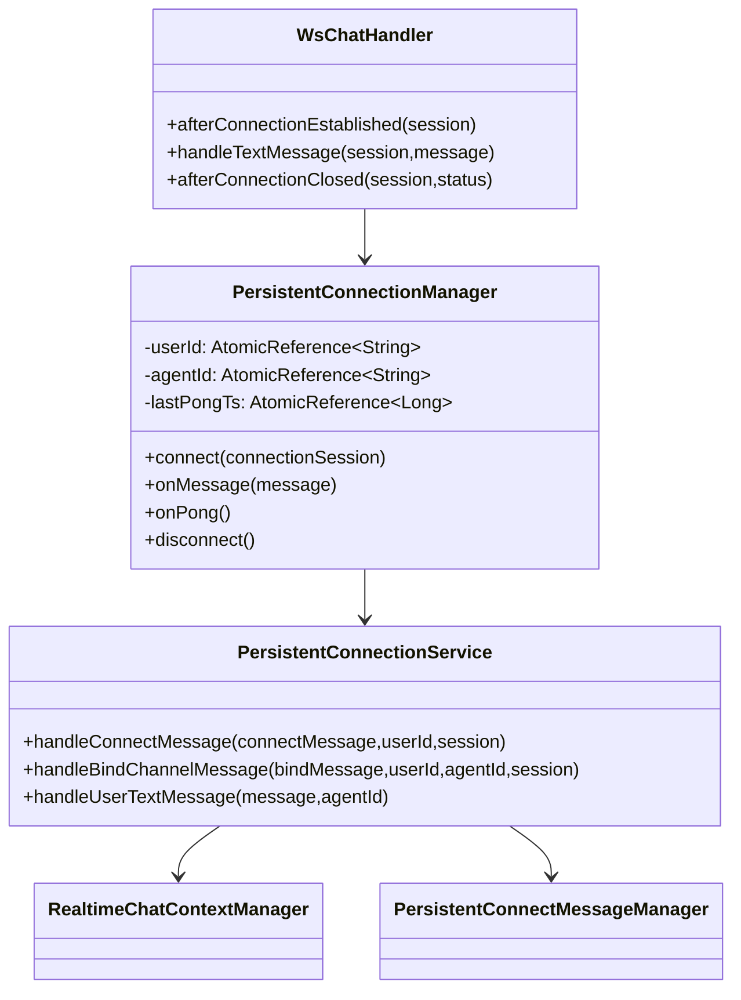

#### UML静态图（对象图）
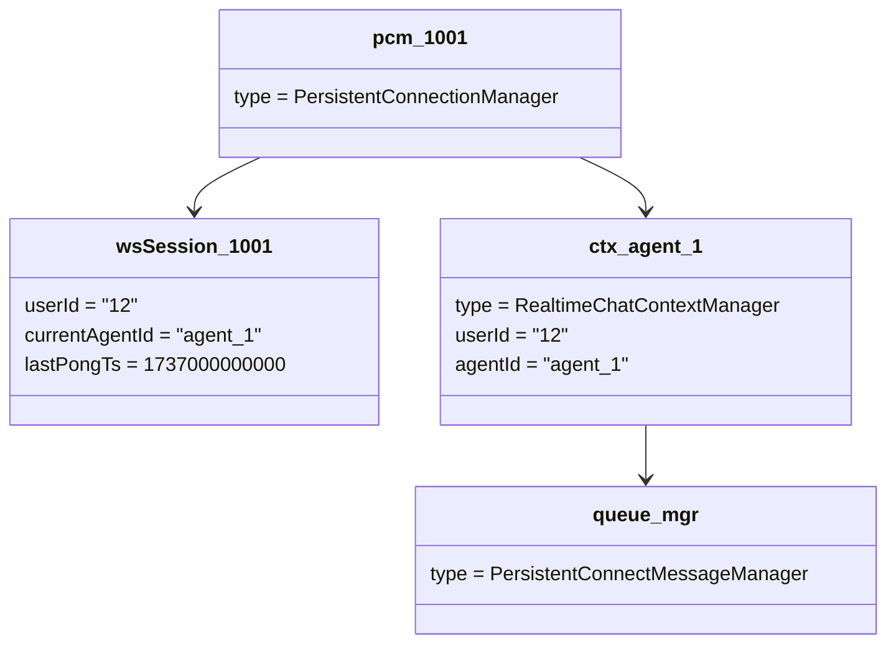

#### UML动态图（通信图）
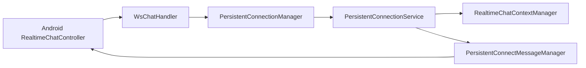

#### UML动态图（活动图）
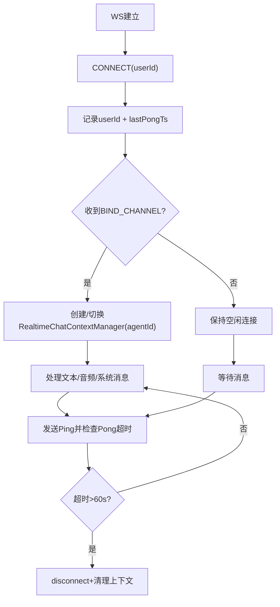

#### UML动态图（时序图）
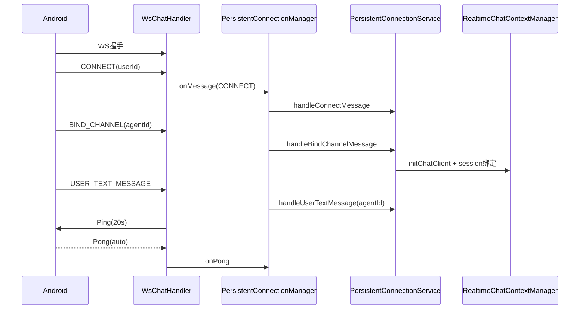

#### 功能线程甘特图
```mermaid
gantt
    title SpringBoot WS持久连接线程甘特图
    dateFormat  X
    axisFormat %L
    section WebSocket线程
    握手与CONNECT处理            :a1, 0, 10
    BIND_CHANNEL处理             :a2, 15, 10
    收发消息                     :a3, 25, 120
    section 业务线程池
    startTextChat/startAudioChat :b1, 30, 90
    section 心跳检测线程
    10s周期检测                   :c1, 10, 120
    超时断连与清理                :c2, 131, 8
```

#### 设计模式说明
* **门面模式**：`PersistentConnectionService` 汇聚 CONNECT/BIND/文本音频消息处理入口。
* **状态模式（轻量）**：连接状态由 `userId/currentAgentId/lastPongTs` 驱动路由与超时行为。
* **工厂式创建（按需）**：`handleBindChannelMessage` 按 channel 创建 `RealtimeChatContextManager`。
* **生产者-消费者模式**：`PersistentConnectMessageManager` 通过队列异步发送，解耦业务线程与网络发送。

#### WS 网络状态图
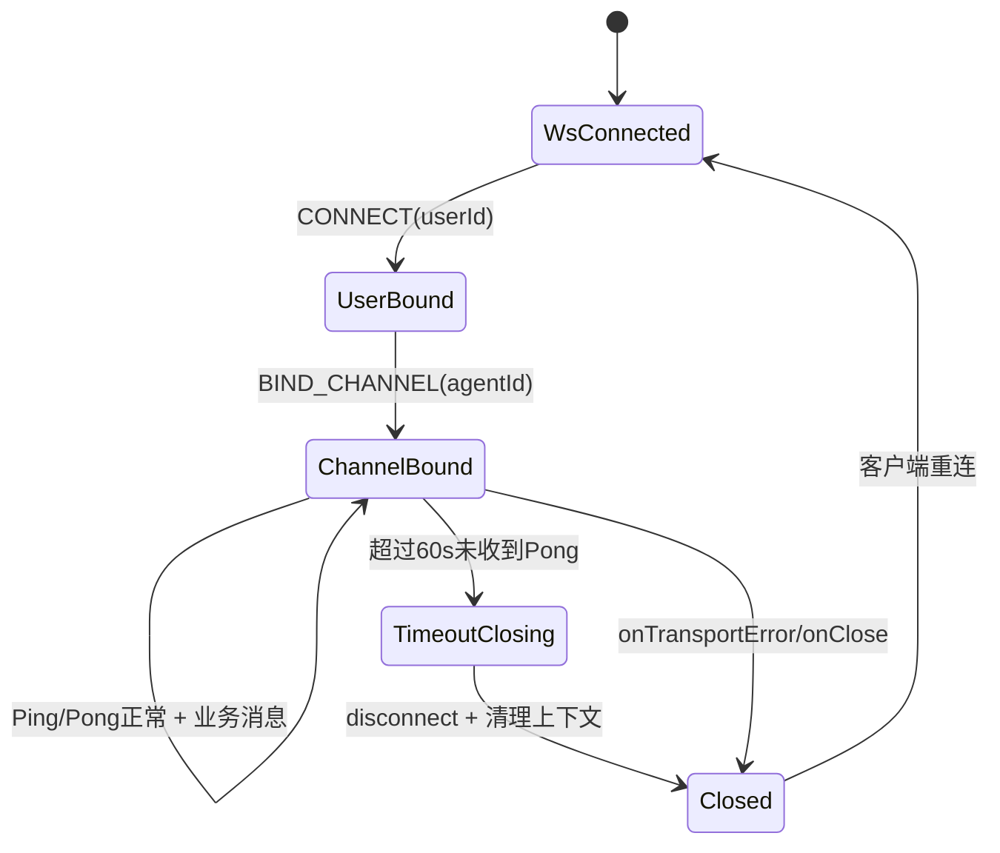


## 数据库设计（MySQL）

### 设计说明
* 用户表主键统一采用 `id BIGINT`。
* 主键和业务 `userId` 全链路统一为 `Long/BIGINT`。
* 聊天消息表支持锚点分页，采用 `chat_timestamp` 作为排序主轴。
* 新增复合索引 `(agent_id, chat_timestamp, id)`，用于历史/补偿消息高效分页。

### ER 图（合并）
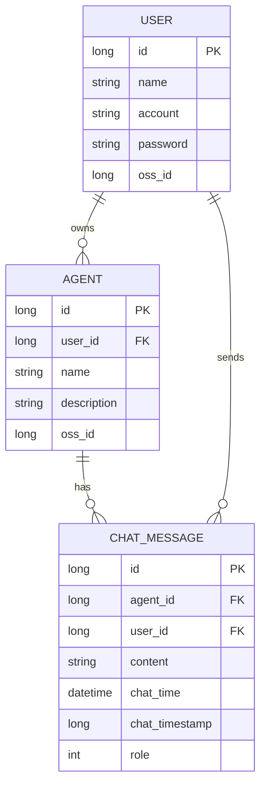

### 主键规范说明
* 使用整型主键可降低 B+Tree 比较和排序成本。
* 索引体积更小，有利于范围查询与排序性能。

## 接口契约模块

### 接口清单（含功能）
* `POST /user/register`：Multipart/FormData（`account/password/name/avatar`）-> `UserAuthResponse`
* `POST /user/login`：`UserLoginRequest -> UserAuthResponse`
* `POST /user/token/verify`：`UserTokenVerifyRequest -> UserTokenVerifyResponse`
* `POST /agent/create`：创建 Agent（头像可选）-> `AgentResponse`
* `POST /agent/update`：更新 Agent（名称/设定/头像）-> `AgentResponse`
* `POST /agent/delete`：删除 Agent -> `AgentResponse`
* `GET /agent/getInfo`：查询单 Agent 信息 -> `AgentResponse`
* `GET /agent/getList`：查询用户 Agent 列表 -> `AgentListResponse`
* `GET /agent/getLastAgentChatList`：查询 Agent 最近聊天摘要 -> `AgentLastChatListResponse`
* `GET /chat/getLastChat`：查询最近消息 -> `ChatMessageResponse`
* `GET /chat/getTimeLimitChat`：按截止时间查询历史消息 -> `ChatMessageResponse`
* `POST /chat/getByAnchor`：请求体 `ChatByAnchorRequest(agentId,anchorTimestamp,before,limit)`，按锚点向前/向后分页 -> `ChatMessageResponse`

### 契约原则
* 非文件上传接口使用 `@RequestBody` + `jakarta.validation` 注解校验。
* 文件上传接口使用 Multipart/FormData，不使用 `@Valid @RequestBody`，改为 `@RequestParam/@Part` + 手动校验。
* 参数校验异常统一由全局异常处理器处理，业务错误类型统一维护在 `com/openapi/domain/constant/error`。
* `getByAnchor` 使用 `before:Boolean` 表示方向（true历史/false补偿），并限制最大分页条数。

## Domain 转换模块（Converter）

### 设计说明
* Domain 层对象转换统一通过 `Converter` 完成，避免 Controller/Service 手写大段字段拷贝。
* SpringBoot 侧统一使用 `MapStruct`，当前用户链路使用 `UserConverter`。
* Agent 与 ChatMessage 链路同样通过 `AgentConverter`、`ChatMessageConverter` 做对象转换。

### 转换类图
```mermaid
classDiagram
    class UserDo {
        +id: Long
        +account: String
        +name: String
        +ossId: String
    }
    class UserModule {
        +userId: Long
        +account: String
        +name: String
        +avatarOssId: String
    }
    class UserAuthResponse {
        +userId: Long
        +account: String
        +name: String
        +avatarUrl: String
        +accessToken: String
    }
    class UserConverter {
        +doToModule(UserDo) UserModule
        +moduleToAuthResponse(UserModule,accessToken,avatarUrl) UserAuthResponse
    }

    UserConverter --> UserDo
    UserConverter --> UserModule
    UserConverter --> UserAuthResponse
```


